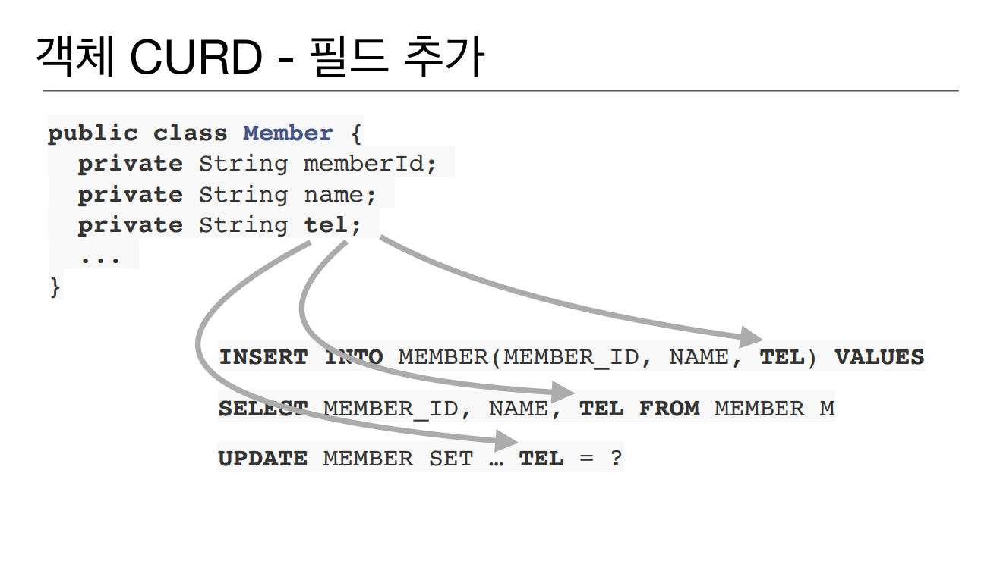
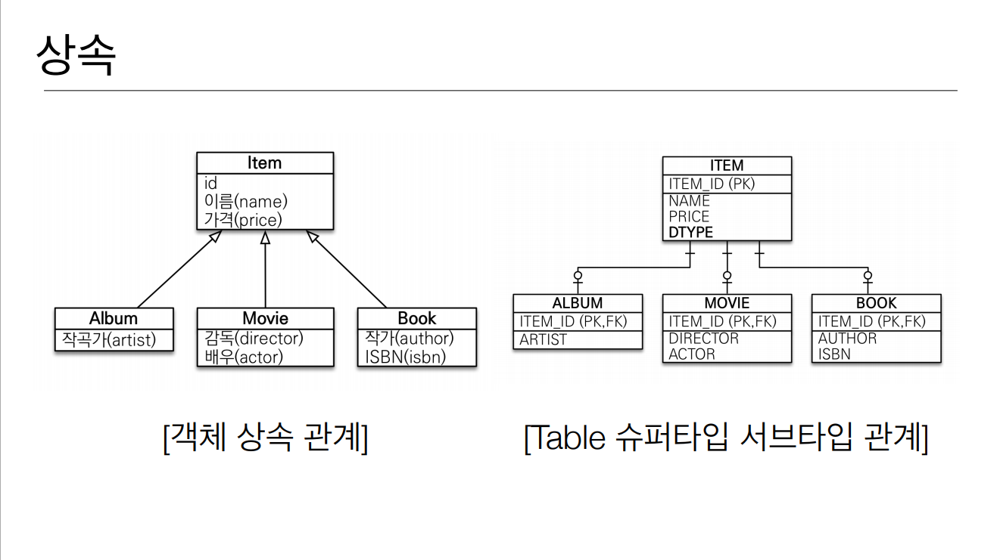
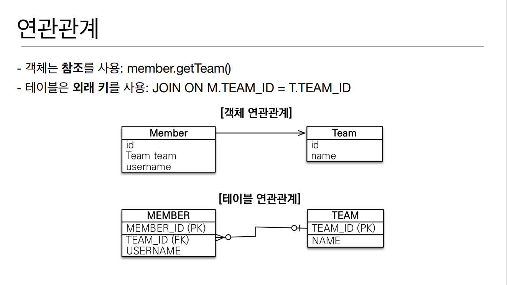
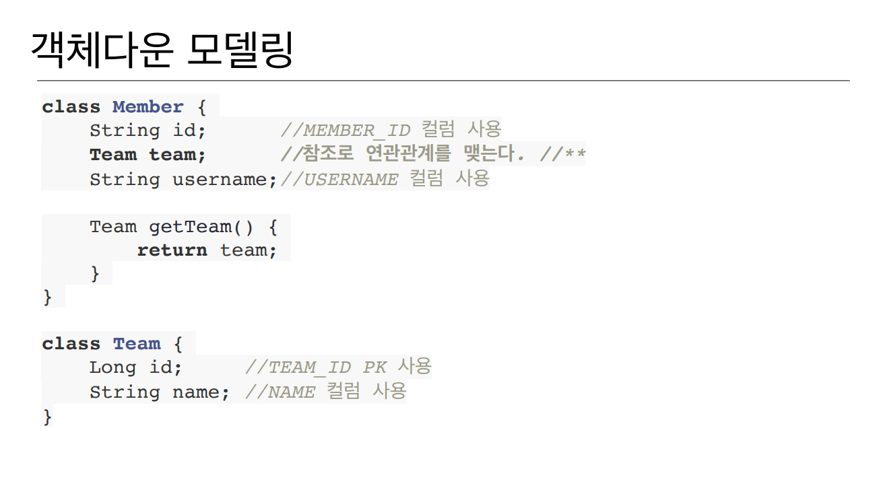
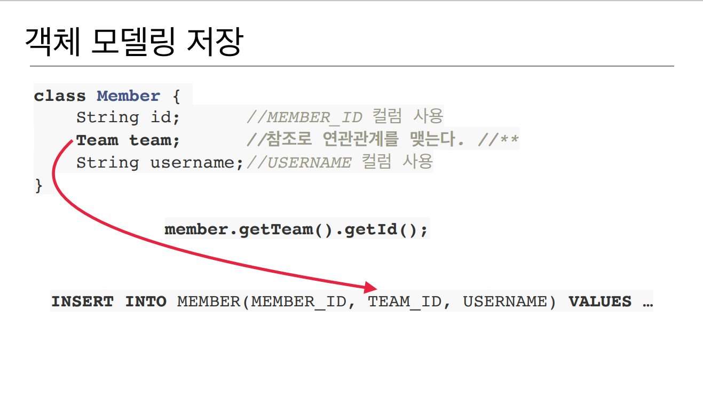
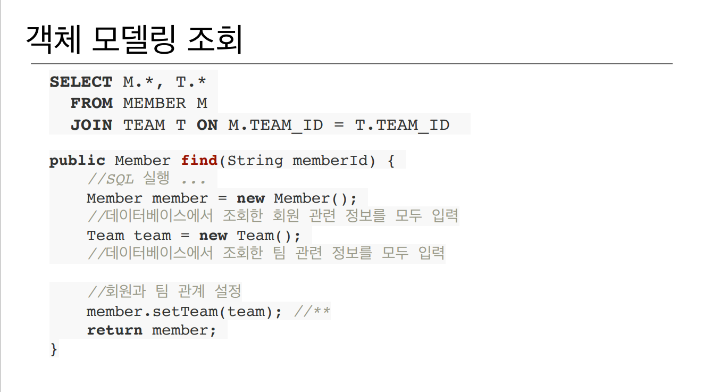
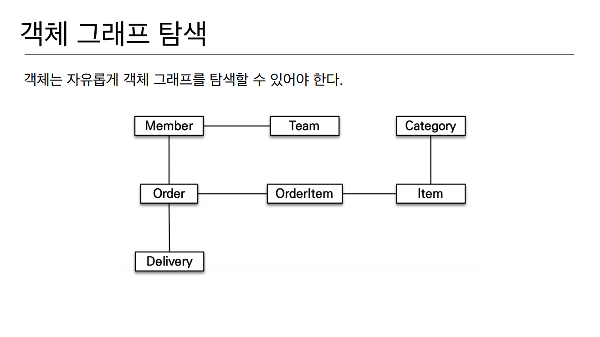
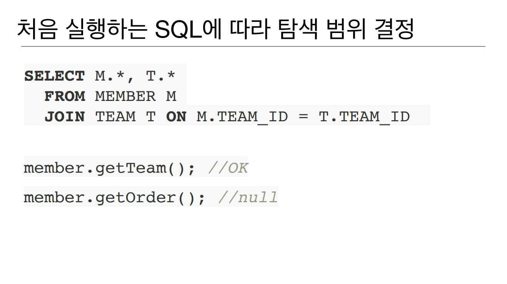
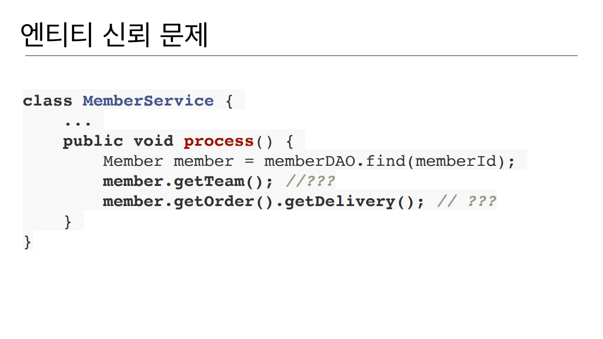
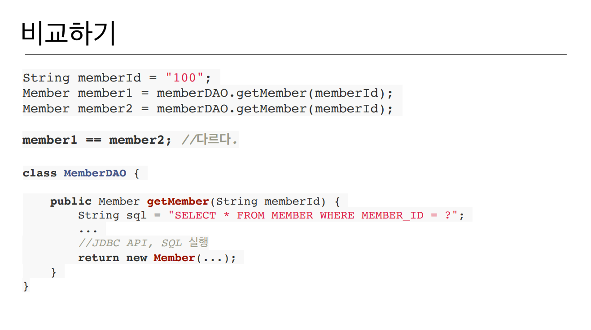

# JPA 를 왜 쓸까

객체를 RDB 에 관리 한다

반복되는 코드, 그리고 패러다임의 불일치, 객체지향적이 아닌 SQL 에 의존 이라는 문제점들이 있어서 나온 나온 기술이다


여기서 전화번호 TEL 이 원래 없었는데 추가 한다면 모든 쿼리에 TEL 을 집어넣어야 될것이다 
결국엔 SQL 에 의존적인 개발을 피하기 어렵다.


여기서도 객체 상속관계를 RDB 의 FK로 어느정도 해결할 수 있을 것 같지만 유사하게 구현하는 것이지 상속관계를 나타 낼 수 없다

- 각각의 테이블에 따른 조인 SQL작성
- 각각의 객체 생성

엄청 복잡해진다 그래서 DB에 저장할 객체에는 상속 관계를 쓰지 않는다

저장할때 자바 컬렉션에서

list.add(album); 하면 끝

조회하는 것도 자바 컬렉션에서 

Album album = list.get(albumId);

또는 부모타입으로 조회 후 다형성을 활용하는

Item item = list.get(albumId); 가 있다

## 연관관계


이런 테이블이 있다.

이걸 객체 답게 모델링하여



이렇게 Member class 에 Team 객체의 참조로 연관관계를 맺어서 참조로 연관관계를 맺어서 만들 수 있다.

이 객체 모델링은



member.getTeam().getId(); 로 INSERT 쿼리문을 날릴 수 있지만



이렇게 객체지향적으로 설계하면 조회할 때
- member 와 team 조인하고 data 와 sql 한방에 불러온다
- member 와 team 이 섞여있는 data 에서 member 부분 꺼낸다 
- team 부분 꺼내고 값을 다 세팅해서 넣은다음에 member.setTeam(team)으로 직접 연관관계 세팅하고 member 객체 반환

->너무 복잡하다

자바 컬렉션에 넣는다 하면 객체지향적으로 설계하는게 참좋다
``` java
list.add(member);
Member member = list.get(memberId);
Team team = member.getTeam();
```
이렇게 하면 컬렉션에 member 넣고 필요하면 memberId로 member 꺼내고
컬렉션에 member 넣을때 거기 연관된 team 참조값도 어쩌피 들어가니까
member.getTeam() 하면 그때 넣었던 team 이 그대로 딸려 온다

-> 엄청 편한데 DB 에 넣는 순간 이게 전부 헝클어 진다




근데 Member 에 Order 가 있다해서 member.getOrder 나 order.getDelivery 를 마음껏 호출 할 수 있을까? -> nope
왜 why? -> 처음 실행하는 SQL 에 따라서 탐색 범위가 결정 된다



예를들어서 처음 SQL 을 날릴 때 member 와 team 을 가져왔다 그리고 member 와 team 만 값을 채워서 반환 했을때, table 상에 data 가 다 있다는 가정하에 
member.getTeam(); 하면 된다 하지만 중간에 비지니스 로직에서 member.getOrder(); 하면 값이 무조건 null 이다 왜? 처음 SQL 실행할 때 member와 
team 만 채웠으니까 그럼 member 필드안에 order 가 있다해서 마음껏 값을 못꺼낸다 내가 다 까봐야 된다 -> 엔티티에 대한 신뢰문제 발생



memberDAO 는 다른 사람이 개발했다.

member 객체 하나 가져와서 그 member 의 팀이도 반환 할 수 있고
가져온 member 의 order 와 delivery 도 호출 할 수 있을까? -> nope! memberDAO 안에서 뭘 했고 어떤 쿼리가 날라가서 어떻게 data 를 조립했는지
눈으로 확인하기 전까지 반환된 엔티티를 신뢰하고 쓸 수 가 없다 
진정한 의미의 계층형 아키텍쳐에서 계층 분할이 어렵다 물리적으로는 계층이 서비스 DAO 이렇게 나뉘어져 있지만 논리적으로는 굉장히 강 결합 되어있다



memberId = 100 이라는 식별자가 같아도 결국엔 다르다 DAO 를 까보면 MemberDAO 에서 쿼리를 날리는데 member1 이 쿼리날리고 member2 가 쿼리날리고 
결과 가져오면 member1 != member2 이다
근데 여기서 자바 컬렉션에서 조회하면 

``` java
String memberId = "100";
Member member1 = list.get(memberId);
Member member2 = list.get(memberid);
member1 == member2;  //같다
```
member1 과 member2 는 같다고 나온다 왜? 똑같은 객체를 꺼내니까 member1 과 member2 는 참조값이 같기 때문에 같다고 나온다
이렇게 자바 컬렉션에서 객체를 다룰때, RDB SQL 에서 객체를 다룰때랑 많은 미스 매치들이 발생한다

### 객체 답게 모델링 할수록 오히려 더 번잡한 매핑 작업만 늘어난다
### 객체를 자바 컬렉션에 저장 하듯이 DB에 저장할 수는 없을까?

## 그 고민의 결과가 JPA