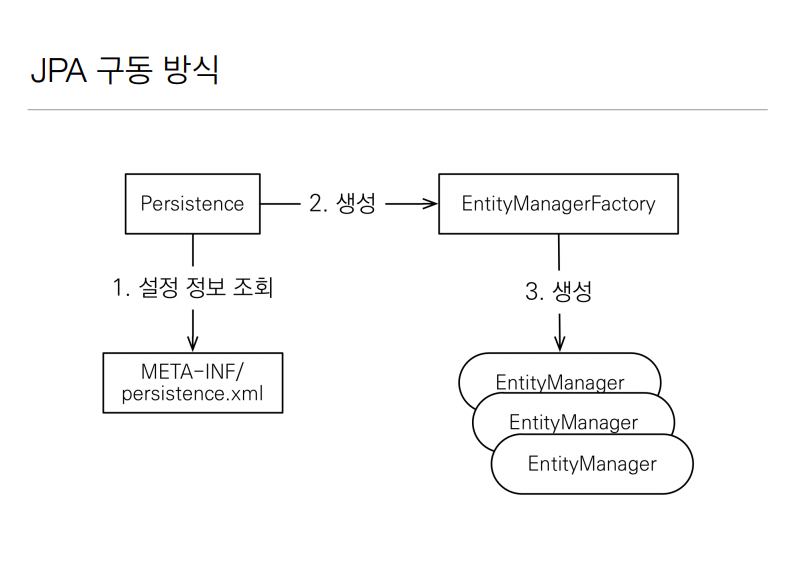

# JPA가 어떻게 쓰이는가

  

먼저 JPA 는 Persistence 라는 class 가 있다 Persistence 에서 시작해서 설정정보(META-INF/persistence.xml)를 읽어서
EntityManagerFactory 라는 class(말그대로 공장) 를 만들고 여기서 필요할 때 마다 'EntityManager' 를 찍어내서 돌리면 된다.

이걸 코드로 구현했을때


```java
public class JpaMain {
    public static void main(String[] args) {
        EntityManagerFactory emf = Persistence.createEntityManagerFactory("hello");

        EntityManager em = emf.createEntityManager();

        EntityTransaction tx = em.getTransaction();
        tx.begin();

        try{
            Member member = new Member();
            member.setId(2L);
            member.setName("Hello");

            em.persist(member);
        } catch (Exception e) {
            tx.rollback();
        } finally {
            em.close();
        }
        emf.close();
    }
}

```


