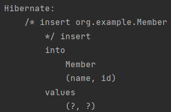

# JPA 가 어떻게 쓰이는가

  

먼저 JPA 는 Persistence 라는 class 가 있다 Persistence 에서 시작해서 설정정보(META-INF/persistence.xml)를 읽어서
EntityManagerFactory 라는 class(말그대로 공장) 를 만들고 여기서 필요할 때 마다 'EntityManager' 를 찍어내서 돌리면 된다.

이걸 코드로 구현했을때

```java
public class JpaMain {
    public static void main(String[] args) {
        EntityManagerFactory emf = Persistence.createEntityManagerFactory("hello");

        EntityManager em = emf.createEntityManager();
        //실제 우리가 동작하는 코드 (DB 에 데이터를 저장, 불러오기)
        em.close();
        
        emf.close();
    }
}
```

emf 는 entityManagerFactory 인데 ("hello") 는 persistence.xml 에 <persistence-unit name="hello"> 라서 hello 넣어 준것
emf 에서 createEntityManager() 라는 애를 꺼내서 EntityManager 를 사용한다

em, emf 를 전부 닫아준다

## 객체와 테이블을 생성하고 매핑하기

```java

@Entity
@Getter @Setter
public class Member {
    @Id
    private Long id;
    private String name;
}

```

우선 @Entity 를 넣어야 JPA 가 처음 로딩될 때 JPA 를 사용하는 클래스 인걸 인식하고 관리 할 수 있다
@Id를 넣어서 PK 가 뭔지 알려준다

### 멤버 등록

```java
public class JpaMain {
    public static void main(String[] args) {
        EntityManagerFactory emf = Persistence.createEntityManagerFactory("hello");

        EntityManager em = emf.createEntityManager();

        EntityTransaction tx = em.getTransaction();
        tx.begin();
        
        Member member = new Member();
        member.setId(1L);
        member.setName("spring");
        em.persist(member);

        tx.commit();
        
        em.close();
        
        emf.close();
    }
}
```

>EntityManagerFactory 는 에플리케이션 로딩 시점에 딱 하나만 만들어야 한다 그리고 실제 DB에 저장하는 트랜잭션 단위 ex) 고객이 들어와서
> 행위를 하고 나가거나, 고객이 상품을 장바구니에 담는다던가 할 때마다 와 같이 DB Connection 을 얻어서 쿼리를 날리고 종료되는 한 일괄적인 단위를
> 할때마다 EntityManger 를 만들어 줘야 한다

- 엔티티 매니저 팩토리는 하나만 생성해서 애플리케이션 전체에서 공유
- 엔티티 매니저는 쓰레드간에 공유X (사용하고 버려야 한다)
- JPA 의 모든 데이터 변경은 트랜잭션 안에서 실행

Member 객체만들고 멤버 Id, Name 설정해주고 em.persist(member); 를 해주면 Member 가 저장이 된다
근데 EntityTransaction 은 뭘까? -> JPA 에서는 Transaction 이라는 단위가 중요하다
모든 데이터를 변경하는 모든 작업은 JPA 에서 transaction 안에서 작업 해야 한다
tx 도 .begin() 으로 시작하고 JPA 에 저장 후 .commit(); 을 해주면 된다
그러면 드디어



가 나온다 Member 가 insert 가 됬다 라는 주석이 있고
그 뒤에 실제 쿼리가 보인다 
실제로 DB에 가보면 data 가 저장이 된걸 볼 수 있다.

### 예외 처리

```java
public class JpaMain {
    public static void main(String[] args) {
        EntityManagerFactory emf = Persistence.createEntityManagerFactory("hello");

        EntityManager em = emf.createEntityManager();

        EntityTransaction tx = em.getTransaction();
        tx.begin();

        try{
            Member member = new Member();
            member.setId(2L);
            member.setName("Hello");

            em.persist(member);
            tx.commit();
        } catch (Exception e) {
            tx.rollback();
        } finally {
            em.close();
        }
        emf.close();
    }
}
```
>예를 들어서 em.persist 나 tx.commit 이런대서 문제가 생겼을때 em.close 도 호출이 안되고
> emf.close 도 호출이 안된다 문제가 생기면 tx.rollback();
> 실제로는 spring 이 다해준다

### 수정

```java

public class JpaMain {
    public static void main(String[] args) {
        EntityManagerFactory emf = Persistence.createEntityManagerFactory("hello");

        EntityManager em = emf.createEntityManager();

        EntityTransaction tx = em.getTransaction();
        tx.begin();

        try{
            Member findMember = em.find(Member.class, 1L);
            System.out.println("findMember.id = " + findMember.getId());
            System.out.println("findMember.name = " + findMember.getName());
            tx.commit();
        } catch (Exception e) {
            tx.rollback();
        } finally {
            em.close();
        }
        emf.close();
    }
}
```
>수정은 이렇게 findMember 라는 Member 객체에 em.find()하고 멤버 클래스, 찾는 아이디 값을 넣어서
> findMember 에 찾는 Member 를 넣어주고 그 멤버에대해 출력하면 된다

### 삭제
``` java

public class JpaMain {
    public static void main(String[] args) {
        EntityManagerFactory emf = Persistence.createEntityManagerFactory("hello");

        EntityManager em = emf.createEntityManager();

        EntityTransaction tx = em.getTransaction();
        tx.begin();

        try{
            Member findMember = em.find(Member.class, 2L);
            em.remove(findMember);
            tx.commit();
        } catch (Exception e) {
            tx.rollback();
        } finally {
            em.close();
        }
        emf.close();
    }
}
```

>삭제도 마찬가지로 삭제할 findMember 만들어주고 그걸 em.remove(findMember); 해주면 삭제가 된다
>그러면 delete 쿼리가 나가면서 삭제가 된다

### 수정

``` java

public class JpaMain {
    public static void main(String[] args) {
        EntityManagerFactory emf = Persistence.createEntityManagerFactory("hello");

        EntityManager em = emf.createEntityManager();

        EntityTransaction tx = em.getTransaction();
        tx.begin();

        try{
            Member findMember = em.find(Member.class, 2L);
            findMember.setName("HelloJPA");
            
            tx.commit();
        } catch (Exception e) {
            tx.rollback();
        } finally {
            em.close();
        }
        emf.close();
    }
}

```

> 마찬가지로 수정할 findMember 만들어주고 이름을 setName 으로 바꿨다 그런다음에 em.persist(findMember)를 해줘야 할까?
> nope! 우리가 자바 컬렉션을 다루듯이 DB 를 다루게 설계되서 가능하다 자바 객체 값만 바꿨데 어캐했을까 JPA 를 통해서 entity 를 가져오면
> 그리고 JPA 가 변경이 됬는지 안됬는지 트랜잭션을 커밋하는 시점에 다 체크를 한다 어? 얘가 이름이 바꼈네? 트랜잭션 커밋직전에 업데이트 쿼리
> 날리고 트랜잭션이 커밋된다