# JPA 에서 가장 중요한 2가지
- 객체와 관계형 데이터베이스 매핑하기 (DB를 어떻게 설계하고 객체를 어떻게 설계해서 이거를 어떻게 JPA 매핑해서 쓸건지)
- 영속성 컨텍스트 (실제 JPA 가 내부에서 어떻게 동작해?)

## 엔티티 매니저 팩토리와 앤티티 매니저
  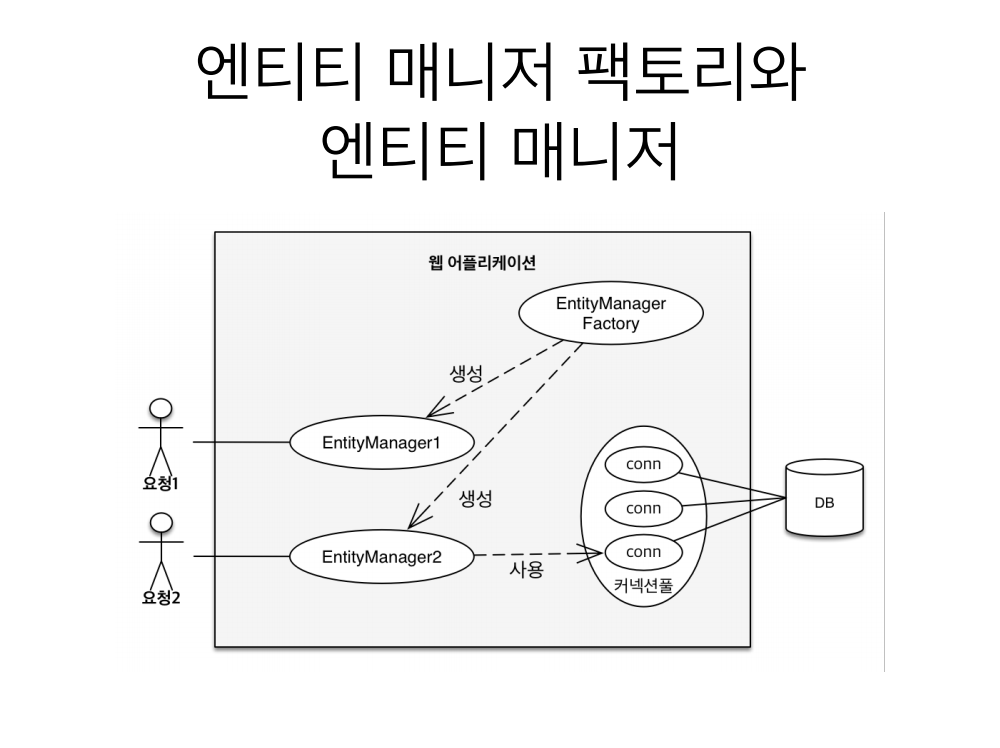 
엔티티 매니저 팩토리를 통해서 고객의 요청이 올때마다 엔티티 매니저를 생성한다.
또 새로운 고객이 오면 엔티티 매니저2 를 생성한다
엔티티 매니저는 내부적으로 DB Connection 을 사용해서 DB 를 사용한다

## 영속성 컨텍스트

- JPA 를 이해하는데 가장 중요한 용어
- "엔티티를 영구 저장하는 환경" 이라는 뜻
- EntityManager.persist(entity); -> 이렇게하면 엔티티 객체를 DB 에 저장하는구나 했는데 실제로 깊은 내용이있다 DB 에 저장하는게 아니라
영속성 컨텍스트를 통해서 엔티티를 영속화 한다는 뜻
- 영속성 컨텍스트는 논리적인 개념
- 눈에 보이지 않는다
- 엔티티 매니저를 통해서 영속성 컨텍스트에 접근

  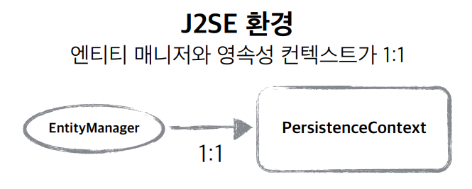
엔티티 매니저를 생성하면 그안에 1대1로 그안에 영속성 컨텍스트가 생성된다
쉽게말해 엔티티 매니저 안에 영속성 컨텍스트 라는 눈에 보이지 않는 공간이 생긴다

## 엔티티의 생명주기
- 비영속 (new/transient) -> 영속성 컨텍스트와 전혀 관계가 없는 새로운 상태

- 영속 (managed) -> 영속성 컨텍스트에 관리되는 상태

ex) em.persist(member) 하면 영속상태가 된다
- 준영속 (detached) -> 영속성 컨텍스트에 저장되었다가 분리된 상태
- 삭제 (removed) -> 삭제된 상태

### 비영속
  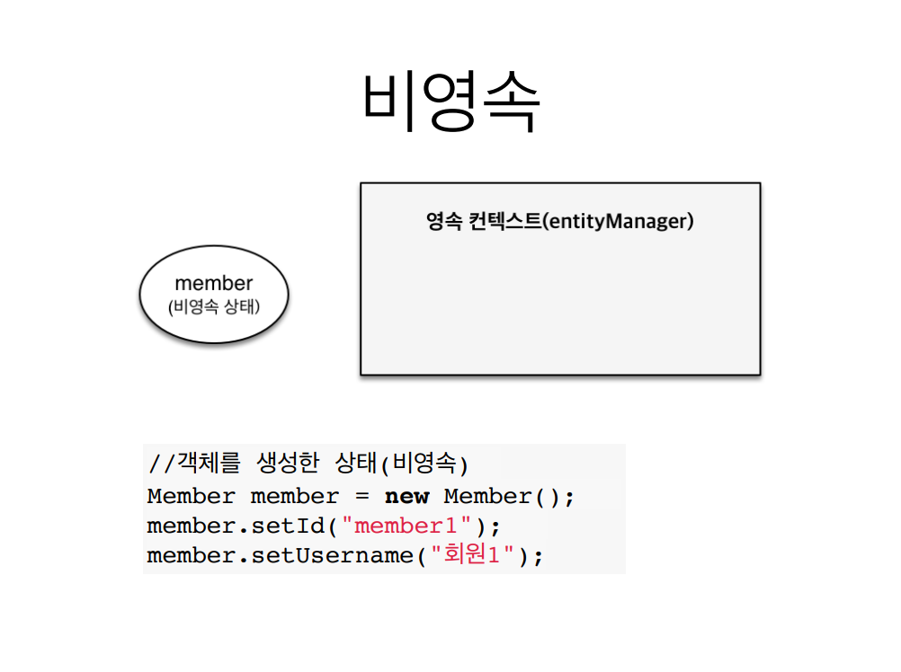

> 비영속 상태라는건 아무것도 안넣고 생성만 한 상태이다
> 코드를 보면 JPA 와 전혀 관계없이 객체만 생성한 것

### 영속
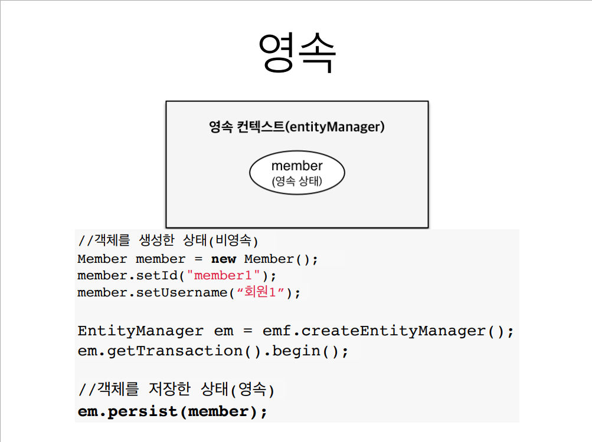

> 영속 상태라는건 엔티티 매니저 안에는 영속성 컨텍스트가 있다 했었다
> 멤버 객체 생성 후, 엔티티 매니저에 Persist 해서 멤버객체를 집어 넣으면
> 엔티티 매니저안에 있는 영속성 컨텍스트에 멤버 객체가 들어가면서 멤버가 영속상태가 된다
> 엔티티 매니저 안에 있는 영속성 컨텍스트를 통해서 멤버가 관리된다

쿼리는 트랜잭션이 커밋되는 시점에(tx.commit();) DB 에 쿼리문 날리는 것이다
em.persist(member); 때 쿼리를 날리는게 아니다

### 준영속, 삭제
``` java
em.detach(member); //회원 엔티티를 영속성 컨텍스트에서 분리, 준영속 상태 
em.remove(member); //객체를 완전히 삭제한 상태
```

## 영속성 컨텍스트의 이점

- 1차 캐시  
- 동일성 보장
- 트랜잭션을 지원하는 쓰기 지연
- 변경 감지
- 지연 로딩

### 엔티티 조회, 1차 캐시

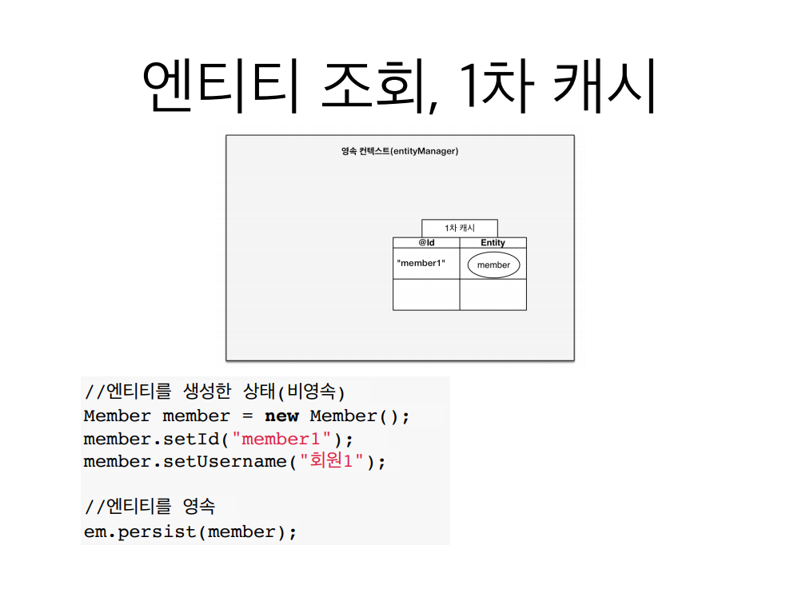

em.persist(member); 를 하면 영속성 컨텍스트 내부에는 1차 캐시가 있다
거기엔 @id, Entity 라는 key, value 가 있다 
key 가 DB PK 로 매핑한 Id가 키가 되고 value 는 Entity 자체가 값이 된다
key = member1, value 는 Member 객체가 된다

이렇게되면 무슨 이점이 있을까?
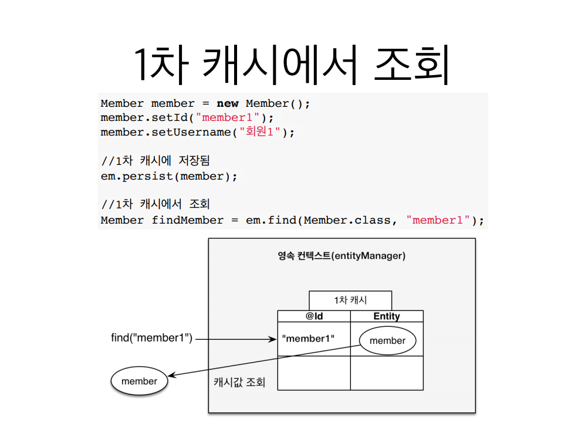
조회할 때, em.find(Member.class, "member1");
로 조회를 하면 JPA 는 DB 를 뒤지는게아니라 1차 캐시를 뒤진다
어? 1차 캐시에보니까 멤버엔티티가 있네? 그럼 그냥 캐시에 있는 값을 그냥 조회해 오는 이점이 있다
그런데 여기서

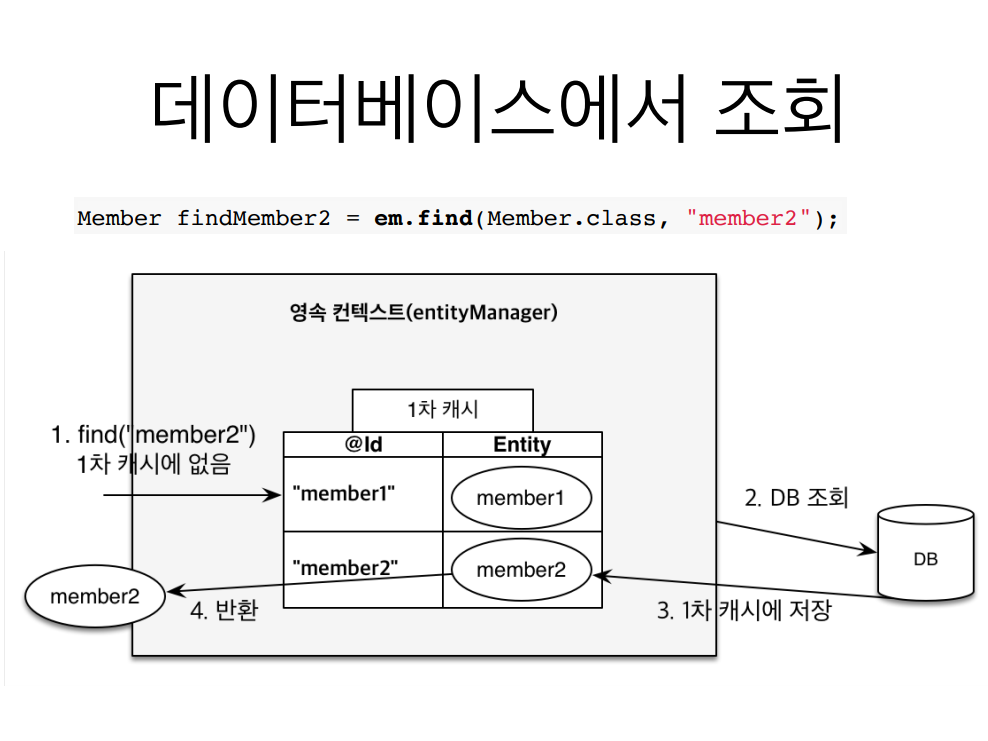

멤버 2번을 조회한다 멤버 2번은 DB 에는 있고 1차 캐시에는 없다
em.find(Member.class, "member2"); 어? 영속선 컨텍스트안에 1차캐시에
member2 가 없네? 그럼 DB 에서 조회해서 member2 를 1차캐시에다가 저장한다
그리고 member2 를 반환한다 이후에 member2를 조회하면 DB 조회안하고 1차캐시에서 
조회한다

> 별로 큰 이점은 아니다 왜? 엔티티매니저는 트랜잭션 단위로 만들고 DB 트랜잭션이 끝날때 같이 종료
> 시켜버린다 무슨말이냐면 고객의 요청이 하나 들어와서 보통 비지니스가 끝나면 영속성 컨텍스트를 지운다 
> 물론 1차 캐시도 날라간다 -> 굉장히 짧은 순간에 이점이다.

### 영속 엔티티의 동일성 보장

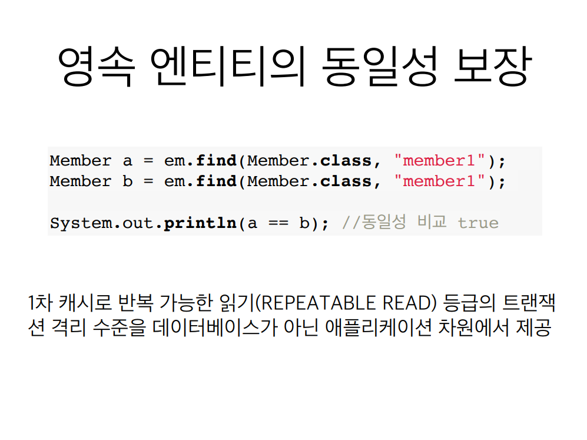

true 가 나온다 마치 우리가 자바 컬렉션에서 같은 참조를 가지고있는 객체 두개가 같은것처럼

### 트랜잭션을 지원하는 쓰기 지연

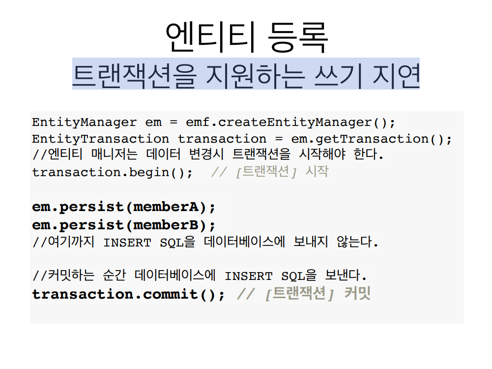

멤버1 이랑 멤버2 를 em.persist 로 넣었을때 SQL 을 디비에 보내지 않고 트랜잭션을 커밋하는 순간 
INSERT SQL 을 DB 에 보낸다

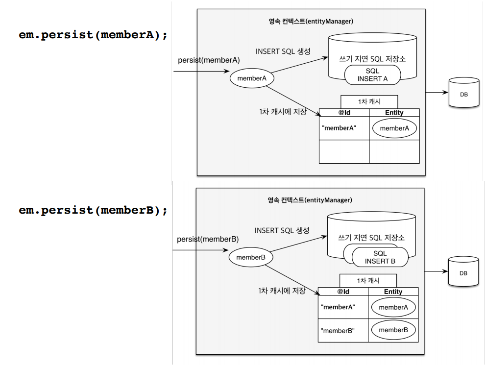

내부적으로 이렇게 된다 
> 멤버A 를 저장하면 영속성 컨텍스트 안에는 1차 캐시 말고 쓰기 지연 SQL 저장소도 있다.
> 멤버A 를 em.persist 로 넣으면 1차 캐시에 들어감과 동시에 JPA 가 엔티티를 분석해서 
> INSERT 쿼리를 생성해서 쓰기 지연 SQL 저장소에 쌓아둔다 멤버B 도 persist 하면 1차 캐시에 
> 멤버B 도 넣고 INSERT SQL 생성해서 쓰기 지연 SQL 저장소에 멤버B 도 쌓아 놓는다

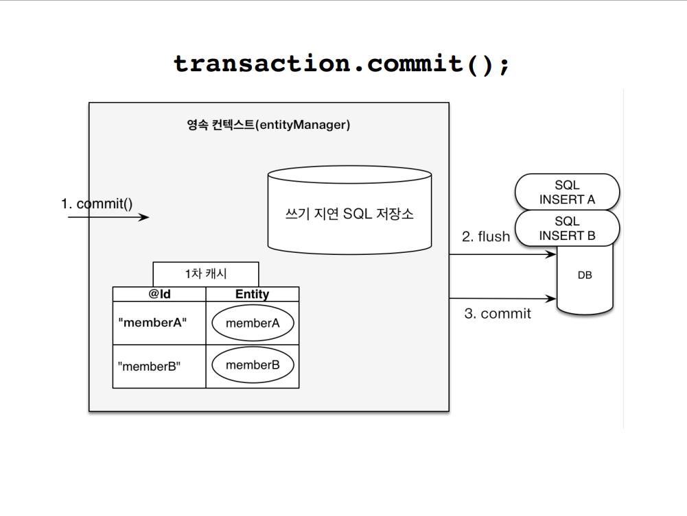

이렇게 트랜잭션을 커밋하는 순간에 쓰기 지연 SQL 저장소에 있던 애들이 flush 가 되면서 날라간다
SQL 이 날라가고 실제 데이터베이스 트랜잭션이 커밋된다

### 변경감지

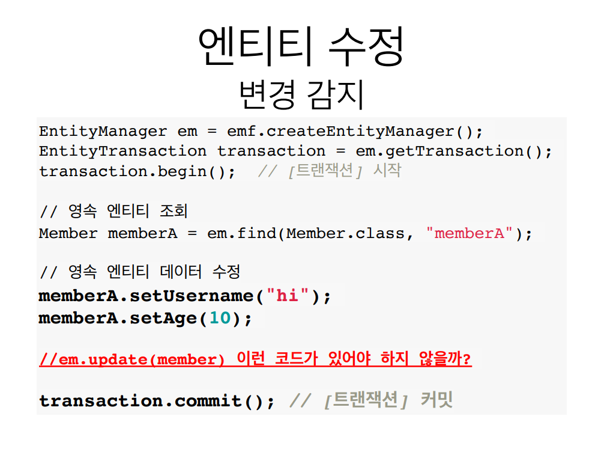

> 내가 찾아온 다음에 데이터를 변경을하면 알아서 update 쿼리가 나간다 
> 마치 자바 컬렉션에서 하는것 처럼 어떻게 동작할까? 

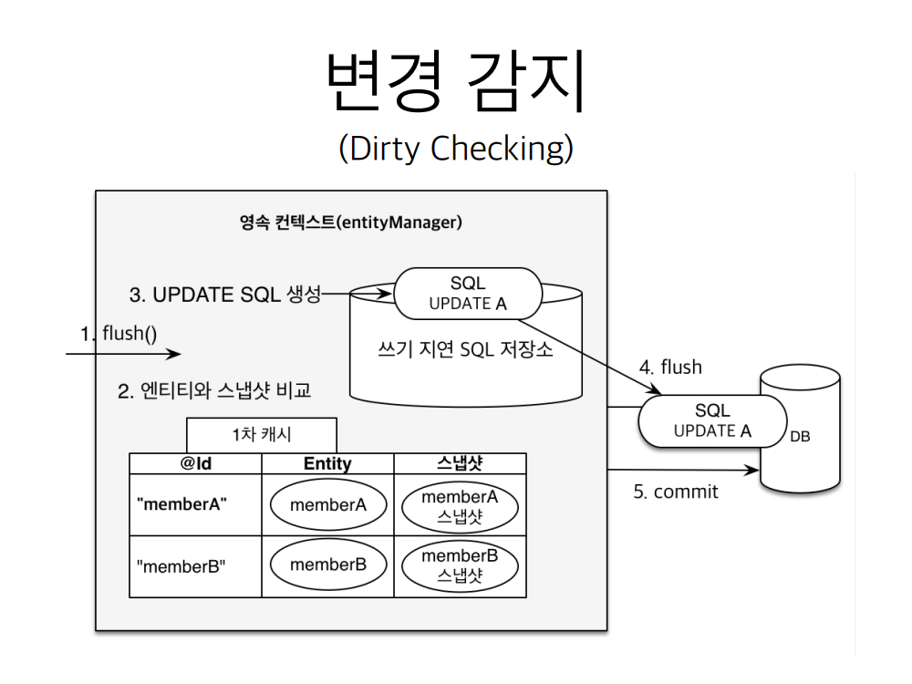

> 이렇게 동작한다 JPA 는 데이터 베이스 트랜잭션을 커밋하면 내부적으로 flush() 가 호출되고
> 엔티티와 스냅샷을 비교한다 1차 캐시 안에는 아이디와 엔티티와 스냅샷이 있는데 스냅샷이란 내가 
> 값을 읽어온 최초 시점의 상태를 스냅샷으로 가져오는 것이다 그 상태에서 memberA 의 값을 변경하면 
> JPA 가 트랜잭션이 커밋되는 시점에 플러시가 호출되면서 JPA 는 엔티티와 스냅샷을 비교하고 memberA 가 
> 바꼈네?? 하면 UPDATE 쿼리를 쓰기 지연 SQL 저장소에 만들어 놓고 DB 에 반영하고 커밋한다

### 엔티티 삭제

``` java

Member memberA = em.find(Member.class, "memberA");
em.remove(memberA); //엔티티 삭제

```

## 플러시
> 영속성 컨텍스트의 변경내용을 데이터베이스에 반영

보통 데이터베이스 트랜잭션이 커밋될때 커밋이 일어나는데 
영속성 컨텍스트의 변경사항과 데이터베이스를 쿼리를 날려서 맞춘다

### 플러시 발생
- 변경감지
- 수정된 엔티티 쓰기 지연 SQL 저장소에 등록
- 쓰기 지연 SQL 저장소의 쿼리를 데이터베이스에 전송(등록, 수정, 삭제 쿼리)

### 영속성 컨텍스트를 플러시하는 방법
- em.flush() -> 직접호출
- 트랜잭션 커밋 -> 플러시 자동 호출
- JPQL 쿼리 실행 -> 플러시 자동 호출

플러시를 하면 1차캐시가 다 지워지나? nope 계속 유지가 된다
오직 영속성 컨텍스트에 있는 쓰기 지연 SQL 저장소에 있는 것들이 DB에 반영이되는 과정일뿐

플러시는
- 영속성 컨텍스트를 비우지 않음
- 영속성 컨텍스트의 변경내용을 데이터베이스에 동기화
- 트랜잭션이라는 작업 단위가 중요 -> 커밋 직전에만 동기화 하면 됨

## 준영속 상태

- 영속 -> 준영속
- 영속 상태의 엔티티가 영속성 컨텍스트에서 분리
- 영속성 컨텍스트가 제공하는 기능을 사용 못함

### 준영속 상태로 만드는 방법
- em.detach(entity) -> 특정 엔티티만 준영속 상태로 전환
- em.clear(entity) -> 영속성 컨텍스트를 완전히 초기화
- em.close() -> 영속성 컨텍스트를 종료