# 엔티티 매핑
> JPA 에서 가장 중요한 두가지중 하나는 영속성 컨텍스트, JPA 내부 동작 방식(매커니즘) 측면이랑 다른 하나는 실제 설계적인 측면(객체와 관계형
> 데이터베이스를 어떻게 매핑해서 쓰는지)

### 엔티티 매핑 소개
- 객체와 테이블 매핑: @Entity, @Table
- 필드와 컬럼 매핑: @Column
- 기본 키 매핑: @Id
- 연관관계 매핑: @ManyToOne, @JoinColumn

## 객체와 테이블 매핑

### @Entity
- @Entity 가 붙으면 이건 JPA 가 관리하는 객체고 데이터베이스 테이블과 매핑해서 쓴다고 본다.
- @Entity 가 붙은 클래스는 JPA 가 관리, 엔티티라 한다
- JPA 를 사용해서 테이블과 매핑할 클래스는 @Entity 필수
- 주의할점
  1. 기본 생성자 필수(파라미터가 없는 public 또는 protected 생성자) -> JPA 가 구현하는 라이브러리들이
  동적으로 뭘하거나 리플렉션 같은 기술을 쓰려면 필요하기 때문
  2. final 클래스, enum, interface, inner 클래스 사용 불가
  3. DB 에 저장하고 싶은 필드에 final 사용 불가

### @Entity 속성
- 속성: name (@Entity(name = "Member"))
  1. JPA 에서 사용할 엔티티 이름을 지정한다.
  2. 기본값: 클래스 이름을 그대로 사용(예: Member)
  3. 같은 클래스 이름이 없으면 가급적 기본값을 사용한다.

### @Table
- @Table 은 엔티티와 매핑할 테이블 지정
-> 예를들어서 DBA 가 DB 이름 Member 라고 쓰시면 안되요 MBR 이라고 쓰셔야되요 라고 하면 @Table(name = "MBR") 이라고 쓰면되고
실제 INSERT 쿼리가 INSERT INTO MBR 로 나간다
 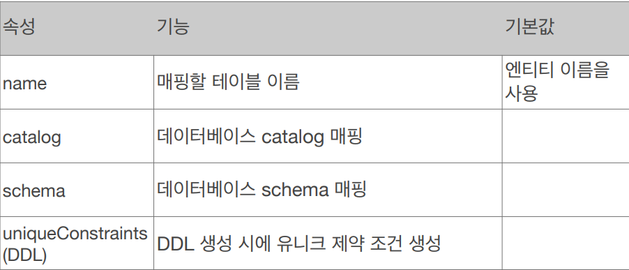
그밖에 이런 기능들도 있다

## 데이터베이스 스키마 자동 생성

- DDL 을 애플리케이션 실행 시점에 자동 생성
  -> JPA 에서는 어플리케이션 로딩 시점에 create 문으로 DB 를 생성하고 시작할 수 있다.
- 테이블 중심 -> 객체 중심 -> 개발할때, 테이블 먼저 막 만들어놓고 객체와서 개발하는데 JPA 는 그럴필요 없다
그냥 객체에서 만들고 객체 매핑해놓으면 애플리케이션 뜰때, 필요한 테이블 다 만들어 준다
- 데이터베이스 방언을 활용해서 데이터베이스에 맞는 적절한 DDL 생성 -> 데이터베이스 마다 다른 방언을 다 적절하게 맞춰서 해준다
- 이렇게 생성된 DDL 은 개발 장비에서만 사용
- 생성된 DDL은 운영서버에서는 사용하지 않거나, 적절히 다듬은 후 사용

### 데이터베이스 스키마 자동 생성 - 속성
 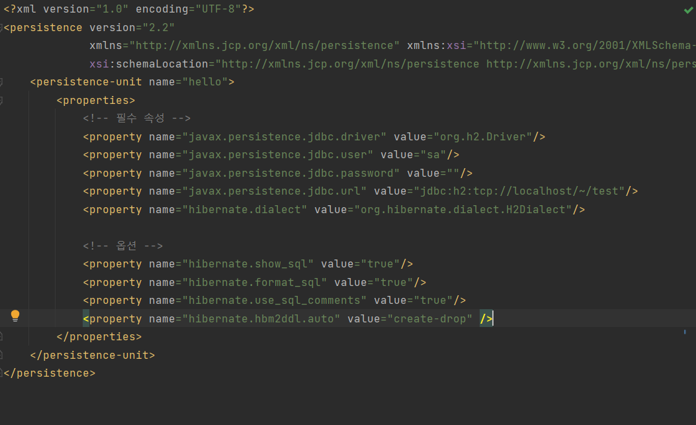
persistence.xml 에 보면 properties 에 hibernate.hbm2ddl.auto" value="create-drop
이게 있는데 이 값에 대한 속성들이다
 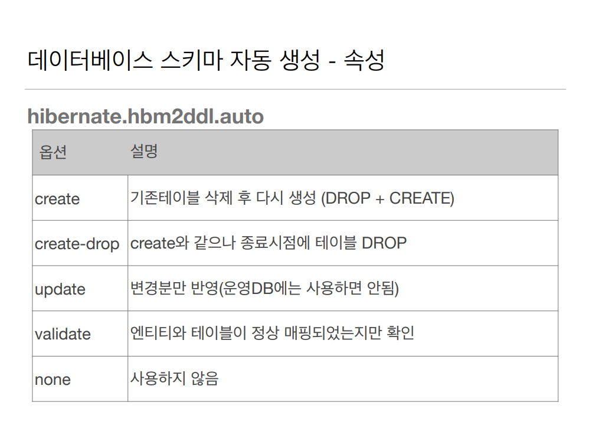

create-drop 은 종료 시점에 테이블을 DROP 하는데 이건 보통 test case 같은걸 실행하고 
마지막에 깔끔하게 싹다 날리고 싶을때 사용한다 

update 는 변경분만 반영하는데 테이블 속성 추가는 되지만 삭제는 안된다
 
### 데이터베이스 스키마 자동 생성 - 주의
- **운영 장비에는 절대 create, create-drop, update 사용하면 안된다.**
- 개발 초기 단계는 혼자 테스트로 create 또는 update 로 자기 로컬로 쓰면 된다
- 여려명의 개발자가 같이쓰는 중간 서버 테스트 서버는 update 또는 validate (create, update 쓰면 다 날라가잖아)
- 스테이징과 운영 서버는 validate 또는 none 쓴다

## 필드와 컬럼 매핑

``` java
@Entity
public class Member {
    @Id                //PK 매핑
    private Long id;   

    @Column(name = "name")    //객체는 username 이라 쓰고 싶은데 DB에는 
    private String username;  //name 이라고 써야되면 이렇게 하면 DB 컬럼 명은 name

    private Integer age;

    @Enumerated(EnumType.STRING)  //객체에서 enum 타입을 쓰고싶은데 DB 에는 enum 타입이 없다
    private RoleType roleType;    //그럼 @Enumerated 를 쓰면 된다

    @Temporal(TemporalType.TIMESTAMP) // @Temporal 에는 DATE, TIME, TIMESTAMP 3개가 있다 날짜, 시간, 날짜시간
    private Date createdDate;         

    @Temporal(TemporalType.TIMESTAMP)
    private Date lastModifiedDate;

    @Lob                            //데이터베이스에 VARCHAR 를 넘어서는 큰 컨텐츠를 넣고싶으면
    private String description;     // @Lob을 쓰면 된다
    
}

public enum RoleType {
    USER, ADMIN
}
```
이걸 실행하면
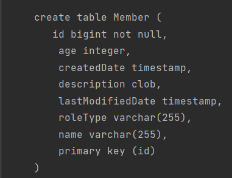
이렇게 뜬다 id 는 big int, 나이는 integer 쭉 매핑이 된것이다

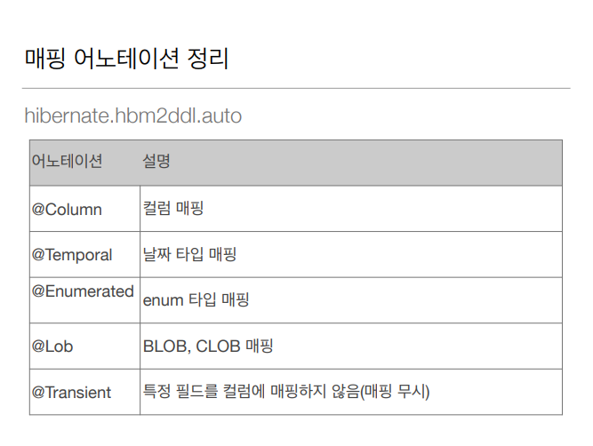

@Transient 는 매핑을 안하고싶을때 사용한다 DB랑 관계없이 메모리에서만 관리하고 싶으면
쓴다

매핑 어노테이션을 하나하나 살펴보면

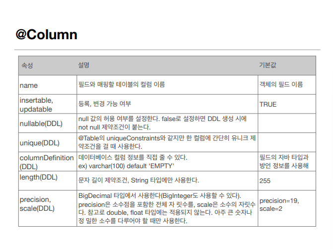

> 제일 많이 쓴다

insertable 데이터베이스에 insert 를 할건지 말건지 등록을 안할거야 insertable = false
updatable 은 데이터베이스 update 를 할건지 말건지 변경 안할거야 updatable = false

nullable = false 로하면 우리가 잘 아는 NOTNULL 제약조건이 붙는다

unique = true 를 하면 unique 제약 조건이 붙는다 근데 거의 안쓴다

columnDefinition = varchar(100) default 'EMPTY' 이렇게 DB 칼럼 정보를 직접 줄 수 있다

length = 10 을 해주면 VARCHAR(10) 으로 된다

precision, scale 엄청 긴 소수점이나 숫자가 엄청 큰 경우 내가 원하는대로 옵션을 줄 수 있다

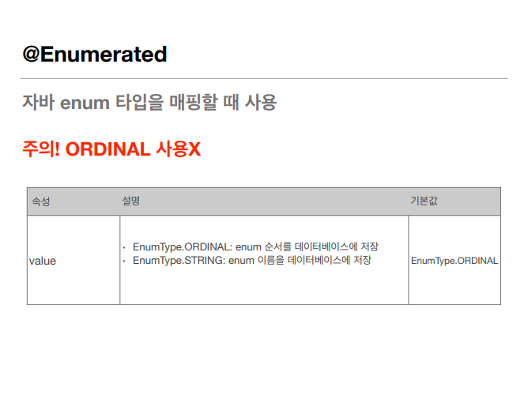

EnumType 을 쓸때는 기본이 ORDINAL 인데 ORDINAL 은 enum 의 순서를 DB 에 저장 하는거고
STRING 은 enum 의 이름을 DB 에 저장 하는 것이다

``` java
public enum RoleType {
    USER, ADMIN
}
```
이런 enum 이 있을때, ORDINAL 로 member.setRoleType(RoleType.USER) 이렇게해서 DB 에 저장
을 하면 DB 에 RoleType 이 int 로 0 번으로 들어가 있다 순서대로 0은 USER 1은 ADMIN 이렇게 enum 순서
대로 저장을 하는 것이고 STRING 으로 하면 DB 에 RoleType 은 String 으로 "ADMIN" 이라고 저장 되어 있을 것이
다 만약에 RoleType 에 guest 가 추가 된다 했을때 ORDINAL 로 했으면 순서를 다시 정해줘야 된다
그니까 STRING 을 쓰자

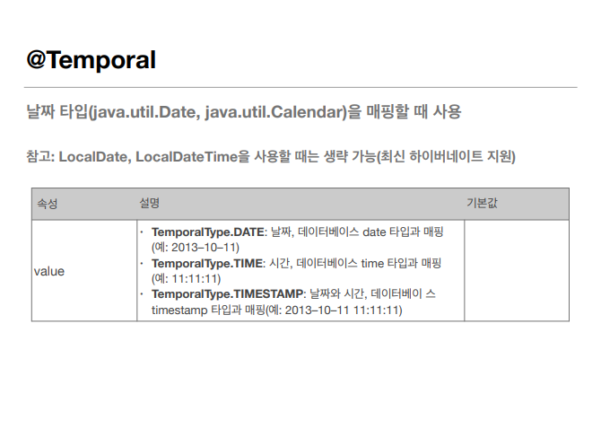

요즘 잘 안쓴다 java 8 시대라서 LocalDate, LocalDateTime 이 생겨서
그냥 이거 쓰면 된다. private LocalDate localDate; 이렇게 하면 hibernate 에서는
어노테이션 없어도 type 을 보고 LocalDate 는 date 로 LocalDateTime 은 timestamp 로 잘 알아서 해준다

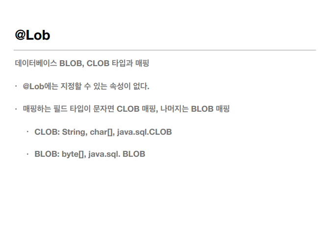

데이터베이스에 VARCHAR 를 넘어서는 큰 컨텐츠를 넣고싶으면 사용한다

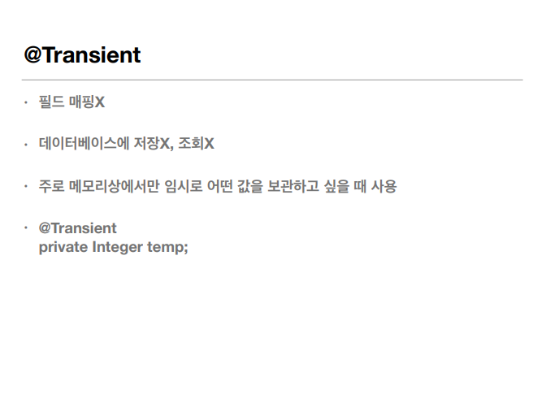

매핑 하기 싫으면 사용한다

## 기본 키 매핑

### 기본 키 매핑 어노테이션
- @id
- @GeneratedValue

### 기본 키 매핑 방법

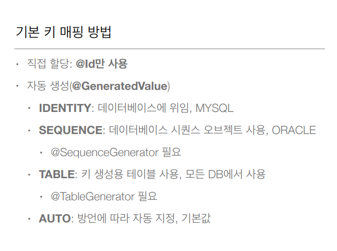

> 자동 생성 속성들에 대해 알아보자

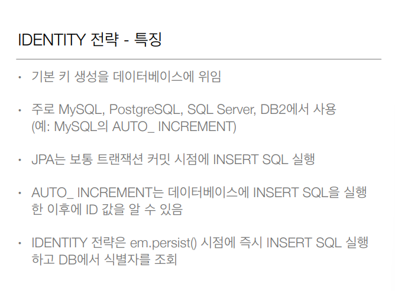

``` java
@Entity 
public class Member { 
  @Id 
  @GeneratedValue(strategy = GenerationType.IDENTITY) 
  private Long id; 
```

> MySQL 의 AUTO_INCREMENT 와 같은데
> properties 에 DB 방언을 MySQL 로 바꾸고 member 를 persist 해주는데 member 의 id 는 set 해주지 말고
> 해보면 첫번째 member id 는 1 이고 두번째 member id 는 2 이렇게 된걸 볼 수 있다

- 문제점 -> Identity 전략은 id 에 값을 넣어주면 안되고 DB 에 INSERT 를 해줘야 하는데 DB 에서 NULL
로 INSERT 쿼리가 날라오면 그때 DB 에 값을 세팅한다 그럼 ID 값을 알 수 있는 시점은 DB 에 값이 들어와 봐야
알 수 있다 그런데 JPA 영속성 컨텍스트에서 관리되려면 무조건 PK 값이 있어야 하는데 얘는 DB 에 값이 들어와 봐야
PK 값을 알 수 있다

 
여기 @Id 값을 DB 에 넣기 전까지 모르니까 JPA 입장에서는 키가 없으니까 값을 넣을 수 있는 방법이
없다 그래서 JPA 에서는 울며 겨자먹기로 IDENTITY 전략에서만 예외적으로 em.persist 를 호출하자마자 DB 에
INSERT 쿼리를 날려버린다 (원래는 트랜잭션 커밋 시점에 insert 쿼리 날림)

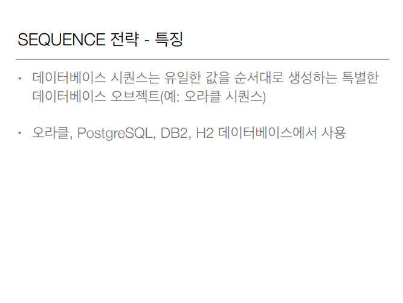

``` java
@Entity 
@SequenceGenerator( 
  name = “MEMBER_SEQ_GENERATOR", 
  sequenceName = “MEMBER_SEQ", //매핑할 데이터베이스 시퀀스 이름
  initialValue = 1, allocationSize = 1) 
public class Member { 
  @Id 
  @GeneratedValue(strategy = GenerationType.SEQUENCE, 
  generator = "MEMBER_SEQ_GENERATOR") 
  private Long id;
```

> 이것도 Identity 와 같다
> 테이블 마다 시퀀스를 따로 관리하고 싶으면 @SequenceGenerator 로 시퀀스 이름을 정해주면 된다
> 이제 기본키에 generator = "MEMBER_SEQ_GENERATOR" 를 해주면 시퀀스를 MEMBER_SQL 로 만든다

- 얘도 IDENTITY 처럼 DB 에 가봐야 Id 값을 알 수 있다 시퀀스 오브젝트는 DB 에서 관리하니까.
그리고 em.persist() 할 때 영속성 컨텍스트에 넣어야되는데 pk를 알 수 없다 어캐할건다
em.persist() 할때 DB 에 MEMBER_SEQ 에다가 call next value for MEMBER_SEQ 라고 해서 미리 다음 값을
받아와서 그것을 member.id 에 넣고 영속성컨텍스트에 저장한다 그러면 아직 DB 에 insert 쿼리는 안날라간 상태
실제 트랜잭션 커밋하는 시점에 insert 쿼리 호출된다 근데 단점은 call next value 를 할때 마다
네트워크 타고 DB에 값을 요청하고 받아와야 된다 (allocationSize 로 최적화 가능)

- allocationSize 로 성능을 증가 시킬 수 있다 allocationSize = 50 으로 한다하면 next call 할때 미리 50개를 땡겨 오는
거다 여러 웹서버가 있어도 동시성 문제없이 해결 가능 (미리 값을 올려놓는 방식이기 때문에 웹서버10대가 동시에 호출해도
쭉 값이 올라가 있고 자기가 미리 숫자를 확보하기 때문에 문제가 없다 ex)어떤애는 1부터 50 어떤애는 50부터 100)

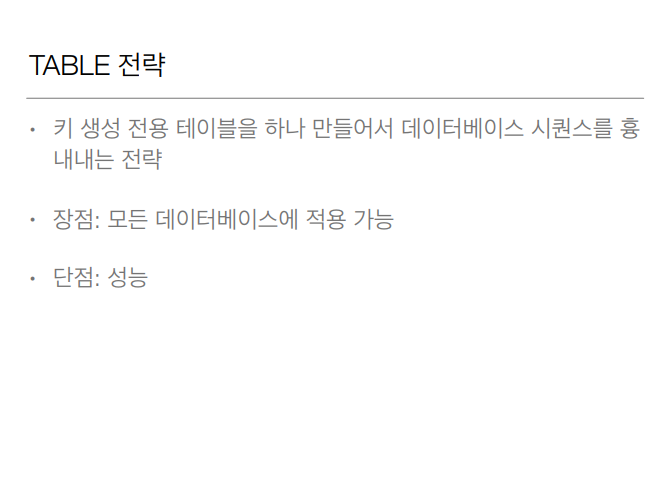

``` java
create table MY_SEQUENCES ( 
 sequence_name varchar(255) not null, 
 next_val bigint, 
 primary key ( sequence_name ) 
)
@Entity 
@TableGenerator( 
 name = "MEMBER_SEQ_GENERATOR", 
 table = "MY_SEQUENCES", 
 pkColumnValue = “MEMBER_SEQ", allocationSize = 1) 
public class Member { 
 @Id 
 
 @GeneratedValue(strategy = GenerationType.TABLE, 
 generator = "MEMBER_SEQ_GENERATOR") 
 private Long id; 
```

- 여기에도 allocationSize 가 있는데 시퀀스랑 같다

@GeneratedValue(strategy = GenerationType.Auto) -> Auto 는 DB 방언에 맞춰서 자동으로 생성 ex) 오라클이면 시퀀스

 '  ' = GenerationType.Identity -> 기본 키 생성을 데이터베이스에 위임
 
### 권장하는 식별자 전략
- 기본 키 제약 조건: null 아님, 유일, **변하면 안된다**. -> 이래야 기본키로 쓸 수 있다.
- 미래까지 이 조건을 만족하는 자연키는 찾기 어렵다. 대리키(대체키) 를 사용하자 (자연키는 비지니스 적으로 의미있는 키 주번, 전번)
(대리키는 generateValue 나 랜덤 값 같이 비지니스와 전혀 상관없는 키를 사용하는것을 권장)
- 예를 들어 주민등록번호도 기본 키로 적절하지 않다.
- 권장: Long 형 + 대체키 + 키 생성전략 사용

## 요구사항 분석
- 회원은 상품을 주문할 수 있다
- 주문 시 여러 종류의 상품을 선택할 수 있다

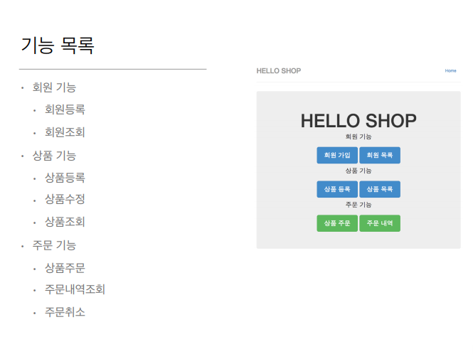

기능은 이런 기능들이 있다 기본적인 간단한 쇼핑몰

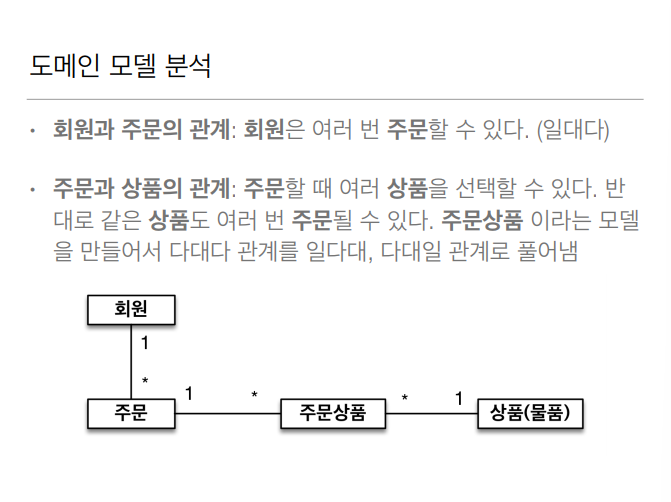

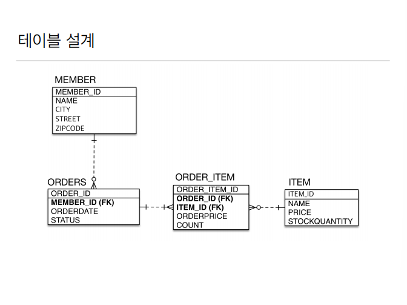

이걸 테이블로 설계했을때 중간 테이블인 ORDER_ITEM 이 있다

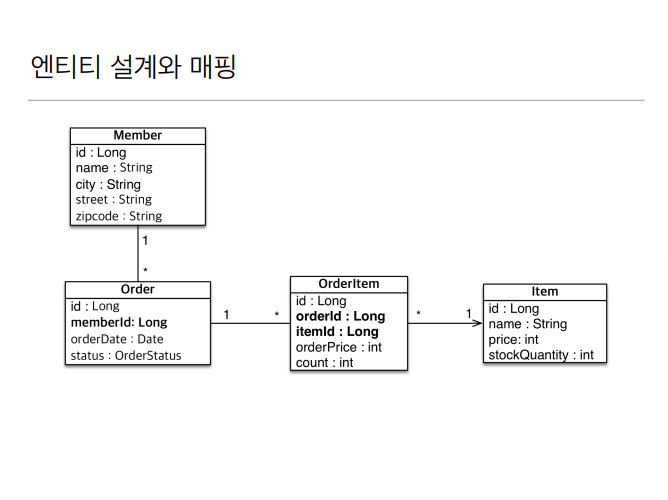
이걸 엔티티로 매핑하면 이렇게 된다.

## 실전 예제

### JpaMain
``` java
public class JpaMain {
    public static void main(String[] args) {
        EntityManagerFactory emf = Persistence.createEntityManagerFactory("hello");

        EntityManager em = emf.createEntityManager();

        EntityTransaction tx = em.getTransaction();
        tx.begin();

        try{
            Member member = new Member();

            tx.commit();
        } catch (Exception e) {
            tx.rollback();
        } finally {
            em.close();
        }
        emf.close();
    }
}
```

### Member
``` java
@Entity @Getter @Setter
public class Member {
    @Id @GeneratedValue(strategy = GenerationType.AUTO)
    @Column(name = "MEMBER_ID")
    private Long id;
    private String name;
    private String city;
    private String street;
    private String zipcode;
}
```
> 애매하면 Column 으로 매핑하는데 애매한것은 DB는 언더 스코어 방식이고(member_id)
> 자바는 카멜케이스 방식이다(memberId) 그런 이유로 name 에 언더스코터 방식을 많이쓴다
> 저렇게 그냥 속성없이하면 varchar(255) 라는 기본 값이 들어가는데 length = 10 과 같이 
> 길이를 제약할 수 있다 

### Order
```java
@Entity @Getter @Setter
@Table(name = "ORDERS")
public class Order {

    @Id @GeneratedValue(strategy = GenerationType.AUTO)
    @Column(name = "ORDER_ID")
    private Long id;

    @Column(name = "MEMBER_ID")
    private Long memberId;
    private LocalDateTime orderDate;
    @Enumerated(value = EnumType.STRING)
    private OrderStatus status;
}
```

> orderDate 를 ORDER_DATE, order_date(spring boot 기본 설정값) 로 바꿔준다 

### OrderItem
```java
@Entity @Getter @Setter
public class OrderItem {

  @Id
  @GeneratedValue(strategy = GenerationType.AUTO)
  @Column(name = "ORDER_ITEM_ID")
  private Long id;

  @Column(name = "ORDER_ID")
  private Long orderID;
  @Column(name = "ITEM_ID")
  private Long itemID;
  private int orderPrice;
  private int count;
}
```
### OrderStatus
``` java
public enum OrderStatus {
    ORDER, CANCEL
}
```

### 핵심
만약에 Order 을 찾아오고 그 주문을한 멤버의 아이디를 찾고싶다면

Order findOrder = em.find(Order.class, 1L);

아이디를 안다 치고 오더를 찾고


Long findMemberId = order.getMemberId();

오더에 멤버 아이디 찾아와서

Member member = em.find(Member.class, memberId);

그 아이디로 멤버 찾기

뭔가 객체지향스럽지 않다

이런설계를 객체를 관계형 DB 에 맞춰서 설계한 것이다
아니면 Order 클래스에 Member 객체 넣고 그 아이디를 찾아와야된다

### 데이터 중심 설계의 문제점

- 현재 방식은 객체 설계를 테이블 설계에 맞춘 방식
- 테이블 외래키를 객체에 그대로 가져옴
- 객체 그래프 탐색 불가
- 참조가 없으므로 UML 도 잘못됨

> 그래서 필요한게 연관관계 매핑


