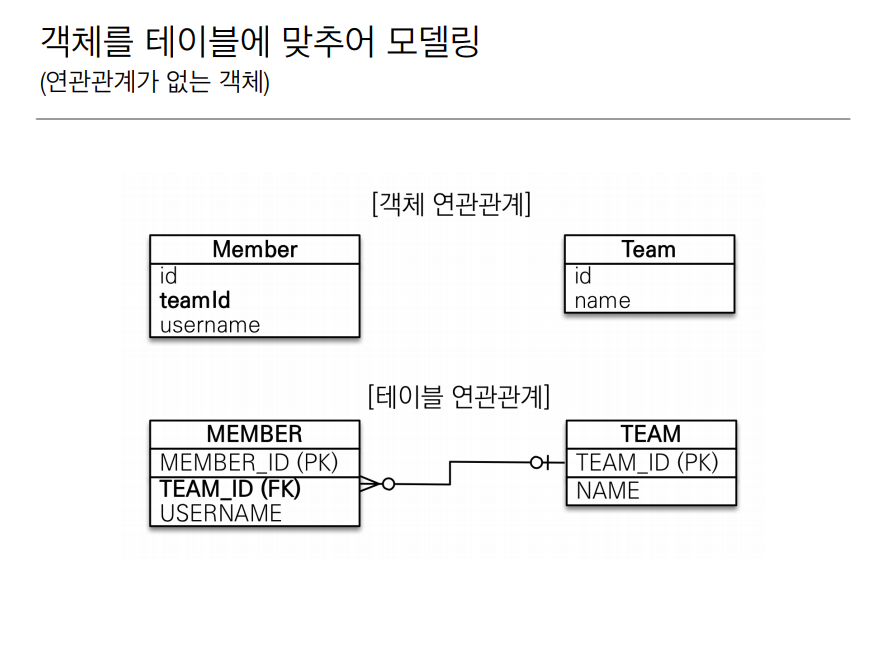
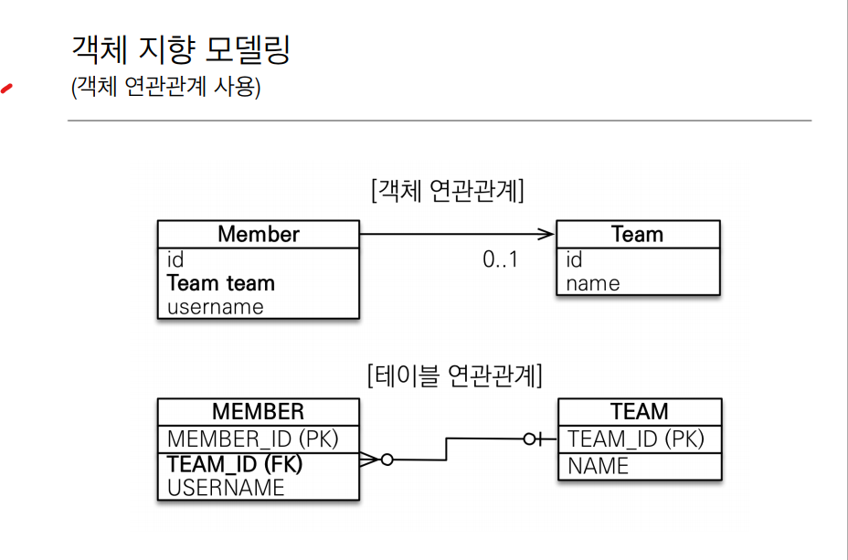
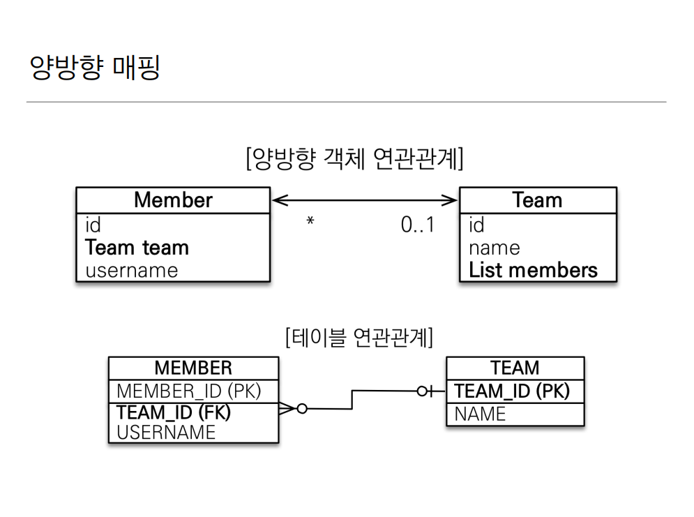
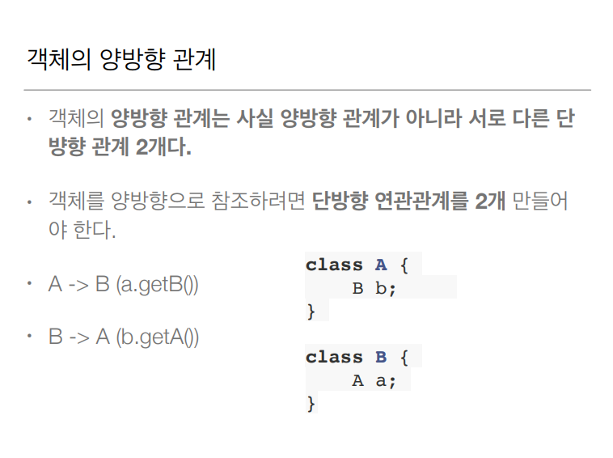
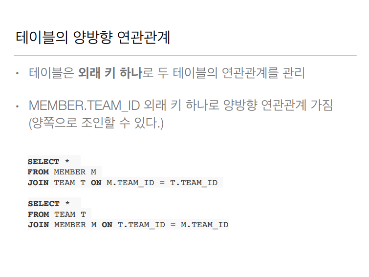
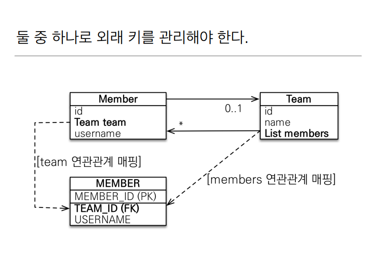
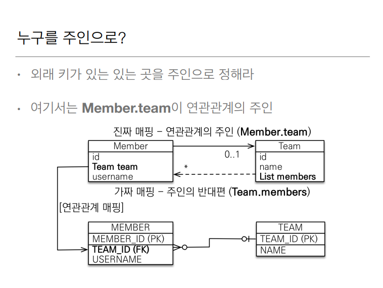
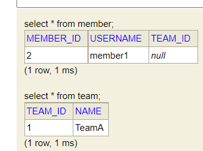

# 연관관계 매핑 기초
테이블에 맞춰서 외래키 그대로 가져오는게 아니라 연관관계를 맺어서 객체지향스럽게 만드는 방식
객체와 관계형 DB 의 패러다임 차이에서 오는것 중 제일 어려운 내용

> 목표
> - **객체와 테이블 연관관계 차이를 이해**
> - **객체의 참조와 테이블의 외래키를 매핑**
> - 용어 이해
    >   - 방향: 단방향, 양방향
>   - 다중성: 다대일, 일대다, 일대일, 다대다 이해
>   - 연관관계 주인: 객체 양방향 연관관계는 관리 주인이 필요

> 예제 시나리오
> - 회원과 팀이 있다
> - 회원은 하나의 팀에만 소속될 수 있다
> - 회원과 팀은 다대일 관계이다



하나의 팀에 여러 멤버가 소속되고 여러멤버는 하나의 팀에 소속될 수 있다

이걸 객체를 테이블에 맞추어 모델링을 하면

### Member
```java
@Entity @Getter @Setter
public class Member {

    @Id @GeneratedValue
    @Column(name = "MEMBER_ID")
    private Long id;

    @Column(name = "USERNAME")
    private String username;

    @Column(name =  "TEAM_ID")
    private Long teamId;
}
```
### Team
```java
@Entity @Getter @Setter
public class Team {
    @Id @GeneratedValue
    @Column(name = "TEAM_ID")
    private Long id;
    private String name;

}
```

Main 클래스에
```java
//팀 저장
Team team = new Team();
team.setName("TeamA");
em.persist(team);
//멤버 저장
Member member = new Member();
member.setUsername("member1");
member.setTeamId(team.getId()); //em.persist 하면 아이디의 값이 들어간다em.persist(member);             // pk 값이 세팅되야 영속상태가 된다

//조회
Member findMember = em.find(Member.class, member.getId());
Team findTeam = em.find(Team.class, team.getId());
```

연관관계가 없기때문에 이렇게 해야된다 객체지향적이지 않다

> 객체를 테이블에 맞추어 데이터 중심으로 모델링하면, 협력 관계를 만들 수 없다.
> - 테이블은 외래키로 조인을 사용해서 연관된 테이블을 찾는다.
> - 객체는 참조를 사용해서 연관된 객체를 찾는다.
> - 테이블과 객체 사이에는 이런 큰 간격이 있다.

## 단방향 연관관계


객체 지향스럽게 모델링 한 것이다
멤버의 teamId 는 Team 클래스의 참조값을 그대로 가져왔다

그리고 Member class 에
```java
@Entity
public class Member {

    @Id @GeneratedValue
    @Column(name = "MEMBER_ID")
    private Long id;

    @Column(name = "USERNAME")
    private String username;

//    @Column(name =  "TEAM_ID")
//    private Long teamId;
    @ManyToOne
    @JoinColumn(name = "TEAM_ID")
    private Team team;
}
```

일단 원래 있었던 private Long teamId 를 지우고

private Team team 으로 Team 클래스의 참조값을 그래도 가져온다
그다음에 Team 이랑 Member 랑 누가 '다' 고 누가 '일' 일까? 하나의 팀에 여러 맴버가 있을 수
있기 때문에 멤버가 N 이고 팀이 1 이다 그래서 멤버입장에서는 @ManyToOne 이라는 어노테이션으로
매핑을 해야한다.

그리고 Member class 에 레퍼런스와 Member table 에 FK 와 매핑을 해야한다 JoinColumn 어노테이션
으로 name 값에 실제 칼럼명 TEAM_ID 로 주면 된다 이러면 매핑이 끝난다


> 이렇게 매핑이 끝난다. Team team 과 TEAM_ID(FK) 와 연관관계 매핑

```java
//팀 저장
Team team = new Team();
team.setName("TeamA");
em.persist(team);
//회원 저장
Member member = new Member();
member.setUsername("member1");
member.setTeam(team);   //단방향 연관관계 설정, 참조 저장 
em.persist(member);            
//조회
Member findMember = em.find(Member.class, member.getId());
Team findTeam = findMember.getTeam();

```

## 양방향 연관관계와 연관관계 주인



> 객체끼리의 화살표가 서로 양방향이 되었다 테이블은 변화가 없다 왜? 멤버에 
> 내가 소속된 팀 아이디를 알고 싶으면 멤버의 TEAM_ID와 팀의 TEAM_ID 를 조인하면 알 수 있다
> 반대로 TEAM 입장에서 우리팀에 어떤 멤버들이 소속 되있는지 알고 싶으면 팀의 TEAM_ID 와
> 멤버의 TEAM_ID 를 조인하면 된다 테이블의 연관관계는 외래키 하나로 양방향이 가능하다 객체는 아니다

아까 멤버에 팀 참조값을 만들어서 Team findTeam = findMember.getTeam() 으로 멤버에서 팀
으로 갈 수 있었다 하지만 팀에서 멤버로 참조해서 갈 수 있을까? 없다
그래서 Team 에다가 List 로 Member 를 받아온다

```java
@Entity @Getter @Setter
public class Team {
    @Id @GeneratedValue
    @Column(name = "TEAM_ID")
    private Long id;
    private String name;

    @OneToMany(mappedBy = "team")
    private List<Member> members = new ArrayList<>();
}
```
이렇게 할 수 있다 당연히 일대 다 관계고 mappedBy 는 -> 일대다 매핑에서 뭐랑 연관 되어있는지
쓰면 된다 이제 멤버 클래스에 private Team team 이랑 연관 되어 있으니까 "team" 을 넣어주면
된다.

```java
public class JpaMain {
    public static void main(String[] args) {
        EntityManagerFactory emf = Persistence.createEntityManagerFactory("hello");

        EntityManager em = emf.createEntityManager();

        EntityTransaction tx = em.getTransaction();
        tx.begin();

        try{
            Team team = new Team();
            team.setName("TeamA");
            em.persist(team);

            Member member = new Member();
            member.setUsername("member1");
            member.setTeam(team);
            em.persist(member);

            em.flush();
            em.clear();

            Member findMember = em.find(Member.class, member.getId());
            List<Member> members = findMember.getTeam().getMembers();

            for(Member m: members) {
                System.out.println("m = " + m.getUsername());
            }
            tx.commit();
        } catch (Exception e) {
            tx.rollback();
        } finally {
            em.close();
        }
        emf.close();
    }
}
```
findMember 을 em.find 로 받아오고 그 멤버의 팀의 팀의 멤버를하면 findMember 가 소속된
전체 팀원을 출력 할 수 있다.
이렇게하면 이제 멤버에서 팀으로, 팀에서 멤버로 이걸 양방향 연관 관계라고 한다

## 연관관계의 주인과 mappedBy

- mappedBy = JPA 의 멘탈붕괴 난이도
- mappedBy 는 처음에는 이해하기 어렵다
- 객체와 테이블간에 연관관계를 맺는 차이를 이해해야 한다

### 객체와 테이블이 관계를 맺는 차이
- 객체 연관관계 = 2개
    - 회원 -> 팀 연관관계 1개(단방향)
    - 팀 -> 회원 연관관계 1개(단방향)
    - 사실 단방향 연관관계 두개를 양방향 연관관계라고 하는 것이다
- 테이블 연관관계 = 1개
    - 회원 <-> 팀의 연관관계 1개(양방향)





이렇게하면 딜레마가 온다



객체를 두방향으로 만들어놨다(참조값이 두개다) 멤버에서 팀으로 가는 Team team, 팀에서 멤버로 가는
List members 두개가 있다 그럼 나는 둘중에 뭘로 매핑을 해야할까?(만약 내가 Member 를 새로운팀
으로 들어가고 싶을때, Member 의 team 을 바꿔야 MEMBER 외래키가 업데이트가 되는건지, 아님 Team
의 members 를 바꿔야지 MEMBER 외래키가 업데이트 되는건지) DB 입장에서는 MEMBER 에 있는 TEAM_ID
외래키 값만 업데이트 되면 된다 그래서 국룰이 생겼다 그게 바로 **연관관계의 주인** 이다

### 연관관계의 주인

- 양방향 매핑 규칙
  - 객체의 두 관계중 하나를 연관관계의 주인으로 지정(바로 위에 Member 에 있는 team 이 주인이될래
아님 Team 에 있는 members 가 주인이 될래)
  - **연관관계의 주인만이 외래키를 관리**(등록 수정)
  - **주인이 아닌쪽은 읽기만 가능**
  - 주인은 mappedBy 속성 사용X
  - 주인이 아니면 mappedBy 속성으로 주인 지정

누구를 주인으로 할까 답이있다



여기서 아까 Member 와 Team 클래스를 살펴보자
Member.class
```java
@ManyToOne
@JoinColumn(name = "TEAM_ID")
private Team team;
```

> 여기서 JoinColumn 으로 Team.class 에 있는 TEAM_ID 에 매핑을 했다

Team.class
```java
@oneToMany(mappedBy = "team")
private List<Member> members = new ArrayList<>();
```

> 여기는 mappedBy 로 team 에 의해 관리가 되 라는 말이고 그 team 은 Member.class 의 team
> 이다 그래서 members 에 값을 넣어 봐야 아무일도 벌어지지 않는다 대신 이걸로 team.getMembers 
> 로 특정 팀과 연관된 회원을 조회하는건 가능하다 값을 변경, 삽입 할때는 Member.class 에 있는
> team 만 참조한다

**결론은 외래키가 있는곳을 주인을 정해야 한다** -> Team 에 members 의 값을 바꿨는데 MEMBER 
테이블에 업데이트 쿼리가 나간다? 이거 자체가 햇갈린다 그리고 성능이슈도 있다

## 양방향 매핑시 가장 많이 하는 실수

- 연관관계의 주인에 값을 입력하지 않음

```java
Team team = new Team();
team.setName("TeamA");
em.persist(team);

Member member = new Member();
member.setUsername("member1");

team.getMembers().add(member);

em.persist(member);
tx.commit();
```



보면 MEMBER 테이블에 TEAM_ID 가 NULL 이다 왜그럴까?
> Member.class 에 있는 team 이 연관 관계의 주인이다 Team.class 에 있는 members 는 mappedBy
> 읽기 전용(가짜 매핑) 이다 그래서 team.getMembers().add(member) 이거 지우고 member.setTeam(team)
> 을 해준다 

```java
Team team = new Team();
team.setName("TeamA");
em.persist(team);

Member member = new Member();
member.setUsername("member1");
member.setTeam(team);
em.persist(member);

tx.commit();
```

이렇게하면 정상적으로 값이 들어간다


> 이코드가 JPA 에 맞는 코드지만 정말 객체 지향적으로 생각해보면 둘다 양쪽에다 값을 걸어야한다
> 위 코드에 team.getMembers().add(member); 이것도 추가해야된다

```java
Team team = new Team();
team.setName("TeamA");
em.persist(team);

Member member = new Member();
member.setUsername("member1");
member.setTeam(team);
em.persist(member);

team.getMembers().add(member);

tx.commit();
```

> 이렇게

## 양방향 연관관계 주입 - 실습

- 순수 객체 상태를 고려해서 항상 양쪽에 값을 설정하자
- 연관관계 편의 메소드를 생성하자
- 양방향 매핑시에 무한루프를 조심하자
  - ex) toString(), lombok, JSON 생성 라이브러리

순수 객체 상태를 고려해서 항상 양쪽에 값을 설정하려면 복잡하고 깜빡깜빡 할 수 있으니
연관관계 편의 메서드를 만든다

Member.class
```java
public void setTeam(Team team) {
    this.team = team;
    team.getMembers().add(this);
}
```

> team.getMembers().add(this); this 는 Member.class 자체 나 자신 인스턴스를 넣어주고
> 메인에 있는 team.getMembers().add(member); 코드를 지워준다

무한루프는 예를들어 
Member.class
```java
@Override
public String toString() {
    return "Member{" +
        "id=" + id +
        ", username='" + username + '\'' +
        ", team=" + team +      //여기서 문제
        '}';
}
```
Team.class
```java
@Override
public String toString() {
    return "Team{" +
        "id=" + id +
        ", name='" + name + '\'' +
        ", members=" + members +        //여기서 문제
        '}';
}
```

> 이렇게 toString 메서드를 만들면 Member.class 에 ", team=" + team + 이 부분은 Team 으로
> 가는데 Team.class 에는 ", members=" + members + 이게 다시 Member 로 가서 무한루프 발생
> 하고 스택오버플로우가 발생한다

> Controller 에는 엔티티 자체를 JSON 으로 반환하면 무한루프가 생길 수 있고 엔티티는 변경될
> 수 있는데 그때 API 스팩이 바뀌어 버린다 엔티티는 왠만하면 dto 로 변환을 해서 반환하자

## 양방향 매핑 정리

- 단방향 매핑만으로도 이미 연관관계 매핑은 완료가 된 것이다 -> JPA 모델링 할때는 단방향 매핑
으로 설계를 완료해야 한다
- 양방향 매핑은 반대방향으로 조회(객체 그래프 탐색) 기능이 추가된 것 뿐
- JPQL 에서 역방향으로 탐색할 일이 많음
- 단방향 매핑을 잘 하고 양방향은 필요할 때 추가해도 됨(테이블에 영향을 주지 않음)
java 코드 몇줄 추가하는거 어렵지 x 이타이밍에 정말 필요하냐 고민해보고 넣는다
- 결론: 단방향 매핑으로 다끝낸다, 일대다 일때 다에다가 연관관계매핑 다하고 설계 끝내고 애플리
케이션 개발하는 단계에서 양방향매핑을 고민해도 늦지 않다

## 연관관계의 주인을 정하는 기준

- 비지니스 로직을 기준으로 연관관계의 주인을 선택하면 안됨
- **연관관계의 주인은 외래 키의 위치를 기준으로 정해야함**

# 연관관계 매핑 시작


