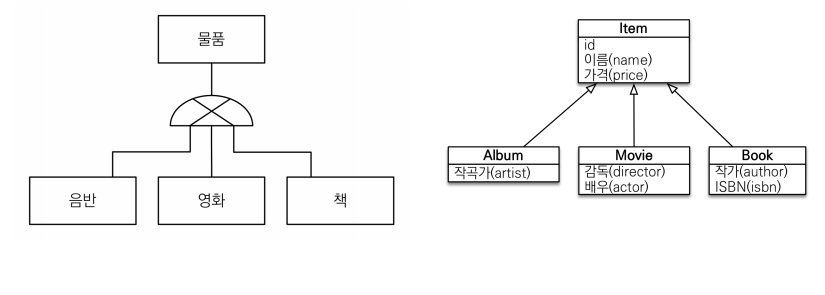
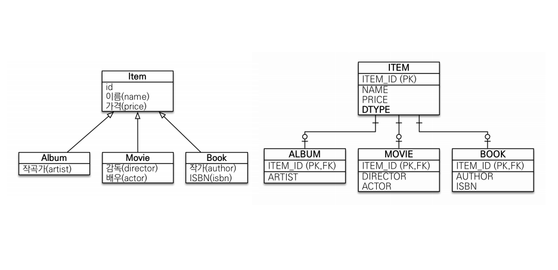
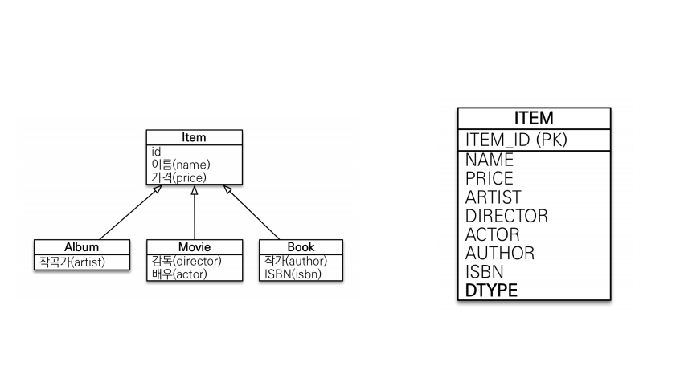
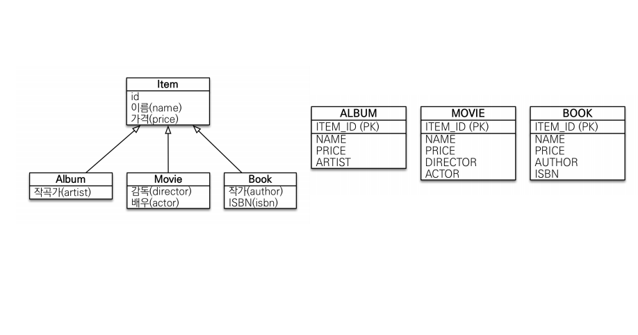
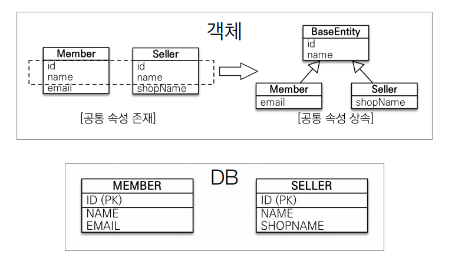
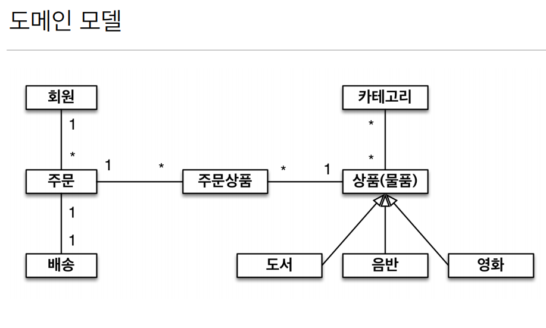
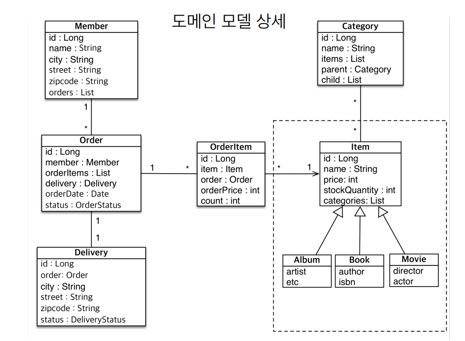
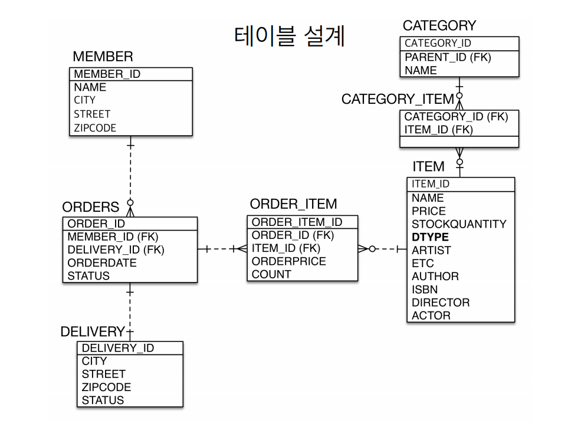

# 고급매핑

## 상속 관계 매핑
- 관계형 데이터베이스는 상속관계 X
- 슈퍼타입 서브타입 관계라는 모델링 기법이 객체 상속과 유사
- 상속관계 매핑: 객체의 상속구조와 DB 의 슈퍼타입 서브타입 관계를 매핑



DB 입장에서 슈퍼타입 서브타입 논리 모델을 실제 물리 모델로 구현하는 방법은 3가지가 있다
1. 각각 테이블로 변환 -> 조인전략
2. 통합 테이블로 변환 -> 단일 테이블 전략
3. 서브타입 테이블로 변환 -> 구현 클래스마다 테이블 전략\

### 조인 전략 (정석)


> ITEM 테이블만들고 앨범 무비 북 테이블 만들고 전부 조인으로 구성하는 방식
> 예를들어서 앨범 데이터를 추가하면 앨범의 이름이랑 가격은 ITEM 테이블에 들어가고 ARTIST 정보는
> 앨범 테이블에 들어간다 그래서 인서트를 두번 해야 한다 조회는 ITEM_ID 인 PK FK 로 
> 조인을 통해 조회한다
> 그래서 ITEM 테이블에 DTYPE 은 앨범인지 무비인지 북인지 구분하는 칼럼 이다

장점
- 데이터가 정규화 -> 제품들의 가격으로 정산을 해야되면 ITEM 테이블만 보면 된다
- 외래키 참조 무결성 제약조건 활용 가능 -> 테이블 ITEM 테이블의 ITEM_ID 아이디와 자식 클래스의 
ITEM_ID 를 쓸 수 있고 주문키에서 ITEM_ID 를 봐야된다 하면 ITEM 클래스만 보면 된다 설계깔끔
- 저장공간 효율화

단점
- 조회시 조인을 많이 사용, 성능 저하
- 조회 쿼리가 복잡함
- 데이터 저장시 INSERT SQL 2번 호출

### 단일 테이블 전략


> 논리모델을 그냥 한테이블에 다 합쳐버리는 방식
> DTYPE 은 조인전략과 같은 기능이다
> 영화를 넣으면 영화와 관련없는 칼럼은 null 로 한다 인서트할때 쿼리 한번

장점
- 조인이 필요없으므로 조회 성능이 빠름
- 조회 쿼리가 단순함

단점
- 자식 엔티티가 매핑한 칼럼은 모두 null 을 허용해야 한다
- 단일 테이블에 모든것을 저장하므로 테이블이 커질 수 있다 상황에 따라서 조회성능이 오히려 느려질
수 있다.

### 구현 클래스마다 테이블 전략 (잘 안씀)


> 아이템 테이블 없이 앨범 무비 북 테이블 3개만 만들고 칼럼을 각각 전부 다 들고 있는 방식
> 아이템 클래스를 추상클래스로 만들어야 한다 DTYPE 필요하지 않다
> 단순하고 좋지만 부모 타입으로 조회할때, 복잡한 쿼리로 조회한다
> ex) Item item = em.find(Item.class, movie.getId()); 를 하면 아이템클래스의 자식클래스
> 들을 ITEM_ID 로 전부 뒤져야 찾을 수 있다

장점
- 서브타입을 명확하게 구분해서 처리할 때 효과적
- not null 제약조건 사용 가능

단점
- 여러 자식 테이블을 함께 조회할 때 성능이 느림
- 자식 테이블을 통합해서 쿼리하기 어려움

객체 입장에서는 3방식 전부 똑같다 어떤 방식이여도 JPA 는 매핑이 가능하다

그냥 평소대로 자바 코딩하듯이 엔티티 만들면 단일 테이블 전략으로 테이블이 생성된다 조인 전략을
선택하고 싶으면 어노테이션을 사용하면 된다

### 주요 어노테이션

- @Inheritance(strategy=InheritanceType.XXX)
  - JOINED: 조인 전략
  - SINGLE_TABLE: 단일 테이블 전략
  - TABLE_PER_CLASS: 구현 클래스마다 테이블 전략
- @DiscriminatorColumn(name=“DTYPE”) -> DTYPE 생성, 무비를 생성하면 ITEM 테이블에 DTYPE = MOVIE
- @DiscriminatorValue(“XXX”) -> 예를들어서 DBA 가 앨범은 A 로하고 영화는 M, 이런식으로 하고
싶으면 엔티티명을 클래스명말고 따로 설정해 줄 수 있다 그럼 DTYPE 에 MOVIE 말고 M 이 들어간다

그냥 조인을 기본으로 깔고 정말 단순하고 확장할 일이 없으면 단일테이블로 하자

## @MappedSuperclass

- 공통 매핑 정보가 필요할 때 사용
  

정말 단순하게 객체 입장에서 id 랑 name 이라는 필드가 Member 에도 나오고 Seller 에도 계속 나오면
클래스 만들때 마다 귀찮으면 부모 클래스에 두고 속성만 상속해서 쓰면 좋다

만약에 어플리케이션에 항상 모든곳에 등록, 수정할때 마다 누가, 몇시에 했는지 정보가 있어야 한다면

```java
private String createBy;
private LocalDateTime createDate;
private String lastModifiedBy;
private LocalDateTime lastModifiedDate;
```

이거를 Member.class 에도 넣고 Team.class 에도 넣고 모든 클래스에 다 넣는것보다 
BaseEntity.class 를 만들어서 위 코드만 넣고 엔티티 클래스들이 BaseEntity.class 를 상속한
후 BaseEntity.class 에 @MappedSuperclass 를 넣어주면 된다 (그냥 매핑 정보만 받는 부모클
래스라고 보면 된다)

- 상속관계 매핑 X
- 엔티티 X, 테이블과 매핑 X
- 부모 클래스를 상속 받는 자식 클래스에 매핑 정보만 제공
- 조회, 검색 불가(em.find(BaseEntity) 불가)
- 직접 생성해서 사용할 일이 없으므로 추상 클래스 권장
- 테이블과 관계 없고, 단순히 엔티티가 공통으로 사용하는 매핑 정보를 모으는 역할
- 주로 등록일, 수정일, 등록자, 수정자 같은 전체 엔티티에서 공통 으로 적용하는 정보를 모을 때 사용
- 참고: @Entity 클래스는 엔티티나 @MappedSuperclass 로 지정한 클래스만 상속 가능

## 실전 에제

### 요구사항 추가
- 상품의 종류는 음반, 도서, 영화가 있고 이후 더 확장될 수 있다.
- 모든 데이터는 등록일과 수정일이 필수다.

  
  
상품에 도서, 음반, 영화를 상속관계로 매핑을 했다

  

기존에 도서 음반 영화 클래스 추가

  

싱글 테이블전략으로 설계

