# 다양한 연관관계 매핑

## 연관관계 매핑시 고려사항 3가지

- 다중성
- 단방향, 양방향
- 연관관계 주인

### 다중성

- 다대일: @ManyToOne
- 일대다: @OneToMany
- 일대일: @OneToOne
- 다대다: @ManyToMany

> 다중성은 JPA 에서 나오는 어노테이션은 DB 와 매핑하기 위한것일 뿐 
> DB 관점에서 다중성을 기준으로 고민하면됨

### 단방향, 양방향

- 테이블
  - 외래키 하나로 양쪽 조인 가능
  - 사실 방향이라는 개념이 없음
- 객체
  - 참조용 필드가 있는 쪽으로만 참조 가능
  - 한쪽만 참조하면 단방향
  - 양쪽이 서로 참조하면 양방향

### 연관관계의 주인

- 테이블은 외래 키 하나로 두 테이블이 연관관계를 맺음
- 객체 양방향 관계는 A->B, B->A 처럼 참조가 2군데
- 객체 양방향 관계는 참조가 2군데 있음, 둘중 테이블의 외래키를 관리할 곳을 지정해야함
- 연관관계의 주인: 외래 키를 관리하는 참조
- 주인의 반대편: 외래 키에 영향을 주지 않음, 단순 조회만 가능

## 다대일 [N:1]

- 가장 많이 사용하는 연관관계
- 다대일의 반대는 일대다

### 다대일 단방향

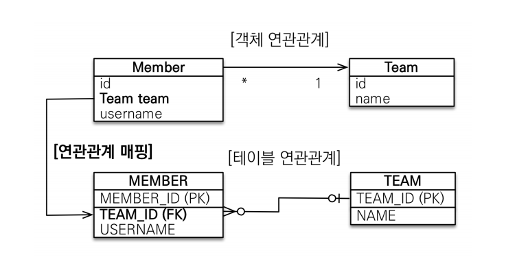

Member 와 Team 이 있으면 DB 입장에서 생각해보면 당연히 Team 이 1 이고 멤버가 N 이다 그러면
다 쪽에 외래키가 가야한다 항상 다(N) 에 외래키가 가야 한다 그래야 Member 를 두명 넣어도 Team_Id
에 같은팀을 넣을 수 있다 반대로 Team 에 Member_Id 가 있으면 Team 을 여러개 insert 해야 한다

결론은 그냥 MEMBER 에 있는 Team_Id 끌어와서 Member.class 에 Team team 에 매핑 걸면 된다
Member.class 에 Team team 은 Team 을 찾아가고 싶어서 만든것

Member.class
```java
@ManyToOne
@JoinColumn(name = "TEAM_ID")
private Team team;
```
Team.class
```java
@Column(name = "TEAM_ID")
private Long id;
```

### 다대일 양방향

- 외래 키가 있는 쪽이 연관관계의 주인
- 양쪽을 서로 참조하도록 개발

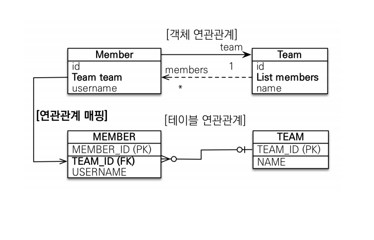

반대쪽 사이드를 추가하면 된다 하지만 그래도 테이블에 영향을 전혀 주지 않는다 
Member 에 Team team 이 연관관계의 주인이기 때문이고 반대쪽은 읽기만 가능하기 때문

Team.class
```java
@OneToMany(mappedBy = "team")
private List<Member> members = new ArrayList<>();
```

mappedBy = 는 Member.class 에 있는 team 에 의해 매핑이 되어진 다는 뜻

## 일대다 [1:N]

### 일대다 단방향

- 일대다 단방향은 일대다(1:N) 에서 1이 연관관계의 주인
- 테이블 일대다 관계는 항상 다(N) 쪽에 외래키가 있음
- 객체와 테이블의 차이 때문에 반대편 테이블의 외래키를 관리하는 특이한 구조
- @JoinColumn 을 꼭 사용하야 함. 그렇지 않으면 조인 테이블 방식을 사용함(중간에 테이블 하나 추가)
 
> 1이 연관관계의 주인, 1이 외래키를 관리하겠다 라는 뜻 (권장 하지 않음)
> DB 테이블 상 무조건 다 쪽에 외래키가 들어간다 여기서는 Member 에 들어가고 Team 에는 외래키가
> 들어갈 수가 없다

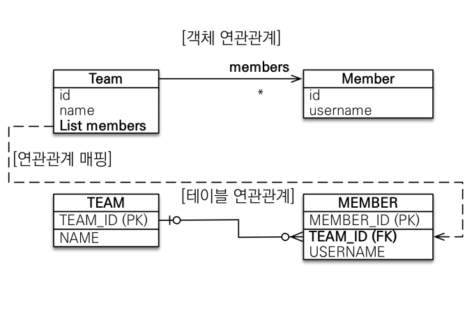

Team 을 중심으로 뭘 해보겠다, Team 에 List members 를 갖는다 어떤 상황에서 유효할까
-> Member 객체는 Team 을 알고싶지 않은거고 반대로 Team 은 Member 를 알고 싶으면 유효하다
Team 에 members 를 추가하거나 변경하면 MEMBER 에 있는 TEAM_ID 를 변경 시켜 줘야 한다
Team 에 있는 List members 의 값을 바꿨을때(추가, 수정), MEMBER 에 있는 TEAM_ID(FK) 를 업데이트 해야
한다 

Member.class
```java
@Entity
@Getter @Setter
public class Member {

  @Id
  @GeneratedValue
  @Column(name = "MEMBER_ID")
  private Long id;

  @Column(name = "USERNAME")
  private String username;
}
```
> Member 에는 깔끔하게 id, username 만 있다

```java
@Entity
@Getter @Setter
public class Team {
  @Id
  @GeneratedValue
  @Column(name = "TEAM_ID")
  private Long id;
  private String name;

  @OneToMany
  @JoinColumn(name = "TEAM_ID")
  private List<Member> members = new ArrayList<>();
}
```

조금 어색하긴 하지만 이렇게하면 동작한다

Main.class
```java
Member member = new Member();
member.setUsername("member1");
em.persist(member);

Team team = new Team();
team.setName("teamA");
team.getMembers().add(member);

em.persist(team);

tx.commit();
```

이렇게 하면 MEMBER 에 있는 TEAM_ID(FK) 가 업데이트 될 것이다
team.getMembers().add(member); 이 내용은 TEAM 테이블에 insert 될 수 있는 내용이 아니다
왜? team.getMembers().add(member); 이렇게 하면 회원이 속한 팀을 지정해 주는 건데 Team 이
연관관계 주인이라서 team 에 있는 members 에 회원을 추가해도 결국엔 MEMBER 테이블에 있는 
TEAM_ID(FK) 를 update 쳐줘야 한다

그래서
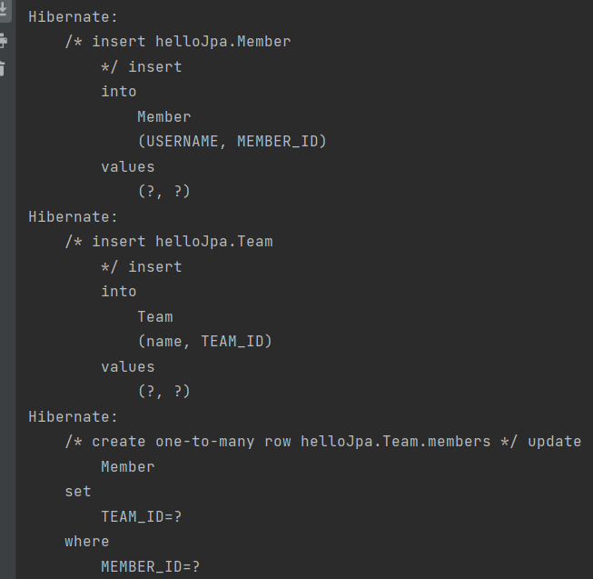

Team 엔티티에 손을 댔는데 MEMBER 테이블에 업데이트 되는 것이다
실무에선 테이블이 한두개가 아닌데 이렇게되면 운영이 힘들어진다
그래서 다대일 단방향 관계에 필요하면 양방향 관계를 추가하는 방식이 좋은 방식이다
Member 입장에서 Team 으로 가는 참조를 만들기 싫어도....

일대다 단방향 매핑의 단점
- 엔티티가 관리하는 외래키가 다른 테이블에 있음
- 연관관계 관리를 위해 추가로 update SQL 실행
- 일대다 단방향 매핑보다 다대일 양방향 매핑을 사용하자

### 일대다 양방향

- 이런 매핑은 공식적으로 존재하지 않다
- @JoinColumn(insertable = false, updatable = false)
- 읽기 전용 필드를 사용해서 양방향 처럼 사용하는 방법
- 다대일 양방향을 사용하자

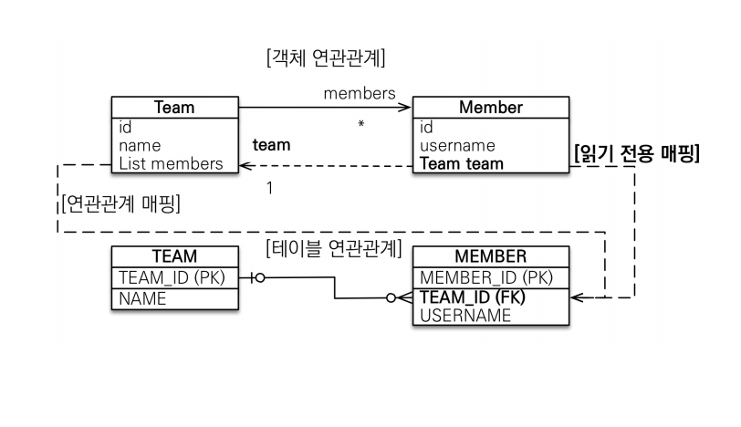

억지지만 가능은 하다 Team 에 List members 가 연관관계 주인이지만(MEMBER 테이블의 외래키인
TEAM_ID 를 관리한다) 양방향이면 Member.class 에서 Team.class 으로 조회하고 싶어 라고 하면

Member.class
```java
@ManyToOne
@JoinColumn(name = "TEAM_ID", insertable = false, updatable = false)
private Team team;
```
이렇게 다대일 단방향 관계인것처럼 매핑을 건다, 그럼 Member.class 에 team 이 연관관계의 주인
처럼 되버리기 때문에 insertable = false, updatable = false 로 읽기전용으로 억지로 만든다
결과적으로 Team.class 에 members 가 연관관계 주인이고 Member.class 에 team 은 연관관계 
주인처럼 하지만 읽기전용이다

## 일대일 [1:1]

- 일대일 관계는 그 반대도 일대일
- 주 테이블이나 대상 테이블 중에 외래키 선택 가능
- 외래키에 DB unique 제약조건 추가

### 일대일 단방향

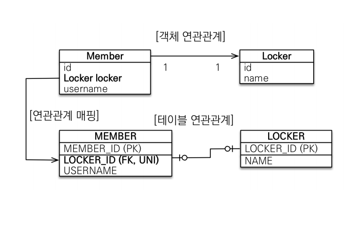

Member 가 주 테이블 Locker 가 대상 테이블 이다 회원이 라커 하나만 가지고 라커는 하나의 회원을
가지고 있는 룰이 있다고 가정해보자

외래키를 MEMBER 에 LOCKER_ID(FK, UNI) 이렇게 넣어도 되고 
LOCKER 에 MEMBER_ID(FK, UNI) 이렇게 넣어도 된다

전자로 예시를 들어보면 단순하게 Member.class 에 Locker locker 를 넣고 연관관계 매핑 하면 된다
다대일 단방향 매핑과 매우 흡사하다 

Member.class
```java
@Entity
@Getter @Setter
public class Member {

  @Id @GeneratedValue
  @Column(name = "MEMBER_ID")
  private Long id;

  @Column(name = "USERNAME")
  private String username;

  @OneToOne
  @JoinColumn(name = "LOCKER_ID")
  private Locker locker;
}
```

Locker.class
```java
@Entity
@Getter @Setter
public class Locker {

    @Id @GeneratedValue
    @Column(name = "LOCKER_ID")
    private Long id;

    private String name;
}
```

이렇게 하면 된다 

### 일대일 양방향

- 다대일 양방향 매핑 처럼 외래키가 있는 곳이 연관관계의 주인
- 반대편은 mappedBy 적용

그냥 Locker 에도 Member 만들고 @OneToOne 에 mappedBy 로 Member.class 에 있는 locker
지정해 준다 그럼 읽기 전용

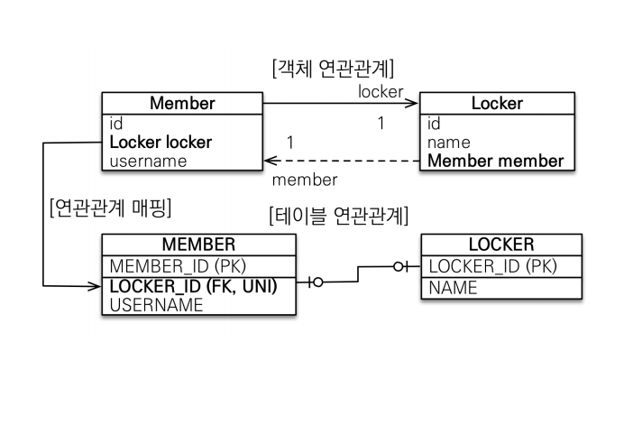

Member.class
```java
@Entity
@Getter @Setter
public class Member {

  @Id @GeneratedValue
  @Column(name = "MEMBER_ID")
  private Long id;

  @Column(name = "USERNAME")
  private String username;

  @OneToOne
  @JoinColumn(name = "LOCKER_ID")
  private Locker locker;
}
```

Locker.class
```java
@Entity
@Getter @Setter
public class Locker {

    @Id @GeneratedValue
    @Column(name = "LOCKER_ID")
    private Long id;

    @OneToOne(mappedBy = "locker")
    private Member member;

    private String name;
}
```

> 이게 가장 간단하게 떨어지는 일대일 매핑 이다

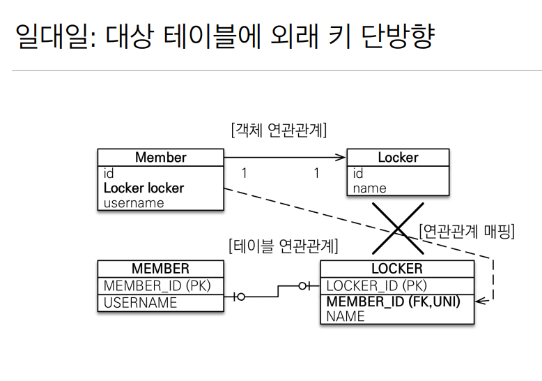

Member 에 있는 locker 가 연관관계 주인을 하고싶은데 외래키는 LOCKER 테이블에 있으면 
Member 에 있는 locker 로 반대쪽 사이드에 MEMBER_ID 가 있으면 관리 할 수 있나? 지원도 안되고
방법도 없음

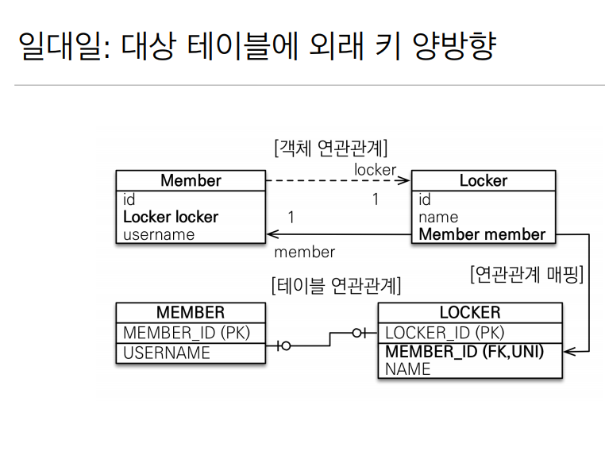

하지만 대상 테이블에 외래키 양방향은 가능하다 대상 테이블에 MEMBER_ID(FK, UNI) 가 있는데
Locker.class 에 있는 member 를 연관관계 주인으로 잡고 LOCKER 에 매핑을 하면 된다

한마디로 Locker.class 에 있는 외래키는 LOCKER 테이블에서만 관리할 수 있다
내가 내꺼만 관리할 수 있다

사실 일대일 주 테이블에 외래키 양방향 매핑 방법이랑 같음

DB 설계상 외래키를 멤버가 들고있는게 맞을까? 라커가 들고있는게 맞을까?
둘중 어떤 방법을 써도 1대1관계가 유효하다 하지만 시간이 흘러서 하나의 회원이 여러개의 라커를 가질
수 있으면 LOCKER 가 MEMBER_ID(FK,UNI) 를 들고 있다가 UNI 제약조건만 빼면 된다 그럼 자연스럽게
일대일에서 일대다 로 바꾸기 쉽다


근데 만약에 이렇게 되어있으면?


MEMBER 에 외래키가 있는데 하나의 회원이 여러개의 라커를 사용할 수 있는 시나리오가 되면 기능, 코드
를 많이 변경해야한다

- 주테이블에 외래 키
  - 주 객체가 대상 객체의 참조를 가지는 것처럼 주 테이블에 외래 키를 두고 대상 테이블을 찾음
  - 객체지향 개발자 선호
  - JPA 매핑 관리
  - 장점: 주 테이블만 조회해도 대상 테이블에 데이터가 있는지 확인 가능
  - 단점: 값이 없으면 외래키에 NULL 허용

- 대상 테이블에 외래키
  - 대상 테이블에 외래키가 존재
  - 전통적인 테이터베이스 개발자 선호
  - 장점: 주 테이블과 대상 테이블을 일대일에서 일대다 관계로 변경할 때 테이블 구조 유지
  - 단점: 프록시 기능의 한계로 지연 로딩으로 설정해도 항상 즉시 로딩됨

## 다대다 [N,M]

- 관계형 데이터베이스는 정규화된 테이블 2개로 다대다 관계를 표현할 수 없음
- 연결 테이블을 추가해서 일대다, 다대일 관계로 풀어내야 한다
- ManyToMany 사용
- @JoinTable 로 연결 테이블 지정
- 다대다 매핑: 단방향, 양방향 가능

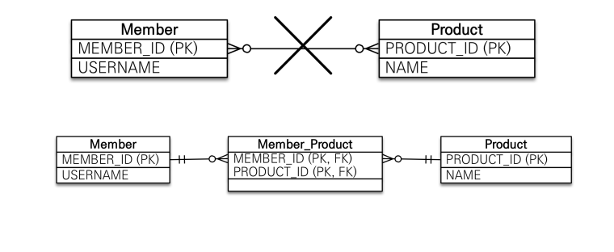

객체는 컬렉션을 사용해서 객체 2개로 다대다 관계가 가능하다 

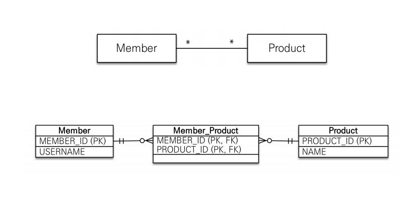

회원은 상품리스트를 가질 수 있고 반대로 상품도 회원 리스트를 가질 수 있다 

Product.class
```java
@Entity
@Getter @Setter
public class Product {
  @Id
  @GeneratedValue
  private Long id;
  
  @ManyToMany(mappedBy = "products")
  private List<Member> members = new ArrayList<>();
  
  private String name;
}
```

Member.class
```java
@ManyToMany
@JoinTable(name = "MEMBER_PRODUCT")
private List<Product> products = new ArrayList<>() ;
```
Member.class 에 JoinTable 에 테이블 명을 적어주면 연결테이블이 PK 가 FK 가 되는 구조로 풀어낸다
Product.class 에도 같이 member 리스트 만들어주고 mappedBy 로 products 만들어 주면 된다

### 다대다 매핑의 한계
- 편리해 보이지만 실무에서 사용 불가
- 연결 테이블이 단순히 연결만 하고 끝나지 않음
- 주문시간, 수량 같은 데이터가 들어올 수 있음

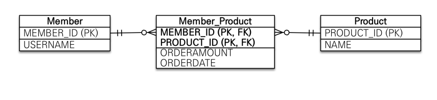

예를 들어서 주문 언제했어, 수량은 몇개야 같은 추가데이터가 들어갈 탠데 그건 불가능하다 매핑정보만
들어가지 추가 데이터가 못들어간다 중간테이블이 숨겨져있기 때문에 쿼리도 이상하게 나간다

### 다대다 한계 극복
- 연결 테이블용 엔티티 추가(연결 테이블을 엔티티로 승격)
- @ManyToMany -> @OneToMany, @ManyToOne

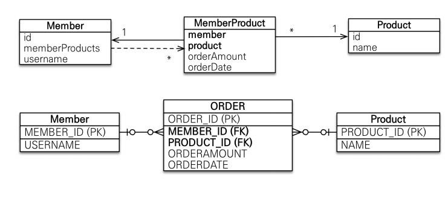

MemberProduct.class
```java
@Entity
public class MemberProduct {

    @Id @GeneratedValue
    private Long id;

    @ManyToOne
    @JoinColumn(name = "MEMBER_ID")
    private Member member;

    @ManyToOne
    @JoinColumn(name = "PRODUCT_ID")
    private Product product;

}
```
이렇게 엔티티로 승격시켜주고

Member.class
```java
@OneToMany(mappedBy = "member")
private List<MemberProduct> memberProducts = new ArrayList<>();
```
OneToMany 로 memberProduct 매핑하고

Product.class
```java
@OneToMany(mappedBy = "product")
private List<MemberProduct> memberProducts = new ArrayList<>();
```
OneToMany 로 memberProduct 매핑

이렇게 중간 연결 테이블을 엔티티로 승격시켜주고 다대일 일대다 로 매핑시켜주면 된다
그렇게되면 중간 엔티티에 추가 데이터가 들어가면 걍 편하게 memberProducts 에 
private int count, price 추가만 해주면 된다

그리고 ORDER 테이블에 PK 는 member 랑 product 의 PK 랑 묶어서 잡지말고 그냥 ORDER 에도
새로운 GenerateValue 로 ORDER_ID 만들어주는게 좋다 왠만하면 PK 는 의미없는 걸로 쓰는게 좋다

## 예제

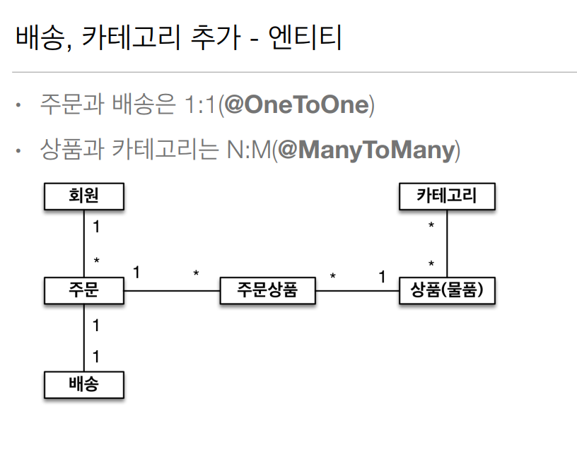
일대일 관계를 위해 배송이 추가가 되었고 상품과 카테고리는 다대다 이다

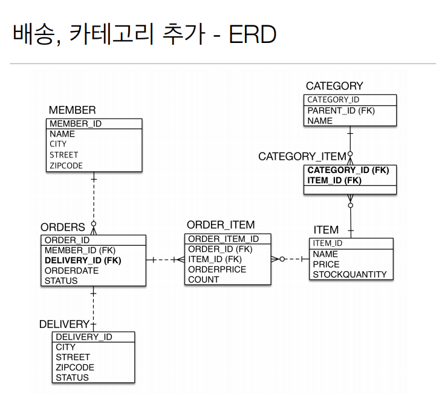
주문과 배송은 1대1인데 외래키는 주테이블에 넣었고 (ORDERS 에 DELIVERY_ID)
카테고리랑 아이템은 다대다 하나의 상품이 여러개의 카테고리에 소속될 수 있고 반대도 성립
원래는 다대다 안쓰고 중간에 엔티티를 넣어주는게 맞는데 ManyToMany 한번 써보긴 하자

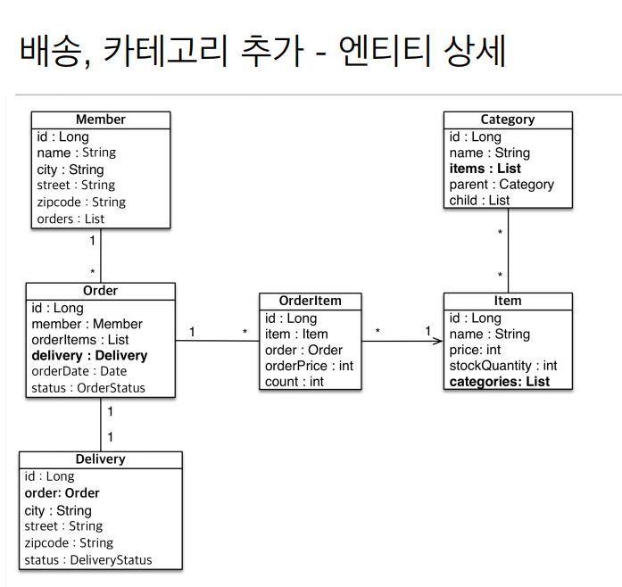
엔티티는 Delivery 가 추가가 되고 Order 랑 Delivery 를 1대1 양방향 관계로 걸었다 Order.class
에 Delivery 있고 Delivery.class 에 Order 가 있다

카테고리도 아이템도 마찬가지로 서로 참조한다

