# 프록시

Member 를 조회할 때 Team 도 DB 에서 함께 조회해야 할까?
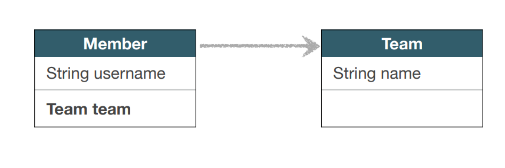

Member member = em.find(Member.class, 1L); 회원 아이디 1번인 애 찾고
printMember(member);
printMemberAndTeam(member);
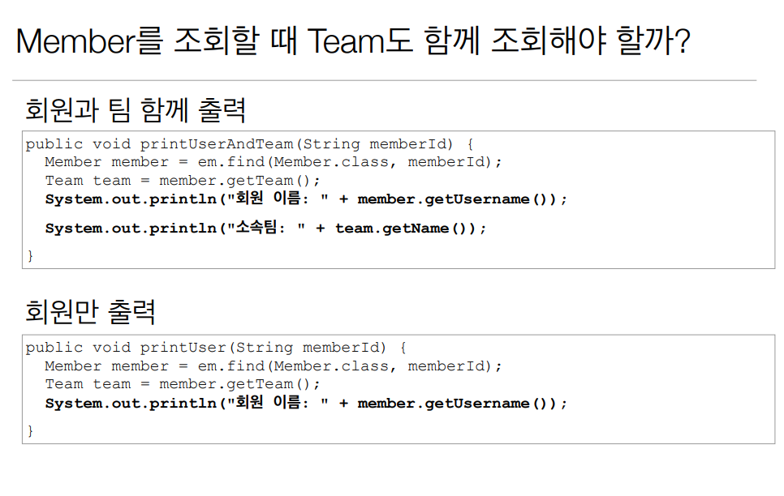

하나는 멤버와 팀을 같이 가져와서 사용하고 다른 하나는 멤버만 찍어서 SQL 로 가져오고 Team 정보는
안가져와도 되는데 printMember 할 때 마다 Team 까지 조회할 필요가 없는데 둘다 조회하기 때문에
손해다 이거를 JPA 는 지연로딩이랑 프록시로 해결한다

## 프록시 기초
- em.find() vs em.getReference()
- em.find(): 데이터베이스를 통해서 실제 엔티티 객체 조회
- em.getReference(): 데이터베이스 조회를 미루는 가짜(프록시) 엔티티 객체 조회 -> DB 에 쿼리가
안날라가는데 객체가 조회가 된다

```java
Member member = new Member();
member.setName("hello");
em.persist(member);
em.flush();
em.clear();
Member findMember = em.find(Member.class, member.getId());
System.out.println("findMember.id = " + findMember.getId());
System.out.println("findMember.name = " + findMember.getName());
```
이렇게 하면 쿼리가 나가고 값을 가져올 수 있다 근데 만약에

```java
Member member = new Member();
member.setName("hello");
em.persist(member);
em.flush();
em.clear();
Member findMember = em.getReference(Member.class, member.getId());
System.out.println("findMember.id = " + findMember.getId());    //이거는 getId있어서 안나감
System.out.println("findMember.name = " + findMember.getName());    //여기서 쿼리나감
```
em.find -> em.getReference 로 바꾸면 findMember 가 실제 사용 되는 시점에 쿼리가 나가고
그전에는 쿼리가 안나간다

findMember.getClass 를 출력해보면 Member$HibernateProxy... 이렇게 나온다 이건 하이버네이트
가 강제로만든 가짜 클래스 라는 소리다

getReference 는 진짜 객체를 주는게 아니라 하이버네이트가 내부 라이브러리를 사용해서 Proxy 라는
껍대기는 같은데 안은 텅텅 비어있는 가짜 엔티티 객체를 준다 

## 프록시 특징
- 실제 클래스를 상속 받아서 만들어짐
- 실제 클래스와 겉 모양이 같다
- 사용하는 입장에서는 진짜 객체인지 프록시 객체인지 구분하지 않고 사용하면 됨(이론상)
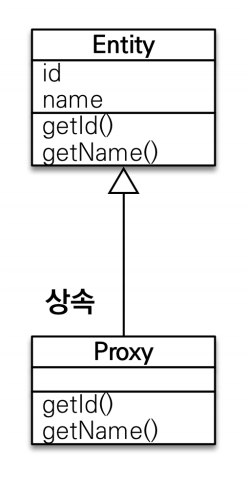
- 프록시 객체는 실제 객체의 참조(target)를 보관
- 프록시 객체를 호출하면 프록시 객체는 실제 객체의 메소드 호출

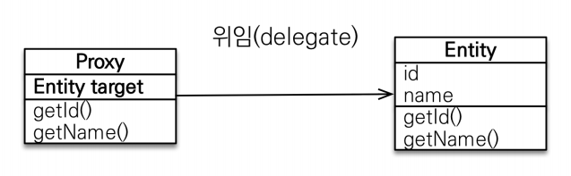
여기서 getName() 을 호출하면 실제 타겟에 있는 getName() 을 호출해준다

## 프록시 객체의 초기화

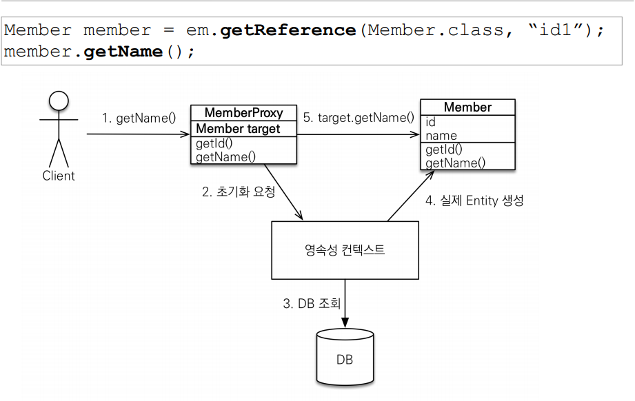

getName 을 호출하면 프록시로 가서 Member target 에 값이 처음엔 없다 그럼 JPA 가 영속성 컨텍
스트에 초기화를 요청한다(진짜 멤버객체 가져와) 그럼 영속성 컨텍스트는 DB 를 조회해서 실제 엔티티
객체를 생성해서 주고 Member target 에 진짜 객체를 연결해 준다 그때 진짜 Member 에 있는 getName
이 조회가 된다 

System.out.println("findMember.name = " + findMember.getName());    //여기서 쿼리나감
이걸 연속으로 두번 호출 하게되면 첫번째 호출할때 프록시에 초기화요청을 하고 두번째 요청은 이미 타겟
의 값이 있으니까 초기화되있는 프록시에서 값을 출력해준다 getClass 해줘도 같은 객체임을 확인할 수 
있다

## 프록시의 특징
- 프록시 객체는 처음 사용할 때 한번만 초기화
- 프록시 객체를 초기화 할때, 프록시 객체가 실제 엔티티로 바뀌는 것은 아님, 초기화 되면 프록시 객체
를 통해서 실체 엔티티에 접근 가능
- 프록시 객체는 원본 엔티티를 상속받음, 따라서 타입 체크시 주의해야함(== 비교대신에 instance of)
- 영속성 컨텍스트에 찾는 엔티티가 이미 있으면 em.getReference() 를 호출해도 실제 엔티티 반환
이미 클래스를 영속성 컨텍스트에 올리고 1차캐시에 있는데 굳이 프록시를 안써도됨, JPA 에서는 같은 영
속성 컨텍스트 같은 클래스 안에서 두개 가져오면 실제 엔티티를 가져온다
- 영속성 컨텍스트의 도움을 받을 수 없는 준영속 상태일 때, 프록시를 초기화 하면 문제 발생(하이버네
이트는 org.hibernate.LazyInitializationException 예외 터짐)

## 프록시 확인
- 프록시 인스턴스 초기화 여부 확인
    emf.PersistenceUnitUtil.isLoaded(Object entity)
- 프록시 클래스 확인 방법 
    entity.getClass().getName() 출력(..javasist.. or HibernateProxy…) 
- 프록시 강제 초기화 
    org.hibernate.Hibernate.initialize(entity);
- 참고: JPA 표준은 강제 초기화 없음
    강제호출: member.getName();

# 즉시 로딩과 지연 로딩

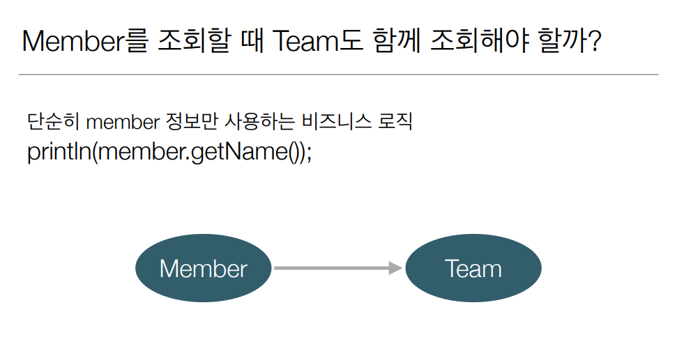

## 지연 로딩
```java
 @Entity
 public class Member {
 @Id
 @GeneratedValue
 private Long id;
 @Column(name = "USERNAME")
 private String name;
 @ManyToOne(fetch = FetchType.LAZY) //**
 @JoinColumn(name = "TEAM_ID")
 private Team team;
 }
```
Member.class 만 DB 에서 조회한다는 소리다 

Main.class
```java
Member findMember = em.find(Member.class, member1.getId());
```
이렇게 하면 member 쿼리만 나온다

Main.class
```java
Member findMember = em.find(Member.class, member1.getId());
sout("m = " + findMember.getTeam().getClass());
```
까지 해보면 member 는 그냥 조회하고 team 은 프록시로 가져와서 findMember.getTeam().getClass();
같이 Team 을 실제로 건들이는 시점에 프록시객체가 초기화되면서 DB 에서 값을 가져온다
그래서 지연로딩으로 세팅하면 연관된걸 프록시로 가져온다

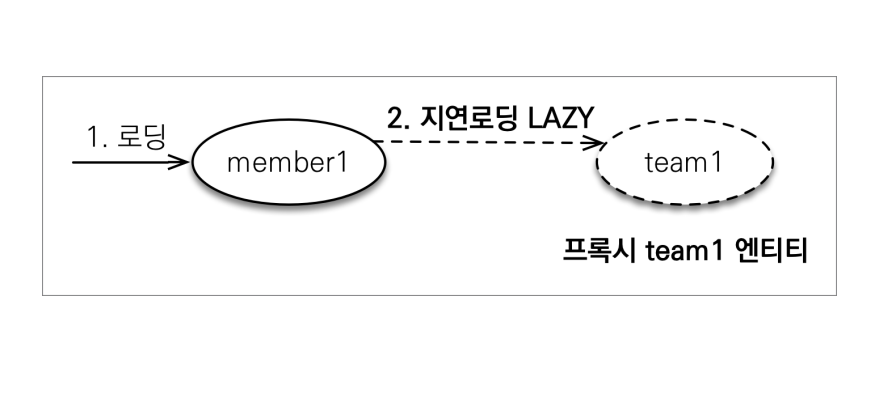

> 내부 매커니즘이 member1 을 로딩할때 team1 엔티티 인스턴스는 지연로딩으로 설정되어 있으니까
> 프록시로 가져온다 이게 지연로딩 이라 한다

### 지연 로딩 LAZY 를 사용해서 프록시로 조회
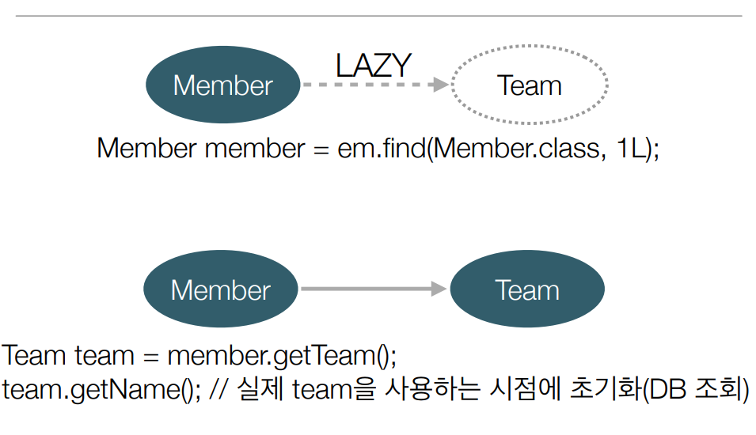

em.find 로 member 가져왔을때 member 랑 tea 이 지연로딩으로 설정 되어 있으면 가짜 프록시 객체
를 받아온다 그다음에 team 을 사용하는 시점에 초기화(DB 조회)


### Member 와 Team 을 자주 함께 사용한다면?

비지니스 로직상 Member 를 조회할땐 Team 을 안쓰는 경우가 많다 그럼 이렇게 쓰면 된다
근데 비지니스 로직에 Member 랑 Team 을 같이 쓰는 경우가 많으면 지연로딩을 쓰면 성능상 별로다

## 즉시 로딩 EAGER 를 사용해서 함께 조회

```java
 @Entity
 public class Member {
 @Id
 @GeneratedValue
 private Long id;
 @Column(name = "USERNAME")
 private String name;
 @ManyToOne(fetch = FetchType.EAGER) //**
 @JoinColumn(name = "TEAM_ID")
 private Team team;
 }
```

이렇게하면 쿼리가 조회할 때(Member m = em.persist(Member.class, member1.getId())) 부터
Member 랑 Team 을 조인을 해서 한방에 쫙 다 Member, Team 다 가져온다 그럼 프록시를 안쓴다
이미 초기화 할 필요없다 

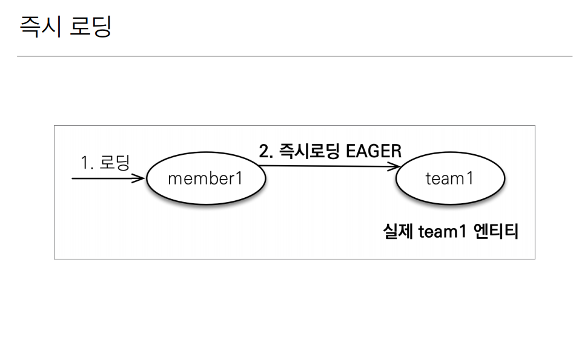

어플리케이션 개발을 했는데 대부분 멤버를 쓸때 팀을 같이쓰면 즉시로딩을 하는게 훨씬 유리하다
JPA 구현체는 가능하면 조인을 사용해서 SQL 한번에 함께 조회 -> EAGER 라고 되어있으면 두가지 
선택을 할 수 있다 조인을 사용해서 SQL 한번에 조회하는거, 멤버를 가지고올때 일단 멤버 가져오는데
EAGER 로 되어있네? 하면 em.find 할때 쿼리를 두방날린다(멤버조회, 팀조회)

## 프록시와 즉시로딩 주의
- 가급적 지연로딩만 사용(특히 실무에서) -> DB 입장에서 수십게의 조인이면 너무 빡세다
- 즉시 로딩을 적용하면 예상하지 못한 SQL 이 발생
- 즉시로딩은 JPQL 에서 N+1 문제를 일으킨다 -> 쿼리 하나가 나갔는데 그거때문에 + N 개의 쿼리가 
더 생기는 문제
- @ManyToOne, @OneToOne 은 기본지 즉시 로딩 -> LAZY 로 설정
- @OneToMany, ManyToMany 는 기본이 지연로딩

## 지연 로딩 활용

굉장히 이론적인거고 실무에선 무조건 지연로딩

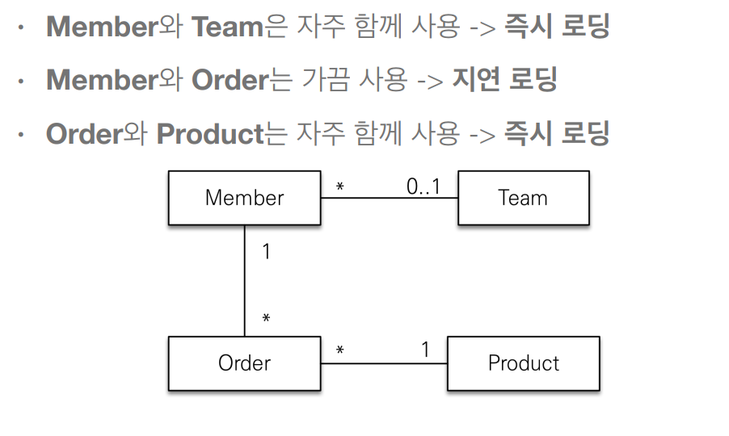

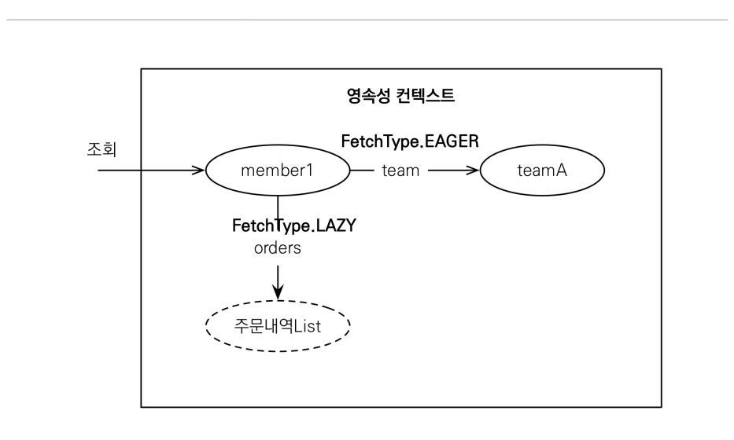

> member1 을 조회한다 team 은 EAGER 라서 teamA 랑 member1 은 조인으로 한반쿼리가 나간다
> member1 이랑 주문내역List 는 지연로딩이니까 프록시로

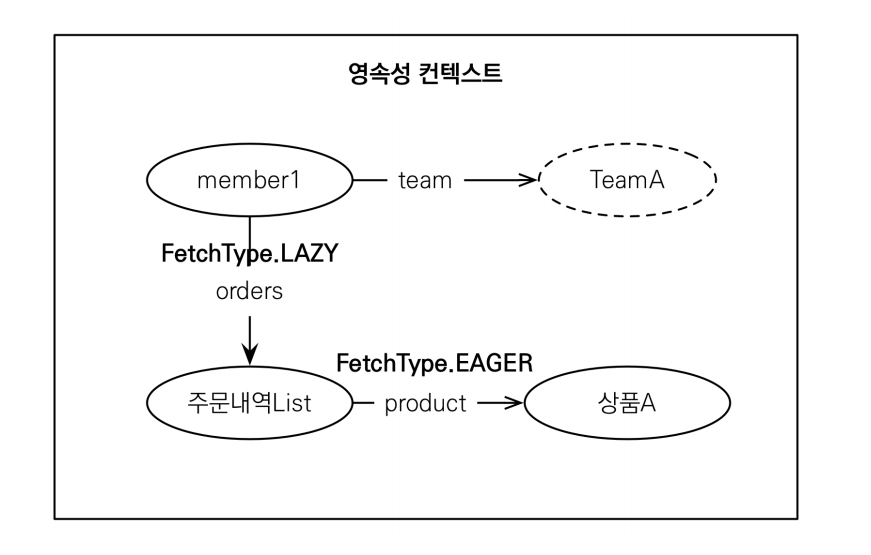

> 근데 프록시를 만졌다, 그럼 주문 내역 List 는 상품A 와 EAGER 로 걸려있으니까 이렇게 된다

## 지연 로딩 활용 - 실무

- 모든 연관관계에 지연 로딩을 사용
- 실무에서 즉시 로딩을 사용하지 마라
- JPQL fetch 조인이나, 엔티티 그래프 기능을 활용해라
- 즉시로딩은 상상하지 못한 쿼리가 나간다

# 영속성 전이: CASCADE
- 앞에 있는 즉시로딩, 지연로딩, 연관관계 세팅과 전혀 관계가 없다
- 특정 엔티티를 영속 상태로 만들 때 연관된 엔티티도 함께 영속 상태로 만들고 싶을 때
- ex) 부모 엔티티를 저장할 때 자식 엔티티도 함께 저장.

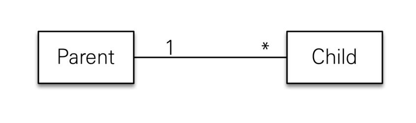

Parent.class
```java
@Entity
@Getter @Setter
public class Parent {
    @Id
    @GenerateValue
    private Long id;
    @OneToMany(mappedBy = "parent")
    private List<Child> childList = new ArrayList<>();
    private String name;
    public void addChild(Child child) {     //연관관계 편의 메서드
        childList.add(child);
        child.setParent(this);
    }
}
```

Child.class
```java
@Entity
@Getter @Setter
public class Child {
    @Id
    @GenerateValue
    private Long id;
    @ManyToOne
    @JoinColumn(name = "parent_id")
    private Parent parent;
    private String name;
    
}
```

이렇게 클래스가 있을때 

Main.class
```java
Child child1 = new Child();
Child child2 = new Child();

Parent parent = new Parent();
parent.addChild(child1);
parent.addChild(child2);

em.persist(parent);
em.persist(child1);
em.persist(child2);

tx.commit();
```
이렇게 em.persist 를 3번 해줘야된다 근데 코드를 짤 때 Parent 중심으로하고 Parent 가 persist
될때, Child 도 persist 가 되었으면 좋겠다 라고 할때

Parent.class
```java
@Entity
@Getter @Setter
public class Parent {
    @Id
    @GenerateValue
    private Long id;
    @OneToMany(mappedBy = "parent", cascade = CascadeType.ALL) //***
    private List<Child> childList = new ArrayList<>();
    private String name;
    public void addChild(Child child) {     //연관관계 편의 메서드
        childList.add(child);
        child.setParent(this);
    }
}
```

이렇게 cascade 를 사용 하면

Main.class
```java
Child child1 = new Child();
Child child2 = new Child();

Parent parent = new Parent();
parent.addChild(child1);
parent.addChild(child2);

em.persist(parent);

tx.commit();
```

em.persist(parent) 만 해줘도 Child1, 2 둘다 persist 가 되었다 이게 cascade 이다
연관관계 랑 상관없고 그냥 Parent 를 persist 할때,

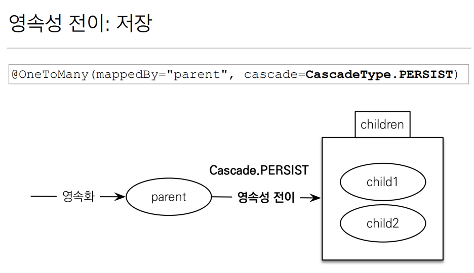

cascade 해준 컬렉션 안에 있는걸 전부 Persist 날려준다

## 영속성 전이: CASCADE - 주의!
- 영속성 전이는 연관관계를 매핑하는 것과 아무 관련이 없음
- 엔티티를 영속화할 때 연관된 엔티티도 함께 영속화하는 편리함을 제공할 뿐

## CASCADE 의 종류
- **ALL: 모두 적용** 
- **PERSIST: 영속** 
- **REMOVE: 삭제**
- MERGE: 병합
- REFRESH: REFRESH
- DETACH: DETACH

## 언제 쓰느냐

> 하나의 부모만 자식들을 관리할 때 의미가 있다
> 게시판, 첨부파일의 경로가 들어갈 때 첨부파일의 경로는 한게시물에서 관리하니까
> 파일을 다른 엔티티에서 관리하면 쓰면 X (소유자가 하나일 때) -> 단일 엔티티에 종속적

# 고아 객체
- 고아 객체 제거: 부모 엔티티와 연관관계가 끊어진 자식 엔티티를 자동으로 삭제
- orphanRemoval = true
- DELETE FROM CHILD WHERE ID = ?

Parent.class
```java
@Entity
@Getter @Setter
public class Parent {
    @Id
    @GenerateValue
    private Long id;
    @OneToMany(mappedBy = "parent", cascade = CascadeType.ALL, orphanRemoval = true) //***
    private List<Child> childList = new ArrayList<>();
    private String name;
    public void addChild(Child child) {     //연관관계 편의 메서드
        childList.add(child);
        child.setParent(this);
    }
}
```

Main.class
```java
Child child1 = new Child();
Child child2 = new Child();

Parent parent = new Parent();
parent.addChild(child1);
parent.addChild(child2);

em.persist(parent);

em.flush();
em.clear();

Parent findParent = em.find(Parent.class, parent.getId());
findParent.getChildList().remove(0);  //index 0 삭제

tx.commit();
```
findParent.getChildList().remove(0); 이렇게하면
orphanRemoval = true orphanRemoval 이 동작하기 때문에 첫번째 자식 객체가 삭제된다

## 고아 객체 - 주의
- 참조가 제거된 엔티티는 다른 곳에서 참조하지 않는 고아 객체로 보고 삭제하는 기능
- **참조하는 곳이 하나일 때 사용해야 함**
- **특정 엔티티가 개인 소유할 때 사용**
- @OneToOne, @OneToMany 만 가능
- 참고: 개념적으로 부모를 제거하면 자식은 고아가 된다. 따라서 고아 객체 제거 기능을 활성화 하면
부모를 제거할 때 자식도 함께 제거된다. 이거은 CascadeType.REMOVE 처럼 동작한다

## 영속성 전이 + 고아 객체, 생명주기
- CascadeType.ALL + orphanRemoval = true 를 둘다 쓰는거
- 스스로 생명주기를 관리하는 엔티티는 em.persist() 로 영속화, em.remove() 로 제거
- 두 옵션을 모두 활성화 하면 부모 엔티티를 통해서 자식의 생명 주기를 관리할 수 있음
- 도메인 주도 설계(DDD) 의 Aggregate Root 개념을 구현할 때 유용

Main.class
```java
Child child1 = new Child();
Child child2 = new Child();

Parent parent = new Parent();
parent.addChild(child1);
parent.addChild(child2);

em.persist(parent);

em.flush();
em.clear();

Parent findParent = em.find(Parent.class, parent.getId());
findParent.getChildList().remove(0);  //index 0 삭제

tx.commit();
```

em.persist 할때도 parent 만 persist 했다 또한 em.remove 할때도 parent 만 remove 했다
findParent.getChildList().remove(0); 생명 주기를 Parent 는 JPA, em 를 통해서 관리한다
child 는 생명주기를 Parent 가 관리한다.

Aggregate Root -> repository 는 Aggregate Root 만 컨택하고 나머지는 repository 를 
거의 만들지 않는다 Aggregate Root 가 관리하는 밑에 애들은 repository 를 따로 만들지 않고
Aggregate Root 를 통해서 생명주기를 관리한다

# 실전예제
- 모든 연관관계를 지연 로딩으로
- @ManyToOne, @OneToOne 은 기본이 즉시 로딩이므로 지연로딩으로 변경

## 영속성 전이 설정
- Order -> Delivery 를 영속성 전이 ALL 설정
- Order -> OrderItem 을 영속성 전이 ALL 설정

Order 를 생성하는 시점에 Delivery 는 자동으로 생성한다 (주문을 생성할 때, 배송 정보도 같이
생성 하겠다) -> Order 를 생성해서 Delivery 에 넣을때, 자동으로 Order 가 저장되면 Delivery
도 저장이 된다

Order 를 생성할때, Delivery 넣고 OrderItem 넣고 Persist 를 Order 하나만 해주면 나머지
두개 들어간다