# 기본값 타입

## JPA 의 데이터 타입 분류
- 엔티티 타입
  - @Entity 로 정의하는 객체
  - 데이터가 변해도 식별자로 지속해서 추적가능
  - 예) 회원 에티티의 키나 나이 값을 변경해도 식별자(id)로 인식 가능
- 값 타입
  - int, integer, String 처럼 단순히 값으로 사용하는 자바 기본 타입이나 객체
  - 식별자가 없고 값만 있으므로 변경시 추적 불가
  - 예) 숫자 100을 200으로 변경하면 완전히 다른 값으로 대체

## 값 타입 분류
- 기본값 타입
  - 자바 기본 타입(int, double)
  - 래퍼 클래스(Integer, Long)
  - String

- 인베디드 타입(embedded type, 복합 값 타입) -> 내가 커스텀해서 쓰고 싶을때
- 컬렉션 값 타입(collection value type)

## 기본 값 타입
- 예) String name, int age
- 생명주기를 엔티티의 의존
  - 예) 회원을 삭제하면 이름, 나이 필드도 함께 삭제
- 값 타입은 공유하면 X
  - 예) 회원 이름 변경시 다른 회원의 이름도 함께 변경되면 안됨

### 참보: 자바의 기본 타입은 절대 공유X
- int, double 같은 기본 타입은 절대 공유X
- 기본 타입은 항상 값을 복사함
- Integer 같은 래퍼 클래스나 String 같은 특수한 클래스는 공유 가능한 객체이지만 변경X ->
래퍼런스를 끌고오는거라 공유가 되긴 함 (포인터 처럼) 근데

# 임베디드 타입(복합 값 타입)
- 새로운 값 타입을 직접 정의할 수 있음
- JPA 는 임베디드 타입(embedded type) 이라 함
- 주로 기본 값 타입을 모아서 만들어서 복합 값 타입이라고도 함
- int, String 과 같은 값 타입

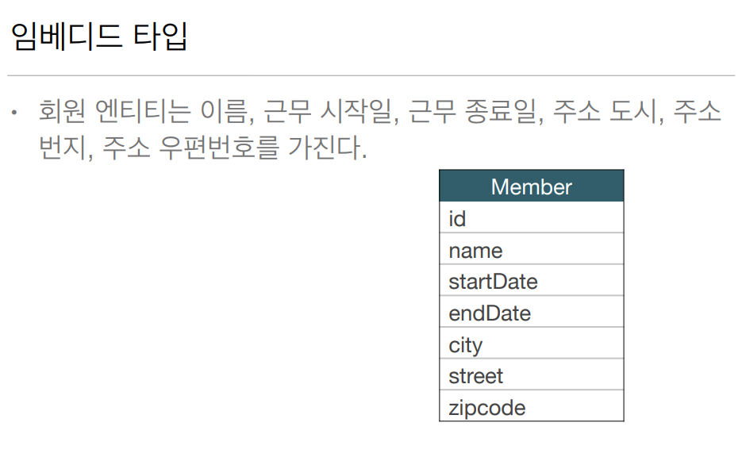

공통적인 속성이 보일것 이다 근무 시작일, 근무 종료일 / 주소 도시, 주소 번지. 주소 우편번호
이런 비슷한 것들을 시스템 내에서 공통으로 클래스 타입을 만들어서 쓸 수 있지 않을까?

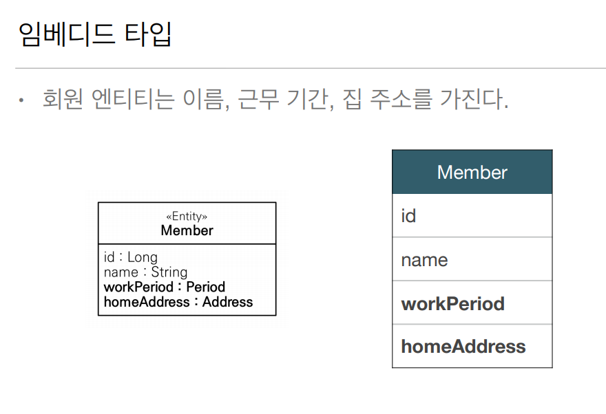

이렇게 추상화해서 설계할 수 있다 이렇게 묶어낼 수 있는게 **임베디드 타입이다** 

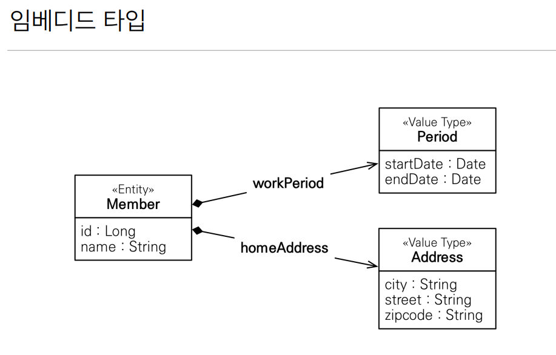

쉽게 클래스 두개를 새로 뽑은 거다

## 임베디드 타입 사용법
- @Embeddable: 값 타입을 정의하는 곳에 표시
- @Embedded: 값 타입을 사용하는 곳에 표시
- 기본 생성자 필수

## 임베디드 타입의 장점
- 재사용 -> Period, Address 는 시스템 안에 다른곳에서도 사용할 수 있다
- 높은 응집도
- Period.isWork() 처럼 해당 값 타입만 사용하는 의미 있는 메소드를 만들 수 있다
- 임베디드 타입을 포함한 모든 값 타입은, 값 타입을 소유한 엔티티에 생명주기를 의존함 -> 값 타입은 엔티티 죽으면 다죽고
엔티티 생성될때 값이 생성

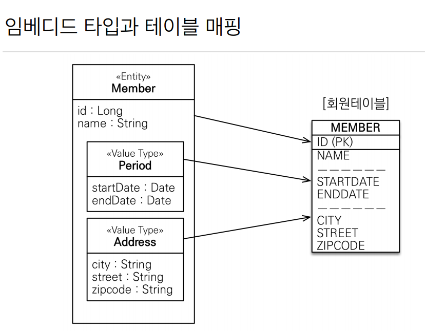

DB 입자에선 회원테이블이 바뀔일이 없다 근데 매핑만 해주면 된다 

Member.class
```java
@Entity
public class Member {

  @Id
  @GeneratedValue(strategy = GenerationType.AUTO)
  @Column(name = "MEMBER_ID")
  private Long id;
  private String name;
  
  private LocalDateTime startDate;
  private LocalDateTime endDate;
  
  private String city;
  private String street;
  private String zipcode;
  
}
```

> 그냥 이렇게 돌리면 DB 에 속성이 전부 있다

근데 여기서 이걸 기간
private LocalDateTime startDate;

private LocalDateTime endDate;

이걸 주소 로 넣고 싶으면
private String city;

private String street;

private String zipcode;

Period.class
```java
@Embeddable @Getter @Setter
public class Period {
  private LocalDateTime startDate;
  private LocalDateTime endDate;
}
```

Address.class
```java
@Embeddable @Getter @Setter
public class Address {
  private String city;
  private String street;
  private String zipcode;
}
```

이렇게 클래스 두개 만들고
Member.class
```java
@Entity
public class Member {

  @Id
  @GeneratedValue(strategy = GenerationType.AUTO)
  @Column(name = "MEMBER_ID")
  private Long id;
  private String name;
  
  @Embedded
  private Period workPeriod;
  @Embedded
  private Address homeAddress;
  
}
```

이렇게 해주면 된다 테이블이 그대로 유지되고 좀더 객체지향스럽게 사용할 수 있다

## 임베디드 타입과 테이블 매핑
- 임베디드 타입은 엔티티의 값일 뿐이다
- 임베디드 타입을 사용하기 전과 후에 매핑하는 테이블은 같다
- 객체와 테이블을 아주 세밀하게 매핑하는 것이 가능
- 잘 설계한 ORM 애플리케이션은 매핑한 테이블의 수보다 클래스의 수가 더 많다

## 임베디드 타입과 연관관계

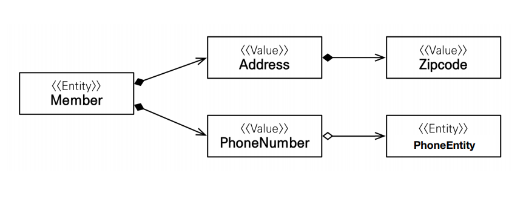

멤버 엔티티는 어드레스와 폰넘버라는 임베디드 타입을 가지고 있다

어드레스는 집코드를 가지고 있다

폰넘버라는 임베디드 타입이 phoneEntity 라는 엔티티를 가질 수 있다

## AttributeOverride: 속성 재정의
- 한 엔티티에서 같은 값 타입을 사용하면?
- 칼럼 명이 중복됨
- @AttributeOverrides, @AttributeOverride 를 사용해서 컬럼 명 속성을 재정의

Member.class
```java
@Entity
public class Member {

  @Id
  @GeneratedValue(strategy = GenerationType.AUTO)
  @Column(name = "MEMBER_ID")
  private Long id;
  private String name;
  
  @Embedded
  private Period workPeriod;
  @Embedded
  private Address homeAddress;  //집 주소
  @Embedded
  private Address workAddress;   //회사 주소
}

```

이렇게 멤버하나에 집 주소와 회사 주소를 둘다 가지려면 @AttributeOverride 를 사용하면 된다

Member.class
```java
@Entity
public class Member {

  @Id
  @GeneratedValue(strategy = GenerationType.AUTO)
  @Column(name = "MEMBER_ID")
  private Long id;
  private String name;
  
  @Embedded
  private Period workPeriod;
  @Embedded
  private Address homeAddress;  //집 주소
  @Embedded
  @AttributeOverrides({
          @AttributeOverride(name="city",
                        column=@Column(name="WORK_CITY")),
          @AttributeOverride(name="street",
                        column=@Column(name=WORK_STREET)),
          @AttributeOverride(name="zipcode",
                        column=@Column(name=WORK_ZIPCODE))
  })
  private Address workAddress;   //회사 주소
}

```

이렇게 하나하나 회사 주소에 관련된 칼럼명을 바꿔줄 수 있다 그럼 칼럼명이 중복되지 않는다

## 임베디드 타입과 null
- 임베디드 타입의 값이 null 이면 매핑한 칼럼값은 null

# 값 타입과 불변 객체

> 값 타입은 복잡한 객체 세상을 조금이라도 단순화하려고 만든 개념이다. 따라서 값 타입은 단순하고
> 안전하게 다룰 수 있어야 한다

## 값 타입 공유 참조

- 임베디드 타입 같은 값 타입을 여러 엔티티에서 공유하면 위험함
- 부작용 발생
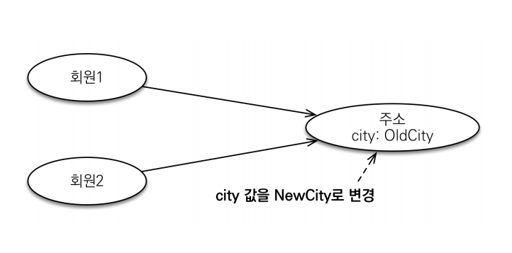

회원1, 회원2 가 같은 값타입인 주소를 보는데 이경우에 회원1 만 city city 의 값을 NewCity
로 바꾸고싶어서 바꾸면 update 쿼리가 두방 (회원1, 회원2) 이 나가버리고 
회원1, 회원2 가 들고있는 테이블이 둘다 NewCity 로 바뀌어 버린다

Main.class
```java
Address address =  new Address("city", "street", "10000");

Member member1 = new Member();
member1.setUsername("member1");
member1.setAddress(address);
em.persist(member1);

Member member2 = new Member();
member2.setUsername("member2");
member2.setAddress(address);
em.persist(member1);

member.getAddress.setCity("newCity");
```

## 값 타입 복사
- 값 타입의 실제 인스턴스인 값을 공유하는 것은 위험
- 대신 값(인스턴스)를 복사해서 사용

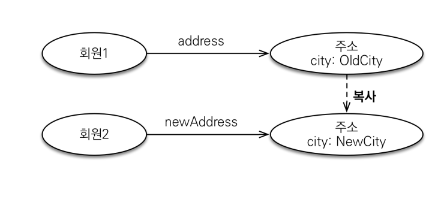

```java
Address address =  new Address("city", "street", "10000");

Member member1 = new Member();
member1.setUsername("member1");
member1.setAddress(address);
em.persist(member1);

Address copyAddress = new Address(address.getCity(), address.getStreet(), address.getZipcode());
    
Member member2 = new Member();
member2.setUsername("member2");
member2.setAddress(copyAddress);
em.persist(member1);
        
member.getAddress.setCity("newCity");
```
 
이렇게 member2 는 address 를 그냥 넣는게 아니라 새로 copyAddress 로 객체 다시 받아와서
복사한 copyAddress 를 member2 주소에 넣어준다 그러면 의도한대로 회원1 만 NewCity 로 바뀐다

## 객체 타입의 한계
- 항상 값을 복사해서 사용하면 공유 참조로 인해 발생하는 부작용을 피할 수 있다
- 문제는 임베디드 타입처럼 직접 정의한  타입은 자바의 기본 타입이 아니라 객체 타입이다
- 자바 기본 타입에 값을 대입하면 값을 복사한다
- 객체 타입은 참조 값을 직접 대입하는 것을 막을 방법이 없다 -> 내가 실수로 copyAddress 말고 
그냥 address 쓰면?
- 객체의 공유 참조는 피할 수 없다

### 기본 타입
```java
int a = 10;
int b = a;  //기본 타입은 값을 복사
b = 4;
```

> 기본 타입은 = 하면 복사가 된다 아무문제가 없다 b 의 값을 바꿔도 a 의 값은 유지가 된다

### 객체 타입
```java
Address a = new Address("old");
Address b = a;  //객체 타입은 참조를 전달
b.setCity("new");
```

> 객체 타입은 이렇게 하면 a 랑 b 는 같은 Address 라는 인스턴스를 가리키기 때문에 b의 값을 바
> 꾸면 a 의 값도 바뀐다

이렇게 참조를 전달하는걸 막을 방법이없다

## 불변 객체
- 객체 타입을 수정할 수 없게 만들면 부작용을 원천 차단 -> 변경 자체를 불가능하게 만듬
- 값 타입은 불변 객체(immutable object)로 설계해야함
- 불변 객체: 생성 시점 이후 절대 값을 변경할 수 없는 객체
- 생성자로만 값을 설정하고 수정자(Setter)를 만들지 않으면 됨
- Integer, String 은 자바가 제공하는 대표적인 불변 객체

예시에서 Address.class 에 Setter 를 전부 다 지우면

Main.class
```java
Address address =  new Address("city", "street", "10000");

Member member1 = new Member();
member1.setUsername("member1");
member1.setAddress(address);
em.persist(member1);

Address copyAddress = new Address(address.getCity(), address.getStreet(), address.getZipcode());
    
Member member2 = new Member();
member2.setUsername("member2");
member2.setAddress(copyAddress);
em.persist(member1);
    
member.getAddress.setCity("newCity");   //이거 자체가 불가능
```

**불변이라는 작은 제약으로 부작용이라는 큰 재앙을 막을 수 있다**
그런데 실제로 값을 바꾸고 싶으면 어떻게 하나요? 여기서 만약에 member 의 도시명을 newCity로 바꾸고 싶다

Main.class
```java
Address address =  new Address("city", "street", "10000");

Member member1 = new Member();
member1.setUsername("member1");
member1.setAddress(address);
em.persist(member1);

Address newAddress = new Address(address.getCity(), address.getStreet(), address.getZipcode());
member.setHomeAddress(newAddress);
```
이렇게 통으로 싹다 다시 세팅할 수 있다

# 값 타입의 비교

- 값 타입: 인스턴스가 달라도 그안에 값이 같으면 같은 것으로 봐야 함

ex
```java
int a = 10;     //a == b -> true
int b = 10;     

Address a = new Address("서울시");     //a == b -> false
Address b = new Address("서울시");
```

- 동일성 비교: 인스턴스의 참조 값을 비교, == 사용
- 동등성 비교: 인스턴스의 값을 비교, equals() 사용
- 값 타입은 a.equals(b)를 사용해서 동등성 비교를 해야 함
- 값 타입의 equals() 메소드를 적절하게 재정의(주로 모든 필드를 재정의)

# 값 타입 컬렉션

**값 타입 컬렉션은 값 타입을 컬렉션에 담아서 쓰는것을 말한다**

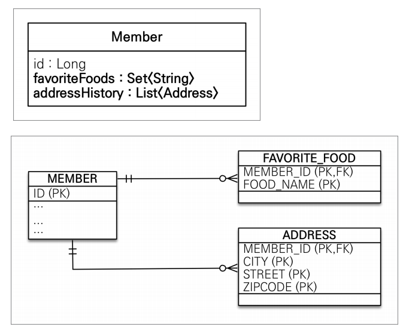

예제에서는 멤버가 favoriteFood 랑 addressHistory 두가지 데이터의 값타입을 컬렉션으로 가지고
있다 이걸 DB 테이블로 구현하는게 문제다 단순한 값타입이 하나일때 멤버에 필드 속성으로 멤버 테이블
에 쭉 넣으면 됬는데 DB 에 들어가야된다 관계형 데이터베이스는 기본적으로 컬렉션을 내부적으로 테이블
안에 담을 수 있는 구조가 없다 멤버 입장에서는 List 에 Address 는 일대다 개념인데 favorite
Food 에 치킨 족발 이런것들이 있으면 별도에 테이블로 뽑아야 한다 개념적으로 일대다 이다 멤버의
addressHistory 도 별도의 테이블로 뽑아야 관리가 된다 위 그림처럼 된다 근데 모든 요소가 PK 이다
왜냐면 식별자 아이디를 넣어서 그걸로 pk 를 쓰게되면 이건 값타입이 아니라 엔티티가 되어 버린다
값타입은 테이블에 값들만 저장되고 그것들을 모아서 PK 로 한다 MEMBER_ID 는 당연히 필요하다
누가 제일좋아한는 음식인지, 누구의 주소 기록인지

Member.class
```java
@Entity
public class Member {

  @Id
  @GeneratedValue(strategy = GenerationType.AUTO)
  @Column(name = "MEMBER_ID")
  private Long id;
  private String name;

  @Embedded
  private Address homeAddress;

  @ElementCollection    //이걸 해줘야 한다
  @CollectionTable(name = "FAVORITE_FOOD", joinColumns =    //테이블 명 지정
  @JoinColumn(name = "MEMBER_ID")              // 결국엔 Member 와 매핑하니까
  )                                            // JoinColumn 으로 외래키 지정
  @Column(name = "FOOD_NAME")            // 얘는 예외적으로 칼럼명을 지정해서 매핑허용 값이 하나기 때문에 String
  private Set<String> favoriteFoods = new HashSet<>();  //Set을쓰면 컬렉션 하위 인터페이스 전부 쓸 수 있다

  @ElementCollection
  @CollectionTable(name = "ADDRESS", joinColumns =      //테이블 명 지정
  @JoinColumn(name = "MEMBER_ID")
  )
  private List<Address> addressHistory = new ArrayList<>();     //Address 라서 칼럼명지정x
}
```

## 값 타입 컬렉션

- 값 타입을 하나 이상 저장할 때 사용
- @ElementCollection, @CollectionTable 사용
- 데이터베이스는 컬렉션을 같은 테이블에 저장할 수 없다
- 컬렉션을 저장하기 위한 별도의 테이블이 필요함

Main.class
```java
Member member = new Member();
member.setUsername("member1");
member.setHomeAddress(new Address("homeCity", "street", 10000));

member.getFavoriteFoods().add("치킨");
member.getFavoriteFoods().add("족발");
member.getFavoriteFoods().add("피자");

member.getAddressHistory().add(new Address("old1", "street", 10000));
member.getAddressHistory().add(new Address("old2", "street", 10000));

em.persist(member);
tx.commit();

```

HomeAddress 를 넣는 인서트 쿼리 1번, AddressHistory 인서트 쿼리 2번, favoriteFood 인서트
쿼리 3번 이 em.persist() 한방에 이루어진다

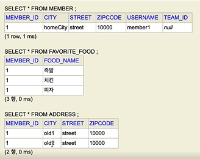

이렇게 잘 들어 갔다

값 타입 컬렉션들을 따로 persist 하지 않고 member 만 persist 만 해줬는데 값 타입 컬렉션들은
다른 테이블인데도 불구하고 라이프 사이클이 같이 돌아가서 persist 해줬다 왜냐? 값 타입 컬렉션도
값 타입이다 자기 스스로 라이프 사이클이 없고 생명주기가 Member 에 소속되어 있다

**조회할 때는**
Main.class
```java
Member member = new Member();
member.setUsername("member1");
member.setHomeAddress(new Address("homeCity", "street", 10000));

member.getFavoriteFoods().add("치킨");
member.getFavoriteFoods().add("족발");
member.getFavoriteFoods().add("피자");

member.getAddressHistory().add(new Address("old1", "street", 10000));
member.getAddressHistory().add(new Address("old2", "street", 10000));

em.persist(member);

em.flush();
em.clear();

Member findMember = em.find(Member.class, member.getId());  //여기까지만 하면 값타입 컬렉션도 지연로딩 전략 default Member만 쿼리 날
List<Address> addressHistory = findMember.getAddressHistory();
for(Address address : addressHistory) {
    sout("address = " + address.getCity());
}
Set<String> favoriteFoods = findMember.getFavoriteFoods();
for(String favoriteFood : favoriteFoods) {
    sout("favoriteFood = " + favoriteFood);
}

tx.commit();
```

**수정할 때는**

Main.class
```java
Member member = new Member();
member.setUsername("member1");
member.setHomeAddress(new Address("homeCity", "street", 10000));

member.getFavoriteFoods().add("치킨");
member.getFavoriteFoods().add("족발");
member.getFavoriteFoods().add("피자");

member.getAddressHistory().add(new Address("old1", "street", 10000));
member.getAddressHistory().add(new Address("old2", "street", 10000));

em.persist(member);

em.flush();
em.clear();

Member findMember = em.find(Member.class, member.getId());

Address a = findMember.getHomeAddress();    //이뮤터블하게 set 안하고 통으로 갈아끼우자
findMember.setHomeAddress(new Address("newCity", a.getStreet(), a.getZipcode()));

// 치킨 -> 한식
findMember.getFavoriteFoods().remove("치킨");
fineMember.getFavoriteFoods().add("한식");

findMember.getAddressHistory().remove(new Address("old1", "street", "10000")); //equals 가 잘 되어있어야한다
findMember.getAddressHistory().add(new Address("newCity1", "street", "10000"));

tx.commit();
```

컬렉션의 값만 변경해도 실제 데이터베이스가 변한다 마치 영속성 전이 처럼

값 타입 컬렉션들은 멤버에 의존관계를 맡긴다 멤버만 생명주기가 관리되는거고 컬렉션들은 멤버 소속의
단순한 값일 뿐이다

음식을 수정하는거는 치킨을 지우고 한식만 인서트 하는데

주소를 만드는거는 old1 을 리무브 하고 newCity 만 인서트 하는게 아니라 old1 을 삭제하고 newCity
인서트, old2 도 인서트한다 그냥 완전히 갈아 끼운다

## 값 타입 컬렉션의 제약사항
- 값 타입은 엔티티와 다르게 식별자 개념이 없다.
- 값은 변경하면 추적이 어렵다
- 값 타입 컬렉션에 변경 사항이 발생하면, 주인 엔티티와 연관된 모든 데이터를 삭제하고, 값 타입
컬렉션에 있는 현재 값을 모두 다시 저장한다
- 값 타입 컬렉션을 매핑하는 테이블은 모든 칼럼을 묶어서 기본 키를 구성해야 함: null 입력 x
중복저장 x

> addressHistory 값을 변경하면 DB 에 쿼리날릴때, 내 memberId 관련된 addressHistory
> 데이터를 전부 다 지운다음에 컬렉션에 남은 최종 데이터가 2개가 있으면 그 2개 인서트 날린다
> 왜? 중간에 DB 에 값이 바뀌면 DB 에서 해당 데이터를 찾고 변경하는 것들이 id 가 있는게 아니라서
> 추적이 안된다 그래서 값 타입 컬렉션에 변경 사항이 발생하면, 주인 엔티티와 연관된 모든 
> 데이터를 삭제하고, 값 타입 컬렉션에 있는 현재 값을 모두 다시 저장한다

그게 싫다?

## 값 타입 컬렉션 대안
- 실무에서는 상황에 따라 값 타입 컬렉션 대신에 일대다 관계를 고려
- 일대다 관계를 위한 엔티티를 만들고, 여기에서 값 타입을 사용
- 영속성 전이(Cascade) + 고아 객체 제거를 사용해서 값 타입 컬렉션 처럼 사용
- EX) AddressEntity

AddressEntity.class
```java
@Entity
@Table(name = "ADDRESS")
public class AddressEntity {
    @Id @GenerateValue
    private Long id;
    private Address address;
    
    public AddressEntity(String city, String street, String zipcode) {
        this.address = new Address(city, street, zipcode);
    }
    
    public AddressEntity(Address address) {
        this.address = address;
    }
}
```
Member.class
```java
@Entity
public class Member {

  @Id
  @GeneratedValue(strategy = GenerationType.AUTO)
  @Column(name = "MEMBER_ID")
  private Long id;
  private String name;

  @Embedded
  private Address homeAddress;

  @ElementCollection    //이걸 해줘야 한다
  @CollectionTable(name = "FAVORITE_FOOD", joinColumns =    //테이블 명 지정
  @JoinColumn(name = "MEMBER_ID")              // 결국엔 Member 와 매핑하니까
  )                                            // JoinColumn 으로 외래키 지정
  @Column(name = "FOOD_NAME")            // 얘는 예외적으로 칼럼명을 지정해서 매핑허용 값이 하나기 때문에 String
  private Set<String> favoriteFoods = new HashSet<>();  //Set을쓰면 컬렉션 하위 인터페이스 전부 쓸 수 있다

//  @ElementCollection
//  @CollectionTable(name = "ADDRESS", joinColumns =      //테이블 명 지정
//  @JoinColumn(name = "MEMBER_ID")
//  )
  
  @OneToMany(cascade = ALL, orphanRemoval = true)
  @JoinColumn(name = "MEMBER_ID")
  private List<AddressEntity> AddressHistory = new ArrayList<>();
  
  private List<Address> addressHistory = new ArrayList<>();     //Address 라서 칼럼명지정x
}
```

이렇게 하면 된다 값 타입으로 쓰는것보다 훨씬 좋고 쿼리 최적화에도 좋다

Main.class
```java
Member member = new Member();
member.setUsername("member1");
member.setHomeAddress(new Address("homeCity", "street", 10000));

member.getFavoriteFoods().add("치킨");
member.getFavoriteFoods().add("족발");
member.getFavoriteFoods().add("피자");

member.getAddressHistory().add(new AddressEntity("old1", "street", 10000));
member.getAddressHistory().add(new AddressEntity("old2", "street", 10000));

em.persist(member);

em.flush();
em.clear();

Member findMember = em.find(Member.class, member.getId());

Address a = findMember.getHomeAddress();    //이뮤터블하게 set 안하고 통으로 갈아끼우자
findMember.setHomeAddress(new Address("newCity", a.getStreet(), a.getZipcode()));

// 치킨 -> 한식
findMember.getFavoriteFoods().remove("치킨");
fineMember.getFavoriteFoods().add("한식");

findMember.getAddressHistory().remove(new Address("old1", "street", "10000")); //equals 가 잘 되어있어야한다
findMember.getAddressHistory().add(new Address("newCity1", "street", "10000"));

tx.commit();
```

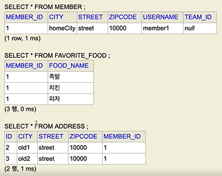

이제 ADDRESS 에 자체적인 ID 가 생기고 FK 로 MEMBER_ID 가 있고 그럼 내 마음대로 값을 가져와서
수정하는게 가능해진다 이렇게 값타입을 엔티티로 승격시킬 수 있다

값타입은 언제쓰냐? 진짜 단순할때, 좋아하는 메뉴를 선택할때 치킨 선택하고 피자 선택하는 단순한거
추적할 필요도없고 값이 바껴도 업데이트 칠 필요없을때 값타입쓰고 그런거아니면 왠만하면 엔티티로 승격
시켜주자 ex) 주소이력 주소이력은 값을 변경하지 않는다 그래도 DB 쿼리자체를 주소이력에서 가져와야
될 수도 있으니까 엔티티로

## 정리
- 엔티티 타입의 특징
  - 식별자 o
  - 생명 주기 관리
  - 공유
- 값 타입의 특징
  - 식별자 x
  - 생명 주기를 엔티티에 의존
  - 공유하지 않는 것이 안전(복사해서 사용)
  - 불변 객체로 만드는 것이 안전

> 값 타입은 정말 값 타입이라 판단될 때만 사용
> 엔티티와 값 타입을 혼동해서 엔티티를 값 타입으로 만들면 안됨
> 식별자가 필요하고 지속해서 값을 추적 변경해야 한다면 그것은 값 타입이 아니라 엔티티

## 실전 예제

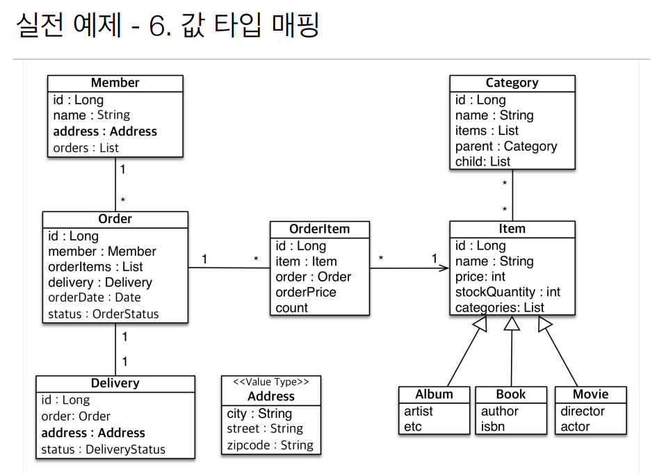

> 값 타입으로 쓸만한게 주소인데 주소는 Member 에도 있고 Delivery 에도 있다
> 주소는 city street zipcode 가 있고 Address 라는 값 타입으로 만들었다

Address.class
```java
@Embeddable
@Getter
public class Address {
  private String city;
  private String street;
  private String zipcode;
}
```

Member.class
```java
@Entity
@Getter @Setter
public class Member extends BaseEntity {

  @Id
  @GeneratedValue(strategy = GenerationType.AUTO)
  @Column(name = "MEMBER_ID")
  private Long id;
  private String name;

  @Embedded
  private Address address;

  @OneToMany(mappedBy = "member")
  private List<Order> orders = new ArrayList<>();
}
```

Delivery.class
```java
@Entity
public class Delivery extends BaseEntity  {

    @Id @GeneratedValue
    private Long id;

    @Embedded
    private Address address;

    private DeliveryStatus status;

    @OneToOne(mappedBy = "delivery")
    private Order order;
}
```
