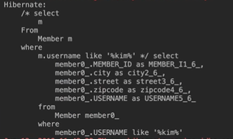
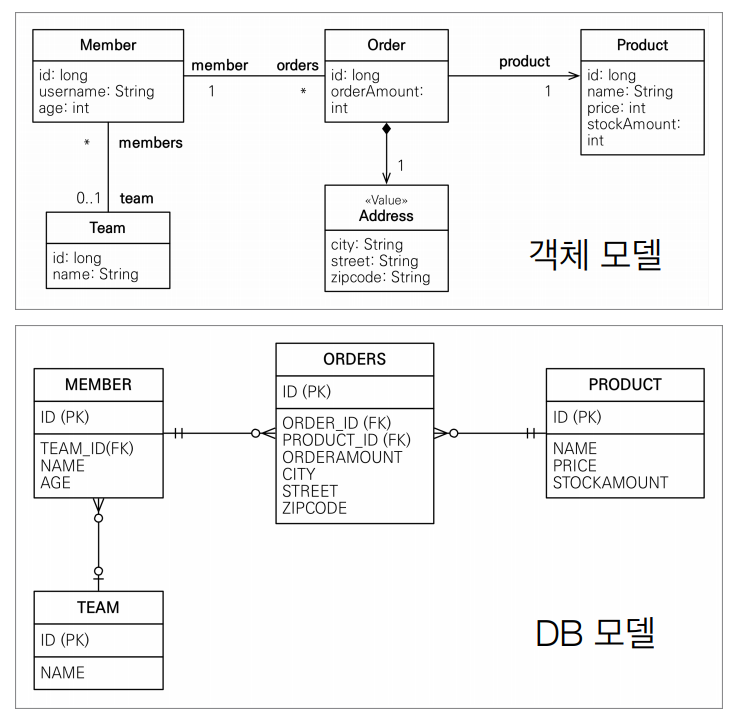
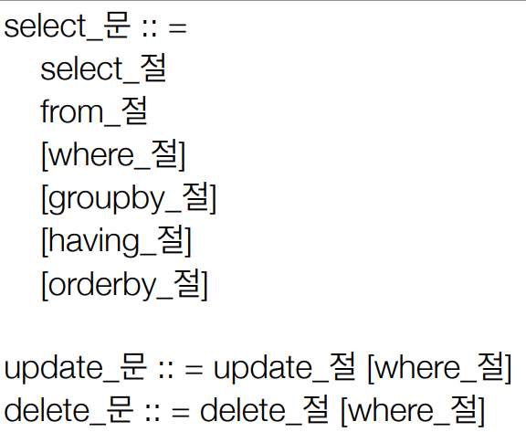
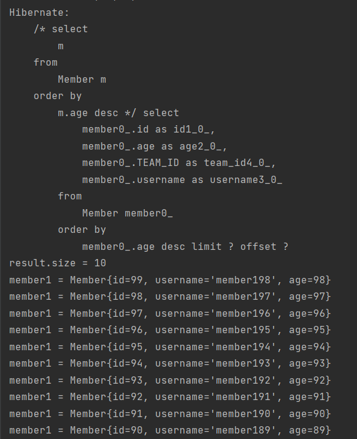
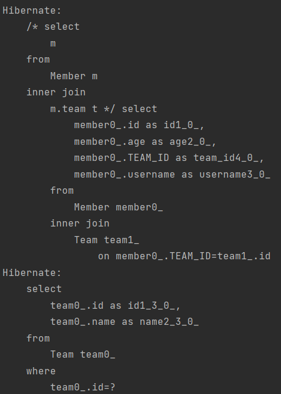
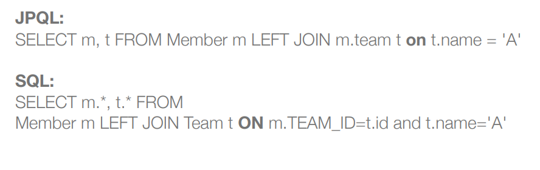
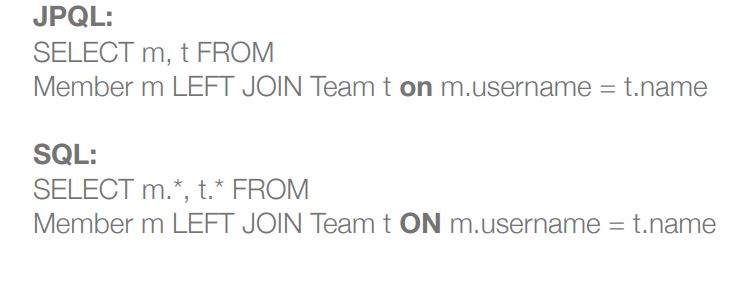
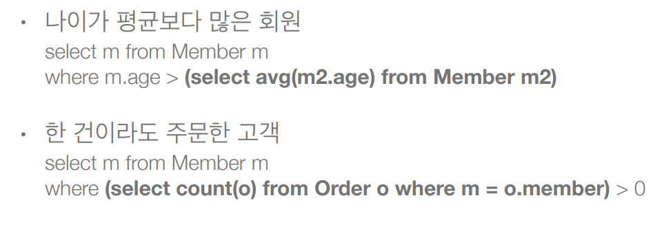
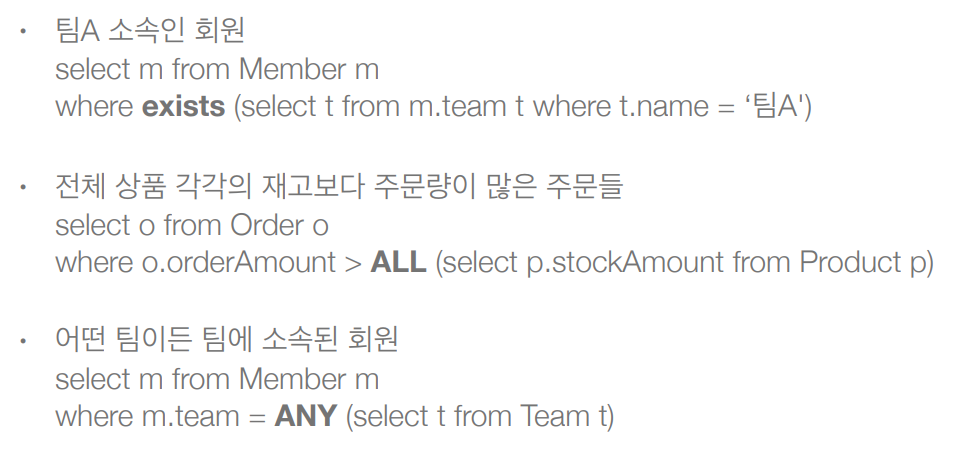
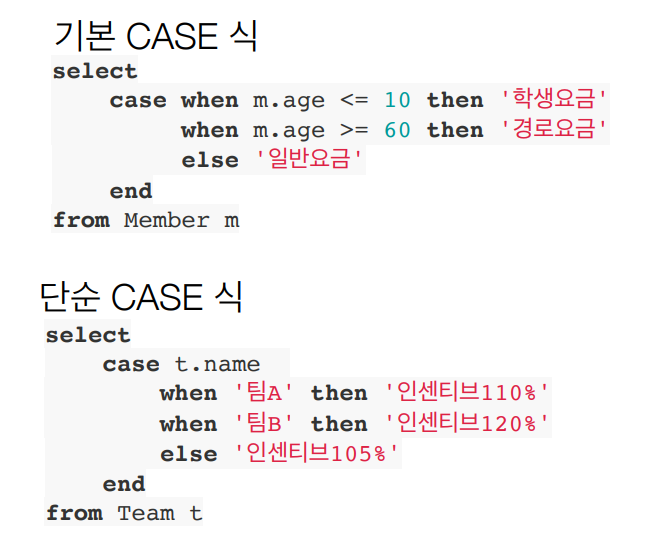

# 객체지향 쿼리언어(JPQL)

## JPA 는 다양한 쿼리 방법을 지원
- JPQL
- JPA Criteria
- QueryDSL
- 네이티브 SQL
- JDBC API 직접 사용, MyBatis, SpringJdbcTemplate 함께 사용

> JPQL 이라는 표준문법을 기반으로 JPA Criteria 랑 QueryDSL 이 두가지는 java 코드로 JPQL 을
> 빌드해주는 generator 이다 네이티브 SQL 은 JPA 를 써도 가끔 데이터 베이스에 종속적인 쿼리
> (connect by) 네이티브 쿼리(생 쿼리) 를 날릴 수 있어야 한다

### JPQL 소개
- 가장 간단한 조회 방법
  - EntityManager.find()
  - 객체 그래프 탐색(a.getB().getC())
- 나이가 18살 이상인 회원을 모두 검색하고 싶다면?

### JPQL
- JPA 를 사용하면 엔티티 객체를 중심으로 개발
- 문제는 검색 쿼리
- 검색을 할 때도 테이블이 아닌 엔티티 객체를 대상으로 검색
- 모든 DB 데이터를 객체로 변환해서 검색하는 것은 불가능
- 결국에는 애플리케이션이 필요한 데이터만 DB 에서 불러오려면 결국 검색 조건이 포함된 SQL 이 필요
- JPQ 는 SQL 을 추상화한 JPQL 이라는 객체 지향 쿼리 언어 제공
- SQL 과 문법 유사, SELECT, FROM, WHERE, GROUP BY, HAVING, JOIN
- JPQL 은 엔티티 객체를 대상으로 쿼리
- SQL 은 데이터베이스 테이블을 대상으로 쿼리
- 결국 JPQL 을 짜면 SQL 로 번역이 되서 실행

```java
 String jpql = "select m From Member m where m.name like ‘%hello%'";
        List<Member> result = em.createQuery(jpql, Member.class)
        .getResultList();
```

여기 쿼리문의 Member 는 테이블이 아니라 Member 엔티티를 가리키는 것이다



이런 결과가 나오는데 주석으로 JPQL 이 보이고 Member 엔티티의 매핑정보를 가지고 
그뒤에 실제 SQL 문으로 번역이 되서 실행이 된다
문법이 SQL 과 거의 같은데 몇가지 차이라 하면 엔티티 객체를 대상으로 하는거, select m 이라 하는거
는 멤버 엔티티 자체를 가르키는 것

- 테이블이 아닌 개겣를 대상으로 검색하는 객체 지향 쿼리
- SQL 을 추상화해서 특정 데이터베이스 SQL 에 의존 X
- JPQL 을 한마디로 정의하면 객체 지향 SQL

### Criteria 소개

JPQL 은 단순한 String(" ") 이다 그럼 동적 쿼리를 만드는게 어렵다 만약에   
```java
String qlString = "select m From Member as m";
String username;
if(username != null) {
    String where = "where m.username like '%kim%'";
    qlString + where    //select m From Member as mwhere m.username like '%kim%
}
```

username 이 없으면 기존쿼리에 더하고 막 잘라내고 주석보면 단순히 더한거라서 띄어쓰기도 신경써야한다
-> 동적 쿼리를 해결해야 한다

```java
//Criteria 사용 준비
CriteriaBuilder cb = em.getCriteriaBuilder(); 
CriteriaQuery<Member> query = cb.createQuery(Member.class); 

//루트 클래스 (조회를 시작할 클래스)
Root<Member> m = query.from(Member.class); 

//쿼리 생성 
CriteriaQuery<Member> cq = query.select(m).where(cb.equal(m.get("username"), “kim”)); 
List<Member> resultList = em.createQuery(cq).getResultList();
tx.commit();
```

여기서 만약에 username 이 null 이 아닐때만 username 관련 쿼리를 넣고싶으면

```java
//Criteria 사용 준비
CriteriaBuilder cb = em.getCriteriaBuilder(); 
CriteriaQuery<Member> query = cb.createQuery(Member.class); 

//루트 클래스 (조회를 시작할 클래스)
Root<Member> m = query.from(Member.class); 

//쿼리 생성 
CriteriaQuery<Member> cq = query.select(m);

String username;

if(username != null) {
    cq = cq.where(cb.equal(m.get("username"), "kim"));
}

List<Member> resultList = em.createQuery(cq).getResultList();
tx.commit();
```

이렇게 깔끔하게 할 수 있다 단점은 SQL 스럽지 않다 실무에서 잘 안쓴다(유지보수가 안되서)

- 문자가 아닌 자바코드로 JPQL 을 작성할 수 있음
- JPQL 빌더 역할
- JPA 공식 기능
- 단점: 너무 복잡하고 실용성이 없다.
- Criteria 대신에 QueryDSL(오픈소스 라이브러리) 사용 권장

### QueryDSL 소개
```java
//JPQL 
//select m from Member m where m.age > 18
JPAFactoryQuery query = new JPAQueryFactory(em);
 QMember m = QMember.member; 
 List<Member> list = 
 query.selectFrom(m)
 .where(m.age.gt(18)) 
 .orderBy(m.name.desc())
 .fetch();
```

동적쿼리도 가능하고 자바코드라서 재사용이 가능하다

- 문자가 아닌 자바코드로 JPQL 을 작성할 수 있음
- JPQL 빌더 역할
- 컴파일 시점에 문법 오류를 찾을 수 있음
- 동적 쿼리 작성 편리
- 단순하고 쉬움
- 실무 사용 권장
- JPQL 을 잘하면 QueryDSL 잘할 수 있음

### 네이티브 SQL 소개
- JPA 가 제공하는 SQL 을 직접 사용하는 기능
- JPQL 로 해결할 수 없는 특정 데이터베이스에 의존적인 기능
- ex) 오라클 CONNECT BY, 특정 DB 만 사용하는 SQL 힌트

```java
String sql = “SELECT ID, AGE, TEAM_ID, NAME FROM MEMBER WHERE NAME = ‘kim’"; 
List<Member> resultList = em.createNativeQuery(sql, Member.class).getResultList(); 
```

sql 에 생쿼리 넣고 em.createNativeQuery 해서 넣으면 된다

### JDBC 직접 사용, SpringJdbcTemplate 등
- JPA 를 사용하면서 JDBC 커넥션을 직접 사용하거나, 스프링 JdbcTemplate, 마이파티스등을 함께
사용 가능
- 단 영속성 컨텍스트를 적절한 시점에 강제로 플러시 필요 (영속성 컨텍스트는 플러쉬가 되야 DB 에
데이터가 있다 이런 기술들은 JPA 와 관련이 없기 때문에 강제로 플러시 하고 쿼리날린다)
ex) JPA 를 우회해서 SQL 을 실행하기 직전에 영속성 컨텍스트 수동 플러시
  
결론은 기본적으로 JPQL 을 철저하게 잘하고 QueryDSL 을 선택해야 한다

나머지 진짜 안되는 엄청나게 복잡한 통계성 쿼리가 5퍼정도 있는데 그건 SpringJdbcTemplate 사용
해서 네이티브 쿼리로 짠다

## JPQL(Java Persistence Query Language)

### JPQL - 기본 문법과 기능

- JPQL 은 객체지향 쿼리 언어다. 따라서 테이블을 대상으로 쿼리하는게 아니라 엔티티 객체를 대상으로
쿼리한다
- JPQL 은 SQL 을 추상화해서 특정 데이터베이스에 SQL 에 의존하지 않는다
- JPQL 은 결국 SQL 로 변환된다



## JPQL 문법



> 문법은 SQL 이랑 똑같다 

update 문은 예를들어서 전 사원의 연봉을 10퍼 인상 시켜라. 라면 JPA 는 값을 바꿀때 업데이트없이
값만 변경되면 트랜잭션 커밋시점에 업데이트 쿼리가 날라갔는데 그건 한건 한건씩 날리는거고 한번에
여러개를 업데이트 하려면 update 문으로 한방에 업데이트하고 한방에 지울 수 있다 이런걸 벌크 연산
이라고 한다

- select m from Member as m where m.age > 18 (Member 는 테이블이 아닌 엔티티 이다)
- 엔티티와 속성은 대소문자 구문 O (Member, age 객체에 있는거랑 똑같이 써야 한다)
- JPQL 키워드는 대소문자 구분 X (SELECT, FROM, where)
- 엔티티 이름 사용, 테이블 이름이 아님(Member)
- 별칭은 필수(m) (as는 생략 가능)

### 집합과 정렬

```java
select
    COUNT(m),   //회원수
    SUM(m.age), //나이 합
    AVG(m.age), //평균 나이
    MAX(m.age), //최대 나이
    MIN(m.age)  //최소 나이
from Member m
```

- GROUP BY, HAVING
- ORDER BY 
다 똑같이 쓰면 된다

### TypeQuery, Query
- TypeQuery: 반환 타입이 명확할 때 사용
- Query: 반환 타입이 명확하지 않을 때 사용

```java
TypedQuery<Member> query1 = em.createQuery("select m from Member m", Member.class);
TypedQuery<String> query2 = em.createQuery("select m.username from Member m", String.class);
Query query3 = em.createQuery("select m.username, m.age from Member m");
```

query1 은 Member.class 를 반환해서 두번째 파라미터에 Member.class 넣어 줬고 TypedQuery 에
Member 넣어 줬다

query2 는 username 을 반환하기 때문에 String.class 넣어주고 TypedQuery 에 String 넣어 줬다

query3 는 username 과 age 가 다르기 때문에 타입 정보를 받을 수 없기 때문에 Query 를 쓴다

### 결과 조회 API

- query.getResultList(): 결과가 하나 이상일 때, 리스트 반환
  - 결과가 없으면 빈 리스트 반환
- query.getSingleResult(): 결과가 정확히 하나, 단일 객체 반환
  - 결과가 없으면: javax.persistence.NoResultException
  - 둘 이상이면: javax.persistence.NonUniqueResultException

결과가 하나 이상일 때, 리스트 반환
```java
TypedQuery<Member> query = em.createQuery("select m from Member m", Member.class);

List<Member> resultList = query.getResultList();
```
결과가 없으면 빈 리스트 반환

결과가 정확히 하나, 단일 객체 반환
```java
TypedQuery<Member> query = em.createQuery("select m from Member m where m.id = 10", Member.class);

Member result = query.getSingleResult();
```
근데 10번 회원의 결과가 없으면 결과가 없으면: javax.persistence.NoResultException
둘 이상이면: javax.persistence.NonUniqueResultException

그래서 얘는 결과가 정확히 하나일 때만 사용해야 한다

### 파라미터 바인딩 - 이름 기준, 위치 기준

**이름 기준**
```java
Member member = new Member();
member.setUsername("member1");
member.setAge(10);
em.persist(member);

TypedQuery<Member> query = em.createQuery("select m from Member m where m.username = :username", Member.class);
query.setParameter("username", "member1");
Member singleResult = query.getSingleResult();
System.out.println("singleResult = " + singleResult.getUsername());

tx.commit();
```
member1 이라고 잘 나온다

m.username = :username" 으로 하고 query.setParameter("username", "member1") 으로 바인딩
했다

**위치 기준**

```java
SELECT m FROM Member m where m.username=?1 
query.setParameter(1, usernameParam);
```

왠만하면 쓰지말자 1,2,3 인데 중간에 하나 끼워 넣으면 장애가 발생한다 근데 문자는 위치가 바껴도
버그가 발생하지 않는다

## 프로젝션
- SELECT 절에 조회할 대상을 지정하는 것
- 프로젝션 대상: 엔티티, 임베디드 타입, 스칼라 타입(숫자, 문자등 기본 데이터 타입)
- SELECT m FROM Member m -> 엔티티 프로젝션 (멤버 엔티티 조회)
- SELECT m.team FROM Member -> m 멤버 연관된 팀 조회 (멤버의 주소값인 임베디드 타입)
- SELECT m.address FROM Member -> m 임베디드 타입 프로젝션 (일반 데이터)
- SELECT m.username, m.age FROM Member -> m 스칼라 타입 프로젝션
- DISTINCT 로 중복 제거

```java
Member member = new Member();
member.setUsername("member1");
member.setAge(10);
em.persist(member);

em.flush();
em.clear();

TypedQuery<Member> result = em.createQuery("select m from Member m", Member.class)
    .setParameter("username", "member1");
    .getResultList();

Member find Member = result.get(0); //하나밖에 없으니까 member1
findMember.setAge(20);

tx.commit();
```

멤버 영속성 컨텍스트에 만들고 flush 하고 clear 해서 1차 캐시에서 지워주고 DB 에만 있을때,
JPQL 사용해서 저렇게 해주면 List<Member> 에 Member 는 영속성 컨텍스트에서 관리가 될까??
나이값이 바뀐다 -> 영속성 컨텍스트에서 관리가 된다

엔티티 프로젝션 하면 select m from Member m 이 대상이 select 절에 여러개 나올 수 있는데
영속성 컨텍스트에 전부 관리된다.

**엔티티 프로젝션**
```java
TypedQuery<Team> result = em.createQuery("select m.team from Member m", Team.class)
```
결과를 Team 으로 받아야되니까 Team 으로 바꿔준다 대신에 좀 조심해야 되는게 Member 랑 Team 이랑
다른 테이블에 있어서 join 해서 연관된 팀을 찾는다 이런 경우에는 왠만하면 SQL 이랑 비슷하게 쓰는게
좋다 join 이 성능, 튜닝에 관련이 많이 되어 있기 때문에

**엔티티 프로젝션**
```java
TypedQuery<Team> result = em.createQuery("select t from Member m join m.team t", Team.class)
```
이렇게 해야 여기서 join 이 들어가는구나 예측이 된다

**임베디드 타입 프로젝션**
```java
em.createQuery("select o.address from Order o", Address.class)
```
얘는 Order 에 address 관련된 것만 쿼리 날린다 from 에 어디 엔티티 소속인지 명시해줘야 한다

**스칼라 타입 프로젝션**
```java
em.createQuery("select distinct m.username, m.age from Member m")
```

내가 원하는것을 SQL 짜듯이 막 가져오는 것

근데 타입이 두개인데 어캐 가져와야 하지??

### 프로젝션 - 여러 값 조회
- SELECT m.username, m.age FROM Member m
- 1. Query 타입으로 조회
- 2. Object[] 타입으로 조회
- 3. new 명령어로 조회
  - 단순 값을 DTO 로 바로 조회 SELECT new jpabook.jpql.UserDTO(m.username, m.age) FROM Member m
  - 패키지 명을 포함한 전체 클래스 명 입력
  - 순서와 타입이 일치하는 생성자 필요

2번을 보면

Main.class
```java
List<Object[]> resultList = em.createQuery("select new jpql.MemberDTO(m.username, m.age) from Member m", MemberDTO.class)
        .getResultList();
Object[] result = resultList.get(0);
sout(reuslt[0]);
sout(reuslt[0]);
```
   
3번을 보면

MemberDTO.class
```java
public class MemberDTO {

  private String username;
  private int age;

  public MemberDTO(String username, int age) {
    this.username = username;
    this.age = age;
  }
}
```
Main.class
```java
List<MemberDTO> resultList = em.createQuery("select new jpql.MemberDTO(m.username, m.age) from Member m", MemberDTO.class)
        .getResultList();
MemberDTO memberDTO = result.get(0);
sout(memberDTO.getUserName());
sout(memberDTO.getAge());
```

이렇게하면 MemberDTO 의 생성자를 통해서 호출이 된다

## 페이징 API
- JPA 는 페이징을 다음 두 API 로 추상화
- setFirstResult(int startPosition): 조회 시작 위치(0부터 시작)
- setMaxResult(int maxResult): 조회할 데이터 수

오라클같은 경우 페이징이 안좋다 0부터 몇번 가지고 오고싶은데 쿼리짜는게 너무 복잡하다 JPA 는 
페이징을 두가지로 추상화 했다

```java
for(int i = 0; i < 100; i++) {
    Member member = new Member();
    member.setUsername("member1" + i);
    member.setAge(i);
    em.persist(member);
}

em.flush();
em.clear();

List<Member> result = em.createQuery("select m from Member m order by m.age desc", Member.class)
        .setFirstResult(1)
        .setMaxResults(10)
        .getResultList();

System.out.println("result.size = " + result.size());
for(Member member1 : result) {
    System.out.println("member1 = " + member1.getAge());
}

tx.commit();
```

패이징에서 order by 가 들어가야 한다 sorting 이 되면서 순서대로 나오기때문에

이렇게 setFirstResult(1) -> 시작 포지션 나는 1번째부터

setMaxResult(10) -> 10개 가져올거야

이렇게해서 result 에 넣어주면 나이가 많은 순으로 되어있는 리스트 result 에 1번째부터 10개 까지
가져온다



이렇게 결과가 출력된다

## 조인
- SQL 조인과 실행되는건 같지만 JPQL 은 객체 스타일로 조인 문법이 나간다
- 내부조인: SELECT m FROM Member m [INNER] JOIN m.team t -> 회원과 연관있는 team 을 t로 조인 
- 외부 조인: SELECT m FROM Member m LEFT [OUTER] JOIN m.team t
- 세타 조인: select count(m) from Member m , Team t where m.username = t.name

```java
Team team = new Team();
team.setName("teamA");
em.persist(team);

Member member = new Member();
member.setUsername("member1");
member.setAge(10);
member.setTeam(team);
em.persist(member);

em.flush();
em.clear();

String query = "select m from Member m inner join m.team t";
List<Member> result = em.createQuery(query, Member.class)
        .getResultList();

tx.commit();
```

이렇게 쓰면



이렇게 멤버랑 팀이랑 조인을하고 t 를 쓸 수 있게 된다 

String query = "select m from Member m inner join m.team t where t.name = :teamName";

이렇게 teamName 으로 파라미터 받을 수 있다

inner 도 생략할 수 있다

String query = "select m from Member m left outer join m.team t";

이렇게 left 조인도 가능하다

String query = "select m from Member m, Team t where m.username = t.name";

이렇게 세타 조인도 가능하다(막조인)

### 조인 - ON 절
- ON 절을 활용한 조인
  - 1. 조인 대상 필터링
  - 2. 연관관계 없는 엔티티 외부 조인 -> 세타 조인처럼 Member username 이랑 teamname 이
아무 관계가 없어도 외부 조인이 가능

### 1. 조인 대상 필터링
- ex) 회원과 팀을 조인하면서, 팀 이름이 A 인 팀만 조인



팀 이름이 'A' 인 애만 레프트 조인 하고 싶어

실제 SQL 에 저렇게 나간다

### 2. 연관관계 없는 엔티티 외부 조인
- ex) 회원의 이름과 팀의 이름이 같은 대상 외부 조인



## 서브 쿼리


### 서브 쿼리 지원 함수
- [NOT] EXISTS (subquery): 서브쿼리에 결과가 존재하면 참
  - {ALL|ANY|SOME} {subquery}
  - ALL 모두 만족하면 참
  - ANY, SOME: 같은 의미, 조건을 하나라도 만족하면 참
- [NOT] IN (subquery): 서브쿼리의 결과 중 하나라도 같은 것이 있으면 참

### 서브 쿼리 - 예제


### JPA 서브 쿼리 한계
- JPA 는 WHERE, HAVING 절에서만 서브 쿼리 사용 가능
- SELECT 절도 가능(하이버네이트에서 지원)
- FROM 절의 서브 쿼리는 현재 JPQL 에서 불가능
  - 조인으로 풀 수 있으면 풀어서해결

ex) select (select avg(m1.age) From Member m1) as avgAge from Member m join Team t on m.username = t.name

### JPQL 타입 표현
- 문자: 'HELLO', 'She''s'
- 숫자: 10L(Long), 10D(Double), 10F(Float)
- Boolean: TRUE, FALSE
- ENUM: jpabook.MemberType.Admin (패키지명 포함)
- 엔티티 타입: TYPE(m) = Member (상속 관계에서 사용) -> 엔티티의 타입정보가 Member 인 애만 쓰고싶다
ex) Item 밑에 앨범 북 무비 가 있다 나는 Book 과 관련된것만 조회하고 싶어 라고하면 
select i from Item i where type(i) = Book 이렇게 하면 된다

MemberType.enum
```java
public enum MemberType {
    ADMIN, USER
}
```

Member.class
```java
private MemberType type;
```

이렇게 ENUM 타입 만들어주고

Main.class
```java
String query = "select m.username, 'HELLO', TRUE From Member m";
```

> 이렇게 'Hello' 로 문자 타입 가능하고 TRUE 롤 Boolean 타입 가능하다 

ENUM 타입은
 ```java
String query = "select m.username, 'HELLO', TRUE From Member m " +
        "where m.type = jpql.MemberType.ADMIN";
```
이렇게 전체 패키지명을 포함해야 한다

### JPQL 기타
- SQL 과 문법이 같은 식
- EXISTS, IN
- AND, OR, NOT
- = > >= < <= <>
- BETWEEN, LIKE, IS NULL

## 조건식 - CASE 식



>기본 CASE 식은 조건을 넣어서 이렇게 할 수 있고
> 
>단순 CASE 식은 정확하게 매칭이 되면 이걸 해라


- COALESCE: 하나씩 조회해서 null 이 아니면 반환
- NULLIF: 두 값이 같으면 null 반환, 다르면 첫번째 값 반환


> username 이 없으면 '이름 없는 회원' 이 나온다
>
> username 이 '관리자' 라면 null 이 나온다 그게 아니라면 본인의 이름이 나온다

## JPQL 기본 함수
애플리케이션을 개발하다보면 데이터베이스에 함수가 있을 수 있고 그 함수를 불러서 써야되는데 JPQL 은
그 함수를 알 수 있는 방법이 없어서 표준 문법을 제공한다
- CONCAT (문자열 두개 합치는거)
- SUBSTRING (문자열 잘라내는거)
- TRIM (공백 제거)
- LOWER, UPPER (대소문자)
- LENGTH (문자열 길이)
- LOCATE (해당하는 문자가 문자열 어디에 있는지)
- ABS, SQRT, MOD
- SIZE, INDEX(JPA 용도) (select size(t.member) From Team t 라고 하면 연관관계에서 컬랙션 크기 반환)
  (INDEX 는 일반적으로 안쓰고 @OrderColumn 써서 컬렉션 위치 구할때 쓴다 왠만하면 안쓰는게 좋다
  리스트에서 빠지면 데이터 null 로 들어오니까)

얘네들은 JPQL 이 제공하는 표준 함수이다 데이터 베이스에 관계없이 쓰면 된다
만약에 여기서 안돼? 그럼 사용자 정의 함수를 호출하면 된다

### 사용자 정의 함수 호출
- 하이버네이트는 사용전 방언에 추가해야 한다.
  - 사용하는 DB 방언을 상속받고, 사용자 정의 함수를 등록한다

(ex) select function('group_concat', i.name) From Item i

내가 함수를 만들어놨다고 가정하고 

```java
public class MyH2Dialect extends H2Dialect {
    public MyH2Dialect() {
      registerFuncton("group_concat", new StandardSQLFunction("group_concat", StandardBasicTypes.String));
    }
}
```
H2Dialect 를 상속받아서 상속자에서 등록해주면 된다 group_concat 이 이름이고 StandardSQLFunction 에 조건을
넣으면 되는데 이건 외우지 못하고 등록하는 방법은 컨트롤 찍어서 소스코드 열어보면 된다
그리고 persistence.xml 에 dialect value 값에 내가 만든 함수를 넣어주면 된다

Main.class
```java
select function('group_concat', m.username) From Member m;
```

이렇게 하면 결과값을 한줄로 받아온다

