# 경로 표현식
- 점을 찍어 객체 그래프를 탐색하는 것

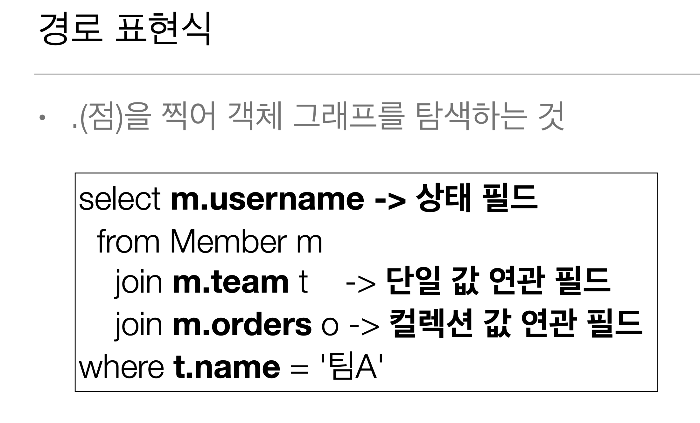

- 상태 필드: 단순히 값을 저장하기 위한 필드 (m.username)
- 연관필드: 연관 관계를 위한 필드
  - 단일 값 연관 필드: @ManyToOne, @OneToOne, 타겟 대상이 엔티티 (m.team)
  - 컬렉션 값 연관 필드: @OneToMany, @ManyToMany, 타겟 대상이 컬렉션 (m.orders)

## 경로 표현식 특징
- 상태필드: 경로 탐색의 끝, 더이상 탐색 X -> ex) m.username 을 하면 m.username.~~ 이렇게 경로탐색을 더 할 수 없다
- 단일 값 연관 경로: 묵시적 내부 조인(inner join) 발생, 탐색 O -> m.team.members 처럼 더 쭉쭉 타고 갈 수 있다
select m.team From Member m (멤버에 소속된 팀을 가져오겠다) 을 실행 하면
  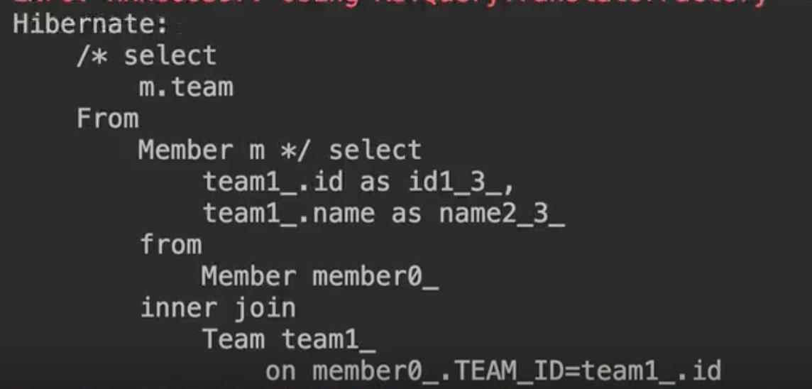
이렇게 뜬다 잘보면 Jpql 은 select m.team 으로 팀을 가져와 라고 했는데 sql 은 from 절에서 멤버랑 팀을 **묵시적 조인**
후 팀을 select select 프로젝션에 나열한다 -> 묵시적 조인? 편해보이지만 조심해서 사용해야 한다 성능 튜닝에도 지대한 영향
그래서 왠만하면 jpql 이랑 sql 을 맞추자
- 컬렉션 값 연관 경로: 묵시적 내부 조인 발생, 탐색 X 
  - from 절에서 명시적 조인을 통해 별칭을 얻으면 별칭을 통해 탐색 가능
select t.members from team t; (팀에 있는 멤버 컬렉션) 일대 다 관계다 컬렉션에 한두개가 아닐탠데 그중에 뭘 선택해서 어떤
필드를 꺼낼건데? 그래서 제한을 뒀다 묵시적으로 내부 조인이 발생한다
또한 t.members.~~ 추가 탐색 X 왜냐하면 컬렉션에서 뭘찍을 수 있겠어 해봤자 컬렉션 크기인 t.members.size 로 팀 내부에
멤버 숫자정도 그런데 select m From Team t join t.members m 으로 명시적 조인을 통해 별칭 얻어서 추가 탐색 가능하다 

> 하지만 전부 권장 하는 방법이 아니다 그냥 묵시적 조인 쓰지말고 명시적 조인 써야 실제 쿼리 튜닝하기 쉽다

## 상태 필드 경로 탐색
- JPQL: select m.username, m.age from Member m
- SQL: select m.username, m.age from Member m

> 상태 필드는 JPQL -> SQL 그대로

## 단일 값 연관 경로 탐색
- JPQL: select o.member from Order o
- SQL: select m.* from Orders o inner join Member m on o.member_id = m.id

> 묵시적 조인이 발생한다 상당히 위험하다 o.member.t.~~ 이렇게 연타로 들어가면 계속 내부조인 나가기 때문

## 명시적 조인, 묵시적 조인
- 명시적 조인: join 키워드 직접 사용
  - select m from Member m join m.team t
- 묵시적 조인: 경로 표현식에 의해 묵시적으로 SQL 조인 발생 (내부 조인만 가능 외부조인은 불가능)
  - select m.team from Member m -> m.team 부분에서 DB 입장에서 join 발생

## 경로 표현식 - 예제
- select o.member.team from Order o -> 가능 (문제는 조인이 2번 일어난다) 주문을 한 멤버의 팀
- select t.members from Team -> 가능 (컬렉션이지만 t.members 에서 끝을 냈기 때문) 팀에 멤버들
- select t.members.username from Team t -> 불가능 (왜? 컬렉션인데 t.members 에서 어캐더가 해봤자 size 정도)
- select m.username from Team t join t.members m -> 가능 (명시적 join 으로 별칭 m 을 만들어서 m 에서 다시시작)

## 경로 탐색을 사용한 묵시적 조인 시 주의사항
- 항상 내부 조인
- 컬렉션은 경로 탐색의 끝, 명시적 조인을 통해 별칭을 얻어야 함
- 경로 탐색은 주로 select, where 절에서 사용하지만 묵시적 조인으로 인해 SQL 의 from(join) 절에 영향을 줌

## 실무 조언
- 가급적 묵시적 조인 대신 명시적 조인 사용
- 조인은 SQL 튜닝에 중요 포인트
- 묵시적 조인은 조인이 일어나는 상황을 한눈에 파악하기 어려움

# JPQL - 페치 조인 (fetch join) -> 실무에서 엄청 중요함

## fetch join
- SQL 조인 종류가 아니다
- JPQL 에서 **성능 최적화**를 위해 제공하는 기능
- 연관된 엔티티나 컬렉션을 SQL 한번에 함께 조회하는 기능 -> 쿼리 두방 나갈거를 한방 쿼리로 날릴 수 있다
- join fetch 명령어 사용
- 페치 조인 = [LEFT [OUTER] | [INNER] JOIN FETCH] 조인 경로

## 엔티티 페치 조인
- 회워을 조회하면서 연관된 팀도 함께 조회 (SQL 한 번에)
- SQL 을 보면 회원 뿐만 아니라 팀도 한께 select
- [JPQL] -> select m from Member m join fetch m.team -> 회원을 조회하고 싶다 근데 회원이랑 팀이랑 many one 으로 연관
관계가 있다 그런데 회원을 조회할때 팀도 한방쿼리로 동적으로 같이 가져오고 싶다. 그럼 join fetch m.team 하면 된다
- [SQL] -> SELECT M.*, T.* FROM MEMBER M INNER JOIN TEAM T ON M.TEAM_ID=T.ID -> 멤버 팀 데이터 전부
나열하고 그다음에 팀과 멤버의 팀 아이디를 조인을 건다

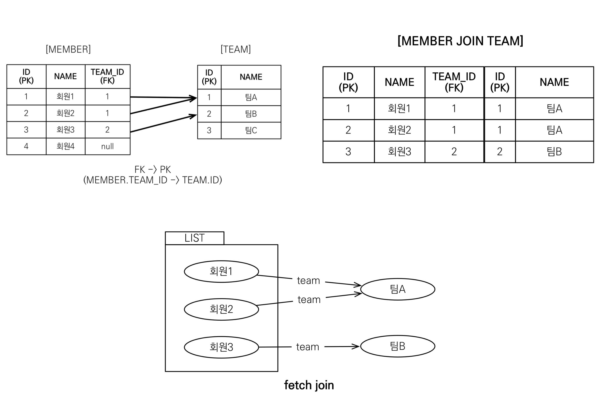

이러한 시나리오가 있다 결과적으로 fetch 조인을하면 저렇게 된다 회원1, 2, 3 그리고 팀 레퍼런스로 teamA, teamB 이렇게
엔티티를 5개의 엔티티를 만든다 영속성 컨텍스트에 5개를 보관하고 이 그림을 만들어서 반환해준다 그리고 **쿼리는 한방쿼리**

```java
Team teamA = new Team();
teamA.setName("팀A");
em.persist(teamA);

Team teamB = new Team();
teamB.setName("팀B");
em.persist(teamB);

Member member1 = new Member();
member1.setUsername("회원1");
member1.setTeam(teamA);
em.persist(member1);

Member member2 = new Member();
member2.setUsername("회원2");
member2.setTeam(teamA);
em.persist(member2);

Member member3 = new Member();
member3.setUsername("회원3");
member3.setTeam(teamB);
em.persist(member3);

em.flush();
em.clear();

String query = "select m From Member m"

List<Member> result = em.createQuery(query, Member.class)
        .getResultList();
for(Member member : result) {
    sout("member = " + member.getUsername() + member.getTeam().getName());
}
tx.commit();
```
이렇게 돌리면 Member 와 Team 의 연관 관계는 ManyToOne 이고 FetchType 은 Lazy 니까 팀은 프록시로 들어와서 지연로딩
이 일어나서 member.getTeam().getName() 을 호출한 시점에 DB 에 쿼리를 날린다

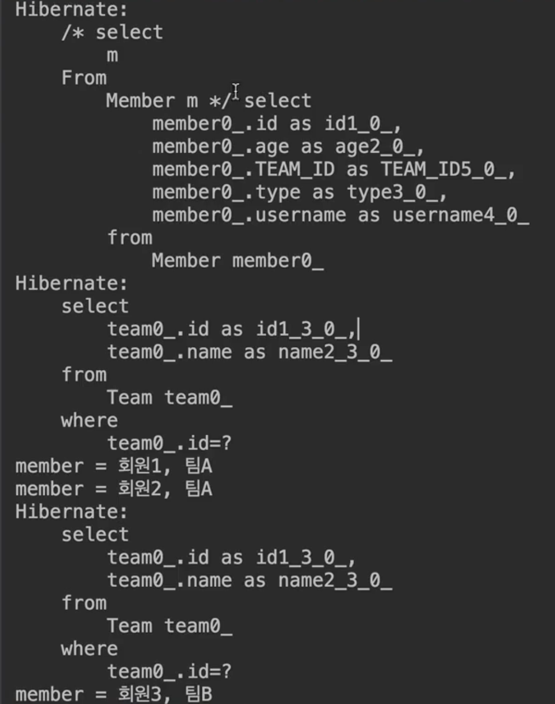

처음에 멤버3개를 가져오고(첫번째 select) 팀을 가져온다 (두번째 select) 루프에서 회원 1 이 돌면 TeamA 가 SQL 쿼리로
가져온다 영속성 컨텍스트에 없어서 회원 2 도 TeamA 소속이다 얘도 TeamA 를 달라하는데 TeamA 는 아까 캐시에 넣었으니 1차캐시
에서 가져온다 회원 3은 TeamB 소속인데 영속성컨텍스트에 없어서 SQL 에서 가져온다 이렇게 쿼리가 3번 나간다

근데 회원이 100명이고 100명 전부 다른팀 소속이면 회원 100명 조회하면 쿼리 100방 나간다 이걸 N + 1 이라고 한다 1 은 회원
을 가져오기 위한 쿼리고 , 그걸 N 번 돌린다 -> 첫번째 쿼리로 날린 결과로 얻은 result 결과만큼 N 번 날리는걸 N+1 문제

이걸 어떻게 풀어야할까 -> fetch 조인으로 풀자!

```java
Team teamA = new Team();
teamA.setName("팀A");
em.persist(teamA);

Team teamB = new Team();
teamB.setName("팀B");
em.persist(teamB);

Member member1 = new Member();
member1.setUsername("회원1");
member1.setTeam(teamA);
em.persist(member1);

Member member2 = new Member();
member2.setUsername("회원2");
member2.setTeam(teamA);
em.persist(member2);

Member member3 = new Member();
member3.setUsername("회원3");
member3.setTeam(teamB);
em.persist(member3);

em.flush();
em.clear();

String query = "select m From Member m join fetch m.team"

List<Member> result = em.createQuery(query, Member.class)
        .getResultList();
for(Member member : result) {
    sout("member = " + member.getUsername() + member.getTeam().getName());
}
tx.commit();
```

쿼리만 바뀌었다 쿼리문을 해석하자면 멤버를 조회할거다 조인을 하긴 하는데 fetch 로 한번에 끌고오면서 team 을가져와

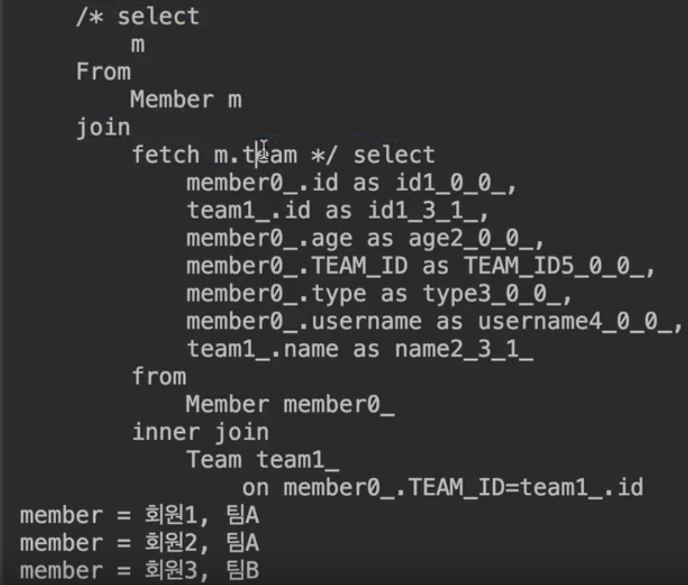

select 쿼리 한번나갔는데 From 절에서 member inner join team 으로 조인하면서 한방쿼리가 나간거다
쿼리가 날라가서 result 에 담기는 시점에 team 은 프록시가 아닌 실제 엔티티가 담긴다
여기서 for 문이 돌면서 member.getTeam().getName() 여기에 팀은 프록시가 아니라 데이터가 이미 채워져 있어서
이미 영속성 컨텍스트에 올라가 있다 그래서 루프 돌면 지연로딩없이 깔끔하게 찍혀있다 이게 페치 조인이다 (지연로딩으로 세팅해도
페치조인이 우선)

## 페치 조인 사용 코드

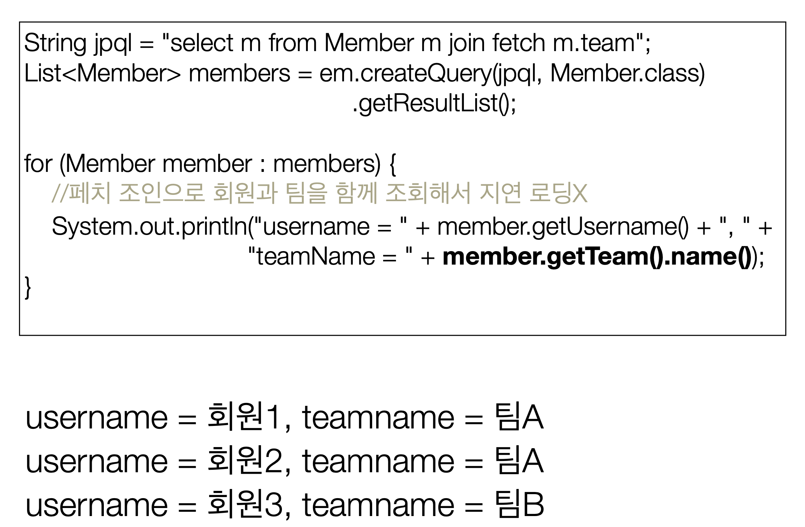

이렇다

## 컬렉션 페치 조인
- 일대다 관계, 컬렉션 페치 조인
- [JPQL] -> select t from Team t join fetch t.members where t.name = '팀A' -> 팀A 와 관련된 애들 다 끌고오기
- [SQL] -> SELECT T.*, M.* FROM TEAM T INNER JOIN MEMBER M ON T.ID=M.TEAM_ID WHERE T.NAME='팀A'

```java
String query = "select t From Team t join fetch t.members";
List<Team> result = em.createQuery(query, Team.class)
    .getResultList();
for(Member member : result) {
    sout("team = " + team.getname() + "|members=" team.getMembers().size());
}
```
이렇게 하면
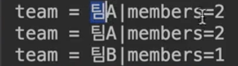
팀A 가 중복으로 출력된다 왤까 -> 일대다 조인을하면 디비는 뻥튀기가 된다 JPA 에서도 똑같다 DB 에 쿼리를 날리는 것 이기 때문에
일대다 조인은 무조건 데이터 뻥튀기

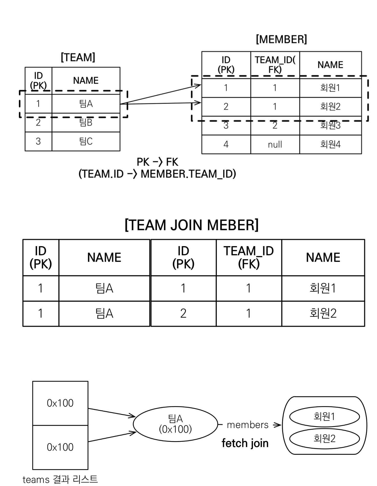

팀 입장에서 팀A 는 회원1 회원2 멤버가 두명이 있다 이걸 조인을 하면 팀A 입장에서 회원이 두명이니까 TEAM JOIN MEMBER 테이블
은 저렇게 된다 그래서 두줄이 된다 TeamA 입장에서는 하나지만 Member 가 둘이기 대문에 raw 가 두줄이 된다 이거는 객체와 RDB
의 차이다 그렇지만 두줄 다 ID 가 1번 이기 때문에 둘은 하나로 영속성 컨텍스트에 올라간다 결국엔 같은 주소값을 가진 결과가 두줄이
나온다

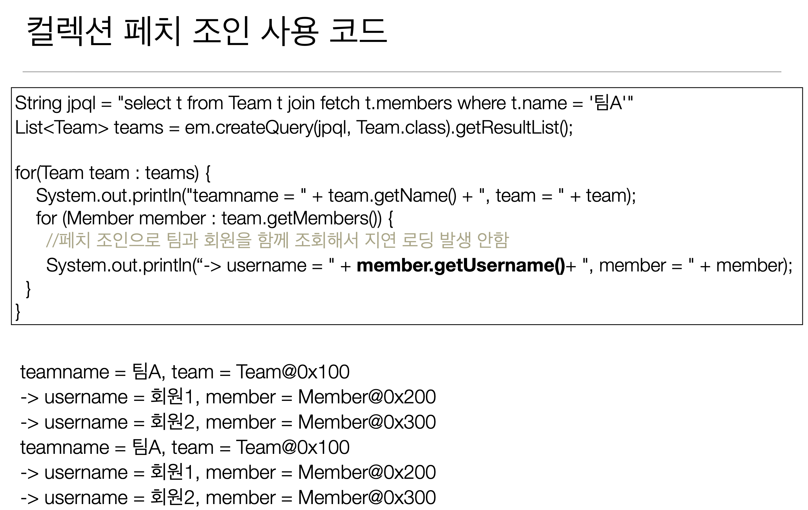

팀A 는 회원1,2 팀A 는 회원1,2 가 중복으로 출력된다 주소값은 같다 팀A 에서의 members 컬렉션에 가보면 회원1, 2 를 잘 가지고
있다

중복이 싫으면 어카지? DISTINCT 사용

## 페치 조인과 DISTINCT
- SQL 의 DISTINCT 는 중복된 결과를 제거하는 명령
- JPQL 의 DISTINCT 2가지 기능 제공
  - 1. SQL 에 DISTINCT 를 추가
  - 2. 애플리케이션에서 엔티티 중복 제거 (DB 가 아닌 애플리케이션 레벨에서) -> SQL 에 DISTINCT 를 추가해서 DB 에 쿼리를
날린 다음에 그 결과가 애플리케이션에 올라오면 똑같은 엔티티가 있으면 날려준다

```java
String query = "select distinct t From Team t join fetch t.members";
List<Team> result = em.createQuery(query, Team.class)
    .getResultList();
for(Member member : result) {
    sout("team = " + team.getname() + "|members=" team.getMembers().size());
}
```

select 프로젝션에 있는것에 대해서 distinct 하겠다는 거다

이렇게 SQL 에 DISTINCT 를 추가 하더라도 데이터가 다르므로 SQL 결과에서 중복제거 실패 -> 완전히 두개가 100 퍼센트 똑같아야
DISTINCT 가 된다 근데 ID 도 다르고 NAME 도 다르다 그래서 SQL 입장에서 안된다

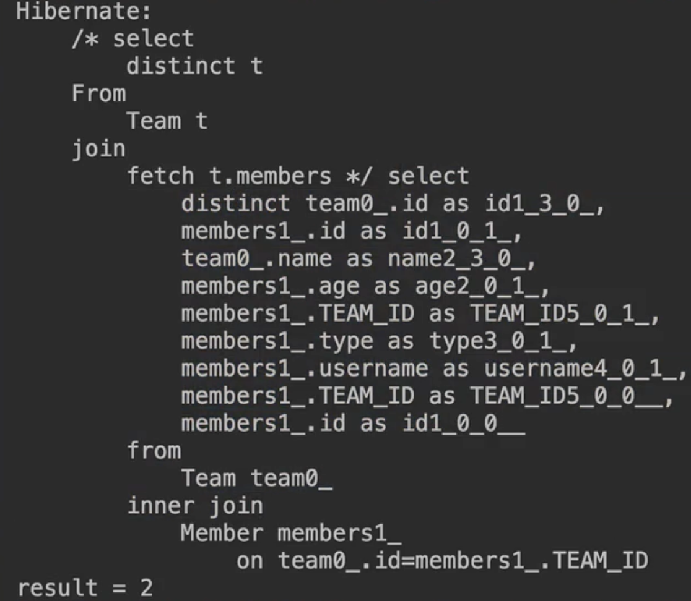

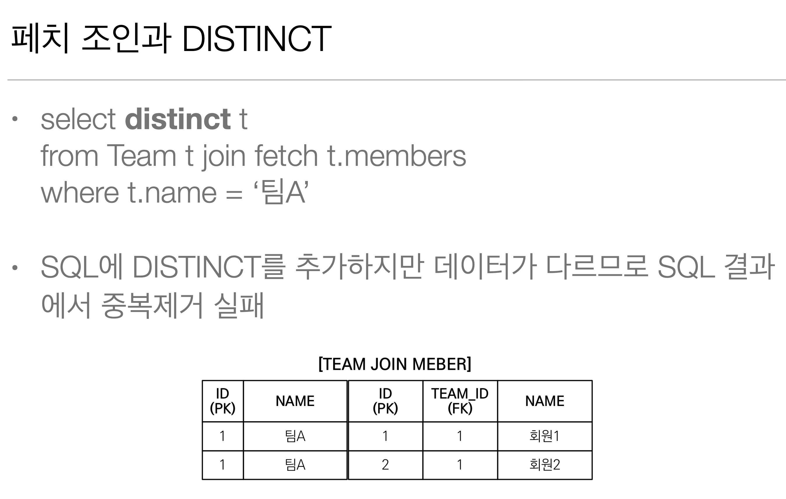
쿼리에서 distinct 가 되도 쿼리만으로 데이터가 안줄여진다

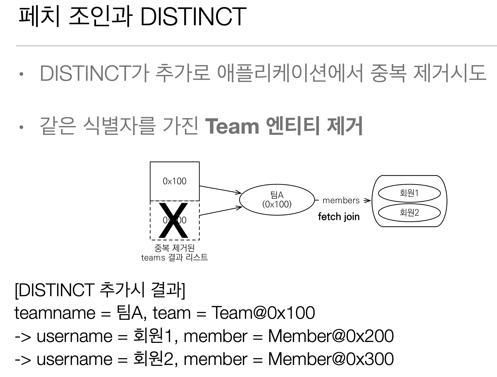

- JPA 에서 뭘 하냐면 DISTINCT 가 추가로 애플리케이션에서 중복 제거를 시도한다

- 컬렉션을 퍼올릴때 같은 식별자를 가진 Team 엔티티 제거한다

그림을 보면 중복이 제거된 결과 리스트를 반환해 준다 


그럼 이제 팀A 가 중복이였지만 JPA DISTINCT 가 중복을 제거해 준다 우리가 원했던대로 결과가 나온다

# 페치 조인과 일반 조인의 차이
- 일반 조인 실행시 연관된 엔티티를 함께 조회하지 않음
- [JPQL] -> select t from Team t join t.members m where t.name = '팀A'
- [SQL] -> SELECT T.* FROM TEAM T INNER JOIN MEMBER M ON T.ID=M.TEAM_ID WHERE T.NAME = '팀A'

```java
Team teamA = new Team();
teamA.setName("팀A");
em.persist(teamA);

Team teamB = new Team();
teamB.setName("팀B");
em.persist(teamB);

Member member1 = new Member();
member1.setUsername("회원1");
member1.setTeam(teamA);
em.persist(member1);

Member member2 = new Member();
member2.setUsername("회원2");
member2.setTeam(teamA);
em.persist(member2);

Member member3 = new Member();
member3.setUsername("회원3");
member3.setTeam(teamB);
em.persist(member3);

em.flush();
em.clear();

String query = "select t From Team t join t.members m"

List<Team> result = em.createQuery(query, Team.class)
        .getResultList();
for(Member member : result) {
    sout("team = " + team.getname() + "|members=" team.getMembers().size());
}
tx.commit();
```
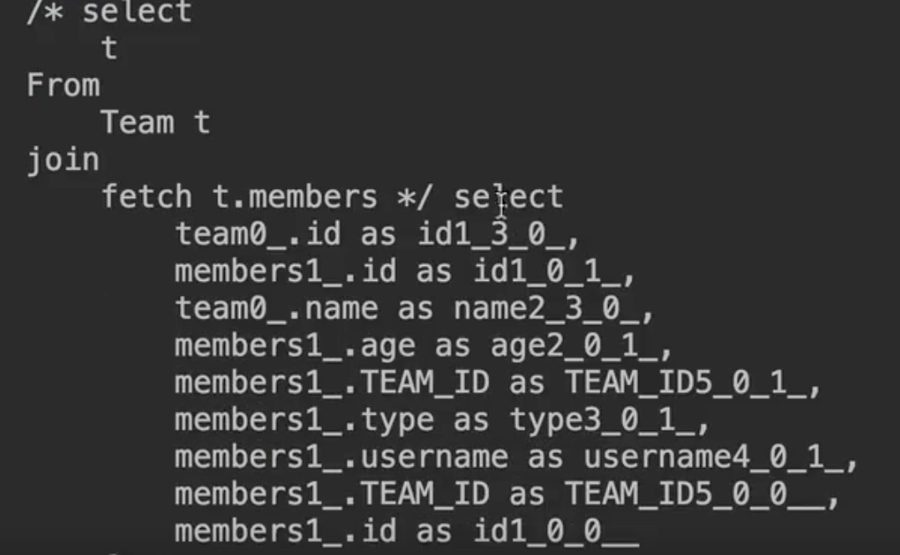
이렇게 fetch 를 빼고 멤버스를 조회해 봤다 그러면 분명히 조인을 했고 쿼리에도 조인이 나갈거다 그런데 잘보면 select 절에서 팀
만 가져온다 그냥 join 이기 때문에 join 문만 sql 에서 실행되고 실제 데이터를 퍼올리는건 t 에 대한것만 퍼올린다 

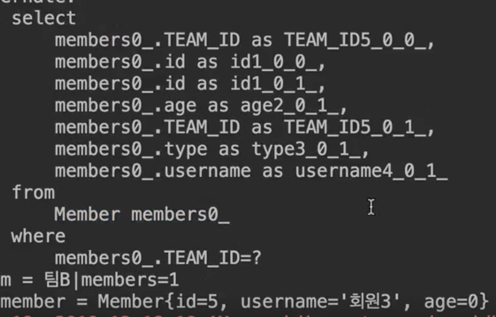 
위 그림을보면 쿼리가 쭉쭉 나가는데 문제는 루프를 돌릴때 members 가 초기화가 안되서 데이터가 없어서 쿼리들이 쭉쭉나간다 데이터가
로딩 시점에 로딩이 안된거다

그런데 이걸 fetch 로 바꾸면 

```java
Team teamA = new Team();
teamA.setName("팀A");
em.persist(teamA);

Team teamB = new Team();
teamB.setName("팀B");
em.persist(teamB);

Member member1 = new Member();
member1.setUsername("회원1");
member1.setTeam(teamA);
em.persist(member1);

Member member2 = new Member();
member2.setUsername("회원2");
member2.setTeam(teamA);
em.persist(member2);

Member member3 = new Member();
member3.setUsername("회원3");
member3.setTeam(teamB);
em.persist(member3);

em.flush();
em.clear();

String query = "select t From Team t join fetch t.members"

List<Team> result = em.createQuery(query, Team.class)
        .getResultList();
for(Member member : result) {
    sout("team = " + team.getname() + "|members=" team.getMembers().size());
}
tx.commit();
```

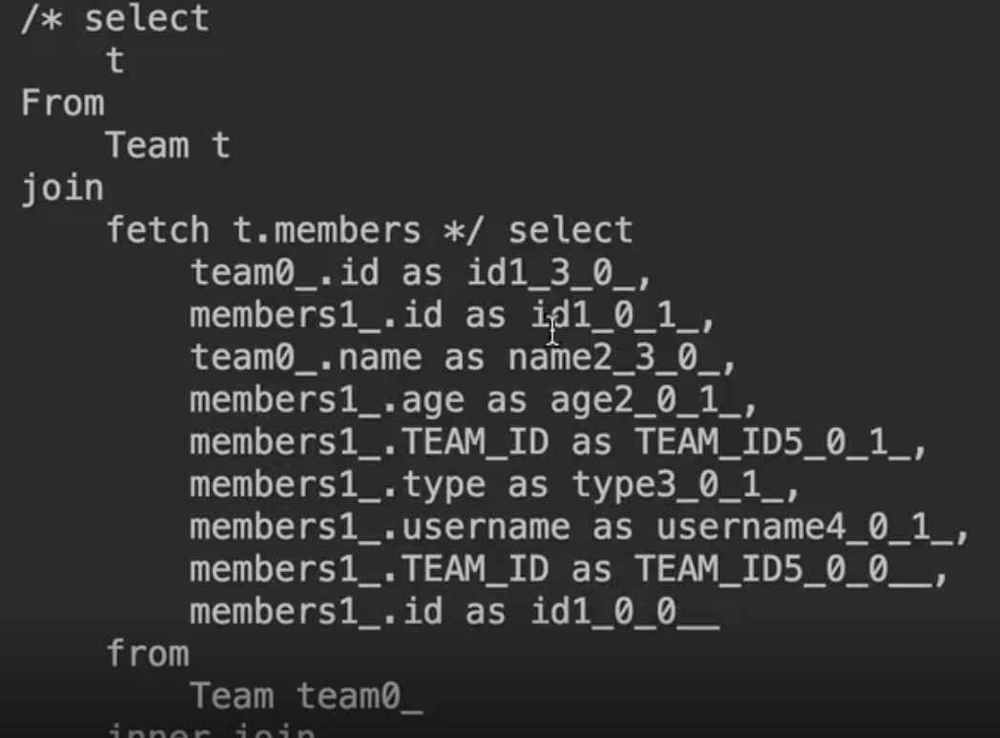
쿼리 한번만 나가 select 절에 데이터 다 포함이 되어있고 

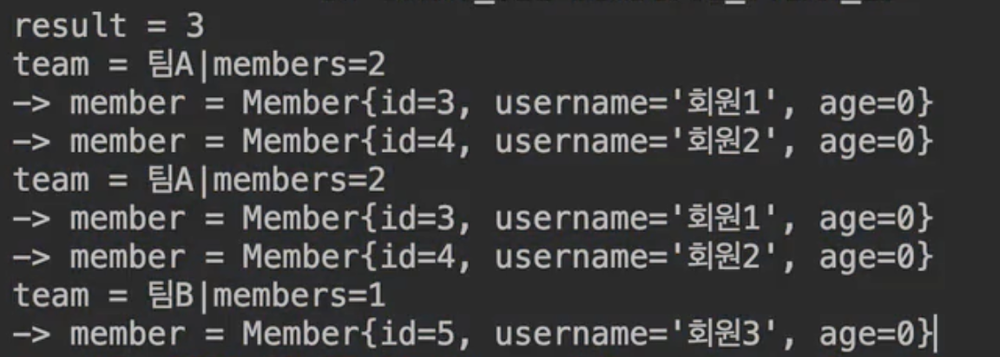
지연로딩 없이 깔끔하게 처음데이터 다 불러온다 

## 이게 페치조인과 일반 조인의 차이
- JPQL 은 결과를 반환할 때 연관관계 고려 x
- 단지 select 절에 지정한 엔티티만 조회할 뿐
- 여기서는 팀 엔티티만 조회하고, 회원 엔티티는 조회 x
- 페치 조인을 사용할 때만 연관된 엔티티도 함께 조회(즉시로딩) -> 같이 한방에 쫙
- 페치 조인은 객체 그래프를 SQL 한번에 조회하는 개념 -> 한방쿼리로 객체그래프 한방에 쫙
- 페치 조인은 연관된 엔티티를 함게 조회함(위에 예시)


