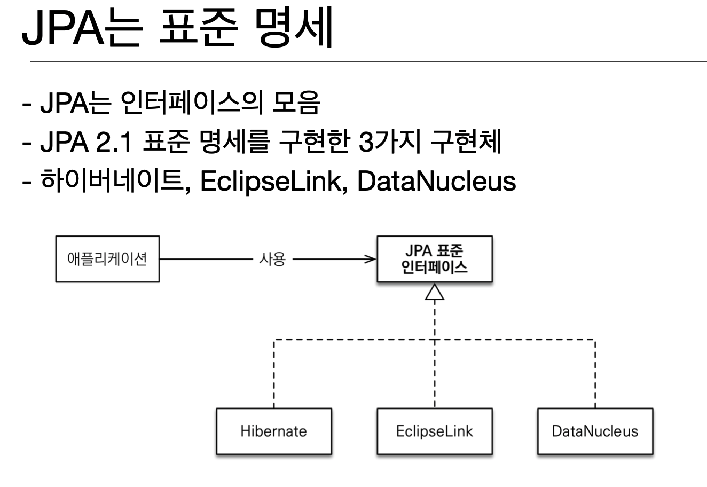

# JPA가 나오게 된 배경

지금 대다수의 애플리케이션은 데이터를 관계형 DB에 저장한다.

따라서 필연적으로 데이터를 저장하고 불러오는데 있어 `SQL`이 많이 사용될 수 밖에 없는데

여기서 문제가 발생하게 된다.

## 객체와 관계형 데이터베이스의 불일치 

객체와 관계형 데이터베이스의 불일치로 인해 다음 4가지 문제점이 생긴다.

1. 상속
2. 연관관계
3. 데이터 타입
4. 데이터 식별 방법


### 1. 상속  


가령 위와 같은 상속을 받는 객체 구조가 있다고 하면

`Album` 객체를 디비에 저장한다고 하자. 그러면,

테이블은 상속이라는 개념이 없으므로

`Album` 테이블 안에 있는 맴버 중에 `Item` 테이블에 있는 항목과 `Album` 

테이블에 있는 항목을 나눠서 각각 `SQL`을 작성해서 넣어주는 과정이 필요하다.

디비에서 꺼내거나 수정해야 할 때 역시 테이블 마다 항목을 나눠서 `SQL` 을  따로 작성해야 하는 문제점이 생긴다.

### 2. 연관 관계


`Member` 와 `Team` 객체를 위와 같이 설계 했다고 하면 

객체와 테이블 사이에 불일치가 다시 발생하는데 바로

>객체는 `Member` 에서 `Team`에 접근할때는 참조를 이용하고 , `Member` -> `Team` 단방향 접근만 가능하다.

반면에

>테이블은 `Member` 에서 `Team`에 접근할때 `PK`, `FK` 를  이용하고,  `Member` <-> `Team` 양방향 접근이 가능하다.

#### 객체를 테이블에 맞추기

이 불일치를 해결하기 위해 객체를 테이블 구조에 맞춰서 설계했다고 하면 다음과 같은 형태가 될 것이다.

```java
class Member{
    String id;          //Member_ID 컬럼 사용
    Long teamId;        //TEAM_ID FK 사용
    String username;    //USERNAME 컬럼 사용
}
class Team{
    Long Id;        //TEAM_ID PK 사용
    String name;    //NAME 컬럼 사용
}
```

위와 같이 설계를 하게 되면 `Member` 에서 `Team` 으로 직접 참조를 하지 못하고  
`Member` 에서 `Team` 으로 접근할 때 `Member` 의 `teamId` 값을 가지고 
```sql
SELECT * 
FROM TEAM 
WHERE ID =  #{TeamId}
```
 이런 식의 SQL을 보내줘야 할 것이다.

하지만 이는 객체 지향의 장점을 포기해야 하므로 그다지 좋은 방법이 아니다.

#### 객체 모델링 대로 테이블에 저장

그러면 이제 남은 방법은 객체 그대로 내비두고 개발자인 우리가 테이블에 맞게 매핑해주는 수 밖에 없다.

```java
class Member{
    String id;          //Member_ID 컬럼 사용
    Team team;        //참조로 연관관게를 맺는다.
    String username;    //USERNAME 컬럼 사용

    Team getTeam() {
        return team;
    }
}

class Team{
    Long Id;        //TEAM_ID PK 사용
    String name;    //NAME 컬럼 사용
}
```

>즉, 위와 같이 설계하고 `CRUD` 를 할때 따로 매핑해주는 작업이 필요하다 => 복잡하고 귀찮다.

### 3. 데이터 타입


가령 위와 같은 객체 구조가 있다고 하자.

객체지향 프로그램으로 작성된 위외 같은 객체들은 서로 연관된 관계에 따라 자유롭게 탐색이 가능할 것이다.

그러나, 위와 같이 되어 있는 구조에서 데이터들을 데이터베이스에서 가져와도 과연 자유롭게 탐색이 가능할까?

>결론부터 말하자면 그럴 수 없다. 
 
데이터가 로컬에 저장되어 있어서 즉각적으로 가져오면 모르겠으나,

우리는 데이터를 `RDBS` 에 저장해놓고 필요할때마다 가져와서 사용하는 방식을 채택하고 있다.

한번에 모든 데이터를 가져오면 이런 문제가 발생하지 않겠지만,

모든 데이터를 항상 가져 오는건 굉장히 부담되는 작업이기 때문이기 때문이다.

실제 코드를 보면서 왜 이런 현상이 발생하는지 알아보자.

```java
class MemberService{
    public void process() {
        Member member = memberDAO.find(memberId);
        member.getTeam(); // 불러 올 수 있을까?
        member.getOrder().getDelivery(); // 불러 올 수 있을까?
    }
} 
```

라는 코드가 있다고 해보면

`Member` 를 가져올 때 `Member` 객체에서 `Team` , `Order`, `Deliverly` 에 접근할 수 있다는 보장이 없다.

>왜냐면 `SQL` 로 `Member` 테이블을 조인해서 가져올 때 어느 테이블과 같이 가져오는지 코드로는 알 방법이 없기 때문이다!

### 4. 데이터 식별 방법

```java
class SampleCode{

    Member member;
    
    public Member getMember(String memberId) {
        String sql = "SELECT * FROM MEMBER WHERE MEMBER_ID = ?";
    }

    // 비교하기
    public DuplicateMember() {
        String memberId = '100';
        Member member1 = memberDAO.getMember(memberId);
        Member member2 = memberDAO.getMember(memberId);
    
        if(member1 == member2){
            // 다르다
        }
    }
}

```

>위처럼 `SQL`을 통해 DB에서 데이터를 불러올 때는 분명 같은 데이터를 불러옴에도 다른 객체 2개를 생성해 각각 넣어주므로   
> `member1` 과 `member2`를 비교하면 예상과는 다르게 다르다는 결과가 나온다.
 
#즉 객체답게 설계를 해도 필연적으로 매핑 작업을 해줘야 한다.

그래서 이런 문제를 해결하기 위해 고안된것이 바로 JPA 이다.

# JPA - Java Persistence API 란?


>현재 자바 진영의 `ORM` 기술 표준을 의미하며  
>`ORM(Object-relational mapping)` 이란 객체와 관계형 데이터베이스 중간에서 개발자가 하던 매핑을 자동으로 해주는 기술을 의미한다.



>JPA는 사실 구현체가 아니고 인터페이스의 모음이다.

## JPA를 사용해야 하는 이유(JPA의 장점)

1. SQL 중심적인 개발에서 객체 중심으로 개발
2. 생산성
3. 유지보수
4. 패러다임의 불일치 해결
5. 성능
6. 데이터 접근 추상화와 벤더 독립성
7. 표준

### 생산성

* 저장: jpa.persist(member)
* 조회: Member member = jpa.find(memberId)
* 수정: member.setName(“변경할 이름”)
* 삭제: jpa.remove(member)

>기존에 복잡하게 `SQL` 맵핑을 해주어야 했던 부분을 간단한 메서드 하나로 처리가 가능하다.

### 유지보수

```sql
INSERT INTO MEMBER(MEMBER_ID, NAME, TEL) VALUES 
SELECT MEMBER_ID, NAME, TEL FROM MEMBER M 
UPDATE MEMBER SET ... TEL = ?
```

기존의 복잡한 `SQL` 대신

```java
public class Member {
    private String memberId;
    private String name;
    private String tel;
}
```

필드만 추가해주면 `JPA` 가 다 알아서 해준다.

### JPA와 패러다임의 불일치 해결

위에서 설명한 `객체와 RDBS의 불일치로 일어난 문제` 를 `JPA`가 모두 해결해주어 객체 지향적 프로그래밍으로 개발만 하면 된다.

### 성능

1. 1차 캐시와 동일성(identity) 보장

> 같은 트렌젝션 안에서 같은 엔티티 조회를 하면 캐싱처리를 했다가 같은 녀석이면 캐싱된 것 안에서 데이터를 가져와서 객체에 넣어준다.  


2. 트랜잭션을 지원하는 쓰기 지연 - INSERT

> 트렌젝션 안에서 여러개의 INSERT 를 하게 되면 그때마다 보내는게 아니라 쿼리들을 모아서 한번에 보내주어 성능상의 이점을 가진다.

3. 트랜잭션을 지원하는 쓰기 지연 - UPDATE 


4. 지연 로딩과 즉시 로딩

> 지연 로딩 : 프록시를 사용해서 쿼리를 한번에 보내는 것이 아닌 객체를 조회해서 가져오는 시점에 쿼리를 날려준다.  
> 즉시 로딩 : JPA 옵션 기능으로, 의도적으로 쿼리를 한번에 보내서 가져오고 싶을 때 사용하면 처음 조회 시점에 모든 쿼리를 날려서 조회한다.

#### 옵션 하나로 `SQL` 튜닝이 자유롭게 가능하다.


