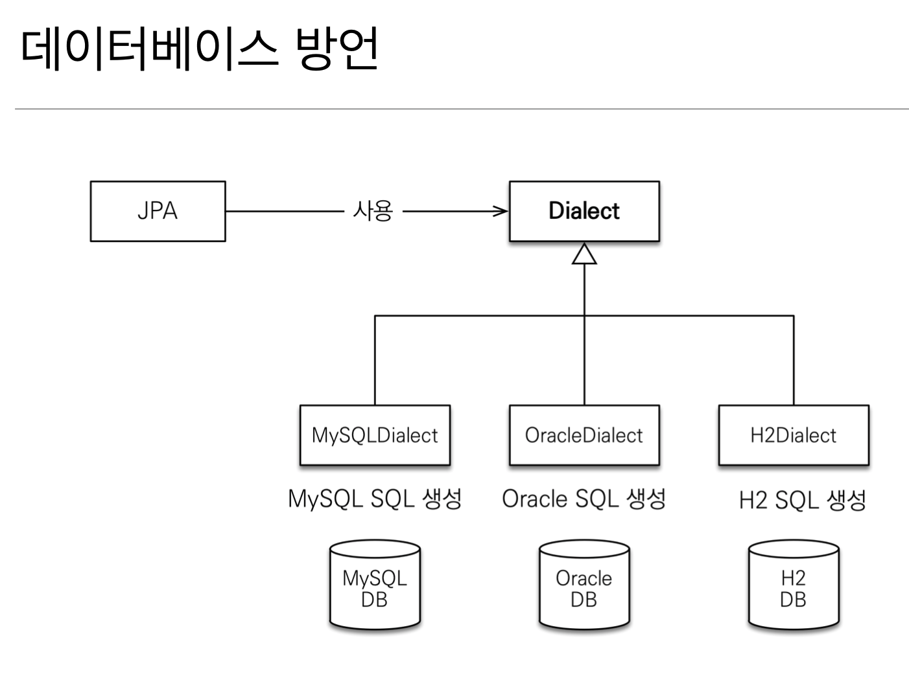

# Hello JPA - 프로젝트 생성

프로젝트 생성하기 전 알아야 할 항목

### H2 데이터베이스 설치와 실행

http://www.h2database.com/ 에서 다운받을 수 있으며

가볍고 웹용 쿼리툴을 제공하는 등 여러 유용한 기능을 제공하는 데이터베이스

### 메이븐 소개

https://maven.apache.org/ (메이븐 공식문서)

자바 라이브러리와 빌드를 관리해주는 툴로  
라이브러리 자동 다운로드 및 의존성 관리를 해준다.  
최근에는 그래들(Gradle)이 더 많이 사용되고 있다.

### 프로젝트 생성

프로젝트 권장 사항

* 자바 8 이상(8 권장)  
* 메이븐 설정
  * groupId: jpa-basic
  * artifactId: ex1-hello-jpa
  * version: 1.0.0


### 라이브러리 추가

`pom.xml` 파일에 다음과 같이 설정을 추가한다.

```xml
<?xml version="1.0" encoding="UTF-8"?>
<project xmlns="http://maven.apache.org/POM/4.0.0"
         xmlns:xsi="http://www.w3.org/2001/XMLSchema-instance"
         xsi:schemaLocation="http://maven.apache.org/POM/4.0.0 http://maven.apache.org/xsd/maven-4.0.0.xsd">
    <modelVersion>4.0.0</modelVersion>
    <groupId>jpa-basic</groupId>
    <artifactId>ex1-hello-jpa</artifactId>
    <version>1.0.0</version>
    <dependencies>
        <!-- JPA 하이버네이트 -->
        <dependency>
            <groupId>org.hibernate</groupId>
            <artifactId>hibernate-entitymanager</artifactId>
            <version>5.3.10.Final</version>
        </dependency>
        <!-- H2 데이터베이스 -->
        <dependency>
            <groupId>com.h2database</groupId>
            <artifactId>h2</artifactId>
            <version>1.4.199</version>
        </dependency>
    </dependencies>
</project>
```

위 설정에서 `JPA` 구현체로 `Hibernate` 를 그리고 `DB` 는 `H2` 데이터베이스를 사용하겠다고 선언하였다.


### JPA 설정하기

이번에는 `persistence.xml` 파일에서 `JPA` 설정을 추가해주자.

>`persistence.xml` 파일이란?

* JPA 설정 파일
* /META-INF/persistence.xml 위치
* persistence-unit name으로 이름 지정
* javax.persistence로 시작: JPA 표준 속성
* hibernate로 시작: 하이버네이트 전용 속성


### 데이터베이스 방언

데이터베이스 방언이란 'SQL 표준을 지키지 않는 특정 데이터베이스만의 고유한 기능' 을 의미하며

>각각의 데이터베이스 마다 제공하는 `SQL` 문법과 함수는 조금씩 다른데  
`JPA`는 특정 데이터베이스에 종속되지 않는다.


 