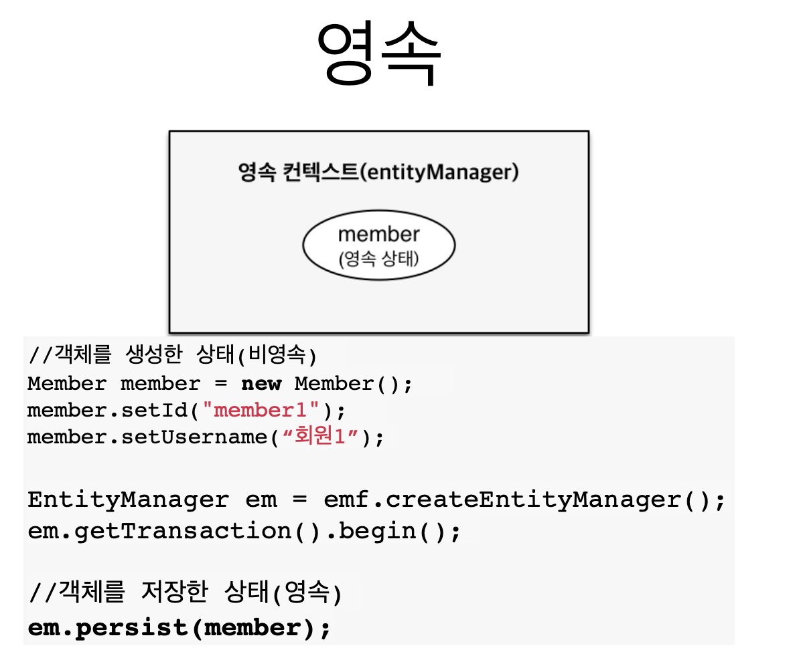
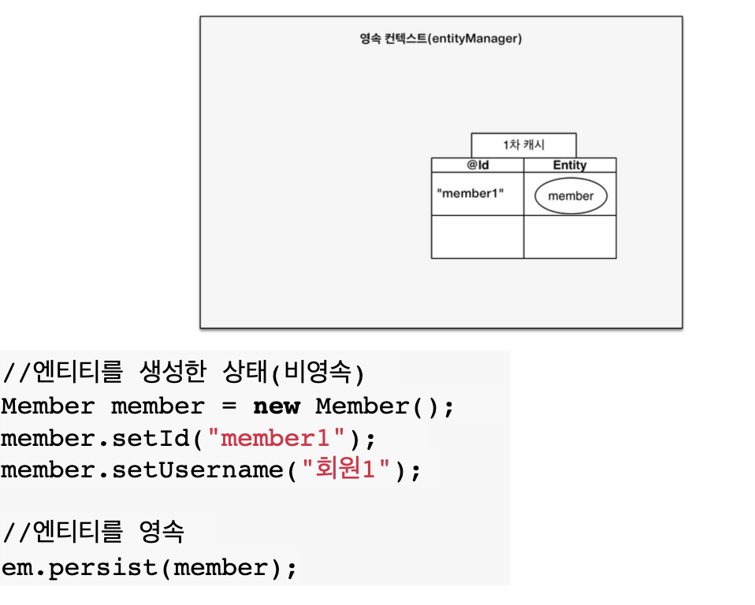
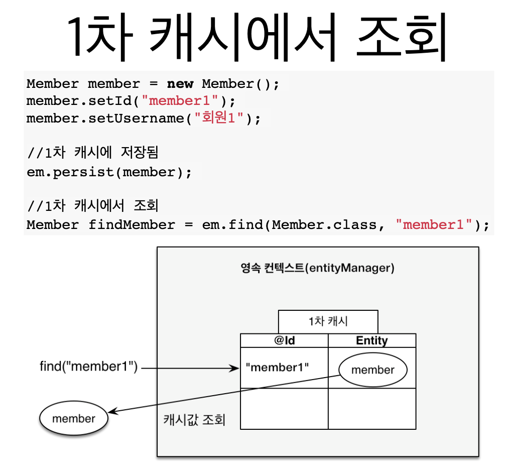
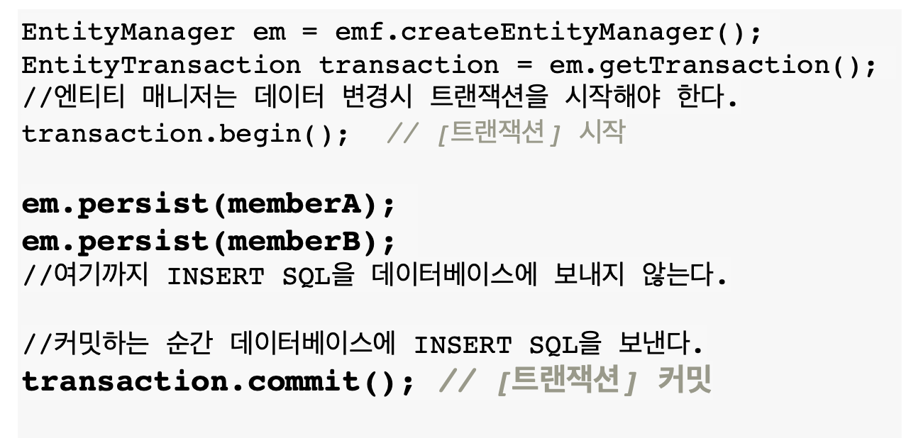

# 영속성 컨텍스트란?

* JPA를 이해하는데 가장 중요한 용어
* “엔티티를 영구 저장하는 환경”이라는 뜻
* `EntityManager.persist(entity);`

> 전 챕터에서 `EntityManager.persist(Member);` 를 통해 맴버를 저장했었는데 이는 데이터베이스에 저장한다는 의미가 아니고  
> 영속성 컨텍스트 라는 곳에 저장하겠다는 의미이다.

>엔티티 매니저의 역할은 눈에 보이지 않는 영속성 컨텍스트 라는 공간에 접근하여 여러 작업을 해주는 녀석이라고 생각하면 된다.


엔티티 매니저를 생성하면 눈에 보이지 않는 영속성 컨텍스트가 하나 생긴다.
즉, 엔티티 매니저 하나당 영속성 컨텍스트를 하나씩 가지고 있어 1:1 매칭이 된다.

# 엔티티의 생명주기


## 비영속


객체를 생성만 한 상태에는 `JPA` 와 관계없이 `영속성 컨텍스트`에서 관리해주지 않기 때문에 `비영속` 상태라고 한다.


## 영속



객체를 생성하고 `엔티티 매니저`를 통해 `persist`를 하게 되면 `영속성 컨텍스트`에 객체가 들어가면서 `영속` 상태가 된다.

```java
public class JpaMain {

  public static void main(String[] args) {
    EntityManagerFactory emf = Persistence.createEntityManagerFactory("hello");

    EntityManager em = emf.createEntityManager();

    EntitiyTransaction tx = em.getTransaction();
    tx.begin(); // 트렌젝션 시작

    try {
        //비영속
        Member member = new Member();
        member.setId(100L);
        member.setName("HelloJPA");
  
        //영속
        em.persist(member);
  
        tx.commit(); // 트렌젝션 커밋
    } catch (Exception e) {
        tx.rollback(); //예외가 발생하면 트렌젝션 롤벡
    }finally {
        entityManager.close();
    }
    

    enf.close();
  }
}
```

> 앞에서 `em.persist(member)` 를 하면 저장된다고 했었는데 사실, 이 순간 디비에 저장되는 것이 아니고  
>이 순간에는 영속성 컨텍스트에 저장만 해놓는다.   
> 디비에 저장하는 쿼리를 보내는 순간은 바로 `tx.commit()`  하는 시점 즉, 트렌젝션이 커밋을 하는 순간에 디비에 `SQL`을 보낸다.


## 준영속

```java
em.detach(member);
```

>위 코드 처럼 작성하면 영속성 컨텍스트에서 회원 엔티티를 분리 하겠다는 의미이며 이를 `준영속` 이라고 부른다.


## 삭제

```java
em.remove(member);
```

>위 코드는 회원 엔티티를 디비에서 삭제해달라고 요청해달라는 의미이다.


# 영속성 컨텍스트의 이점

영속성 컨텍스트를 채용함으로써 얻는 이점은 다음과 같은 것들이 있다.
* 1차 캐시
* 동일성(identity) 보장
* 트랜잭션을 지원하는 쓰기 지연
 (transactional write-behind)
* 변경 감지(Dirty Checking)
* 지연 로딩(Lazy Loading)


## 엔티티 조회, 1차 캐시



영속성 컨텍스트에 회원 엔티티를 추가하면 `@Id` 즉 `DB`의 `PK`로 설정한 값이 `key`로 저장이 되며
그리고 엔티티 객체가 `value`로 저장이 된다.

이런식으로 저장하면 어떤 이점이 있냐 하면



`em.find(member)` 로 회원 엔티티를 조회하게 되면
바로 데이터베이스에 쿼리를 날려서 조회하는 것이 아닌 `영속성 컨텍스트`의 1차 캐시에 저장이 되어있는지
여부부터 확인한다.

그후, 만약 1차 캐시에 회원 엔티티가 있으면 바로 1차 캐시에서 가져오기 때문에 
무조건적으로 디비에 접근해서 가져오는 로직보다 효율적이라는 장점이 있다.


만약 1차 캐시에 없는 값을 조회 했을때에는 
1. 우선 1차 캐시에 값이 있는지 여부를 확인하고
2. 1차 캐시에 없다면 데이터베이스에 쿼리를 날려서 원하는 값을 가져온다.
3. 그 이후 가져온 값을 1차 캐시에 저장한다.
4. 값을 반환한다.

>데이터베이스에서 가져온 값을 1차 캐시에 저장하는 이유는   
> 이후에 다시 조회를 할때 데이터베이스에서 가져오지않고 1차 캐시에서 가져오는 것이 효율적이기 떄문이다.

> 여기서 1차 캐시는 한개의 엔티티 매너지만 공유한다. 즉, 여러 요청이 있으면 같이 공유하는 캐시가 아니라
> 하나의 요청에서만 사용하는 캐시임에 유의하자.

## 영속 엔티티의 동일성 보장


`JPA` 가 같은 `PK`를 가진 엔티티를 조회 하면 1차 캐시에 있는 객체를 반환해주기 때문에
동일성이 보장된다.(단, 같은 트렌젝션 안에서 일어나는 일임을 명심하자.)

## 트랜잭션을 지원하는 쓰기 지연




영속성 컨텍스트 안에는 `1차 캐시`와는 별개로 `쓰기 지연 SQL 저장소`라는 공간이 존재하는데,

`em.persist(member)` 를 하게 되면 `1차 캐시`에 엔티티 객체를 저장하는 것과 별개로

`JPA`가 엔티티 객체를 분석해서 `쓰기 지연 SQL 저장소`에 디비에 요청해야하는 쿼리를 작성해서

저장해둔다.


그렇게 `SQL` 들을 차곡 차곡 쌓아두다가 트랜젝션을 커밋하는 순간 쌓아놨던 것들을 한번에 보낸다.

디비에 한번에 `SQL` 들을 보내주는 작업을 `flush` 라고 한다. 

> 한번에 보내주는것의 이점?
> `SQL` 을 모으지 않고 각각 보내면 통신을 여러번 해야하기 때문에 성능적으로 비효율적일 수 있으나,
> 한번에 모아서 보내기 때문에 통신을 여러번 할것을 한번으로 줄여서 성능상으로 이점을 가져갈 수 있다.  
> (참고) `persistence.xml` 파일의 `hibernate.jdbc.batch_size` 설정으로 모아서 보내줄 쿼리의 개수를 설정해줄 수 있다.

## 엔티티 수정


엔티티를 조회하고 값을 변경했을때 따로 저장한다는 코드를 작성하지 않아도   
`JPA`가 알아서 `update` 쿼리를 날려준다.

어떻게 이런일이 가능한 것일까?


비밀은 바로 `더티 체킹`이라고 하는 `변경 감지 기능`에 있다.

`영속성 컨텍스트`의 `1차 캐시` 안에는 `스냅샷`을 저장해두는 공간이 있는데
이는 맨 처음에 엔티티 객체를 `1차 캐시`에 저장할 때 그 상태를 저장해두는 공간을 뜻한다.
이 `스냅샷` 과 `1차 캐시`의 엔티티를 비교해서 변경된 부분이 있으면   
`JPA` 가 `update` 쿼리를 `쓰기 지연 SQL 저장소`에 저장해놨다가 커밋하기전에 쿼리를 날려주기 때문에
따로 저장하려는 코드를 작성하지 않아도 된다.

## 엔티티 삭제


엔티티를 삭제할때 역시 삭제 쿼리를 `쓰기 지연 SQL 저장소`에 저장해놨다가 커밋하기 전에 보내준다.


