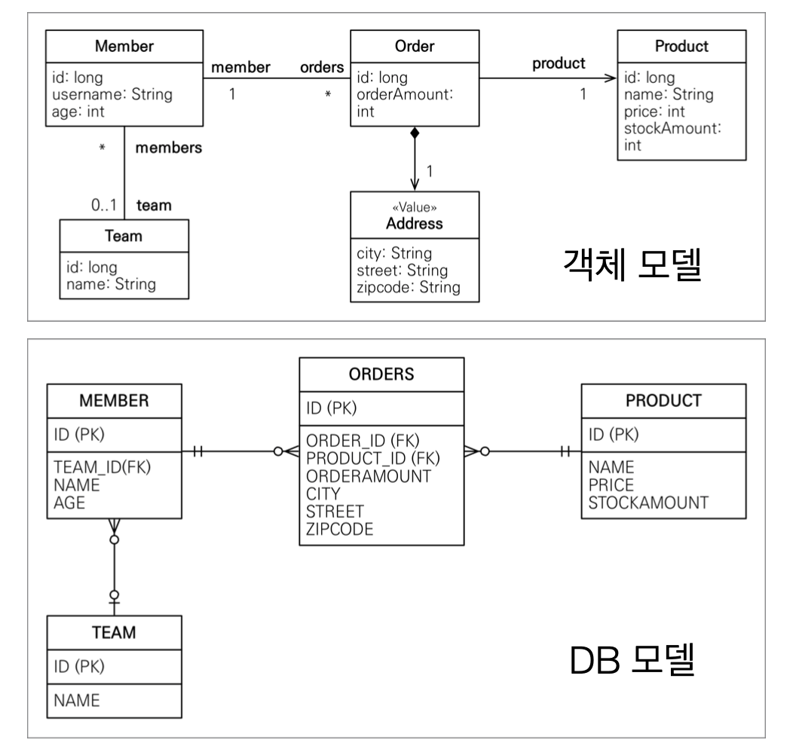
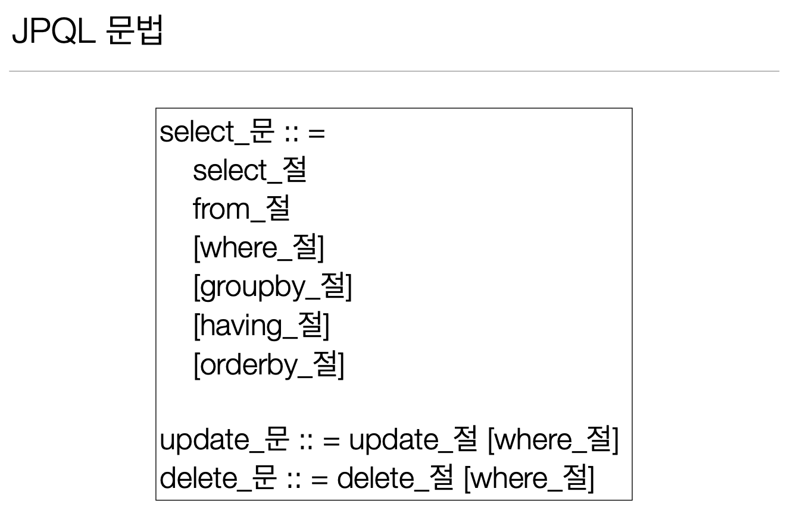
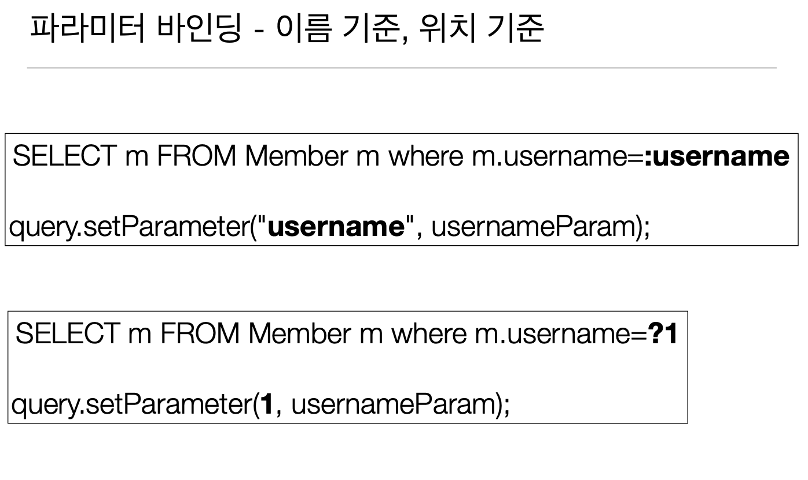

# 객체지향 쿼리 언어 소개

## JPA는 다양한 쿼리 방법을 지원

* JPQL
* JPA Criteria
* QueryDSL
* 네이티브 SQL 
* JDBC API 직접 사용, MyBatis, SpringJdbcTemplate 함께 사용

## JPQL 소개

* 가장 단순한 조회 방법
* EntityManager.find()
* 객체 그래프 탐색(a.getB().getC())
* 나이가 18살 이상인 회원을 모두 검색하고 싶다면?

## JPQL

* JPA를 사용하면 엔티티 객체를 중심으로 개발 
* 문제는 검색 쿼리 
* 검색을 할 때도 테이블이 아닌 엔티티 객체를 대상으로 검색 모든 DB 데이터를 객체로 변환해서 검색하는 것은 불가능 
* 애플리케이션이 필요한 데이터만 DB에서 불러오려면 결국 검색 조건이 포함된 SQL이 필요
* JPA는 SQL을 추상화한 JPQL이라는 객체 지향 쿼리 언어 제공
* SQL과 문법 유사, SELECT, FROM, WHERE, GROUP BY, HAVING, JOIN 지원 
* JPQL은 엔티티 객체를 대상으로 쿼리 SQL은 데이터베이스 테이블을 대상으로 쿼리


가령 맴버의 이름에 kim 이 들어가는 유저를 모두 조회하고 싶다면

```java
class SampleCode{
    //트렌젝션 안에서 작성된 코드
    
    List<Member> result = em.createQuery(
            "SELECT m from MEMBER m WHERE m.username LIKE %kim%",
            Member.class
    ).getResultList();
}

```

## JPQL

* 테이블이 아닌 객체를 대상으로 검색하는 객체 지향 쿼리
* SQL을 추상화해서 특정 데이터베이스 SQL에 의존X
* JPQL을 한마디로 정의하면 객체 지향 SQL

## JPQL과 실행된 SQL

```java
class SampleCode{
    //검색
    String jpql = "select m from Member m where m.age > 18";
    List<Member> result = em.createQuery(jpql, Member.class)
            .getResultList();
    실행된 SQL select
    m.id as id,
    m.age as age,
    m.USERNAME as USERNAME,
    m.TEAM_ID as TEAM_ID
            from
    Member m
    where
    m.age>18
}
```

>  그러나, `JPQL` 에 들어가는 쿼리문이 `string` 값으로 되어있고 동적 쿼리를 작성할때 상황에 따라 스트링값을 더하는 등 여러 작업을 해줘야하는데 띄어쓰기 콤마 등등 에러나기 딱좋은 구조이다. 


## `Criteria` 소개

```java
class SampleCode{

    //Criteria 사용 준비
    CriteriaBuilder cb = em.getCriteriaBuilder(); CriteriaQuery<Member> query = cb.createQuery(Member.class);
    
    //루트 클래스 (조회를 시작할 클래스)

    Root<Member> m = query.from(Member.class);
    //쿼리 생성 
    CriteriaQuery<Member> cq = query.select(m).where(cb.equal(m.get("username"), 'kim')); 
    List<Member> resultList = em.createQuery(cq).getResultList();
}
```

* 문자가 아닌 자바코드로 JPQL을 작성할 수 있음
* JPQL 빌더 역할
* JPA 공식 기능
* <b style = "color : red;">단점: 너무 복잡하고 실용성이 없다.</b> 
* Criteria 대신에 QueryDSL 사용 권장

## QueryDSL 소개

```java
class SampleCode{
    //JPQL
    //select m from Member m where m.age > 18
    JPAFactoryQuery query = new JPAQueryFactory(em);
    QMember m = QMember.member;

    List<Member> list = query.selectFrom(m)
            .where(m.age.gt(18)) .orderBy(m.name.desc())
            .fetch();
}
```

## QueryDSL 소개

```java
class SampleCode{
    //JPQL
    //select m from Member m where m.age > 18
    JPAFactoryQuery query = new JPAQueryFactory(em);
    QMember m = QMember.member;

    List<Member> list = query.selectFrom(m)
            .where(m.age.gt(18)) 
            .orderBy(m.name.desc())
            .fetch();
}
```

* 문자가 아닌 자바코드로 JPQL을 작성할 수 있음
* JPQL 빌더 역할
* 컴파일 시점에 문법 오류를 찾을 수 있음 동적쿼리 작성 편리함 
* 단순하고 쉬움
* 실무 사용 권장

## 네이티브 SQL 소개

* JPA가 제공하는 SQL을 직접 사용하는 기능
* 예) 오라클 CONNECT BY, 특정 DB만 사용하는 SQL 힌트 
* JPQL로 해결할 수 없는 특정 데이터베이스에 의존적인 기능

```java
class SampleCode{
    //트렌젝션 안
    String sql =
    “SELECT ID, AGE, TEAM_ID, NAME FROM MEMBER WHERE NAME = ‘kim’";
    List<Member> resultList =
            em.createNativeQuery(sql, Member.class).getResultList();
}
```

## JDBC 직접 사용, SpringJdbcTemplate 등

* JPA를 사용하면서 JDBC 커넥션을 직접 사용하거나, 스프링 JdbcTemplate, 마이바티스등을 함께 사용 가능 
* 단 영속성 컨텍스트를 적절한 시점에 강제로 플러시 필요 
* 예) JPA를 우회해서 SQL을 실행하기 직전에 영속성 컨텍스트 수동 플러시

```java
class SampleCode{
    // 트렌젝션 안
    Member member = new Member();
    member.setUsername("member1");
    em.persist(member);
    
    //결과 반환 안됨
    List<Member> resultList = dbconnection.executeQuery("select * from member");
    
    for(Member membe1r : resultResult){
        System.out.println("member1 = " + member1);
    }
}
```

> 위 코드에서 `dbconnection.executeQuery("select * from member");` 는 `JPA`와 관련된 코드가 아니기 때문에
> 자동으로 flush 를 해주지 않아 member 가 아직 영속성 컨텍스트에만 존재하고 디비에는 존재하지 않는다.
> 따라서 위에서는 결과가 출력되지 않는다.


```java
class SampleCode{
    // 트렌젝션 안
    Member member = new Member();
    member.setUsername("member1");
    em.persist(member);
    
    em.flush()
    
    //결과 반환 안됨
    List<Member> resultList = dbconnection.executeQuery("select * from member");
    
    for(Member membe1r : resultResult){
        System.out.println("member1 = " + member1);
    }
}
```

> 위 코드 처럼 쿼리를 실행하기 전에 flush 를 해주어야 원하는 결과값을 도출할 수 있다.
> (참고) : flush 가 자동으로 될때는 1.commit() 할때, 2. JPQL 이나 em에서 제공하는 네이티브 쿼리가  나갈때 이다.


## 정리

>JPQL은 동적쿼리를 짤때 오류가 많이 나므로 QueryDSL 을 사용하자!
>그리고 너무 복잡한 동적쿼리는 네이티브 쿼리를 사용하면 된다.


# JPQL(Java Persistence Query Language)

## JPQL - 기본 문법과 기능

### JPQL 소개

* JPQL은 객체지향 쿼리 언어다.따라서 테이블을 대상으로 쿼리 하는 것이 아니라 <strong>엔티티 객체를 대상으로 쿼리</strong>한다.
* JPQL은 SQL을 추상화해서 특정데이터베이스 SQL에 의존하지 않는다.
* JPQL은 결국 SQL로 변환된다.





### JPQL 문법

* select m from Member as m where m.age > 18 
* 엔티티와 속성은 대소문자 구분O (Member, age)
* JPQL 키워드는 대소문자 구분X (SELECT, FROM, where)
* 엔티티 이름 사용, 테이블 이름이 아님(Member) 
* 별칭은 필수(m) (as는 생략가능)


### 집합과 정렬

```sql
select
    COUNT(m), //회원수
    SUM(m.age), //나이 합
    AVG(m.age), //평균 나이 
    MAX(m.age), //최대 나이 
    MIN(m.age) //최소 나이
from Member m
```

* GROUP BY, HAVING 
* ORDER BY

>  JPQL은 SQL 의 위 문법들을 다 지원한다.

### TypeQuery, Query

* TypeQuery: 반환 타입이 명확할 때 사용
* Query: 반환 타입이 명확하지 않을 때 사용

```java
class SampleCode{
    TypedQuery<Member> query =
            em.createQuery("SELECT m FROM Member m", Member.class);
    Query query =
            em.createQuery("SELECT m.username, m.age from Member m");
}
```

### 결과 조회 API

* query.getResultList(): 결과가 하나 이상일 때, 리스트 반환 
  * 결과가 없으면 빈 리스트 반환
* query.getSingleResult(): 결과가 정확히 하나, 단일 객체 반환
  * 결과가 없으면: javax.persistence.NoResultException
  * 둘 이상이면: javax.persistence.NonUniqueResultException



* 순서 기반 코드

```java
class SampleCode{
    //트렌젝션 안
    Member result = em.createQuery("select m from Member m where m.username = :username",Member.class)
            .setParameter("username","member1")
            .getSingleResult();
}
```

* 위치 기반 코드

```java
class SampleCode{
    //트렌젝션 안
    Member result = em.createQuery("select m from Member m where m.username = ?1",Member.class)
            .setParameter(1,"member1")
            .getSingleResult();
}
```

> 위치 기반 기준은 순서가 밀리면 에러의 원인이 되므로 이름 기준을 사용하자!

## 프로젝션

* SELECT 절에 조회할 대상을 지정하는 것
* 프로젝션 대상: 엔티티, 임베디드 타입, 스칼라 타입(숫자, 문자등 기본 데이터 타입)
* SELECT m FROM Member m -> 엔티티 프로젝션 
* SELECT m.team FROM Member m -> 엔티티 프로젝션
* SELECT m.address FROM Member m -> 임베디드 타입 프로젝션
* SELECT m.username, m.age FROM Member m -> 스칼라 타입 프로젝션 
* DISTINCT로 중복 제거

```java
class SampleCode{
    //트렌젝션 안
    List<Team> result = em.createQuery("select t from Member m join m.team t", Team.class)
            .getResultList();
  
    //위 코드와 아래 코드는 똑같은 쿼리가 나가지만 위쪽 쿼리가 보다 SQL에 가까우므로 위와같이 작성하는게 좋
//  List<Team> result = em.createQuery("select m.team from Member m", Team.class)
//            .getResultList();

  Team findTeam = result.get(0);
}
```

## 프로젝션 - 여러 값 조회

* SELECT m.username, m.age FROM Member m
* 1. Query 타입으로 조회

  ```java
  class SampleCode{
      //트렌젝션 안
      List resultList = em.createQuery("select m.username, m.age from Member")
              .getResultList();
    
      Object o = resultList.get(0);
      Object[] result = (Object[]) o;
      System.out.printLn("username = " + result[0]);
      System.out.printLn("age = " + result[1]);
  }
  ```
  > 위 코드에서 Query 타입으로 조회를 하면 어떤 형인지 엔티티 클래스로 매핑을 할수 없으므로 Object 형으로 가지고 온다.
  > 그리고 여러개의 값을 가져올 수 있기 때문에 Object[] 로 사용을 해야하기 때문에 형변환을 해줘야한다. 


* 2. Object[] 타입으로 조회 

```java
  class SampleCode{
      //트렌젝션 안
      List<Object[]> resultList = em.createQuery("select m.username, m.age from Member m")
              .getResultList();
    
      Object[] result = resultList.get(0);
      System.out.printLn("username = " + result[0]);
      System.out.printLn("age = " + result[1]);
  }
  ```

> 1의 형변환이 하기 싫으면 처음부터 가져올때 제네릭에 Object[] 을 넣어줘서 타입쿼리로 받아올 수도 있다.


* 3. new 명령어로 조회

  * 단순 값을 DTO로 바로 조회 
    SELECT new jpabook.jpql.UserDTO(m.username, m.age) FROM
    Member m 
  * 패키지 명을 포함한 전체 클래스 명 입력 
  * 순서와 타입이 일치하는 생성자 필요

```java
public class MemberDTO{
    
    private String username;
    private int age;
    
    ...getter, setter ,constructor
}
```

```java
class sampleCode{
    //트렌젝션 안
    List<Object[]> resultList = em.createQuery("select new jpql.MemberDTO(m.username, m.age) from Member m",MemberDTO.class)
            .getResultList();
    
    MemberDTO memberDTO = result.get(0);
    System.out.println("memberDTO = " + memberDTO.getUsername());
    Sysyem.out.pringln("memberDTO = " + memberDTO.getAge());
}
```