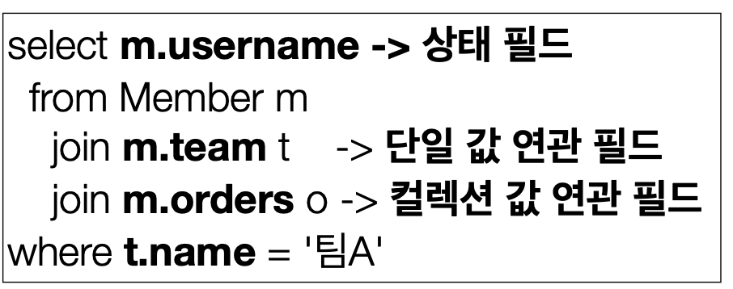
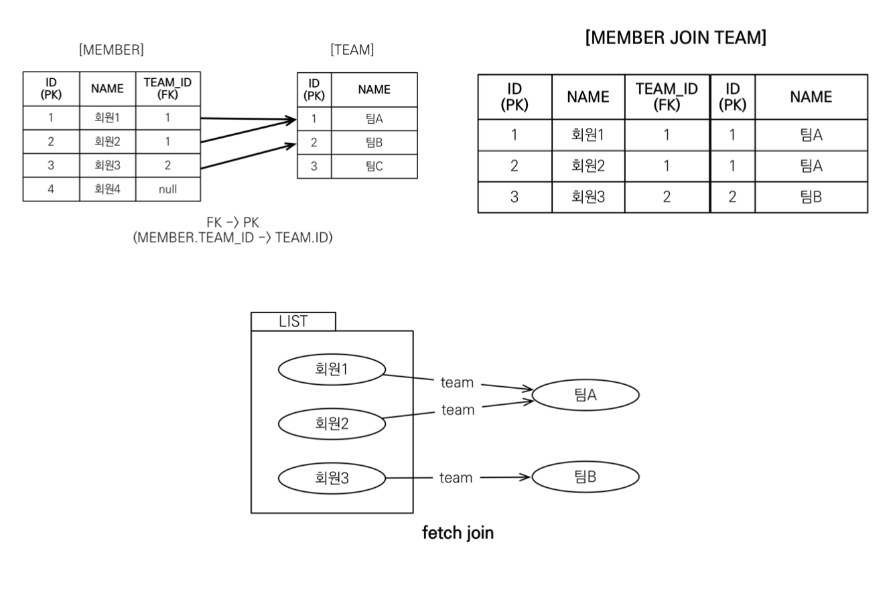
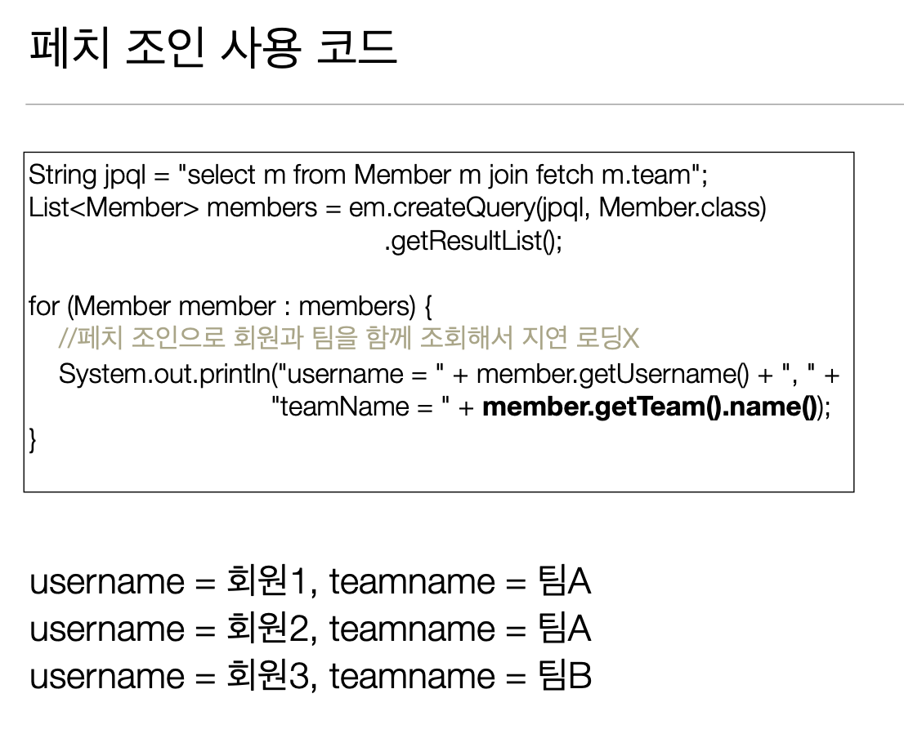
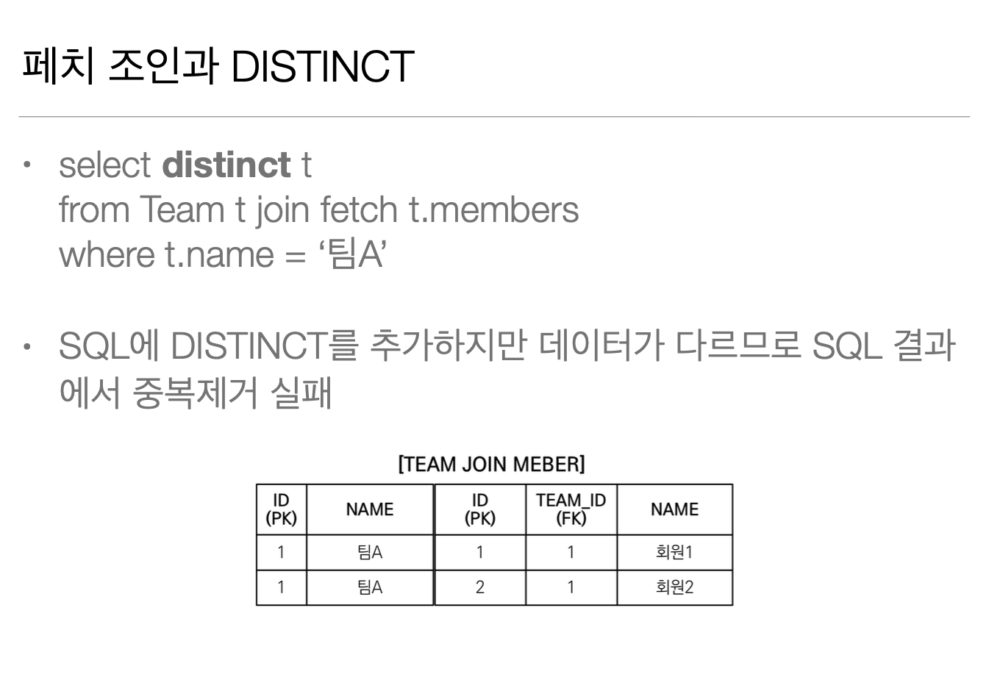
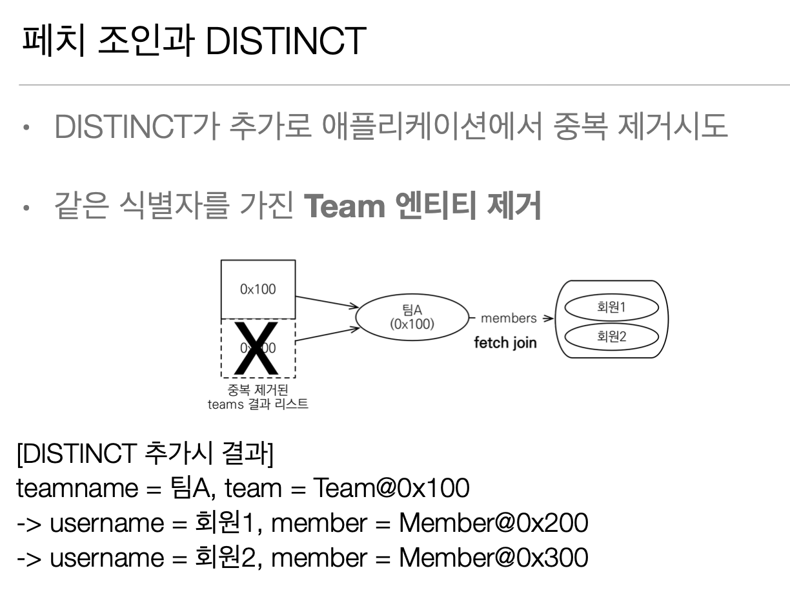
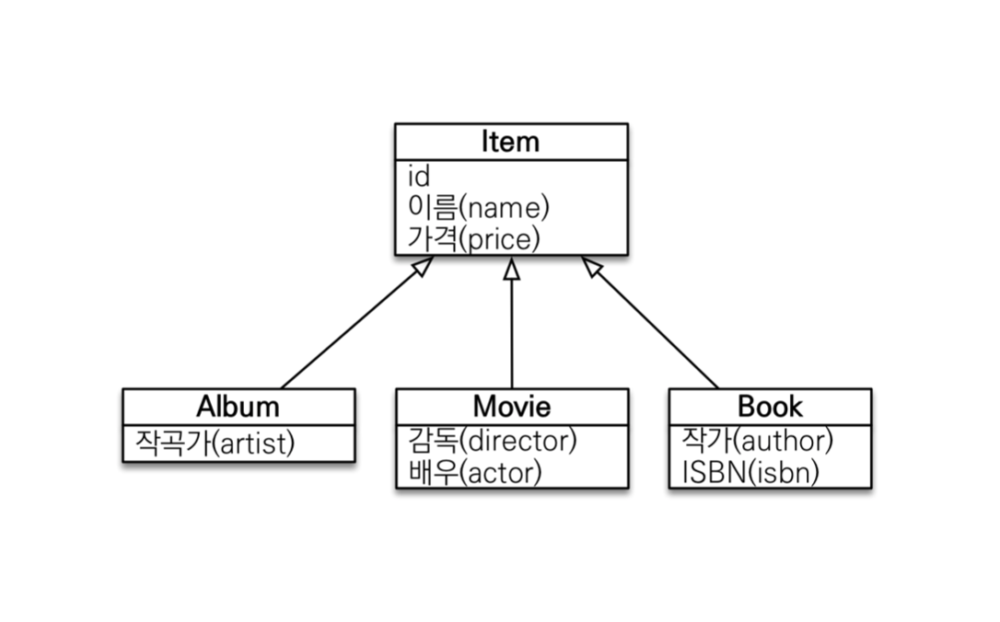

# JPQL - 경로 표현식

## 경로 표현식

* .(점)을 찍어 객체 그래프를 탐색하는 것



## 경로 표현식 용어 정리

* 상태 필드(state field): 단순히 값을 저장하기 위한 필드
  (ex: m.username)

* 연관 필드(association field): 연관관계를 위한 필드
  
  * 단일 값 연관 필드:
  @ManyToOne, @OneToOne, 대상이 엔티티(ex: m.team)
  
  * 컬렉션 값 연관 필드:
  @OneToMany, @ManyToMany, 대상이 컬렉션(ex: m.orders)

## 경로 표현식 특징

* 상태 필드(state field): 경로 탐색의 끝, 탐색X
    ex) m.username 은 뒤에 .을 찍어 더 탐색이 불가능하다. 

* 단일 값 연관 경로: 묵시적 내부 조인(inner join) 발생, 탐색O 


* 컬렉션 값 연관 경로: 묵시적 내부 조인 발생, 탐색X
FROM 절에서 명시적 조인을 통해 별칭을 얻으면 별칭을 통해 탐색 가능

> 실무에선 묵시적 JOIN을 사용하지말고  무조건 명시적 JOIN을 사용해야 한다!!


### 상태 필드 경로 탐색

* JPQL : select m.username, m.age from Member m 

* SQL: select m.username, m.age from Member m 

### 단일 값 연관 경로 탐색

* JPQL: select o.member from Order o

* SQL:
 select m.* 

      from Orders o 

      inner join Member m on o.member_id = m.id

### 명시직 조인, 묵시적 조인

* 명시적 조인: join 키워드 직접 사용
  select m from Member m join m.team t

* 묵시적 조인: 경로 표현식에 의해 묵시적으로 SQL 조인 발생
 (내부 조인만 가능, Left join을 하려면 명시적 조인을 해야함!)
 select m.team from Member m

## 경로 표현식 - 예제

* select o.member.team
 from Order o -> 성공
> 그러나 이 예제는 Join이 두번이나 일어남,,  order에서 member, member 에서  team

* select t.members from Team -> 성공

* select t.members.username from Team t -> 실패
> 컬렉션에서는 경로표현식으로 더 들어가지 못함(  .size 까지는 가능)

* select m.username from Team t join t.members m -> 성공
> 명시적 조인이라 가능

## 경로 탐색을 사용한 묵시적 조인 시 주의사항

* 항상 내부 조인

* 컬렉션은 경로 탐색의 끝, 명시적 조인을 통해 별칭을 얻어야함

* 경로 탐색은 주로 SELECT, WHERE 절에서 사용하지만 묵시적 조인으로 인해 SQL의 FROM (JOIN) 절에 영향을 줌

## 실무 조언

* 가급적 묵시적 조인 대신에 명시적 조인 사용

* 조인은 SQL 튜닝에 중요 포인트

* 묵시적 조인은 조인이 일어나는 상황을 한눈에 파악하기 어려움


# JPQL - 페치 조인(fetch join)

## 페치 조인(fetch join)

* SQL 조인 종류X 

* JPQL에서 성능 최적화를 위해 제공하는 기능 

* 연관된 엔티티나 컬렉션을 SQL 한 번에 함께 조회하는 기능 join fetch 명령어 사용

* 페치 조인 ::= [ LEFT [OUTER] | INNER ] JOIN FETCH 조인경로


## 엔티티 페치 조인

* 회원을 조회하면서 연관된 팀도 함께 조회(SQL 한 번에) 

* SQL을 보면 회원 뿐만 아니라 팀(T.*)도 함께 SELECT

* [JPQL]  
select m from Member m join fetch m.team

* [SQL]
SELECT M.*, T.* FROM MEMBER M
INNER JOIN TEAM T ON M.TEAM_ID=T.ID



예제코드

위 그림과 같이 맴버와 팀이 존재한다고 했을때 

```java
class SampleCode {
    // 트렌젝션 안
    String query = "select m From Member m";
    
    List<Member> result = em.createQuery(query, Collection.class)
            .getResultList();
    
    for(Member member : result){
        System.out.println("member = " + member.getUsername() + ", " + member.getTeam().getName());
        //회원1, 팀A (SQL을 사용해서 디비에서 가져옴)
        //회원2, 팀A (1차 캐시에서 가저욤)
        //회원3, 팀B (SQL을 사용해서 디비에서 가져옴)
    }
    
    tx.commit();
    
}
```

> 현재 맴버와 팀은 `@OneToMany(fetch = FetchType.LAZY)` 로 되어있다. (지연로딩)  
> 즉, 지연로딩이기 때문에 맴버를 불러올때 팀을 불러오지 않고 프록시 객체로 불러올것이다.
> 때문에, `member.getTeam().getName()` 에서 `Team` 을 직접 사용할때마다 쿼리가 날아갈것
> 위의 예제 코드에서는 쿼리가 1. 맨처음 맴버 List 가져올때 , 2. 팀A 조회시, 3. 팀B 조회시
> 총 3번의 쿼리가 나갔다.
> 만약 유저가 100명인데 팀이 다 다르다면 ? 1 + 100 개의 쿼리가 나갈것!

### 이런 현상을 N + 1 문제라고 한다!

이 문제를 해결하려면 `fetch Join` 을 사용해야한다.



> 엔티티에서 지연로딩으로 설정을 해도 `join fetch` 를 하면 연관된 엔티티를 연관 즉시 가지고온다.


# 컬렉션 페치 조인

* 일대다 관계, 컬렉션 페치 조인

* [JPQL]
select t
from Team t join fetch t.members
 where t.name = ‘팀A'

* [SQL]
SELECT T.*, M.*
FROM TEAM T
INNER JOIN MEMBER M ON T.ID=M.TEAM_ID
 WHERE T.NAME = '팀A'


위와 같은 상황이면 `Team` 은 하나지만 `Member`가 둘이기 때문에 데이터가 뻥튀기 되어
TeamA 값은 두개 찍힌다.

## 페치 조인과 DISTINCT

* SQL의 DISTINCT는 중복된 결과를 제거하는 명령 

* JPQL의 DISTINCT 2가지 기능 제공

1. SQL에 DISTINCT를 추가
2. 애플리케이션에서 엔티티 중복 제거



> `distinct` 로 중복을 제거하려면 데이터의 모든 값이 똑같아야하는데 위의 예시는 id가 달라서 SQL 에서는 중복을 제거 할 수가 없다.



> 일대다는 데이터가 뻥튀기 되지만 , 다대일은 데이터가 갯수가 맞거나 줄어든다(연관 엔티티가 없으면)
> 따라서, 일대다만 주의해서 join 하면 된다!!

## 페치 조인과 일반 조인의 차이

* 일반 조인 실행시 연관된 엔티티를 함께 조회하지 않음

* [JPQL]
select t
from Team t join t.members m
 where t.name = ‘팀A'

* [SQL]
SELECT T.*
FROM TEAM T
INNER JOIN MEMBER M ON T.ID=M.TEAM_ID 
 WHERE T.NAME = '팀A'

# 페치 조인과 일반 조인의 차이

* JPQL은 결과를 반환할 때 연관관계 고려X

* 단지 SELECT 절에 지정한 엔티티만 조회

* 여기서는 팀 엔티티만 조회하고, 회원 엔티티는 조회X

* 페치 조인을 사용할 때만 연관된 엔티티도 함께 조회(즉시 로딩)

* 페치 조인은 객체 그래프를 SQL 한번에 조회하는 개념


## 페치 조인 실행 예시

* 페치 조인은 연관된 엔티티를 함께 조회함

* [JPQL]
select t 

from Team t join fetch t.members
 where t.name = ‘팀A'

* [SQL]
SELECT T.*, M.*
FROM TEAM T
INNER JOIN MEMBER M ON T.ID=M.TEAM_ID 
 WHERE T.NAME = '팀A'

# 페치 조인의 특징과 한계

* 페치 조인 대상에는 별칭을 줄 수 없다. 

> 객체 그래프에서는 어떤것은 가져오고 어떤것은 안가져오는 방식은 위험하고 가져올꺼면 전부가져와야 하기때문에 (페치 조인은 한번에 전부 가져오는게 목표) 별칭을 줄 수 없다.(주면 위험함)
> 걸러서 가져오면 데이터가 삭제되거나 이상하게 작동할 수 있다.
> 
> Team 안에 Member 가 있고 특정 맴버만 가져오고싶으면 Team 안의 맴버중에서 걸러서 가져올게 아니라
    맴버만 따로 조회해야한다.
> 
> 페치 조인을 여러번 할때 정도만 엘리아스를 붙여서 페치조인을 한번더 하는거 정도는 괜찮 해

* 하이버네이트는 가능, 가급적 사용X

* 둘 이상의 컬렉션은 페치 조인 할 수 없다.

> 일대다 관계에서도 데이터가 뻥튀기 되었는데 둘 이상의 컬렉션을 페치 조인하게 되면 뻥튀기 되는게 서로 곱하기가 되어 예상치 못한 결과를 초래할 수 있어서 불가능하다.

* 컬렉션을 페치 조인하면 페이징 API(setFirstResult, setMaxResults)를 사용할 수 없다. 

* 일대일,다대일 같은 단일 값 연관 필드들은 페치 조인해도 페이징 가능 

> 이런 관계는 데이터가 뻥튀기가 안되기 때문에 가능하다.

* 하이버네이트는 경고 로그를 남기고 메모리에서 페이징(매우 위험)

> 페이징을 할거면 쿼리를 바꿔서 일대다 관계말고 다대일 관계로 조회해서 페이징하면 된다.


```java
    class SampleCode{
        // 잘못된 페이징 일대다(TEAM -> MEMBER) 로 페이징 하고있음.
        String query = "select t FROM TEAM t join fetch t.members m";
    
        List<Team> result = em.createQuery(query, Team.class)
                .setFirstResult(0)
                .setMaxResults(1)
                .getResultList();
    }
   ```
    
```java
    class SampleCode{
        // 해결책 1 : 올바른 페이징 다대일(MEMBER -> TEAM) 로 페이징 하고있음.
        String query = "select m FROM MEMBER m join fetch m.team t";
    
        List<Team> result = em.createQuery(query, MEMBER.class)
                .setFirstResult(0)
                .setMaxResults(1)
                .getResultList();
    }
   ```
    
    > 다대일은 페이징이 가능하므로 위처럼 하면 문제가 해결된다.
    
    
```java
    class SampleCode{
        // 해결책 2 : 페치 조인을 하지말고 TEAM 엔티티의 MEMBER 부분에 @BatchSize 를 넣어서 해결
        //엔티티에 에너테이션 말고 JPA 세팅에 batch 세팅을 추가해줘서 글로벌하게 세팅할수도 있다.
        String query = "select t FROM TEAM t";
    
        List<Team> result = em.createQuery(query, Team.class)
                .setFirstResult(0)
                .setMaxResults(2)
                .getResultList();
    }
    
    class TEAM {
    
        @BatchSize(size = 100)
        @OneToMany(mappedBy = "team")
        private List<Member> members = new ArrayList<>();
    }
   ```
    
    > batch 세팅을 통해 문제를 해결할 수 있다.
    
    
    > 해결책 3 : dto 로 직접 쿼리짜기


* 연관된 엔티티들을 SQL 한 번으로 조회 - 성능 최적화 
* 엔티티에 직접 적용하는 글로벌 로딩 전략보다 우선함
  * @OneToMany(fetch = FetchType.LAZY) //글로벌 로딩 전략
* 실무에서 글로벌 로딩 전략은 모두 지연 로딩
* 최적화가 필요한 곳은 페치 조인 적용


# 페치 조인 - 정리

* 모든 것을 페치 조인으로 해결할 수는 없음 
* 페치 조인은 객체 그래프를 유지할 때 사용하면 효과적 
  * 예) Member.team 을 통해 객체 탐색을 하는것을 유지
* 여러 테이블을 조인해서 엔티티가 가진 모양이 아닌 전혀 다른 결과를 내야 하면, 페치 조인 보다는 일반 조인을 사용하고 필요한 데이터들만 조회해서 DTO로 반환하는 것이 효과적
  1. 페치 조인을 사용해서 엔티티 조회해서 사용
  2. 페치 조인을 사용해서 가져오고 애플리케이션 단에서 DTO로 변경해서 사용
  3. 처음부터 new operation 으로 DTO로 스위칭해서 가져온다.


# JPQL - 다형성 쿼리



## TYPE

* 조회 대상을 특정 자식으로 한정

* 예) Item 중에 Book, Movie를 조회해라

* [JPQL]
select i from Item i
where type(i) IN (Book, Movie)

* [SQL]
select i from i
where i.DTYPE in (‘B’, ‘M’)

## TREAT(JPA 2.1)

* 자바의 타입 캐스팅과 유사

* 상속 구조에서 부모 타입을 특정 자식 타입으로 다룰 때 사용

* FROM, WHERE, SELECT(하이버네이트 지원) 사용

* 예) 부모인 Item과 자식 Book이 있다.

* [JPQL]
select i from Item i
where treat(i as Book).auther = ‘kim’

* [SQL]
select i.* from Item i
where i.DTYPE = ‘B’ and i.auther = ‘kim’

> 위의 예제에서는 싱글테이블 전략이라 SQL이 위와같이 나오는 것이고 만약 테이블 전략이 다르면 다른방식으로 
> SQL이 나갈것.