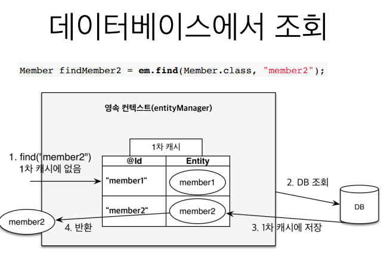

# 영속성 관리
* **

## 영속성 컨텍스트

+ 엔티티를 영구 저장하는 환경
+ 엔티티 매니저를 통해서 접근


### persist(entity) 메소드

```DB```에 저장하는 것이 아니라.entity를 ```영속성 컨텍스트```에 저장한다.


## 엔티티 생명주기

+ 비영속 : 영속성 컨텍스트와 전혀 관계가 없는 새로운 상태


```java
//객체를 생성한 상태(비영속)
Member member = new Member();
member.setId("member1");
member.setUsername("회원1");
```

+ 영속 : 영속성 컨텍스트에 관리되는 상태    


```java
//객체를 저장한 상태(영속)
em.persist(member);
```
+ 준영속 : 영속성 컨텍스트에 저장되었다가 분리된 상태

```java
//영속성 컨텍스트에서 분리(준영속)
em.detach(member);
```
+ 삭제 : 삭제된 상태
```java
//객체를 삭제한 상태(삭제)
em.remove(member);
```

## 영속성 컨텍스트의 이점


### 1차캐시
```
 key:DB의 pk로 매핑한 값(@Id) , value: 객체
```


em.find로 조회 하게 되면 JPA 는 ```DB```를 조회하는 것이 아닌 ```1차 캐시```를 먼저 조회한다.  
이때 1차 캐시에 같은 key 값이 존재하면 캐시에 있는 ```entity```를 그대로 반환 한다.

```java
Member member = new Member();
memeber.setId(101L);
member.setName("HelloJPA");

em.persist(member);

Member findMember1 = em.find(Member.class, 101L);
```
em.persist 를 통해 member 를 영속성 컨텍스트에 저장하고 find 매서드를 통해 조회를 하게 되면  
```Select``` 쿼리로 ```DB```에서 찾지 않고 ```1차 캐시```에 있는 ```member```를 그대로 반환하게 된다  


### 그렇다면 1차 캐시에 없는 entity는 어떻게 조회하지?


다음과 같이 영속성 컨텍스트에 찾는 ```entity```가 없다면 ```DB```를 조회한다  
그 다음에 조회해온 ```entity``` 를 ```1차 캐시```에 저장한다 그리고 찾아온 ```entity```를 반환한다.

### 영속 엔티티의 동일성 보장

```java
Member member = new Member();
memeber.setId(101L);
member.setName("HelloJPA");

em.persist(member);

Member findMember1 = em.find(Member.class, 101L);
Member findMember2 = em.find(Member.class, 101L);
```
위에서 설명한 ```1차캐시```가 있기 때문에 
```findMemeber1``` 과 ```findMember2```의 동일성을 보장해준다.


### 트랜잭션을 지원하는 쓰기 지연

```java
EntityManager em = emf.createEntityManager();
EntityTransaction transaction = em.getTransaction();

transaction.begin();

em.persist(memberA);
em.persist(memberB);

transaction.commit();
```

```em.persist(memberA)``` 를 해주었을때 ```memberA``` 가 1차캐시에 저장되고   
동시에 ```JPA```가 엔티티를 분석하여 ```INSERT 쿼리```를 생성한다.그리고 그 쿼리를 ```쓰기 지연 SQL 저장소```에 쌓아 둔다.
```em.persist(memberB)```를 해주었을때도 마찬가지다. 그럼 언제 데이터베이스에 쿼리가 날라가지?  
바로 ```transaction.commit()```을 하는 시점이다. 이렇게 쓰기 지연을 사용함으로써 ```최적화```가 가능하다.


### 변경 감지
```java
EntityManager em = emf.createEntityManager();
EntityTransaction transaction = em.getTransaction();
transaction.begin();

Member memberA = em.find(Member.class, "memberA");

memberA.setUsername("hi");
memberA.setAge(10);

transaction.commit();
```
엔티티를 ```수정```할때 값을 바꾸고 ```트랜잭션을 커밋하는 시점```에 ```변경감지(Dirty Checking)``` 기능을 통해 update 쿼리를 자동으로 생성해준다.

  
```flush()```를 한다-> ```엔티티```와 ```스냅샷(최초시점)```을 비교한다 -> ```UPDATE SQL```을 ```쓰기지연 SQL 저장소```에 넣는다.   
-> ```update 쿼리```를 DB에 반영한다 -> commit 한다.

* **

## 플러시
```영속성 컨텍스트의 변경 내용을 데이터베이스에 반영```

### 플러시 발생
트랜잭션이 커밋되면 ```flush```가 자동으로 발생한다. ```flush```가 발생하면 무슨 일들이 생길까?

+ #### 변경감지
+ #### 수정된 엔티티 쓰기 지연 SQL 저장소에 등록
+ #### 쓰기지연 SQL 저장소의 쿼리를 데이터베이스에 전송(등록,수정,삭제 쿼리)

#### ※ flush를 한다고 ```1차캐시 데이터```가 사라지진 않는다.

### 영속성 컨텍스트를 플러시 하는 방법

+ #### em.flush() - 직접 호출
+ #### 트랜잭션 커밋 - 플러시 자동 호출
+ #### JPQL 쿼리 실행 - 플러시 자동 호출

```java
Member member = new Member(200L, "member200");
em.persist(member);

em.flush();
```
원래라면 ```transaction.commit()```이 없기 때문에 INSERT 쿼리가 DB에 날라가지 않겠지만   
```em.flush()```를 통해 플러시를 ```직접 호출``` 함으로써 INSERT 쿼리가 DB에 날라가게 된다.


### 플러시 모드 옵션

```FlushModeType.AUTO``` : 커밋이나 쿼리를 실행할 때 플러시(기본값)   
```FlushModeType.COMMIT``` : 커밋할 때만 플러시


## 준영속 상태

```영속 상태의 엔티티가 영속성 컨텍스트에서 분리```

### 준영속 상태로 만드는 방법
+ em.detach(entity) : 특정 엔티티 준영속 상태로 전환
+ em.clear() : 영속성 컨텍스트를 통째로 지움 
+ em.close() : 영속성 컨텍스트 종료 