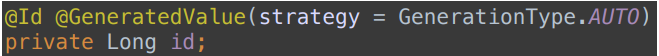
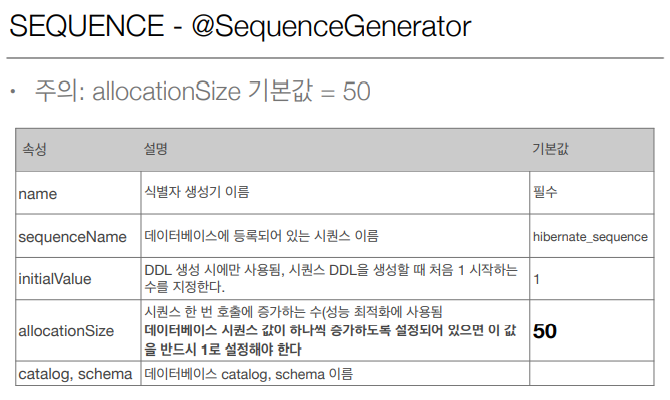
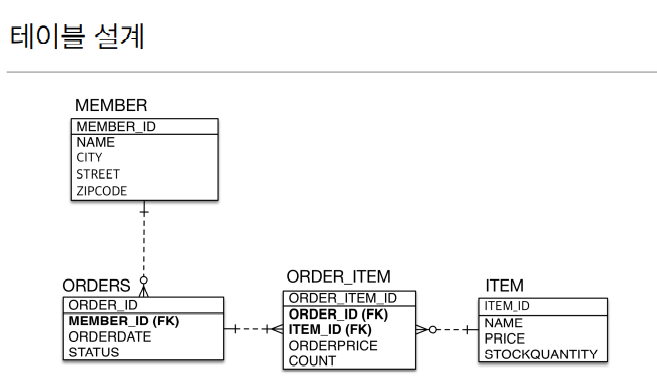

# 엔티티 매핑 

* **

## 객체와 테이블 매핑

### @Entity 

+ ```@Entity``` 가 붙은 클래스는 JPA가 관리하는 엔티티
+ JPA를 사용해서 테이블과 매핑할 클래스는 ```@Entity``` 필수

주의점:
+ 기본 생성자가 필수다 (파라미터가 없는 public 또는 protected 생성자)

#### 기본 생성자가 필요한 이유?
Spring Data JPA 에서 `Entity`에 기본 생성자가 필요한 이유는 동적으로 객체 생성 시 ```Reflection API```를 활용하기 때문이다.

JPA는 `DB` 값을 객체 필드에 주입할 때 ```기본 생성자```로 객체를 생성한 후 ```Reflection API```를 사용하여 값을 매핑한다.

때문에 기본 생성자가 없다면 ```Reflection```은 해당 객체를 생성 할 수 없기 때문에 JPA의 ```Entity```에는 기본 생성자가 필요하다.

#### Reflection API란?

```Reflection API```는 구체적인 클래스 타입을 알지 못해도 클래스 이름을 통해 ```static 영역```에서    
그 클래스의 정보(메서드, 타입, 변수 등등)에 접근할 수 있게 해준다.


+ `final` 클래스, `enum`, `interface`, `inner` 클래스에는 사용할 수 없음

+ DB에 저장할 필드에는 `final` 사용 x


### @Entity name 속성

+ JPA에서 사용할 엔티티 이름을 지정한다.

```java
@Entity(name  = "Member")
```
+ 기본값: 클래스 이름을 그대로 사용(예: Member)
+ 일반적으로 쓸 일이 별로 없지만 다른 패키지에 같은 이름의 클래스가 존재하면 사용한다.


## @Table  
엔티티와 매핑할 테이블 지정


+ `name` 속성: DB 테이블을 다른 이름으로 매핑하고 싶을때 사용(기본값: 엔티티 이름을 사용)

이 외에도 catalog,schema,uniqueConstraints(유니크 제약 조건 생성) 속성이 있다.

* **

## 데이터베이스 스키마 자동 생성 

+ `DDL`을 애플리케이션 실행 시점에 자동 생성
+ `테이블` 중심 -> `객체` 중심 (객체 매핑을 다 해놓으면 필요한 테이블을 자동으로 만들어 준다)
+ 데이터베이스`방언`을 활용해서 데이터베이스에 맞는 적절한 DDL 생성(`orcle`은 `varchar2`,`mysql`은 `varchar`)
+ 이렇게 생성된 `DDL`은 `개발 장비`에서만 사용
+ 생성된 `DDL`은 `운영서버`에서는 사용하지 않거나, 적절히 다듬은 후 사용


### 데이터베이스 스키마 자동 생성 - 속성
```java
<property name ="hibernate.hbm2ddl.auto" value="속성 값"/>
```


+ `create-drop`  테스트케이스같은걸 실행시킬때 마지막에 깔끔하게 날리고 싶을때
+ `update` 변경분만 반영 drop이 아닌 `alter table` 지우는건 안되고 추가하는 것만 된다


### 데이터베이스 스키마 자동 생성 - 주의
+ 운영 장비에는 절대 `create`, `create-drop`, `update` 사용하면 안된다.  
`create` 를 쓰면 서버를 배포하거나 실행할때마다 데이터가 다 날라가기 때문에
+ 개발 초기 단계는 `create` 또는 `update`
+ 테스트 서버는 `update` 또는 `validate`
+ 스테이징과 운영 서버는 `validate` 또는 `none`

### DDL 생성기능
테이블을 JPA에서 자동으로 생성해 주니까 테이블의 여러가지 제약 조건을 어노테이션 속성을 이용해서 추가할 수 있다.
```java
///제약조건 추가: 회원 이름은 필수, 10자 초과X
@Column(nullable = false, length = 10)
```
```java
//유니크 제약 조건 추가
@Table(uniqueConstraints = {@UniqueConstraint( name = "NAME_AGE_UNIQUE", columnNames = {"NAME", "AGE"} )})
```
#### DDL 생성 기능은 DDL을 자동 생성할 때만 사용되고 JPA의 실행 로직에는 영향을 주지 않는다.

* **

## 필드와 컬럼 매핑 
``` java
@Entity
public class Member {
    @Id                
    private Long id;   

    @Column(name = "name")    
    private String username;  

    private Integer age;

    @Enumerated(EnumType.STRING)  
    private RoleType roleType;    

    @Temporal(TemporalType.TIMESTAMP) // @Temporal 에는 DATE, TIME, TIMESTAMP 3개가 있다 날짜, 시간, 날짜시간
    private Date createdDate;         

    @Temporal(TemporalType.TIMESTAMP)
    private Date lastModifiedDate;

    @Lob                            //데이터베이스에 VARCHAR 를 넘어서는 큰 컨텐츠를 넣고싶으면
    private String description;     // @Lob을 쓰면 된다
    
}

```

+ `@Column`의 name 속성을 이용해 객체는 `username`이지만 DB에는 `name`으로 저장할 수 있다.
+ 자바에는 enum 타입이 있지만 DB에는 enum타입이 없기 때문에 @Enumrated 어노테이션을 사용하여 매핑한다.
+ `@Temporal`을 이용해 날짜 타입을 매핑하는데,자바의 `Date` 타입에는 날짜와 시간이 담겨있고 `DB`는 보통 `DATE`,`TIME`,`TIMESTAMP`를 구분해서 사용하기 때문에
TemporalType.`TIMESTAMP`처럼 매핑 정보를 넘겨줘야 한다.
+ `@Lob`을 사용해 데이터베이스에 varchar를 넘어서는 큰 컨텐츠를 넣을 수 있다.


### @Column


####
+ `insertable`,`updatable`은 컬럼을 등록하거나 수정했을때 데이터베이스에 반영할 것인지 물어보는 것이다.
+ 이름을 식별하기가 어렵기 때문에 `unique` 속성은 잘 사용하지 않는다따라서 `@Column`이 아닌 `@Table`에서 유니크 제약조건을 사용한다.

### @Enumerated
자바 enum 타입을 매핑할 때 사용


기본값인 ORDINAL로 설정하게 되면 0,1,2,3 같은 숫자로 값을 저장하는데 
요구사항이 늘어나 enum 클래스에 값을 추가하게 되면 순서가 바뀌지만 DB의 이전 데이터에는
반영할 수 없기 때문에 큰 장애를 일으킬 수 있다.또한 그렇기 때문에 꼭 
STRING으로 설정해서 사용해야 한다.


### @Temporal
날짜 타입을 매핑할 때 사용 

자바 8시대가 오면서 `LocalData`, `LocalDateTime`이 들어왔는데 
하이버네이트를 사용하면 `@Temporal`을 생략하고 사용이 가능하다.

```java
@Temporal(TemporalType.Date)   //날짜 데이터베이스 date 타입과 매핑  2013-10-11
@Temporal(TemporalType.TIME)   //시간 데이터베이스 time 타입과 매핑  11:11:11
@Temporal(TemporalType.TIMESTAMP)  //날짜와 시간, 데이터베이스 timestmamp 타입과 매핑 2013-10-11 11:11:11

private LocalDate testLocalDate; // date 타입과 매핑 
private LocalDateTime testLocalDateTime; // timestamp 타입과 매핑
```
최신버전을 사용할때는 밑에있는 코드를 사용하자.

### Lob
데이터베이스에 VARCHAR 를 넘어서는 큰 컨텐츠를 넣고싶으면 사용  
데이터베이스 BLOB, CLOB 타입과 매핑 

+ `@Lob`에는 지정할 수 있는 속성이 없다
+ 문자면 `CLOB` 매핑 (String,char[])
+ 나머지는 `BLOB` 매핑 (byte)


### Transient
```java
@Transient
private Integer temp;
```

+ 필드 매핑x
+ 데이터베이스에 저장x ,조회x
+ 주로 메모리상에서만 임시로 어떤 값을 보관하고 싶을때 사용 

## 기본 키 매핑 



+ `@Id` : 직접 할당

+ `@GeneratedValue` : 자동 생성

### 자동 생성 종류 
+ #### IDENTITY 전략 
```java
@GeneratedValue(strategy = GenerationType.IDENTITY)
private Long id;
```
+ 기본 키 생성을 데이터베이스에 위임
+ 주로 MySQL H2 에서 사용
+ `MySQL`의 `AUTO_INCREMENT` 속성처럼 1,2,3 순차적으로 DB가 ID값을 할당해 준다.


`null`인 `Id` 값이 `insert`쿼리를 통해 DB에 전달되면 그때 `DB`가 값을 세팅 하게 된다.
그렇기 때문에 Id 값을 알 수 있는 시점이 DB에 값이 들어가봐야 알 수 있다.

앞서 배운 JPA 영속성 컨텍스트에서 관리되려면 `PK값`이 있어야 하는데 모르니까
하는수 없이 `em.persist()`를 호출 하는 시점에 `DB`에 `insert` 쿼리를 날려 버리고 DB에 값이 들어가면
`JPA`가 Id 값을 `select` 쿼리로 가져와서 영속성 컨텍스트에 넣는 작업을 한다.

그래서 `쓰기지연 기능`을 사용할 수 없다!


* **
+ #### SEQUENCE 전략 
```java
@SequenceGenerator(
        name = "MEMBER_SEQ_GENERATOR", 
        sequenceName = "MEMBER_SEQ",  //매핑할 데이터베이스 시퀀스 이름
        initialValue = 1, allocationSize = 1))

public 
@GeneratedValue(strategy = GenerationType.SEQUENCE,
        generator = "MEMBER_SEQ_GENERATOR")
private Long id;

```

+ Oracle 데이터베이스에서 많이 사용
+ 데이터베이스에 있는 sequence 오브젝트를 통해서 기본 키를 할당
+ 테이블마다 시퀀스를 관리하고 싶으면 `@SequenceGenerator` 추가 (따로 설정해 주지 않으면 기본 값인 `hibernate_sequence` 사용)


IDETITY 전략과 비슷하게 `em.persist()`를 호출할 때 영속성컨텍스트에 넣으려면 `pk값`이 있어야 하므로
호출 시점에 `DB`에 `MEMBER_SEQ`의 다음 값을 요청하여 가져와서 영속성 컨텍스트에 값을 넣어준다.
insert 쿼리를 트랜잭션 커밋 시점에 날라가므로 `쓰기지연`기능은 사용 가능하다.

#### 그럼 네트워크를 많이 타게 되므로 성능 문제가 발생하지 않나?
`allocationSize()`를 사용하여 해결 가능하다.예를들어 `allocationSize=50`을 하게 되면
미리 50개 사이즈를 `DB`에 올려놓고, `메모리`에서 1씩 사용하고 50을 다 사용하면
next call을 호출해서 또 50개를 올려놓고, 메모리에서 1씩 사용하는 것을 반복한다.


* **
+ #### TABLE 전략
키 생성 전용 테이블을 하나 만들어서 데이터베이스 시퀀스를 흉내내는 전략
````java

@Entity
@TableGenerator(
        name= "MEMBER_SEQ_GENERATOR",
        table = "MY_SEQUENCES", //매핑할 테이블 이름
        pkColumnValue = "MEMBER_SEQ", allocationSize=1)
public class Member {
    @Id
    @GeneratedValue(strategy = GenerationType.TABLE,
            generator = "MEMBER_SEQ_GENERATOR"
    )
    private Long id;
}

// 위 코드를 실행하게 되면 아래 테이블이 생성
create table MY_SEQUENCES(
        sequence_name varchar(255) not null,
        next_val bigint,
        primary key( sequence_name )
        )

````


데이터를 넣을수록 `NEXT_VAL` 값이 순차적으로 증가 

  

`NEXT_VAL값`을 가져와서 ID가 생성된 것을 볼 수 있다.

장점: 모든 `DB`에 적용이 가능하다.  
단점: `TABLE`을 직접사용하다보니까 성능이슈가 있다.

`SEQUENCE` 전략과 마찬가지로 `initialValue` 와 `allocationSize`를 설정할 수 있다.


### 권장하는 식별자 전략

+ 기본 키 제약 조건: null 아님,유일 하다,변하면 안된다.

+ 변하면 안된다는 조건은 먼 미래까지 만족하는 `자연키`(주민등록번호,전화번호)를 찾기가 쉽지않다.  
그래서 `대체키`(GeneratedValue,랜덤값같은 비즈니스와 전혀 상관 없는 키)를 사용하자!

+ 나라에서 주민번호 보관하지 말라고 하는 경우가 있으므로 `pk`를 주민번호로 쓰지말자.

권장: `Long형(10억넘어도 동작해야되니까) + 대체키 + 키 생성전략 사용`


## 실전 예제1



여기서는 테이블 대로 엔티티를 설계함.

실전예제에서는 위에서 배운 개념이 아닌 추가적인 개념을 사용한 것을 적어보려고 함.

```java
@Entity
@Table(name = "ORDERS")
public class Order{
    ...
}
```
`Order` 엔티티는 테이블명을 `ORDERS`로 매핑 했는데 그 이유는 `DB`에는 `ORDER`가 `예약어`로 설정 되있기 때문에
오류가 발생하는 `DB`들이 있기때문이다.

```java
@Id @GeneratedValue
@Column(name = "MEMBER_ID , member_id")
private Long id;
        ...
```
`Column명`은 회사의 규정에 맞게 `소문자` 혹은 `대문자` 등으로 사용하도록 한다


```java
@Id @GeneratedValue
@Column(length = 10)
private String name;
        ...
```
필드마다 `length` 제약을 걸어둠으로서 개발자가 한눈에 문자열 제한 길이를 알아볼 수 있게 된다.

관계형 `DB`에 맞춘 설계의 문제점

```java

@Entity
@Table(name = "ORDERS")
public class Oreder {
    ...
    
    @Column(name = "MEMBER_ID")
    private Long memberId;
    ...
}
```
위의 코드처럼 엔티티를 설계하게 되면 
```java
Order order = em.find(Order.class , 1L);
Long memberId = order.getMemberId();
Member member = em.find(Member.class, memberId);
```
`order`를 조회해서 `memberId`를 가져오고 그 가져온 `memberId` 를 통해 `member`를 조회해야 한다.(객체지향적이지 않음)
객체지향 적이려면 `order.getMember();` 객체 그래프 탐색으로 가져와야 한다.

이러한 문제점을 해결하기 위해 `연관관계 매핑`을 사용한다.


