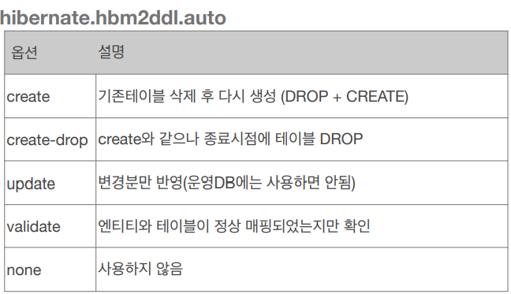

# 엔티티 매핑

* **

## 객체와 테이블 매핑

### @Entity 

+ ```@Entity``` 가 붙은 클래스는 JPA가 관리하는 엔티티
+ JPA를 사용해서 테이블과 매핑할 클래스는 ```@Entity``` 필수

주의점:
+ 기본 생성자가 필수다 (파라미터가 없는 public 또는 protected 생성자)

#### 기본 생성자가 필요한 이유?
Spring Data JPA 에서 Entity에 기본 생성자가 필요한 이유는 동적으로 객체 생성 시 ```Reflection API```를 활용하기 때문이다.

JPA는 ```DB``` 값을 객체 필드에 주입할 때 ```기본 생성자```로 객체를 생성한 후 ```Reflection API```를 사용하여 값을 매핑한다.

때문에 기본 생성자가 없다면 ```Reflection```은 해당 객체를 생성 할 수 없기 때문에 JPA의 ```Entity```에는 기본 생성자가 필요하다.

#### Reflection API란?

```Reflection API```는 구체적인 클래스 타입을 알지 못해도 클래스 이름을 통해 ```static 영역```에서    
그 클래스의 정보(메서드, 타입, 변수 등등)에 접근할 수 있게 해준다.

+ final 클래스, enum, interface, inner 클래스에는 사용할 수 없음

+ DB에 저장할 필드에는 final 사용 x


### @Entity name 속성

+ JPA에서 사용할 엔티티 이름을 지정한다.

```java
@Entity(name  = Member)
```
+ 기본값: 클래스 이름을 그대로 사용(예: Member)
+ 일반적으로 쓸 일이 별로 없지만 다른 패키지에 같은 이름의 클래스가 존재하면 사용한다.


## @Table  
엔티티와 매핑할 테이블 지정


+ name 속성: DB 테이블을 다른 이름으로 매핑하고 싶을때 사용(기본값: 엔티티 이름을 사용)

이 외에도 catalog,schema,uniqueConstraints(유니크 제약 조건 생성) 속성이 있다.

* **

## 데이터베이스 스키마 자동 생성 

+ ```DDL```을 애플리케이션 실행 시점에 자동 생성
+ ```테이블``` 중심 -> ```객체``` 중심 (객체 매핑을 다 해놓으면 필요한 테이블을 자동으로 만들어 준다)
+ 데이터베이스```방언```을 활용해서 데이터베이스에 맞는 적절한 DDL 생성(```orcle```은 ```varchar2```,```mysql```은 ```varchar```)
+ 이렇게 생성된 ```DDL```은 ```개발 장비```에서만 사용
+ 생성된 ```DDL```은 ```운영서버```에서는 사용하지 않거나, 적절히 다듬은 후 사용


### 데이터베이스 스키마 자동 생성 - 속성
```java
<property name ="hibernate.hbm2ddl.auto" value="속성 값"/>
```


+ ```create-drop```  테스트케이스같은걸 실행시킬때 마지막에 깔끔하게 날리고 싶을때
+ ```update``` 변경분만 반영 drop이 아닌 ```alter table``` 지우는건 안되고 추가하는 것만 된다


### 데이터베이스 스키마 자동 생성 - 주의
+ 운영 장비에는 절대 `create`, `create-drop`, `update` 사용하면 안된다.  
`create` 를 쓰면 서버를 배포하거나 실행할때마다 데이터가 다 날라가기 때문에
+ 개발 초기 단계는 `create` 또는 `update`
+ 테스트 서버는 `update` 또는 `validate`
+ 스테이징과 운영 서버는 `validate` 또는 `none`

### DDL 생성기능
테이블을 JPA에서 자동으로 생성해 주니까 테이블의 여러가지 제약 조건을 어노테이션 속성을 이용해서 추가할 수 있다.
```java
///제약조건 추가: 회원 이름은 필수, 10자 초과X
@Column(nullable = false, length = 10)
```
```java
//유니크 제약 조건 추가
@Table(uniqueConstraints = {@UniqueConstraint( name = "NAME_AGE_UNIQUE", columnNames = {"NAME", "AGE"} )})
```
#### DDL 생성 기능은 DDL을 자동 생성할 때만 사용되고 JPA의 실행 로직에는 영향을 주지 않는다.

* **

## 필드와 컬럼 매핑 
``` java
@Entity
public class Member {
    @Id                
    private Long id;   

    @Column(name = "name")    
    private String username;  

    private Integer age;

    @Enumerated(EnumType.STRING)  
    private RoleType roleType;    

    @Temporal(TemporalType.TIMESTAMP) // @Temporal 에는 DATE, TIME, TIMESTAMP 3개가 있다 날짜, 시간, 날짜시간
    private Date createdDate;         

    @Temporal(TemporalType.TIMESTAMP)
    private Date lastModifiedDate;

    @Lob                            //데이터베이스에 VARCHAR 를 넘어서는 큰 컨텐츠를 넣고싶으면
    private String description;     // @Lob을 쓰면 된다
    
}

```

+ `@Column`의 name 속성을 이용해 객체는 `username`이지만 DB에는 `name`으로 저장할 수 있다.
+ 자바에는 enum 타입이 있지만 DB에는 enum타입이 없기 때문에 @Enumrated 어노테이션을 사용하여 매핑한다.
+ `@Temporal`을 이용해 날짜 타입을 매핑하는데,자바의 `Date` 타입에는 날짜와 시간이 담겨있고 `DB`는 보통 `DATE`,`TIME`,`TIMESTAMP`를 구분해서 사용하기 때문에
TemporalType.`TIMESTAMP`처럼 매핑 정보를 넘겨줘야 한다.
+ `@Lob`을 사용해 데이터베이스에 varchar를 넘어서는 큰 컨텐츠를 넣을 수 있다.


### @Column


####
+ `insertable`,`updatable`은 컬럼을 등록하거나 수정했을때 데이터베이스에 반영할 것인지 물어보는 것이다.
+ 이름을 식별하기가 어렵기 때문에 `unique` 속성은 잘 사용하지 않는다따라서 `@Column`이 아닌 `@Table`에서 유니크 제약조건을 사용한다.

### @Enumerated
자바 enum 타입을 매핑할 때 사용


기본값인 ORDINAL로 설정하게 되면 0,1,2,3 같은 숫자로 값을 저장하는데 
요구사항이 늘어나 enum 클래스에 값을 추가하게 되면 순서가 바뀌지만 DB의 이전 데이터에는
반영할 수 없기 때문에 큰 장애를 일으킬 수 있다.또한 그렇기 때문에 꼭 
STRING으로 설정해서 사용해야 한다.


### @Temporal
날짜 타입을 매핑할 때 사용 

자바 8시대가 오면서 `LocalData`, `LocalDateTime`이 들어왔는데 
하이버네이트를 사용하면 `@Temporal`을 생략하고 사용이 가능하다.

```java
@Temporal(TemporalType.Date)   //날짜 데이터베이스 date 타입과 매핑  2013-10-11
@Temporal(TemporalType.TIME)   //시간 데이터베이스 time 타입과 매핑  11:11:11
@Temporal(TemporalType.TIMESTAMP)  //날짜와 시간, 데이터베이스 timestmamp 타입과 매핑 2013-10-11 11:11:11

private LocalDate testLocalDate; // date 타입과 매핑 
private LocalDateTime testLocalDateTime; // timestamp 타입과 매핑
```
최신버전을 사용할때는 밑에있는 코드를 사용하자.

### Lob
데이터베이스 BLOB, CLOB 타입과 매핑 

+ @Lob에는 지정할 수 있는 속성이 없다
+ 문자면 CLOB 매핑 (String,char[])
+ 나머지는 BLOB 매핑 (byte)


### Transient
```java
@Transient
private Integer temp;
```

+ 필드 매핑x
+ 데이터베이스에 저장x ,조회x
+ 주로 메모리상에서만 임시로 어떤 값을 보관하고 싶을때 사용 