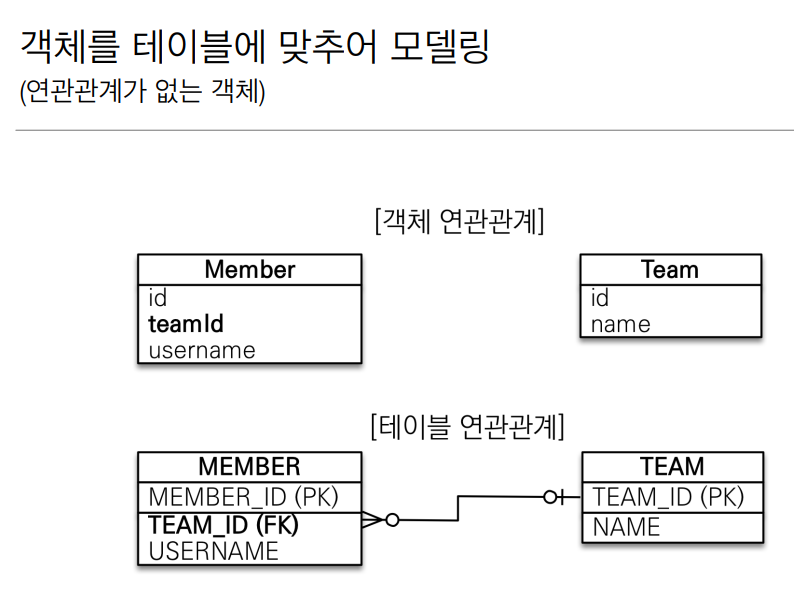
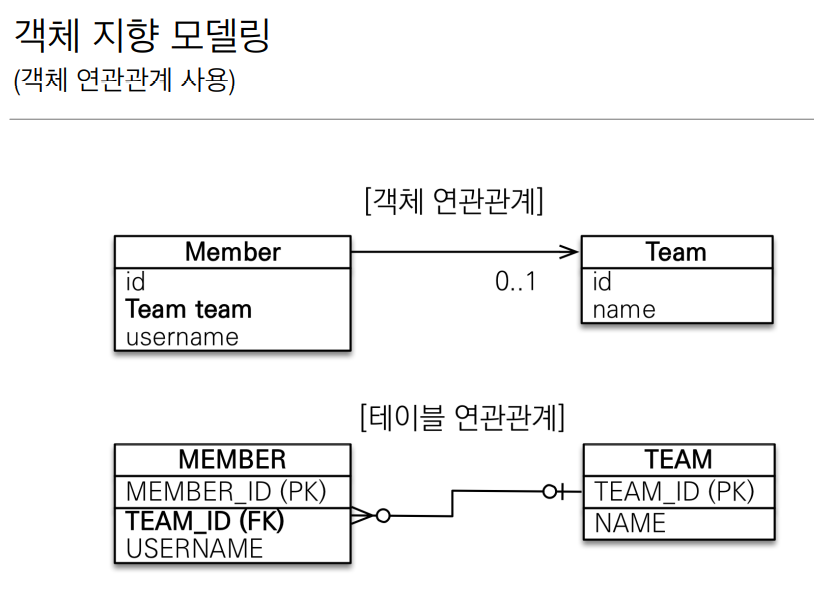
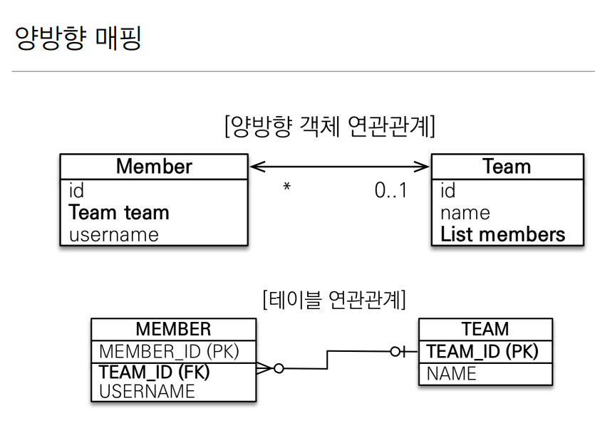
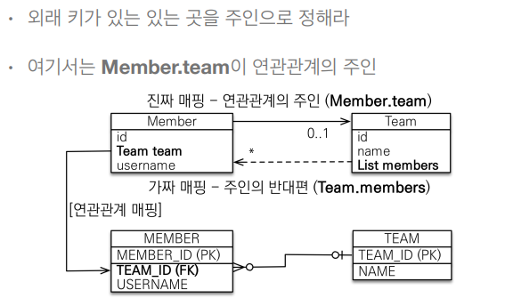
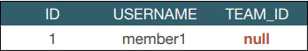
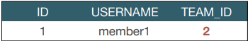

# 연관관계 매핑 기초 


### 목표 : 객체의 참조와 테이블의 외래 키를 매핑 하는 방법


### 관계형 DB에 맞춘 설계의 문제점
```
예제 시나리오  
- 회원과 팀이 있다.
- 회원은 하나의 팀에만 소속될 수 있다.
- 회원과 팀은 다대일 관계다.
```



```java
@Entity
 public class Member {
    ...
    @Column(name = "TEAM_ID")
    private Long teamId;
    ...
 }
 
```
+ 참조 대신에 외래 키를 그대로 사용 

```java
//팀 저장
 Team team = new Team();
 team.setName("TeamA");
 em.persist(team);
 
 //회원 저장
 Member member = new Member();
 member.setName("member1");
 member.setTeamId(team.getId()); //외래 키 식별자를 직접 다룸 
 em.persist(member);
```
+ 외래 키 식별자를 직접 다룸
```java
//조회
 Member findMember = em.find(Member.class, member.getId());
 Long findTeamId = findMember.getTeamId();
 //연관관계가 없음
 Team findTeam = em.find(Team.class, findTeamId);

```
멤버를 조회하고, 멤버에서 `TeamId`식별자를 가져오고 그 식별자를 또 `team`을 조회하는데 사용 
+ 식별자로 다시 조회

이러한 문제점들이 객체지향적인 설계를 하기 힘들게 한다.


## 단방향 연관관계 



Member 객체에 Team의 참조값을 가져옴
```java
@Entity
public class Member {
...
    private Team team;
...
}
```
이렇게 코드를 쓰게되면 에러가 나게 된다.그 이유는 JPA에게 Member와 Team이 
무슨 관계인지(일대다,다대일 등) 알려줘야 하기 때문이다.  

Member와 Team은 다대일 관계 
```java
@Entity
public class Member {
...
    @ManyToOne
    private Team team;
...
}
```
`Member` 입장에서 `Many` `Team`입장에서 `One`이라고 생각하면 편하다.

또한 객체의 `Team 레퍼런스`와 테이블의 `Team_Id(fk)`를 매핑해 주기 위해서 
`@JoinColumn(name = "Team_ID")`을 추가해 준다.
```java
@Entity
public class Member {
...
    @ManyToOne
    @JoinColumn(name = "TEAM_ID")
    private Team team;
...
}
```
이렇게 코드를 적으면 매핑이 완료된 것이다.


매핑을 완료했으니 연관관계를 이용해 저장,조회,수정을 어떻게 하는지 알아보자

+ ### 저장

```java
//팀 저장
 Team team = new Team();
 team.setName("TeamA");
 em.persist(team);
 
 //회원 저장
 Member member = new Member();
 member.setName("member1");
 member.setTeam(team); //단방향 연관관계 설정, 참조 저장
 em.persist(member);

```
member.setTeam(team); 을 해주면 JPA가 알아서 team에서 pk값을 꺼내서
Insert 할때 fk값으로 사용 한다.

+ ### 조회

```java
//조회
 Member findMember = em.find(Member.class, member.getId()); 
//참조를 사용해서 연관관계 조회
 Team findTeam = findMember.getTeam();
```
getTeamId 가 아닌 getTeam()을 이용해 객체지향스럽게 레퍼런스를 가지고 온다. 

+ ### 수정
```java

Member findMember = em.find(Member.class, member.getId());

Team newTeam = em.find(Team.class, 100L);
findMember.setTeam(newTeam);

``` 
DB에 100번 팀이 있다고 가정하고, 팀을 가져온다음에 Member에서 setTeam(newTeam)을 통해
팀을 수정해 주면 DB의 fk값이 업데이트 된다.

* **

## 양방향 연관관계와 연관관계의 주인

앞전에 코드는  
Team findTeam = findMember.getTeam(); member에서 team으로는 갈 수 있지만(단방향으로 매핑)  
findTeam.getMember()는 team에서 member는 레퍼런스도 없고 갈 방법이 없다.

그렇기 때문에 양방향 연관관계를 사용해서 양쪽으로 참조해서 갈 수 있게 만들어 준다.


테이블 연관관계는 단방향과 바뀐게 없음.테이블은 외래키 하나로 양방향 연관관계가 가능하기 때문이다.
객체는 Member 에는 Team 레퍼런스를 넣어주고 Team 에는 members List를 넣어줌으로써 양쪽으로 갈수 있다.

```java
@Entity
 public class Member { 
    
 @Id @GeneratedValue
 private Long id;
 
 @Column(name = "USERNAME")
 private String name;
 private int age;
 
 @ManyToOne
 @JoinColumn(name = "TEAM_ID")
 private Team team;
 …
```
+ Member 엔티티는 단방향과 동일하게 작성

```java
@Entity
 public class Team {
    
 @Id @GeneratedValue
 private Long id;
 
 private String name;
 
 @OneToMany(mappedBy = "team")
 List<Member> members = new ArrayList<Member>();
 … 
 }
```
+ Team과 Member는 일대다 관계인데 `Team` 입장에서 `One`,
`Member` 입장에서 `Many` 기 때문에 @OneToMany를 써준다
+ `mappedBy="team"`은 해석하자면,나는 반대편에서 team으로 매핑이 되있다는 말이다.자세한건 뒤에 


매핑을 해줬으니 반대방향으로 객체 그래프를 탐색
```java
//조회
 Team findTeam = em.find(Team.class, team.getId()); 
 int memberSize = findTeam.getMembers().size(); //역방향 조회
```
* **

### 객체와 테이블이 관계를 맺는 차이

객체 연관관계 = 2개
 + 회원 -> 팀(단방향)   Meber에서는 team 레퍼런스를 통해 Team 으로
 + 팀 -> 회원(단방향)   Team에서는 members 레퍼런스를 통해 Member로 

객체의 양방향 관계는 사실 양방향 관계가 아니라 서로 다른 단방향 관계 2개다.

테이블 연관관계 = 1개
 + 회원 <-> 팀  외래키 하나로 두 테이블의 연관관계를 관리


### 연관관계의 주인(Owner)

양방향 매핑 규칙  
• 객체의 두 관계중 하나를 연관관계의 주인으로 지정  
• 연관관계의 주인만이 외래 키를 관리(등록,수정)  
• 주인이 아닌쪽은 읽기만 가능  
• 주인은 mappedBy 속성 사용X  
• 주인이 아니면 mappedBy 속성으로 주인 지정  

#### 누구를 주인으로 정하지?

+ 외래 키가 있는 곳을 주인으로
+ 연관관계의 주인(진짜 매핑) @ManyToOne
+ 주인의 반대편(가짜 매핑)  @OneToMany

DB입장에서 보면 외래키가 있는곳이 다,외래키가 없는 곳이 1 이다.
그 말은 즉 DB의 다 쪽이 연관관계의 주인이 되는 것이다.


### 양방향 매핑시 가장 많이 하는 실수

+ 연관관계의 주인에 값을 입력하지 않음

```java
    Team team = new Team();
    team.setName("TeamA");
    em.persist(team);
    
    Member member = new Member();
    member.setName("member1");
    
    //역방향(주인이 아닌 방향)만 연관관계 설정
    team.getMembers().add(member);  //********
    em.persist(member);
    
```
member에 있는 team 레퍼런스가 연관관계의 주인이고  
team.getMembers()로 가져오는 members 레퍼런스는 가짜매핑(읽기전용)이기때문에   
JPA가 update나 insert할때 보지 않는다.  
따라서 연관관계의 주인이 아닌 곳에 값을 넣었기 때문에 외래키가 제대로 insert 되지 않았다.  



```java
    Team team = new Team();
     team.setName("TeamA");
     em.persist(team);
     
     Member member = new Member();
     member.setName("member1");
     team.getMembers().add(member); //******* 읽기전용이라 없어도 결과는 같다.
        
     //연관관계의 주인에 값 설정
     member.setTeam(team); //***********
     em.persist(member);
```
연관관계의 주인에 값을 설정했으므로 외래키값이 제대로 insert 된다.



### 하지만 순수한 객체 관계를 고려하면 항상 양쪽다 값을 입력해야 한다.
team.getMembers().add(member); , member.setTeam(team);

실수 할 수 있으므로 연관관계 편의 메소드를 사용하자
```java
public void setTeam(Team team){
    this.team = team;
    team.getMembers().add(this);
        }
```
+ Member 클래스의 setTeam 메소드에 값을 입력하는 코드를 작성해준다.(this = Member 자신)

또한 setTeam 메소드에 에 로직이 들어갔으므로 changeTeam 같은 의미가 있는 이름으로 바꾸어 주는 것이 좋다. 


+ Team 클래스에 연관관계 편의 메소드를 넣어서 사용할 수도 있다.

```java
public void addMember(Member member){
    member.setTeam(this);
    members.add(member);
}
```
둘중에 한군데에서만 사용,두개 다 할 경우 무한루프 걸릴수가 있음.


### 양방향 매핑시에 무한 루프를 주의
Member의 toString()을 호출하는 순간 Team의 toString()의 members가 호출하는 
각 member의 toString()때문에 무한루프 생성. 스택오버플로우 발생

결론적으로 lombok이 자동으로 만드는 toString()을 사용하지 말자.


### 양방향 매핑 정리
+ 단방향 매핑만으로도 이미 연관관계 매핑은 완료  
+ 실무에서 JPA 모델링 할 때, 단방향 매핑으로 처음에 설계를 끝내야 한다  
+ 양방향 매핑은 반대 방향으로 조회(객체 그래프 탐색) 기능이 추가된 것 뿐이다.
+ JPQL에서 역방향으로 탐색할 일이 많다. 실무에서 많이 쓴다.
+ 단방향 매핑을 잘 하고 양방향은 필요할 때 추가해도 됨(테이블에 영향을 주지 않음)


