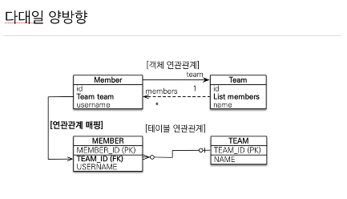
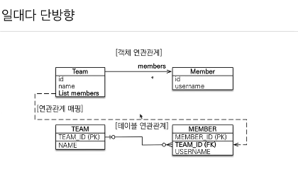

# 다양한 연관관계 매핑

### 연관관계 매핑시 고려사항 3가지

 + `다중성`
    - 다대일(@ManyToOne)
    - 일대다(@OneToMany)
    - 일대일(@OneToOne)
    - 다대다(@ManyToMany)  

&nbsp;  
+ `단방향,양방향`
  - 테이블 : 외래 키 하나로 양쪽 조인
  - 객체 : 한쪽만 참조하면 단방향,양쪽이 서로 참조하면 양방향
  - 
&nbsp;
+ `연관관계의 주인`

  - 외래 키 하나로 두 테이블이 연관관계를 맺음
  - 연관관계의 주인: 외래 키를 관리하는 참조
  - 주인의 반대편: 외래 키에 영향을 주지 않음,단순 조회만 가능


## 다대일


다대일 테이블에서 다 쪽에 `외래키`가 존재해야 맞는 설계다.

`외래키`가 있는 테이블을 기준으로 객체의 `참조`를 매핑해주면 된다.

다대일 단방향 정리
+ 가장 많이 사용하는 `연관관계`
+ `다대일`의 반대는 `일대다`

```java
@Entity
public class Member {
    
    @ManyToOne
    @JoinColumn(name = "TEAM_ID")
    private Team team;
}
```
객체의 `참조`를 다음과같이 작성해주고  
`@JoinColumn`을 통해 테이블의 `외래키`와 매핑해준다.

하다보니까 `Team`에서 `Member`의 `team`을 알아야 하는 경우가
너무 많을 경우 반대편에 단방향으로 참조를 추가해준다.

다대일 양방향


```java
@Entity 
public class Team{
    
    @OneToMany(mappedBy = "team")
    private List<Member> members = new ArrayList<>();
}
```
`mappedBy`는 연관관계의 주인 반대편에 사용되고 
이 코드의 경우 `"반대편에서 team 에 의해 매핑 되어진 것이다"` 라는 의미로 쓰인다.

다대일 양방향 정리
+ 외래 키가 있는 쪽이 연관관계의 주인
+ 양쪽을 서로 참조하도록 개발

## 일대다



이 모델은 실무에서 권장되지는 않는다.(다른 테이블의 update쿼리가 날라가므로)

+ 객체 연관관계에서는 1대다에서 1이 연관관계의 주인이고,   
Team은 Member를 아는데 Member는 Team을 알고싶지 않은 경우 이다.

+ 테이블 연관관계에서는  
다 쪽에 항상 외래키가 있어야 하므로 Member에 외래키가 존재

+ `Team`의 `List Members` 값을 바꿨을때 `TEAM_ID`라는 
다른 테이블에 있는 `외래키`를 업데이트 해줘야 한다.

+ `@JoinColumn`을 꼭 사용해야 한다, 그렇지 않으면 `조인 테이블 방식`을 사용하기때문이다.

+ 일대다 단방향 매핑의 단점: 
  - 엔티티가 관리하는 `외래 키`가 다른 테이블에 있음
  - 연관관계 관리를 위해 추가로 `UpdateSQL` 실행

```java
@Entity
public class Team{

    @OneToMany
    @JoinColumn(name="TEAM_ID")
    private List<Member> members = new ArrayList<>();
}
```

`결론적으로 일대다 단방향 매핑보다는 참조를 하나 추가해서 다대일 양방향 매핑을 사용하자!`


이런 매핑은 공식적으로 존재하지 않지만 야매로 가능

```java
@Entity
public class Memeber{

@ManyToOne
@JoinColumn(name ="TEAM_ID",insertable = false, updatable = false)
privae Team team;
}
```

insertable 과 updatable 속성을 이용하여 `읽기 전용 매핑`을 사용해서 양방향 처럼 사용하는 방법

