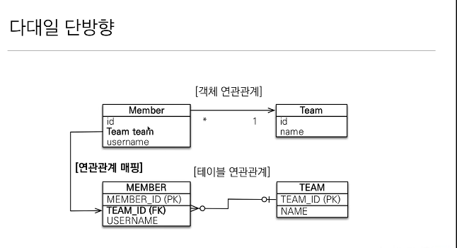
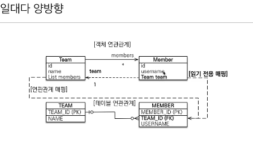
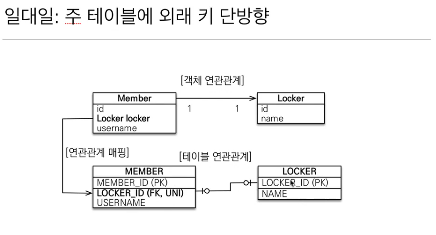
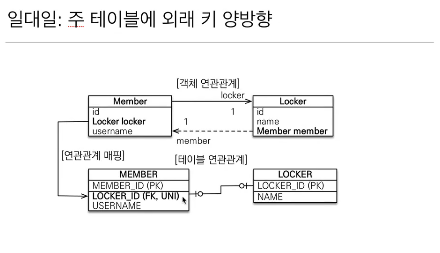
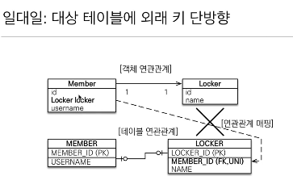
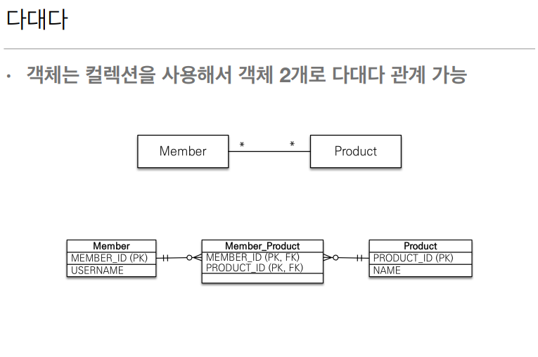

# 다양한 연관관계 매핑 

### 연관관계 매핑시 고려사항 3가지

 + `다중성`
    - 다대일(@ManyToOne)
    - 일대다(@OneToMany)
    - 일대일(@OneToOne)
    - 다대다(@ManyToMany)  

&nbsp;  
+ `단방향,양방향`
  - 테이블 : 외래 키 하나로 양쪽 조인
  - 객체 : 한쪽만 참조하면 단방향,양쪽이 서로 참조하면 양방향
  - 
&nbsp;
+ `연관관계의 주인`

  - 외래 키 하나로 두 테이블이 연관관계를 맺음
  - 연관관계의 주인: 외래 키를 관리하는 참조
  - 주인의 반대편: 외래 키에 영향을 주지 않음,단순 조회만 가능


## 다대일



다대일 테이블에서 다 쪽에 `외래키`가 존재해야 맞는 설계다.

`외래키`가 있는 테이블을 기준으로 객체의 `참조`를 매핑해주면 된다.

다대일 단방향 정리
+ 가장 많이 사용하는 `연관관계`
+ `다대일`의 반대는 `일대다`

```java
@Entity
public class Member {
    
    @ManyToOne
    @JoinColumn(name = "TEAM_ID")
    private Team team;
}
```
객체의 `참조`를 다음과같이 작성해주고  
`@JoinColumn`을 통해 테이블의 `외래키`와 매핑해준다.

하다보니까 `Team`에서 `Member`의 `team`을 알아야 하는 경우가
너무 많을 경우 반대편에 단방향으로 참조를 추가해준다.

다대일 양방향


```java
@Entity 
public class Team{
    
    @OneToMany(mappedBy = "team")
    private List<Member> members = new ArrayList<>();
}
```
`mappedBy`는 연관관계의 주인 반대편에 사용되고 
이 코드의 경우 `"반대편에서 team 에 의해 매핑 되어진 것이다"` 라는 의미로 쓰인다.

다대일 양방향 정리
+ 외래 키가 있는 쪽이 연관관계의 주인
+ 양쪽을 서로 참조하도록 개발
* **
## 일대다


이 모델은 실무에서 권장되지는 않는다.(다른 테이블의 update쿼리가 날라가므로)

+ 객체 연관관계에서는 1대다에서 1이 연관관계의 주인이고,   
Team은 Member를 아는데 Member는 Team을 알고싶지 않은 경우 이다.

+ 테이블 연관관계에서는  
다 쪽에 항상 외래키가 있어야 하므로 Member에 외래키가 존재

+ `Team`의 `List Members` 값을 바꿨을때 `TEAM_ID`라는 
다른 테이블에 있는 `외래키`를 업데이트 해줘야 한다.

+ `@JoinColumn`을 꼭 사용해야 한다, 그렇지 않으면 `조인 테이블 방식`을 사용하기때문이다.

+ 일대다 단방향 매핑의 단점: 
  - 엔티티가 관리하는 `외래 키`가 다른 테이블에 있음
  - 연관관계 관리를 위해 추가로 `UpdateSQL` 실행

```java
@Entity
public class Team{

    @OneToMany
    @JoinColumn(name="TEAM_ID")
    private List<Member> members = new ArrayList<>();
}
```

`결론적으로 일대다 단방향 매핑보다는 참조를 하나 추가해서 다대일 양방향 매핑을 사용하자!`



이런 매핑은 공식적으로 존재하지 않지만 야매로 가능

```java
@Entity
public class Memeber{

@ManyToOne
@JoinColumn(name ="TEAM_ID",insertable = false, updatable = false)
privae Team team;
}
```

insertable 과 updatable 속성을 이용하여 `읽기 전용 매핑`을 사용해서 양방향 처럼 사용하는 방법


* **

## 일대일

+ 일대일 관계는 그 반대도 일대일
+ 주 테이블 ,대상 테이블 선택해서 외래 키 넣을 수 있음.
+ 외래 키에 유니크 제약조건 추가



```java
@Entity
public class Member  {
    ...
    @OneToOne
    @JoinColumn(name="LOCKER_ID")
    private Locker locker;
    ...
}
```

+ 단방향은 다대일 매핑과 비슷하게 해주면 되고 대신 @OneToOne이 들어간다.




```java
@Entity
public class Locker  {
    ...
    @OneToOne(mappedBy = "locker")
    private Member member;
    ...
}
```
+ 양방향은 Locker에 Member 레퍼런스만 넣어주고 mapped by를 해준다.




+ 대상 테이블에 외래키 단방향은 JPA가 지원하지 않는다.
+ 양방향 관계는 지원한다.


+ 일대일 주 테이블의 양방향 매핑방법과 같다.

`주 테이블` 외래키 양방향과,`대상 테이블` 외래키 양방향 중 무엇을 선택해야 할까?

하나의 Member가 여러개의 Locker 를 가진다고 비즈니스 룰이 바뀌게 되면
`대상 테이블에 외래키 양방향 설계`는 Locker테이블에 MEMBER_ID 유니크 제약조건만
풀어주고 매핑해주면 되기 때문에 편하다.

반대로 하나의 Locker가 여러명의 Member를 가진다면 `주 테이블에 외래키 양상뱡 설계`
가 편하다.

그치만 개발 입장에서는 주 테이블에 외래키 양방향 설계가 성능면에서 유리하다.
Member가 주로 select 되어져서 사용되기 때문에 성능면에서 이점이 있다.


### 일대일정리
+ 주 테이블에 외래 키
    - 객체지향 개발자 선호
    - JPA 매핑 편리
    - 장점: 주 테이블만 조회해도 대상 태이블에 데이터가 있는지 확인가능
    - 단점: 값이 없으면 외래 키에 null 허용(DBA 입장에서 치명적)
+ 대상 테이블에 외래 키
    - 대상 테이블에 외래 키가 존재
    - 전통적인 데이터베이스 개발자 선호(null 허용 x)
    - 장점: 주 테이블과 대상 테이블을 일대일에서 일대다 관계로 변경할 때 테이블 구조 유지
    - 단점: 지연 로딩으로 설정해도 항상 즉시 로딩됨


## 다대다




```java
@Entity
public class Member {
    
    @ManyToMany
    @JoinTable(name = "MEMBER_PRODUCT")
    private List<Product> products = new ArrayList<>();
}
```

+ 테이블  
  관계형 데이터베이스는 정규화된 테이블 2개로 다대다 관계를 표현할수 없음
  연결 테이블을 추가, 일대다 다대일 관계를 풀어내야한다.
+ 객체  
  객체는 컬렉션을 사용해서 객체 2개로 다대다 관계 가능
+ ManyToMany 사용, @JoinTable 로 연결 테이블 지정한다.
+ 단방향, 양방향 모두 가능


### 다대다 매핑의 한계
+ 편해 보이지만 실무에서 사용x 
+ 연결테이블에 추가적인 정보(주문시간,수량)를 넣는것이 불가능하고 쿼리가 복잡해진다.

### 다대다 한계 극복
+ 연결 테이블용 엔티티를 추가한다(연결 테이블-> 엔티티로 승격)

```java
@Entity
public class MemberProduct {
  ...
  @ManyToOne
  @JoinColumn(name = "MEMBER_ID")
  private Member member;
  
  @ManyToOne
  @JoinColumn(name = "PRODUCT_ID")
  private Product product;
  ...
}
```

N:M 관계 
• 테이블의 N:M 관계는 중간 테이블을 이용해서 1:N, N:1  
• 실전에서는 중간 테이블이 단순하지 않다.   
• @ManyToMany는 제약: 필드 추가X, 엔티티 테이블 불일치  

 

