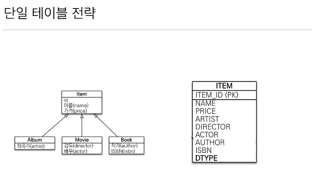
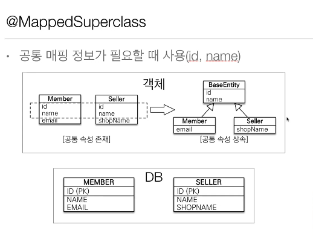

# 고급 매핑

## 상속관계 매핑

+ 관계형 데이터베이스는 상속관계가없다.

+ 객체의 상속 구조와 DB의 슈퍼타입 서브타입 관계(상속관계와 비슷한)를 매핑한다.


###  슈퍼타입 서브타입 논리모델을 물리 모델로 구현하는 방법

+ 조인 전략


  - `ITEM`과 그 밑에 `ALBUM`,`MOVIE`,`BOOK` 테이블을 조인하는 형식으로 만드는 것이다.   
  - 예를들면, `ALBUM` 정보가 들어오면 `이름`,`가격`은 `ITEM` 테이블에 들어가고,`ARTIST` 정보는`ALBUM `테이블에 들어간다.그 뒤에 조인을 해서 정보를 가져온다.  
  - `DTYPE`을 통해 구분해서 어떤 테이블과 조인할지 결정하게 된다.
```java
@Entity  
@Inheritence(strategy = InheritanceType.JOINED)  //조인 전략 선택
@DiscriminatorColumn  // 테이블에 DTYPE 칼럼을 넣어줌
public class Item{
    @Id @GeneratedValue
    private Long id;
    
    private String name;
    private int price;
  
  ...
}
```
```java
@Entity
@DiscriminatorValue("M") // default는 Entity명이고 Dtype의 Value를 설정할 수 있다.
public class Movie extends Item{
    private String Director;
    private String Actor;
  ...
}
```

```java
Movie movie = new Movie();
movie.setDirector("aaaa");
movie.setActor("bbbb");
movie.setName("바람과함께사라지다");
movie.setPrice("10000");

em.persist(movie);
```


다음과 같이 ITEM 에는 Name 과 PRICE 가 Insert 되고  
MOVIE 에는 ACTOR ,DIRECTOR가 Insert 된 것을 확인 할 수 있다.

> 장점:
> + 테이블 정규화
> + 외래 키 참조 무결성 제약조건 활용가능(다른 테이블에서 ITEM을 참조할때 ITEM 테이블만 보면 된다.)
> + 저장공간 효율
> * **
> 단점 :
> + 조회시 조인을 많이 사용, 성능 저하
> + 조회 쿼리가 복잡

+ 단일 테이블 전략

  - 논리모델을 한 테이블에 다 합쳐버린다.
  - DTYPE으로 구분   
  - JPA의 기본 전략

```java
@Entity  
@Inheritence(strategy = InheritanceType.SINGLE_TABLE)  //조인 전략 선택
@DiscriminatorColumn  // 테이블에 DTYPE 칼럼을 넣어줌
public class Item{
    @Id @GeneratedValue
    private Long id;
    
    private String name;
    private int price;
  
  ...
}
```
>strategy 속성만 `SINGLE_TABLE`로 바꿔주면 되고,  
@DiscriminatorColumn`이 없어도 `DTYPE`을 만들어 준다.`DTYPE`이 필수로 들어가야 하기 때문에

   
상관없는 나머지 값들은 다 null로 들어가게 된다.

> 장점:
> + 조회 성능이 빠름
> + 조회 쿼리가 단순함
> * **
> 단점 :
> + 자식 엔티티가 매핑한 컬럼은 모두 null을 허용해야 한다.(데이터 무결성)
> + 하나의 테이블에 저장하므로 테이블이 커질 수 있고 상황에 따라 조회성능이 느려질 수 있다.


+ 구현 클래스마다 테이블 전략

  - ITEM 테이블 없애고 각각의 이름,가격 정보까지 담긴 테이블을 만들어준다.

```java
@Entity  
@Inheritence(strategy = InheritanceType.TABLE_PER_CLASS)  //조인 전략 선택
@DiscriminatorColumn  // 테이블에 DTYPE 칼럼을 넣어줌
public abstract class Item{
    @Id @GeneratedValue
    private Long id;
    
    private String name;
    private int price;
  
  ...
}
```


>strategy 속성을 `TABLE_PER_CLASS`로 바꿔주고 ITEM 클래스를 추상클래스로 만들어준다.(다른 전략들도 처음부터 ITEM은 추상 클래스로 만드는게 맞다.)  

- 이 전략을 사용하면, 부모클래스를 통해 어떤 데이터를 조회하게 되면 테이블을 하나하나 다 조회하기 때문에 비효율적으로 동작하게 된다.
- 실무에서 추천하지 않는다

> 장점:
> + 서브 타입을 명확하게 구분해서 처리
> + not null 제약조건 사용 가능(데이터 무결성)
> * **
> 단점 :
> + 여러 테이블을 함께 조회할 때 성능이 느림(UNION 쿼리를 날려야함)
> + 자식 테이블을 통합해서 쿼리하기 어려움(변경하기 어려움) 


## @MappedSuperclass



객체에 id,name 같은 필드를 클래스를 만들때마다 써줘야 하는 불편함이 있다.  
그래서 부모클래스에 이러한 필드를 두고 공통 속성만 상속해서 사용하는 방법이다.  

```java
@MappedSuperclass
public abstract class BaseEntity {
    private String createdBy;
    private LocalDateTime createdDate;
    private String lastModifiedBy;
    private LocalDateTime lastModifiedDate;
}
```
+ BaseEntity 클래스를 만들어 공통 속성을 집어넣어 주고 @MappedSuperclass 어노테이션을 적어준다.
```java
@Entity
public class Team extends BaseEntity{
  ...
}
@Entity
public class Member extends BaseEntity{
  ...
}
```

+ 다른 클래스에서 상속받아서 사용한다.

> + 상속관계 매핑이 아니다.
> + 엔티티가 아니기 때문에 테이블과 매핑을 하지 않는다.
> + 상속 받는 자식 클래스에 매핑 정보만 제공
> + 조회,검색 불가
> + 직접 생성해서 사용할 일이 없으므로 추상 클래스로 만드는 것을 권장 