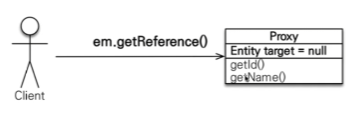
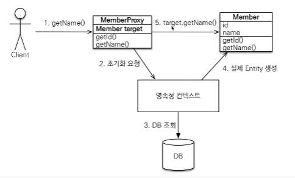
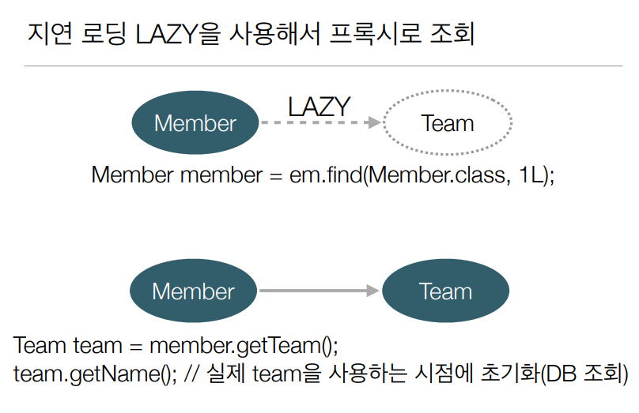
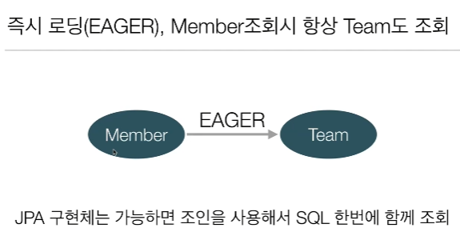
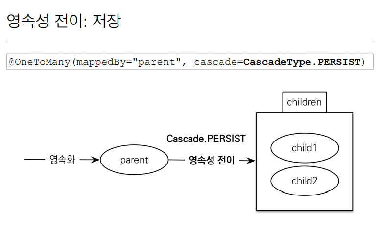

 # 프록시와 연관관계 

---
## 프록시 기초
`em.getReference():데이터베이스 조회를 미루는 가짜(프록시) 엔티티 객체 조회`  
DB에 쿼리가 안나갔는데 객체가 조회가 되는 것이다.



```java
Member member = new Member();
member.setUsername("hello")

em.persist(member)


em.flush();
em.clear();

Member findMEmber = em.getReference(Member.class , member.getId());
```
getReference만 다음과 같이 사용하면 쿼리가 날라가지 않는다.

```java
Member member = new Member();
member.setUsername("hello")

em.persist(member)


em.flush();
em.clear();

Member findMember = em.getReference(Member.class , member.getId());
System.out.println("findMember = " + findMEmber.getClass());
System.out.println("findMember.username = " + findMember.getUsername());
```
+ getClass()로 가져온 값은 ...HibernateProxy$..., Hibernate가 만든 가짜(프록시 )클래스 라는 것을 알 수 있다.
+ getReference로 가져온 가짜(프록시) 객체가 실제로 사용되는 시점에 JPA가 DB에 쿼리를 날려준다.

---
## 프록시 특징

+ 실제 클래스를 상속 받아서 만들어지고 겉 모양이 같다.
+ 사용하는 입장에서는 진짜 객체인지 프록시 구분하지 않고 사용하면 된다.
+ 프록시 객체는 실제 객체의 참조(taget)를 보관하고 프록시 객체를 호출하면 실제 객체의 메소드를 호출한다.
+ 프록시 객체는 처음 사용할 때 `한번만 초기화 된다`(한번 초기화 하고 계속 사용).
+ 프록시 객체를 초기화 할 때, `프록시 객체가 실제 엔티티로 바뀌는 게 아님!` ,접근을 가능하게 해주는것임.
+ 프록시 객체는 원본 엔티티를 상속 받기 때문에 `타입 체크를 주의`해야 한다(== 비교x instance of 사용)
+ 영속성 컨텍스트에 찾는 엔티티가 이미 있으면 em.getReference()를 호출해도 실제 엔티티를 반환한다.(캐시에 있는데 프록시로 가져와봤자 이점이 없으니까,  
JPA에서는 한 트랜잭션안에서 같은 것을 보장해야 하기 때문에 ==비교할때 true로 만들어 주기 위해서 실제 entity를 반환한다.그 반대도 마찬가지다.밑에 예씨)
+ `준영속` 상태일 때, 프록시 초기화 문제 발생(영속성 컨텍스트가 관리 안하기 때문에,실무에서 많이 만난다 트랜잭션이 끝나고 프록시를 조회하는 경우 `org.hibernate.LazyInitializationException 예외`)


```java

Member refMember = em.getReference(Member.class, member1.getId());
System.out.println("refMember = " + refMember.getClass());//Proxy

Member findMember = em.find(Member.class, member1.getId());
System.out.println("findMember = " + findMember.getClass()); // Member

System.out.println("refMember == findMember : " + (refMEmber == findMember));
```
이런 상황의 경우는 ==을 보장해줘야 하는데 JPA가 어떻게 동작할까?  
Proxy가 한번 조회 되면 find에서도 Proxy를 반환해준다.


---
## 프록시 객체 초기화


getReference로 프록시 객체를 가져오고   
-> getName()을 호출하면 Member target의 값이 없기 때문에 영속성 컨텍스트에 실제 Member 를요청한다     
-> 영속성 컨텍스트가 DB를 조회하여 실제 Member Entity 를 가져옴   
->target과 가져온 Member Entity를 연결하여 Member의 getName()값이 반환된다.
---
## 프록시 확인

+ PersistenceUnitUtil.isLoaded(Object entity) :프록시 인스턴스의 초기화 여부
- 예시: `emf.getPersisttenceUnitUtil().isLoaded(Member)` (팩토리에서 사용)
+ entity.getClass().getName() 출력 : 프록시 클래스 확인
+ org.hibernate.Hibernate.initialize(entity) : 프록시 강제 초기화
- 예시: ```Hibernate.initialize(refMember);```

---
## 즉시로딩과 지연로딩
member 를 조회할때 연관관계가 걸려있는 team 까지 가져오면 손해일 것이다.

### 지연로딩
```java
@Entity
public class Member {
    ...
    @ManyToOne(fetch = FetchType.LAZY) // 지연로딩 
    @JoinColumn(name = "TEAM_ID")
    private Team team;
    ...
}

public static void main(String[] args) {
    ...
    Team team1 = new Team();  // team 엔티티 생성
    team.setName("teamA");
    em.persist(team1);
    
    Member member1 = new Member();  // member 엔티티 생성 
    member1.setUsername("member1");
    member1.setTeam(team);
    
    em.persist(member1);  
    
    em.flush();
    em.cleat();
    
    Member m = em.find(Member.class, member1.getId()); //member 조회
    
    System.out.println("m = " + m.getTeam().getClass()); // member를 통해 team 조회
    ...
}
```

지연로딩 LAZY를 사용하여 Member 를 조회할때 일단 member를 그대로 가지고오고 추가로 연관된 Team을 프록시 객체로 가져온다.  
그리고 실제 team을 사용하는 시점에 영속성컨텍스트를 통해 DB를 조회하여 프록시 객체를 초기화 시켜준다.  

### 즉시 로딩 

`Member를 Team 과 함께 많이 사용한다면` LAZY로 설정하게 되면 네트워크를 2번 타기 때문에 성능이 떨어진다.그럼 `즉시로딩(EAGER)`를 사용하자!

### 프록시와 즉시로딩 주의
실무에서는 즉시로딩을 쓰면 안된다!!..
+ 가급적 지연 로딩만 사용(특히 실무에서)
+ 즉시 로딩을 적용하면 예상하지 못한 SQL이 발생(연관관계에 있는 테이블을 다 조인해오기 때문에 아주 많은 쿼리가 나가게 된다.)
+ 즉시 로딩은 JPQL에서 N+1 문제를 일으킨다.(JPQL은 그대로 sql로 번역)
```java
    ...
    List<Member> members = em.createQuery ("select m from Member m", Member.class)
        .getResultList();
    // SQL: select * from Member
    // SQL: select * from Team where TEAM_ID = xxx
```
조회해서 Member 객체를 가져와보니 EAGER로 설정되있어서 연관된 TEAM 다 가져와야 된다.추가 쿼리 N개가 나감.
해결법: 지연로딩으로 다 설정해 준뒤,
- FetchJoin : 동적으로 원하는 것들을 조인해서 한방에 가져온다(Member,Team을 같이)
```java
    ...
    List<Member> members = em.createQuery ("select m from Member m join fetch m.team", Member.class)
        .getResultList();
    ...
```
+ @ManyToOne, @OneToOne은 기본이 즉시 로딩 -> LAZY로 설정
+ @OneToMany, @ManyToMany는 기본이 지연 로딩

결론적으로 , 지연로딩을 다 깔아주고 필요에 의해 한방에 조회할때 fetchjoin을 사용한다.  

---
## 영속성 전이: CASCADE
+ 특정 엔티티를 영속 상태로 만들 떄 연관된 엔티티도 함께 영속 상태로 만들고 싶을 때
+ 예시 : 부모 엔티티를 저장할 때 자식 엔티티도 함께 저장

연관관계나 즉시로딩 지연로딩과 아무 관계가 없음!

```java

@Entity
public class Parent {
    
    @Id
    @GeneratedValue
    private Long id;
    
    private String name;
    
    @OneToMany(mappedBy ="parent")
    private List<Child> childList = new ArrayList<>();
    
    public void addChild(Child child) {      //양방향 연관관계 추가
        childList.add(child);
        child.setParent(this);
    }
    ...
}

@Entity
public class Child {

    @Id
    @GeneratedValue
    private Long id;

    private String name;

    @ManyToOne
    @JoinColumn(name="PARENT_ID")
    private Parent parent;
    
    
    ...
}

public static void main(String[] args) {
    ...
    Child child1 = new Child();
    Child child2 = new Child();

    Parent parent = new Parent();
    parent.addChild(child1);
    parent.addChild(child2);
    
    em.persist(parent);    //em.persist를 3번이나 해야한다. 
    em.persist(child1);
    em.persist(child2);
}
```
em.persist를 3번이나 해야되고 부모 엔티티를 persist 해줄때 자식 엔티티도 같이 해줄수는 없을까? 그래서 나온게 cascade

```java

@Entity
public class Parent {
    ...
    
    @OneToMany(mappedBy="parent", cascade = CascadeType.ALL) // @OneToMany cascade 속성
    private List<Child> childList = new ArrayList<>();
    ...
}
    public static void main(String[] args) {
        ...
        Child child1 = new Child();
        Child child2 = new Child();

        Parent parent = new Parent();
        parent.addChild(child1);
        parent.addChild(child2);

        em.persist(parent);    //em.persist를 부모꺼 1번만 해도 child 까지 persist 해준다.
         ...
}
```



※추가로 Child가 Parent 이외에 관계가 있을때는 쓰기 힘들다.(소유자가 하나여야 한다 Parent->Child 소유)
### CASCADE의 종류

+ ALL : 모두 적용(라이프 사이클을 다 맞춰야 할때)
+ PERSIST : 영속(저장할때만 라이프 사이클 맞출때)
+ REMOVE : 삭제

---
## 고아 객체
+ 고아 객체 제거: 부모 엔티티와 연관관계가 끊어진 자식 엔티티를 자동으로 삭제


```java
@Entity
public class Parent {
    ...
    
    @OneToMany(mappedBy="parent",orphanRemoval = true) // 고아 객체 설정
    private List<Child> childList = new ArrayList<>();
    ...
}
public static void main(String[] args) {
    ...
    Parent parent1 = em.find(Parent.class, parent.getId);
    parent1.getChildList().remove(0); //0 번째자식 엔티티를 컬렉션에서 제거
    // DELETE FROM CHILD WHERE ID=? 쿼리가 나감 
    ...
}
```

### 고아객체-주의
+ 참조하는 곳이 하나일 때 사용해야 한다(게시판,첨부파일)
+ 특정 엔티티가 개인 소유할 때 사용 (Parent->Child 소유)
+ @OneToOne , @OneToMany 만 가능
+ 고아 객체 제거 기능을 활성화 하면, 부모를 제거할 때 자식도 함께 제거된다 (CascadeType.REMOVE처럼 동작)

### 영속성 전이 + 고아 객체, 생명주기
+ 영속성 컨텍스트에 의해 스스로 생명주기를 관리하는 보통의 엔티티는 em.persist()로 영속화, em.remove()로 제거
+ 두 옵션을 모두 활성화 하면(CascadeType.ALL + orphanRemovel=true) 부모 엔티티를 통해서 자식의 생명 주기를 관리할 수 있음
+ 도메인 주도 설계(DDD)의 Aggregate Root개념을 구현할 때 유용(Aggregate Root 밑에 애들은 따로 Repository를 만들지 않고 Aggregate Root 를 통해 생명주기 관리)


