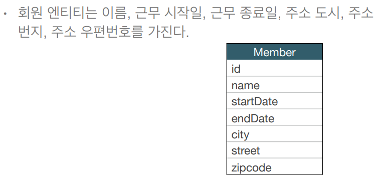
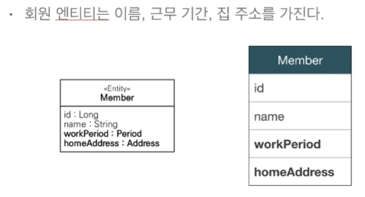
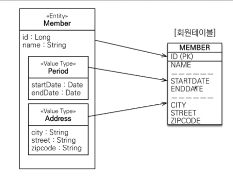
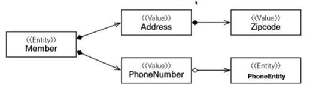
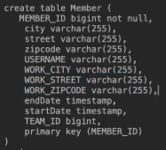
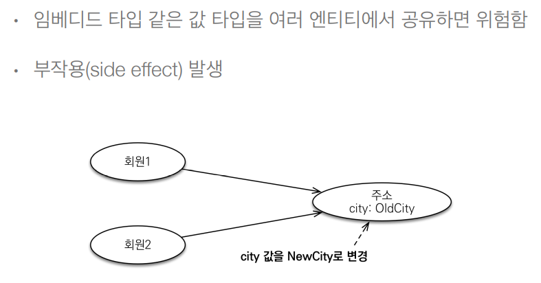
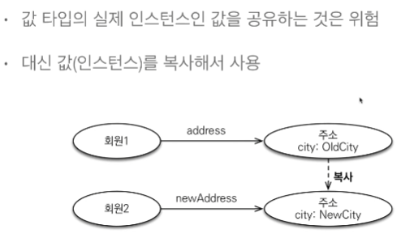
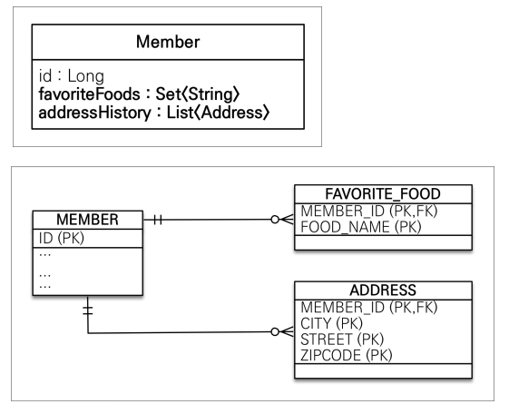
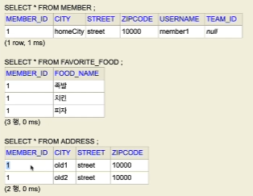

# 값 타입 


## 기본 값 타입

### JPA 데이터 타입 분류

+ 엔티티 타입 
  - @Entity로 정의하는 객체
  - 데이터가 변해도 식별자로 지속해서 추적 가능. 예) 내부 데이터(키,나이)를 바꿔도 식별자로 인식이 가능하다
- 값 타입
  + (int,Integer,String)단순히 값으로 사용하는 자바 기본 타입이나 객체
  + 식별자가 없고 값만 있으므로 변경시 추적 불가. 예)내부 데이터(나이,숫자)를 변경하면 다른 값이 되버림

### 기본 값 타입 

+ 기본값 타입- 자바가 제공하는 기본적으로 값을 세팅해서 사용할 수 있는 타입(int,double,Integer,Long,String)
    + 생명 주기를 엔티티에 의존- 회원을 삭제하면 내부 필드도 함께 삭제
    + 값 타입은 공유하면 안된다 - 회원 이름 변경시 다른 회원의 이름도 함께 변경되면 안된다.
    + int,double 같은 기본 타입은 절대 공유되지 않는다.(값 타입으로 썼을때 안전하다)
    + 기본 타입은 항상 값을 복사한다.
    + Integer 같은 래퍼 클래스나 String 같은 특수한 클래스는 공유는 가능(참조값),하지만 따로 값을 변경하는것을 불가능하게 만들어서 side effect가 일어나지 않게 한다. 
```java
Integer a1 = new Integer(10);
Integer b1 = a1;    //주소값(레퍼런스) 가 넘어 간다

int a2 = 10;
int b2 = a2;   //값이 넘어간다
        
b2 = 20;

```


    
### 임베디드 타입 
+ 새로운 값 타입을 직접 정의할 수 있음
+ 주로 기본 값 타입을 모아서 만들어서 복합 값 타입이라고도 한다.
+ int, String 처럼 값 타입이다(변경하면 추적 불가).



근무 시작일과 근무 종료일처럼 비슷한 데이터를 공통으로 만들어서 쓸수 있지 않을까?  
주소 도시와 주소 번지, 주소 우편번호를 묶어서 사용할 수 없을까?

  
이런 식으로 묶어서 사용하는 것이 임베디드 타입이다.  
데이터를 묶기위해서 Period,Address 클래스를 추가로 만들어서 사용한다.

### 임베디드 타입 사용법
+ @Embeddable: 값 타입을 정의하는 곳에 표시한다.
+ @Embedded: 값 타입을 사용하는 곳에 표시한다.
+ 기본 생성자가 필수다.

### 임베디드 타입의 장점
+ 재사용이 가능하다(시스템 전체에서 Period,Address 클래스 같은 것을 여러곳에서 재사용)
+ 높은 응집도 (Address,Period 같은 클래스를 만들면 묶이기 때문에 응집도가 높아짐)
+ Period.isWork()처럼 해당 값 타입만 사용하는 의미있는 메소드를 만들 수 있다.
+ 임베디드 타입을 포함한 모든 값 타입은, 값 타입을 소유한 엔티티에 생명주기를 의존한다.

### 임베디드 타입과 매핑


```java
@Embeddable
public class Period {
    private LocalDateTime startDate;
    private LocalDateTime endDate;
  ... //getter,setter,기본생성자
}
@Embeddable
public class Address{
    private String city;
    private String street;
    private String zipcode;
  ... //getter,setter , 기본생성자
}

@Entity
public class Member {
  ...
  @Embedded // @Embeddable과 @Embedded 둘중에 하나만 넣고 생략해도 된다.
  private Period wordPeriod;
  @Embedded
  private Address homeAddress;
  ...
}
```
+ 값 타입을 정의하는 Period,Address 클래스에 @Embeedable 을 써주고 Member 엔티티에 @Embedded를 넣어줘 매핑한다.  
+ 더 객체지향스럽게 사용 할 수 있다.(Period.isWork() 같은 메소드)
+ 임베디드 타입을 사용하기 전과 후에 매핑하는 테이블은 같다.
+ 객체와 테이블을 좀 더 세밀하게 매핑 가능(좌표,기간 같은 클래스내에 메소드를 만들어 활용한다던가,모델링이 깔끔하고 설명하기 쉬워짐)
+ 잘 설계한 ORM 애플리케이션은 매핑한 테이블의 수보다 클래스의 수가 더 많다.(ValueType 으로 사용하기 때문에)


### 임베디드 타입과 연관관계


임베디드 타입은 임베디드 타입이나 엔티티를 가질 수 있음

### @AttributeOverride: 속성 재정의
한 엔티티에서 같은 값 타입을 사용하면?   
예시)Member에 homeAddress와 workAddress가 같이 있는 경우 에러 발생

```java
@Embedded
@AttributeOverrides({
        @AttributeOverride(name= "city"),
            column = @Column(name="work_city")),
        @AttributeOverride(name= "street"),
            column = @Column(name="work_street")),
        @AttributeOverride(name="zipcode"),
            column = @Column(name= "work_zipcode"))
})
private Address workAddress;
```



재정의한 컬럼이 들어간다.

### 임베디드 타입과 null
임베디드 타입의 값이 null 이면 매핑한 컬럼 값은 모두 null이다.  
예시) Period에 null을 저장하면 endDate,startDate값 모두 null이 된다.


## 값 타입과 불변객체

### 값 타입 공유 참조


```java
...
        
Address address = new Address("city","street","10000"); //address 값 설정

Member member = new Member();
member.setUsername("member1");
member.setHomeAddress(address);  // 같은 address 값 공유
em.persist(member);

Member member2 = new Member();
member.setUsername("member2");
member.setHomeAddress(address); // 같은 address 값 공유
em.persist(member2);

member.getHomeAddresss().setCity("newCity");  //member1의 city 값만 newcity로 바뀔까? x 둘다 바뀜

...
```
데이터가 같이 바뀌는(city->newcity) 위험성 때문에 공유하지 않고 값을 복사해서 사용한다

### 값 타입 복사 



```java
...
        
Address address = new Address("city","street","10000"); //address 값 설정
        
Member member = new Member();
member.setUsername("member1")
member.setHomeAddress(address);  // 기존 address 값 
em.persist(member);

new copyAddress(address.getCity(),address.getStreet(),address.getZipcode())
Member member2 = new Member();
member.setUsername("member2");
member.setHomeAddress(copyAddress); // 복사한 address 값 
em.persist(member2);

member.getHomeAddresss().setCity("newCity");  //member1의 city 값만 newcity로 바뀐다.
...
```

### 객체 타입의 한계
+ 임베디드 타입처럼 직접 정의한 값 타입은 자바의 기본 타입(primitive type)이 아니라 객체 타입
+ 자바 기본 타입은 값을 복사하지만, 객체 타입은 참조 값을 직접 대입하기 때문에 공유 참조를 피할 수 없다.
참조를 그럼 어떻게 막지? 불변 객체 사용
### 불변 객체
`생성 시점 이후 절대 값을 변경할 수 없는 객체` 
+ Integer,String 은 불변객체
+ 객체 타입을 수정할 수 없게 만들면 부작용을 원천 차단
+ 값 타입은 불변 객체로 설계해야 한다.
+ 생성자로만 값을 설정하고 수정자(Setter)로 만들지 않으면 된다.

방법:Setter를 다 지우고 생성자와 Getter만 놔둔다.  
그러면 member.getHomeAddress().setCity("newCity")코드가 불가능해지기 때문에 위험으로 부터 면역이 된다.

+ 그럼 값을 Setter 없이 어떻게 바꾸지?
```java
Address newAddress = new Address("NewCity", address.getStrret(),address.getZipcode);
member.setHomeAddress(newAddress);
```

생성자를 통해 다시 값을 세팅하고 넣어주거나 메소드를 활용


## 값 타입의 비교

```java
// 
int a = 10;
int b = 10; 
// 값타입 a == b  true 

Address a = new Address("서울시")
Address b = new Address("서울시")
// 객체타입 a == b false
//  a.eqauls(b) true  equals 메소드 재정의 후에 사용
```

+ 동일성(identity) 비교 : 인스턴스의 참조 값을 비교,  == 사용
+ 동등성(equivalence) 비교 : 인스턴스의 값을 비교, equals() 사용
+ 값 타입은 a.equals(b) 를 사용해서 동등성 비교를 해야한다.
+ 값 타입의 equals() 메소드를 적절하게 재정의(기본값이 ==이기 때문에)


## 값 타입 컬렉션


+ 값 타입을 컬렉션으로 넣어서 사용하는 것을 말한다.
+ RDB에는 내부적으로 컬렉션을 담을 수 있는 구조가 없다.
+ 값 타입 컬렉션은 값 타입을 하나 이상 저장할 때 사용한다.
+ @ElementCollection , @CollectionTable 사용하여 매핑
+ 컬렉션들은 1:N 개념이기 때문에 데이터베이스는 컬렉션을 같은 테이블에 저장할 수 없고, 별도의 테이블이 필요하다.




구현 예시
```java
@Entity
public calss Member{
    ...
    @Embedded
    private Address homeAddress;
    
    @ElementCollection
    @CollectionTable(
            name = "FAVORITE_FOOD", joinColumns =
            @JoinColumn(name = "MEMBER_ID")
    )
    @Column(name="FOOD_NAME") // 컬럼명을 지정 (예외상황)
    private Set<String> favoriteFoods = new HashSet<>();

    @ElementCollection
    @CollectionTable(
            name = "ADDRESS" , joinColumns =
            @JoinColumn(name="MEMBER_ID"))
    private List<Address> addressHistory = new ArrayList();
    
        
}
```
+ Member 클래스에 값 타입 컬렉션을 추가해준다.
+ addressHistory는 임베디드 타입이므로 컬럼명들을 그대로 사용한다.
+ memberId를 외래키로 지정한다.(연관관계)


### 값 타입 컬렉션 저장
```java
Member member = new Member();
member.setUsername("member1");
member.setHomeAddress(new Address("homeCity", "street", "10000"));

member.getFavoriteFoods().add("치킨");
member.getFavoriteFoods().add("족발");
member.getFavoriteFoods().add("피자");

member.getAddressHistory().add(new Address("old1", "street1", "10000"));
member.getAddressHistory().add(new Address("old2", "street2", "10000"));

em.persist(member);

```
+ 값 타입 컬렉션을 따로 persist 해주지 않아도 쿼리가 나갔다.
+ 즉, Member 객체의 라이프 사이클과 동일하게 적용되었다(Member에 의존)
+ 값 타입은 별도로 persist 또는 update 할 필요 없이 Member에서 값을 변경하면 자동으로 처리해준다.
+ 영속성 전이(Cascade) + 고아 객체 제거 기능을 필수로 가진다고 볼 수 있음.



### 값 타입 컬렉션 조회


```java
System.out.println("============ START ============");
  Member findMember = em.find(Member.class, member.getId());
  // 
  List<Address> addressHistory = findMember.getAddressHistory();
  for (Address address : addressHistory) {
      System.out.println("address = " + address.getCity());
  }
  // 
  Set<String> favoriteFoods = findMember.getFavoriteFoods();
  for (String favoriteFood : favoriteFoods) {
      System.out.println("favoriteFood = " + favoriteFood);
  }
```
+ Member를 조회하면 embedded 타입 값은 같이 조회하지만, 컬렉션은 조회되지않는다.  
+ 컬렉션 값 타입은 지연로딩(LAZY) 전략을 사용하기 때문이다.


### 값 타입 컬렉션 수정 

#### 값 타입 수정 예시
```java
  System.out.println("============ START ============");
  Member findMember = em.find(Member.class, member.getId());

  // homeCity -> newCity 
  // findMember.getHomeAddress().setCity("newCity"); // 틀린 방법
  Address address = findMember.getHomeAddress();
  findMember.setHomeAddress(new Address("newCity", address.getStreet(), address.getZipCode())); // 새로 생성 

  tx.commit();
```
값 타입은 불변이어야 하기 때문에 새로운 인스턴스를 생성하여 통으로 교체해야 한다.


#### 값 타입 컬렉션 수정 예시 - `Set<String>`
```java
System.out.println("============ START ============");
 Member findMember = em.find(Member.class, member.getId());
 // 치킨 -> 한식 
 findMember.getFavoriteFoods().remove("치킨");
 findMember.getFavoriteFoods().add("한식");
```
+ 값 타입 컬렉션을 수정할때는 값을 삭제하고 다시 리스트에 넣어준다.
+ 컬렉션의 값만 변경해도 JPA가 실제 DB 변경사항을 반영해준다.(영속성 전이처럼)  

#### 값 타입 컬렉션 수정 예시 - `List<Address>`
```java
 System.out.println("============ START ============");
 Member findMember = em.find(Member.class, member.getId());
 // old1 -> newCity1
 findMember.getAddressHistory().remove(new Address("old1", "street1", "10000")); // equals 로 비교 
 findMember.getAddressHistory().add(new Address("newCity1", "street1", "10000"));
```
+ remove할때 eqauls() 와 hash()가 제대로 재정의 되어있어야 한다(비교해야되기 때문에).
+ AddressHistory테이블에서 Member에 소속된(MEMBER_ID) Address를 통째로 delete 하고 old2,newcity1을 새로 insert한다.
+ 실무에서 쓰면 안된다..


### 값 타입 컬렉션의 제약사항
+ 값 타입은 엔티티와 다르게 식별자 개념이 없다.
+ 값은 변경하면 추적이 어렵다
+ (중요!)값 타입 컬렉션에 변경 사항이 발생하면,주인 엔티티와 연관된 모든 데이터를 삭제하고 , 값 타입 컬렉션에 있는 현재 값을 모두 다시 저장한다.

+ 값 타입 컬렉션을 매핑하는 테이블은 모든 컬럼을 묶어서 기본키를 구성해줘야한다(직접 DB에)
  + null 입력 x
  + 중복 저장x

결론 : 값 타입 컬렉션은 실무에서 사용하지 말자!

### 값 타입 컬렉션 대안

```java
@Entity
@Table(name = "ADDRESS")
public class AddressEntity {

    @Id @GeneratedValue
    private Long id;

    private Address address; // 값 타입 
  
  ...
}
@Entity
public class Member {
    ...
  @OneToMany(cascade = CascadeType.ALL, orphanRemoval = true) // 일대다매핑
  @JoinColumn(name = "MEMBER_ID") 
  private List<AddressEntity> addressHistory = new ArrayList<>();
    ...
}


```

+ 실무에서는 값 타입 컬렉션 대신에 일대다 관계를 고려하는것이 낫다.
  + 일대다 관계를 위한 엔티티를 만들고, 이곳에 값 타입을 사용(값 타입-> 엔티티로 승급)
+ 영속성 전이 + 고아 객체 제거를 사용해서 값 타입 컬렉션 처럼 사용하자.
  + @OneToMany(cascade = CascadeType.ALL, orphanRemoval = true)
  + 실무에서 쿼리 최적화에 유리


#### 그럼 값타입 컬렉션은 언제쓰죠?..  
추적할 필요도 없고 값이 바뀌어도 업데이트를 할 필요가 없는 아주 단순한 구조에만 사용  

식별자가 필요하고, 지속해서 값을 추적, 변경해야 한다면 그것은 값 타입이 아닌 엔티티를 사용해야한다.


정리
+ 엔티티 타입의 특징
  + 식별자가 있다
  + 생명 주기 관리
  + 공유
+ 값 타입의 특징
  + 식별자가 없다
  + 생명 주기를 엔티티에 의존
  + 공유하지 않는 것이 안전하다(복사해서 사용)
  + 불변 객체로 만드는 것이 안전하다.