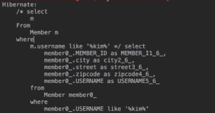
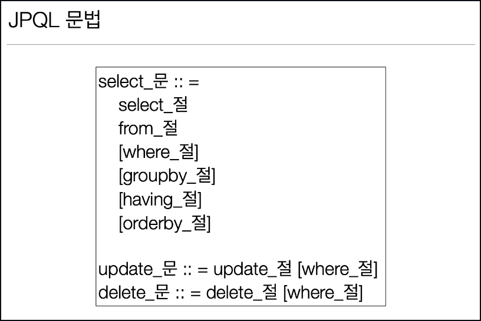

# 객체지향 쿼리 언어(JPQL)
-- --
### JPA는 다양한 쿼리 방법을 지원
+ JPQL 
+ JPA Criteria
+ QueryDSL
+ Native SQL
+ JDBC API 직접 사용, MyBatis, SpringJdbcTemplate 함께 사용


### JPQL 소개
+ 가장 단순한 조회 방법(기존에 배운)
  + EntityManager.find()
  + 객체 그래프 탐색(a.getB().getC())
+ 만약에 나이가 18살 이상인 회원을 모두 검색하고 싶다면?


### JPQL
JPQL 이라는 SQL과 유사한 문법이 제공이 된다.

+ JPA를 사용하면 엔티티 객체를 중심으로 개발(테이블은 그저 매핑, 실질적인 개발은 엔티티 객체 중심)
+ 문제는 검색 쿼리
+ 검색을 할 때도 테이블이 아닌 `엔티티 객체` 를 대상으로 검색을 하되,모든 DB데이터를 객체로 변환해서 검색하는 것은 불가능하다.
+ 결국에는 애플리케이션이 필요한 데이터만 DB에서 불러오려면 결국 검색조건이 포함된 SQL이 필요(where문으로 필터링, 필요하면 group by해서 가져오는)
+ JPA는 SQL을 추상화한 JPQL이라는 객체 지향 쿼리 언어를 제공한다.
+ SQL과 문법 유사하고,SELECT , FROM ,WHERE, GROUP BY, HAVING, JOIN(ANSI표준SQL 지원하는 문법)지원한다.
+ JPQL은 엔티티 객체를 대상으로 쿼리(SQL은 테이블 대상)


```java
em.createQuery(
        "select m From Member as m where m.username like '%kim%'", //Member는 객체
        Member.class
        ).getResultList();
```
  
주석으로 JPQL이 먼저 보이고 실제 SQL로 번역되어 실행된다.
실행한 코드는 엔티티를 대상으로 쿼리를 한거고 엔티티 매핑 정보를 읽어서 적절한 SQL을 만들어 낸다.


### JPQL
+ 테이블이 아닌 객체를 대상으로 검색하는 객체 지향 쿼리
+ SQL을 추상화해서 특정 데이터베이스 SQL에 의존 X
+ JPQL을 한마디로 정의하면 객체 지향 SQL


### Criteria 소개 
+ JPQL은 결국 단순 문자이기 때문에 동적 쿼리를 만들기 어렵다(문자 더해주기,띄어쓰기,쉼표 신경쓰기 너무 힘듬).
그래서 대안으로 나온 것이 Criteria
+ JAVA표준에서 제공하는 문법이다.

```java
//Criteria 사용 준비
CriteriaBuilder cb = em.getCriteriaBuilder();
CriteriaQuery<Member> query = cb.createQuery(Member.class);

//루트 클래스 (조회를 시작할 클래스)
Root<Member> m = query.from(Member.class);

//쿼리 생성 
CriteriaQuery<Member> cq =  query.select(m).where(cb.equal(m.get("username"), “kim”));
List<Member> resultList = em.createQuery(cq)
        .getResultList()

```
#### 장점 
+ 자바코드로 JPQL을 짤 수 있는것(컴파일 시점에 오류 잡아줌)
+ 동적쿼리를 짜기 훨씬 좋다

#### 단점 
+ 복잡하고 실용성이 없다.
+ SQL 스럽지가 않다.
+ 책에는 적어놨지만 실무에서는 사용하지 않음!(코드를 알아보기 어려움)


### QueryDSL 소개
대안으로 QueryDSL 을 사용 권장

```java
//JPQL
//select m from Member m where m.age > 18
JPAFactoryQuery query= new JPAQueryFactory(em); 
QMember m = QMember.member;
List<Member> list = queryFactory.selectFrom(m)
        .where(m.age.gt(18))
        .orderBy(m.name.desc())
        .fetch()
```

장점:
+ 자바코드로 JPQL을 작성할 수 있다.
+ JPQL 빌더 역할
+ 컴파일시점에 오류가 잡힌다
+ 동적 쿼리 작성이 편리하다
+ 직관적이다(JPQL과 거의 1:1이다)
+ 실무 사용 권장 (JPQL 문법만 알면 QueryDSL은 사용하기 쉽다)

### 네이티브 SQL 소개

+ JPA가 제공하는 SQL을 직접 사용하는 기능이다.
+ JPQL로 해결할 수 없는 특정 데이터베이스에 의존적인 기능이 있을때 사용한다.
  + 예시: 오라클 CONNECT BY, 특정 DB만 사용하는 SQL 힌트(꼭 네이티브SQL이 아니어도 Hibernate 방언세팅을 통해 지원하기도 한다.)

```java
String sql ="SELECT ID, AGE, TEAM_ID, NAME FROM MEMBER WHERE NAME = ‘kim’";
List<Member> resultList = em.createNativeQuery(sql, Member.class)
        .getResultList();
```


### JDBC 직접 사용, SpringJdbcTemplate 등
네이티브 쿼리 잘 안쓰고 SpringJdbcTemplate을 사용한다고 한다.

+ JPA를 사용하면서 JDBC 커넥션을 직접 사용하거나, 스프링 JdbcTemplate, 마이바티스등을 함께 사용 가능
+ 단 영속성 컨텍스트를 적절한 시점에 강제로 플러시 필요
예) JPA를 우회해서 SQL을 실행하기 직전에 영속성 컨텍스트 수동 플러시

```java
Member member = new Member();
member.setUsername("catsbi");

em.flush();  // 2번
// 결과 0
//dbconn.excuteQuery("select * from member");  1번
//JPA와 아무 관련 없는 excuteQuery 문이기 때문에 flush가 호출되지 않음

tx.commit();
```

flush는 트랜잭션을 commit 했을때나 JPQL query를 날릴때 호출된다.


### 결론:
JPQL 과 Query DSL 로 작성을 하고 엄청 복잡한 쿼리는 SpringJdbcTemplate을 사용한다.


## 기본 문법과 쿼리 API

### JPQL 소개
+ JPQL은 객체지향 쿼리 언어다. 따라서 테이블을 대상으로 쿼리하는 것이 아니라 엔티티 객체를 대상으로 쿼리한다.
+ JPQL은 SQL을 추상화해서 특정 데이터베이스 SQL에 의존하지 않는다.
+ JPQL은 결국 SQL로 변환된다.




### JPQL 문법 

+ select m from **Member** as m where **m.age** > 18
+ 엔티티와 속성은 대소문자 구분O (Member, age)
+ JPQL 키워드는 대소문자 구분X (SELECT, FROM, where)
+ 엔티티 이름 사용(@Entity(name="???")), 테이블 이름이 아님(Member)
+ **별칭은 필수(m)** (as는 생략가능)


### 집합과 정렬

```java
select
 COUNT(m), //회원수
 SUM(m.age), //나이 합
 AVG(m.age), //평균 나이
 MAX(m.age), //최대 나이
 MIN(m.age) //최소 나이
from Member m

GROUP BY,HAVING
ORDER BY
```
ANSI SQL 표준 function은 제공이 된다.


### TypeQuery, Query
+ TypeQuery: 반환 타입이 명확할 때 사용
```java
TypedQuery<Member> query = 
 em.createQuery("SELECT m FROM Member m", Member.class); //기본적으로 Entity 타입 정보를 넣어준다.
```
Member.class 라는 타입정보를 명확하게 써줬기 때문 
+ Query: 반환 타입이 명확하지 않을 때 사용

```java
Query query = 
 em.createQuery("SELECT m.username, m.age from Member m"); // username 은 String , age 는 int 기 때문에 타입 정보를 명기할 수 없다.
```


### 결과 조회 API
+ query.getResultList(): 결과가 하나 이상일 때, 리스트 반환
  + 결과가 없으면 빈 리스트 반환 (NullPointException 걱정 안해도 된다)
+ query.getSingleResult(): 결과가 정확히 하나가 나와야한다, 단일 객체 반환 (값이 있다고 보장될때 사용) 
  + 결과가 없으면: javax.persistence.NoResultException // 결과가 없을때 터지는 Exception 에러가 골치 아프다(try catch 돌려야 됨), Spring Data JPA 에서는 결과가 없으면 Null 반환
  + 둘 이상이면: javax.persistence.NonUniqueResultException


