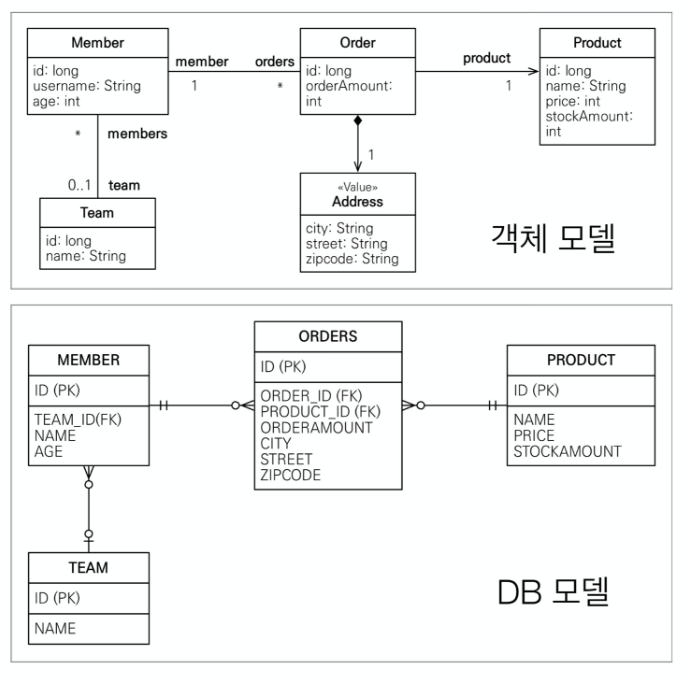
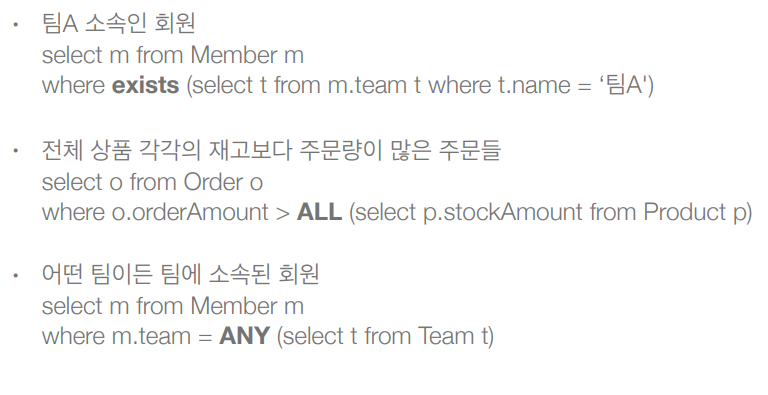
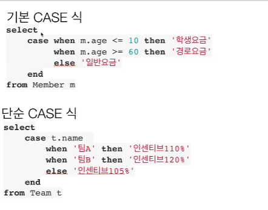

# 객체지향 쿼리 언어(JPQL)
-- --
### JPA는 다양한 쿼리 방법을 지원
+ JPQL 
+ JPA Criteria
+ QueryDSL
+ Native SQL
+ JDBC API 직접 사용, MyBatis, SpringJdbcTemplate 함께 사용


### JPQL 소개
+ 가장 단순한 조회 방법(기존에 배운)
  + EntityManager.find()
  + 객체 그래프 탐색(a.getB().getC())
+ 만약에 나이가 18살 이상인 회원을 모두 검색하고 싶다면?


### JPQL
JPQL 이라는 SQL과 유사한 문법이 제공이 된다.

+ JPA를 사용하면 엔티티 객체를 중심으로 개발(테이블은 그저 매핑, 실질적인 개발은 엔티티 객체 중심)
+ 문제는 검색 쿼리
+ 검색을 할 때도 테이블이 아닌 `엔티티 객체` 를 대상으로 검색을 하되,모든 DB데이터를 객체로 변환해서 검색하는 것은 불가능하다.
+ 결국에는 애플리케이션이 필요한 데이터만 DB에서 불러오려면 결국 검색조건이 포함된 SQL이 필요(where문으로 필터링, 필요하면 group by해서 가져오는)
+ JPA는 SQL을 추상화한 JPQL이라는 객체 지향 쿼리 언어를 제공한다.
+ SQL과 문법 유사하고,SELECT , FROM ,WHERE, GROUP BY, HAVING, JOIN(ANSI표준SQL 지원하는 문법)지원한다.
+ JPQL은 엔티티 객체를 대상으로 쿼리(SQL은 테이블 대상)


```java
em.createQuery(
        "select m From Member as m where m.username like '%kim%'", //Member는 객체
        Member.class
        ).getResultList();
```
  
주석으로 JPQL이 먼저 보이고 실제 SQL로 번역되어 실행된다.
실행한 코드는 엔티티를 대상으로 쿼리를 한거고 엔티티 매핑 정보를 읽어서 적절한 SQL을 만들어 낸다.


### JPQL
+ 테이블이 아닌 객체를 대상으로 검색하는 객체 지향 쿼리
+ SQL을 추상화해서 특정 데이터베이스 SQL에 의존 X
+ JPQL을 한마디로 정의하면 객체 지향 SQL


### Criteria 소개 
+ JPQL은 결국 단순 문자이기 때문에 동적 쿼리를 만들기 어렵다(문자 더해주기,띄어쓰기,쉼표 신경쓰기 너무 힘듬).
그래서 대안으로 나온 것이 Criteria
+ JAVA표준에서 제공하는 문법이다.

```java
//Criteria 사용 준비
CriteriaBuilder cb = em.getCriteriaBuilder();
CriteriaQuery<Member> query = cb.createQuery(Member.class);

//루트 클래스 (조회를 시작할 클래스)
Root<Member> m = query.from(Member.class);

//쿼리 생성 
CriteriaQuery<Member> cq =  query.select(m).where(cb.equal(m.get("username"), “kim”));
List<Member> resultList = em.createQuery(cq)
        .getResultList()

```
#### 장점 
+ 자바코드로 JPQL을 짤 수 있는것(컴파일 시점에 오류 잡아줌)
+ 동적쿼리를 짜기 훨씬 좋다

#### 단점 
+ 복잡하고 실용성이 없다.
+ SQL 스럽지가 않다.
+ 책에는 적어놨지만 실무에서는 사용하지 않음!(코드를 알아보기 어려움)


### QueryDSL 소개
대안으로 QueryDSL 을 사용 권장

```java
//JPQL
//select m from Member m where m.age > 18
JPAFactoryQuery query= new JPAQueryFactory(em); 
QMember m = QMember.member;
List<Member> list = queryFactory.selectFrom(m)
        .where(m.age.gt(18))
        .orderBy(m.name.desc())
        .fetch()
```

장점:
+ 자바코드로 JPQL을 작성할 수 있다.
+ JPQL 빌더 역할
+ 컴파일시점에 오류가 잡힌다
+ 동적 쿼리 작성이 편리하다
+ 직관적이다(JPQL과 거의 1:1이다)
+ 실무 사용 권장 (JPQL 문법만 알면 QueryDSL은 사용하기 쉽다)

### 네이티브 SQL 소개

+ JPA가 제공하는 SQL을 직접 사용하는 기능이다.
+ JPQL로 해결할 수 없는 특정 데이터베이스에 의존적인 기능이 있을때 사용한다.
  + 예시: 오라클 CONNECT BY, 특정 DB만 사용하는 SQL 힌트(꼭 네이티브SQL이 아니어도 Hibernate 방언세팅을 통해 지원하기도 한다.)

```java
String sql ="SELECT ID, AGE, TEAM_ID, NAME FROM MEMBER WHERE NAME = ‘kim’";
List<Member> resultList = em.createNativeQuery(sql, Member.class)
        .getResultList();
```


### JDBC 직접 사용, SpringJdbcTemplate 등
네이티브 쿼리 잘 안쓰고 SpringJdbcTemplate을 사용한다고 한다.

+ JPA를 사용하면서 JDBC 커넥션을 직접 사용하거나, 스프링 JdbcTemplate, 마이바티스등을 함께 사용 가능
+ 단 영속성 컨텍스트를 적절한 시점에 강제로 플러시 필요
예) JPA를 우회해서 SQL을 실행하기 직전에 영속성 컨텍스트 수동 플러시

```java
Member member = new Member();
member.setUsername("catsbi");

em.flush();  // 2번
// 결과 0
//dbconn.excuteQuery("select * from member");  1번
//JPA와 아무 관련 없는 excuteQuery 문이기 때문에 flush가 호출되지 않음

tx.commit();
```

flush는 트랜잭션을 commit 했을때나 JPQL query를 날릴때 호출된다.


### 결론:
JPQL 과 Query DSL 로 작성을 하고 엄청 복잡한 쿼리는 SpringJdbcTemplate을 사용한다.


## 기본 문법과 쿼리 API

### JPQL 소개
+ JPQL은 객체지향 쿼리 언어다. 따라서 테이블을 대상으로 쿼리하는 것이 아니라 엔티티 객체를 대상으로 쿼리한다.
+ JPQL은 SQL을 추상화해서 특정 데이터베이스 SQL에 의존하지 않는다.
+ JPQL은 결국 SQL로 변환된다.




### JPQL 문법 

+ select m from **Member** as m where **m.age** > 18
+ 엔티티와 속성은 대소문자 구분O (Member, age)
+ JPQL 키워드는 대소문자 구분X (SELECT, FROM, where)
+ 엔티티 이름 사용(@Entity(name="???")), 테이블 이름이 아님(Member)
+ **별칭은 필수(m)** (as는 생략가능)


### 집합과 정렬

```java
select
 COUNT(m), //회원수
 SUM(m.age), //나이 합
 AVG(m.age), //평균 나이
 MAX(m.age), //최대 나이
 MIN(m.age) //최소 나이
from Member m

GROUP BY,HAVING
ORDER BY
```
ANSI SQL 표준 function은 제공이 된다.


### TypeQuery, Query
+ TypeQuery: 반환 타입이 명확할 때 사용
```java
TypedQuery<Member> query = 
 em.createQuery("SELECT m FROM Member m", Member.class); //기본적으로 Entity 타입 정보를 넣어준다.
```
Member.class 라는 타입정보를 명확하게 써줬기 때문 
+ Query: 반환 타입이 명확하지 않을 때 사용

```java
Query query = 
 em.createQuery("SELECT m.username, m.age from Member m"); // username 은 String , age 는 int 기 때문에 타입 정보를 명기할 수 없다.
```


### 결과 조회 API
+ query.getResultList(): 결과가 하나 이상일 때, 리스트 반환
  + 결과가 없으면 빈 리스트 반환 (NullPointException 걱정 안해도 된다)
+ query.getSingleResult(): 결과가 정확히 하나가 나와야한다, 단일 객체 반환 (값이 있다고 보장될때 사용) 
  + 결과가 없으면: javax.persistence.NoResultException // 결과가 없을때 터지는 Exception 에러가 골치 아프다(try catch 돌려야 됨), Spring Data JPA 에서는 결과가 없으면 Null 반환
  + 둘 이상이면: javax.persistence.NonUniqueResultException


### 파라미터 바인딩

```java

//이름 기준 
Member result = em.createQuery("select m from Member m where m.username = :username",Member.class)
        .setParameter("username","member1")
        .getSingleResult();

//위치 기준
Member result = em.createQuery("select m from Member m where m.username =?1",Member.class)
        .setParameter(1,"member1")
        .getSingleResult();
```
위치 기반은 중간에 끼워 넣으면 순서가 밀리므로 쓰지 말자


프로젝션
+ SELECT 절에 조회할 대상을 지정하는 것
+ 프로젝션 대상: 엔티티, 임베디드 타입, 스칼라 타입(숫자, 문자등 기본 데이터 타입)
+ SELECT ***m*** FROM Member m -> 엔티티 프로젝션 (Member 엔티티)
```java
List<Team> result = em.createQuery("select m from Member m ", Member.class)
        .getResultList();  // 엔티티 프로젝션은 영속성 컨텍스트에서 관리된다.
```
+ SELECT ***m.team*** FROM Member m -> 엔티티 프로젝션 (Member와 연관된 Team 엔티티)
```java
List<Team> result = em.createQuery("select m.team from Member m", Team.class)
        .getResultList();

        List<Team> result = em.createQuery("select t from Member m join m.team t", Team.class)
        .getResultList();  
// 둘다 SQL문은 같지만 밑에 있는 코드가 예측이 더 잘 되므로 밑에 코드처럼 작성 해야 한다.(join 명시)
```
+ SELECT ***m.address*** FROM Member m -> 임베디드 타입 프로젝션
```java
List<Team> result = em.createQuery("select o.address from from Order o", Address.class)
        .getResultList(); 
```
 
+ SELECT ***m.username, m.age*** FROM Member m -> 스칼라 타입 프로젝션(원하는 값을 SQL 짜듯이 막 가져온다)
```java
List<Team> result = em.createQuery("select m.username, m.age from Member m")
        .getResultList(); 
```
+ DISTINCT로 중복 제거


### 프로젝션 - 여러 값 조회
SELECT m.username, m.age FROM Member m - 타입이 두개인데 어떻게 가져와야 하지?

+ 1.Query 타입으로 조회
```java
List resultList = em.createQuery("select m.username, m.age from Member")
            .getResultList();
  
    Object o = resultList.get(0); 
    Object[] result = (Object[]) o;
    System.out.printLn("username = " + result[0]);
    System.out.printLn("age = " + result[1]);
```
object 를 가져오고 타입 캐스팅 하여 object 배열을 가져온다.
배열의 첫번째 인덱스에 username, 두번째 인덱스에 age 값이 들어가게 된다. 

+ 2.Object[] 타입으로 조회
```java
List<Object[]> resultList = em.createQuery("select m.username, m.age from Member m")
              .getResultList();
    
      Object[] result = resultList.get(0);
      System.out.printLn("username = " + result[0]);
      System.out.printLn("age = " + result[1]);
```
제네릭에 Object[]를 선언해주면 타입 캐스팅 하는 과정을 생략 할 수 있다.

+ 3.new 명령어로 조회
   + 단순 값을 DTO로 바로 조회 SELECT new jpabook.jpql.UserDTO(m.username, m.age) FROM Member m
   + 패키지 명을 포함한 전체 클래스 명 입력
   + 순서와 타입이 일치하는 생성자 필요
```java
public class MemberDTO{

  private String username;
  private int age;
  ...
}

List<Object[]> result = em.createQuery("select new jpql.MemberDTO(m.username, m.age) from Member m",MemberDTO.class)
.getResultList();

    MemberDTO memberDTO = result.get(0);
    System.out.println("memberDTO = " + memberDTO.getUsername());
    Sysyem.out.pringln("memberDTO = " + memberDTO.getAge());

```
MemberDTO 타입을 명시해 주고 Entity 가 아닌 다른 타입이기 때문에 select 뒤에 new를 붙혀 준다.
패키지명을 적어주고,생성자 호출 문법과 비슷하게 적어준다.

## 페이징 API

JPA는 페이징을 다음 두 API로 추상화
+ setFirstResult(int startPosition) : 조회 시작 위치 (0부터 시작)
+ setMaxResults(int maxResult) : 조회할 데이터 수

```java
//페이징 쿼리
 String jpql = "select m from Member m order by m.name desc"; //desc는 내림차순으로 나타내줌
 List<Member> resultList = em.createQuery(jpql, Member.class)
    .setFirstResult(1)  //시작 포지션
    .setMaxResults(10)  //20개 가지고 올것이다.
    .getResultList();
```


#### MySQL 방언
```sql
SELECT
        M.ID AS ID,
        M.AGE AS AGE,
        M.TEAM_ID AS TEAM_ID,
        M.NAME AS NAME
FROM
        MEMBER M
ORDER BY
        M.NAME DESC LIMIT ?,?
```

#### Oracle 방언
```sql
SELECT *
FROM (SELECT ROW_.*, ROWNUM ROWNUM_
      FROM (SELECT M.ID      AS ID,
                   M.AGE     AS AGE,
                   M.TEAM_ID AS TEAM_ID,
                   M.NAME    AS NAME
            FROM MEMBER M
            ORDER BY M.NAME
           ) ROW_
      WHERE ROWNUM <= ?
     )
WHERE ROWNUM_ > ?
```

## 조인
SQL조인과 실행되는건 똑같은데 차이는 Entity 를 중심으로 동작한다(객체 스타일 문법 m.team)

내부조인:
```sql
SELECT m FROM Member m [INNER] JOIN m.team t  //INNER 생략 가능 
```

외부조인:
```sql
SELECT m FROM Member m LEFT [OUTER] JOIN m.team t //OUTER 생략 가능 
```

세타조인:
```sql
select count(m) from Member m, Team t where m.username = t.name
```


### 조인-ON절
1. 조인 대상 필터링
2. 연관관계 없는 엔티티 외부 조인(하이버 네이트 5.1부터,이전에는 내부 조인만 가능했음)


#### 조인 대상 필터링
예) 회원과 팀을 조인하면서, 팀 이름이 A인 팀만 조인

JPQL:
```sql
SELECT m, t FROM Member m LEFT JOIN m.team t on t.name = 'A'
```
on절을 사용해서 조인할때 조건으로 team의 이름이 'A' 인것만 조회

SQL:
```sql
SELECT m.*, t.* FROM
Member m LEFT JOIN Team t ON m.TEAM_ID=t.id and t.name='A'
```

예) 회원의 이름과 팀의 이름이 같은 대상 외부 조인
JPQL:
```sql
SELECT m, t FROM  
Member m LEFT JOIN Team t on m.username = t.name
```
연관관계가 전혀 없는것을 조인
SQL:
```sql
SELECT m.*, t.* FROM
Member m LEFT JOIN Team t ON m.username = t.name
```

## 서브 쿼리
쿼리가 있는데 그 안에 서브로 또 쿼리를 만드는 것

+ 나이가 평균보다 많은 회원
```sql
select m from Member m
where m.age > (select avg(m2.age) from Member m2) 
```
상위 쿼리에 있는 m 을 서브쿼리로 안가져 옴  
-> 메인 쿼리와 서브쿼리가 전혀 관계가 없다.

+ 한 건이라도 주문한 고객
```sql
select m from Member m
where (select count(o) from Order o where m = o.member) > 0 
```
메인에서 선언한 m 을 서브쿼리로 가져왔음.  
-> 보통 성능이 떨어진다.


### 서브 쿼리 지원 함수
+ [NOT] EXISTS (subquery): 서브쿼리에 결과가 존재하면 참
+ {ALL | ANY | SOME} (subquery)
+ ALL 모두 만족하면 참
+ ANY, SOME: 둘은 같은 의미, 조건을 하나라도 만족하면 참
+ [NOT] IN (subquery): 서브쿼리의 결과 중 하나라도 같은 것이 있으면 참

### 서브 쿼리 - 예제


### JPA 서브 쿼리 한계
+ JPA는 WHERE, HAVING 절에서만 서브 쿼리 사용 가능
+ SELECT 절도 가능(하이버네이트에서 지원)
+ ***FROM 절의 서브 쿼리는 현재 JPQL에서 불가능***
  + ***조인으로 풀 수 있으면 풀어서 해결***
```sql
select mm.age, mm.username
    from (select m.age, m.username from Member m) as mm //JPQL에서 불가능
```
조인으로 푸는게 힘들다면 native SQL 혹은 쿼리를 두번 날리는것도 고려해봐야 한다.


### JPQL 타입 표현

+ 문자: ‘HELLO’, ‘She’’s’  (문자는 작은 따옴표 안에 넣어준다 '를 표현하려면 '' 두번)
+ 숫자: 10L(Long), 10D(Double), 10F(Float)
+ Boolean: TRUE, FALSE
+ ENUM: jpabook.MemberType.Admin (패키지명 포함해서 넣어야 한다)
+ 엔티티 타입: TYPE(m) = Member (상속 관계에서 사용)

```java
String query = "select m.username,'Hello' , true From Memmber m" + 
               "where m.type = jpql.MEmberType.ADMIN";
List<Object[]> result = em.createQuery(query)
        .getResultList();

//패키지명이 길어서 파라미터 바인딩 방식으로도 많이 쓰인다.
```

```java
//엔티티 타입
em.createQuery("select i from Item i where type(i) = Book ", Item.class)
          .getResultList();

//book은 item을 상속받음, 원하는 상속 타입만 뽑아낸다.
```

### JPQL 기타
+ SQL과 문법이 같은 식
+ EXISTS, IN
+ AND, OR, NOT
+ =, > , >= , < , <=, <>
+ BETWEEN,LIKE,ISNULL


### 조건식-CASE 식


기본 CASE식은 조건을 넣어 만족하면 결과를 도출하고,  
단순 CASE식은 정확하게 매칭이 되면 결과 도출

+ COALESCE: 하나씩 조회해서 null이 아니면 반환 
  + 사용자 이름이 없으면 이름 없는 회원을 반환
```sql
select coalesce(m.username,'이름 없는 회원') from Member m
```
+ NULLIF: 두 값이 같으면 null 반환, 다르면 첫번째 값 반환
  + 사용자 이름이 ‘관리자’면 null을 반환하고 나머지는 본인의 이름을 반환
```sql
select NULLIF(m.username, '관리자') from Member m
```


### JPQL 기본 함수
JPQL이 제공하는 표준 함수 이므로 데이터베이스에 관계없이 사용 가능
+ CONCAT (문자 더하기) 
+ SUBSTRING (문자 슬라이싱)
+ TRIM (공백 제거)
+ LOWER, UPPER (대소문자)
+ LENGTH (문자 길이)
+ LOCATE 
```sql
select locate ('de', 'abcdef') From Member m;  // 4 반환 
```
+ ABS, SQRT, MOD (수학)
+ SIZE, INDEX(JPA 용도)

이 함수들로 해결이 안된다면?
### 사용자 정의 함수 호출
데이터베이스에 있는 함수들을 불러다 써야 하는데 JPQL은 그 함수들을 알 방법이 없다.그래서 이러한 표준 문법 제공 

+ 하이버네이트는 사용전 방언에 추가해야 한다.
  + 사용하는 DB 방언을 상속받고, 사용자 정의 함수를 등록한다.
```sql
select function('group_concat', i.name) from Item i
```


dialect 패키지를 만들고 사용하는 DB 방언을 상속 받아 클래스를 만들고 사용자 정의 함수 등록
```java

public class MyH2Dialect extends H2Dialect {
    
    public MyH2Dialect() {
        registerFunction("group_concat", new StandartSQLFunction("group_concat",StandardBasicTypes.STRING));
    }
}
```

persistence.xml 에서 내가 만든 클래스로 연결해 준다.
```java
<!--persistence.xml-->
<property name="hibernate.dialect" value="dialect.MyH2Dialect"/>
```

함수를 사용하면 된다.
```java
String query = "select function('group_concat', m.username) from Member m"
```
